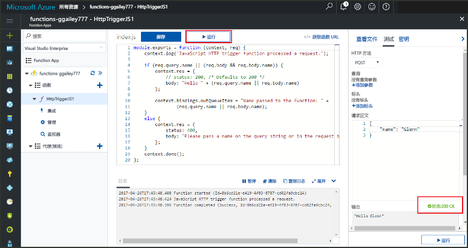
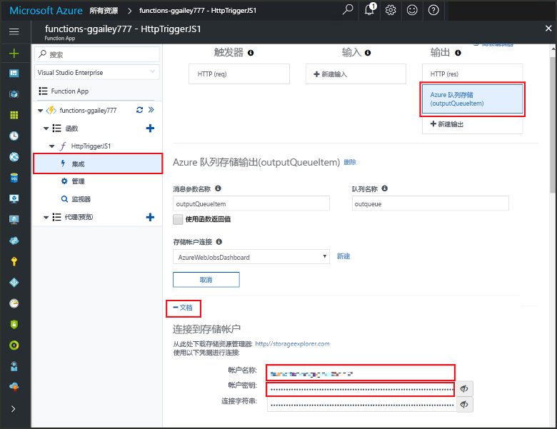

# <a name="add-messages-to-an-azure-storage-queue-using-functions"></a>使用 Functions 将消息添加到 Azure 存储队列

在 Azure Functions 中，输入和输出绑定提供从函数连接到外部服务数据的声明性方式。 在本主题中，了解如何通过添加用于将消息发送到 Azure 队列存储的输出绑定来更新现有函数。  


## <a name="prerequisites"></a>先决条件 

[!INCLUDE [Previous topics](../../includes/functions-quickstart-previous-topics.md)]

* 安装 [Microsoft Azure 存储资源管理器](http://storageexplorer.com/)。

## <a name="add-binding"></a>添加输出绑定
 
1. 展开 Function App 和函数。

2. 选择“集成”和“+ 新建输出”，然后选择“Azure 队列存储”并选择“选择”。
    
    

3. 使用表中指定的设置： 

    

    | 设置      |  建议的值   | 说明                              |
    | ------------ |  ------- | -------------------------------------------------- |
    | **队列名称**   | myqueue-items    | 要连接到存储帐户中的队列的名称。 |
    | **存储帐户连接** | AzureWebJobStorage | 可以使用 Function App 已在使用的存储帐户连接，也可以创建一个新的存储帐户连接。  |
    | **消息参数名称** | outputQueueItem | 输出绑定参数的名称。 | 

4. 单击“保存”添加绑定。
 
现在，已定义输出绑定，需要更新代码以使用绑定将消息添加到队列。  

## <a name="update-the-function-code"></a>更新函数代码

1. 选择函数以在编辑器中显示函数代码。 

2. 对于 C# 函数，请按如下所示更新函数定义，以添加“outputQueueItem”存储绑定参数。 对于 JavaScript 函数，跳过此步骤。

    ```cs   
    public static async Task<HttpResponseMessage> Run(HttpRequestMessage req, 
        ICollector<string> outputQueueItem, TraceWriter log)
    {
        ....
    }
    ```

3. 在方法返回之前，将以下代码添加到函数。 使用与函数的语言对应的代码段。

    ```javascript
    context.bindings.outputQueueItem = "Name passed to the function: " + 
                (req.query.name || req.body.name);
    ```

    ```cs
    outputQueueItem.Add("Name passed to the function: " + name);     
    ```

4. 选择“保存”以保存更改。

传递给 HTTP 触发器的值将包含在添加到队列的消息中。
 
## <a name="test-the-function"></a>测试函数 

1. 保存代码更改后，选择“运行”。 

    

2. 检查日志以确保该函数成功。 首次使用输出绑定时，Functions 运行时会在存储帐户中创建名为 **outqueue** 的新队列。

接下来，可以连接到存储帐户以验证新队列和添加到它的消息。 

## <a name="connect-to-the-queue"></a>连接到队列

如果已安装存储资源管理器并已将其连接到存储帐户，请跳过前三个步骤。    

1. 在函数中，选择“集成”和新的“Azure 队列存储”输出绑定，并展开“文档”。 复制“帐户名称”和“帐户密钥”。 使用这些凭据连接到存储帐户。
 
    

2. 运行 [Microsoft Azure 存储资源管理器](http://storageexplorer.com/)工具，选择左侧的“连接”图标，选择“使用存储帐户名称和密钥”，然后选择“下一步”。

    
    
3. 将步骤 1 中的“帐户名称”和“帐户密钥”粘贴到相应的字段中，然后选择“下一步”和“连接”。 
  
    

4. 展开附加的存储帐户，展开“队列”并验证名为“myqueue-items”的队列是否存在。 应看到一条消息已在队列中。  
 
    
 

## <a name="clean-up-resources"></a>清理资源

[!INCLUDE [Next steps note](../../includes/functions-quickstart-cleanup.md)]

## <a name="next-steps"></a>后续步骤

已将输出绑定添加到现有函数。 

[!INCLUDE [Next steps note](../../includes/functions-quickstart-next-steps.md)]

有关队列存储绑定的详细信息，请参阅 [Azure Functions 存储队列绑定](functions-bindings-storage-queue.md)。 


