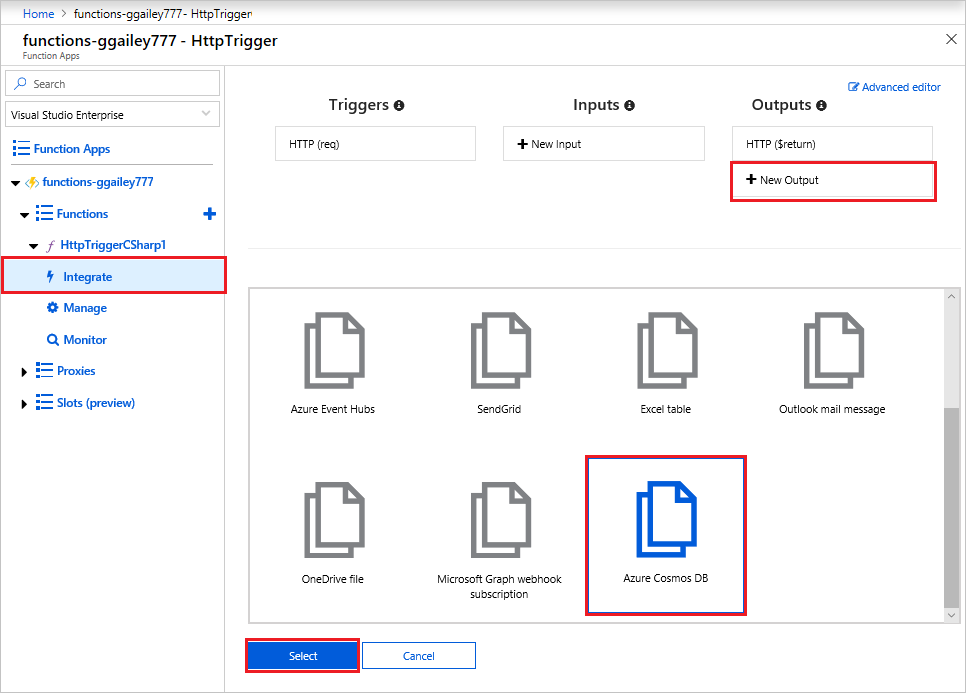
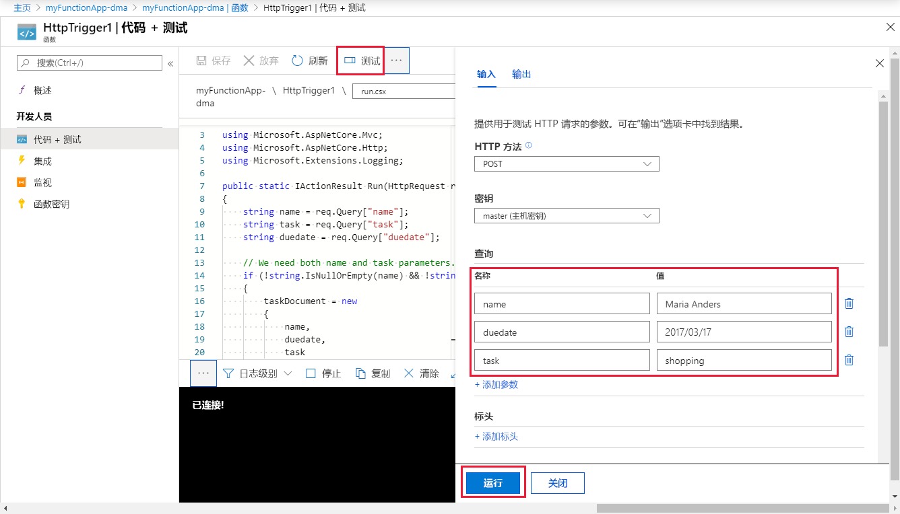

# <a name="store-unstructured-data-using-azure-functions-and-cosmos-db"></a>使用 Azure Functions 和 Cosmos DB 存储非结构化数据

Azure Cosmos DB 是存储非结构化数据和 JSON 数据的良好方式。 将 Cosmos DB 与 Azure Functions 结合使用，可以快速、轻松地存储数据，并且所需的代码也比在关系数据库中存储数据时所需的代码少得多。

本教程将逐步讲解如何使用 Azure 门户创建在 Cosmos DB 文档中存储非结构化数据的 Azure 函数。 

## <a name="prerequisites"></a>先决条件

[!INCLUDE [Previous quickstart note](../../includes/functions-quickstart-previous-topics.md)]

[!INCLUDE [functions-portal-favorite-function-apps](../../includes/functions-portal-favorite-function-apps.md)]

## <a name="create-a-function"></a>创建函数

新建名为 `MyTaskList` 的 C# 泛型 WebHook。

1. 展开现有函数列表，然后单击 + 号以新建函数
1. 选择 GenericWebHook-CSharp 并将其命名为 `MyTaskList`


## <a name="add-an-output-binding"></a>添加输出绑定

一个 Azure 函数可以有一个触发器和任意数量的输入或输出绑定。 在此示例中，我们将使用 HTTP 请求触发器和 Cosmos DB 文档作为输出绑定。

1. 单击函数的“集成”选项卡以查看或修改函数的触发器和绑定。
1. 选择位于页面右上角的“新建输出”链接。

注意：HTTP 请求触发器已配置，但你必须添加 Cosmos DB 文档绑定。



1. 输入创建绑定所需的信息。 使用下表来确定值。


|  字段 | 值  |
|---|---|
| 文档参数名称 | 引用代码中的 Cosmos DB 对象的名称 |
| 数据库名称 | 用于保存文档的数据库的名称 |
| 集合名称 | Cosmos DB 数据库分组的名称 |
| 是否希望为你创建 Cosmos DB 和集合 | 是或否 |
| Cosmos DB 帐户连接 | 指向 Cosmos DB 数据库的连接字符串 |

还必须配置与 Cosmos DB 数据库的连接。

1. 单击“Cosmos DB 文档连接”标签旁边的“新建”链接。
1. 填写字段，然后选择创建 Cosmos DB 文档所需的相应选项。


|  字段 | 值  |
|---|---|
| ID | Cosmos DB 数据库的唯一 ID  |
| NoSQL API | Cosmos DB 或 MongoDB  |
| 订阅 | MSDN 订阅  |
| 资源组  | 新建组或选择现有组。  |
| 位置  | 西欧  |

1. 单击“确定”按钮。 当 Azure 创建资源时，你可能需要等待几分钟。
1. 单击“保存”按钮  。

## <a name="update-the-function-code"></a>更新函数代码

将函数的模板代码替换为以下代码：

请注意，此示例的代码仅采用 C# 语言。

```csharp
using System.Net;

public static HttpResponseMessage Run(HttpRequestMessage req, out object taskDocument, TraceWriter log)
{
    string name = req.GetQueryNameValuePairs()
        .FirstOrDefault(q => string.Compare(q.Key, "name", true) == 0)
        .Value;

    string task = req.GetQueryNameValuePairs()
        .FirstOrDefault(q => string.Compare(q.Key, "task", true) == 0)
        .Value;

    string duedate = req.GetQueryNameValuePairs()
        .FirstOrDefault(q => string.Compare(q.Key, "duedate", true) == 0)
        .Value;

    taskDocument = new {
        name = name,
        duedate = duedate.ToString(),
        task = task
    };

    if (name != "" && task != "") {
        return req.CreateResponse(HttpStatusCode.OK);
    }
    else {
        return req.CreateResponse(HttpStatusCode.BadRequest);
    }
}

```

此代码示例读取 HTTP 请求查询字符串，并将其分配为 `taskDocument` 对象的成员。 `taskDocument` 对象自动将数据保存在 Cosmos DB 数据库中，并且甚至在首次使用时会创建该数据库。

## <a name="test-the-function-and-database"></a>测试函数和数据库

1. 在函数选项卡中，单击门户右侧的“测试”链接并输入以下 HTTP 查询字符串：

| 查询字符串 | 值 |
|---|---|
| name | Chris P.Bacon |
| task | Make a BLT sandwich |
| duedate | 05/12/2017 |

1. 单击“运行”链接。
1. 验证该函数是否返回了“HTTP 200 正常”响应代码。



确认 Cosmos DB 数据库中已生成一个项。

1. 在 Azure 门户中找到你的数据库，然后选择它。
1. 选择“数据资源管理器”选项。
1. 展开节点，直到到达文档的条目。
1. 确认数据库项。 在数据库中，你的数据还将随附元数据。


如果数据在文档中，则表示已成功创建一个在 Cosmos DB 数据库中存储非结构化数据的 Azure 函数。

## <a name="clean-up-resources"></a>清理资源

[!INCLUDE [Next steps note](../../includes/functions-quickstart-cleanup.md)]

## <a name="next-steps"></a>后续步骤

有关 Azure Functions 的详细信息，请参阅以下主题：

[!INCLUDE [Getting help note](../../includes/functions-get-help.md)]

[!INCLUDE [functions-quickstart-next-steps](../../includes/functions-quickstart-next-steps.md)]
