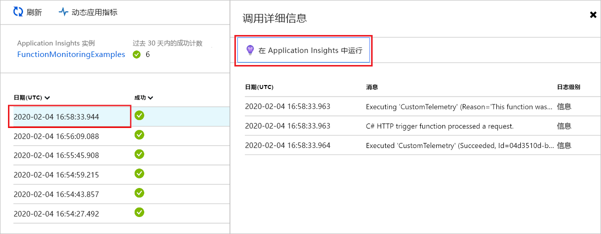
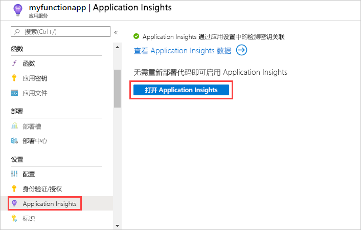
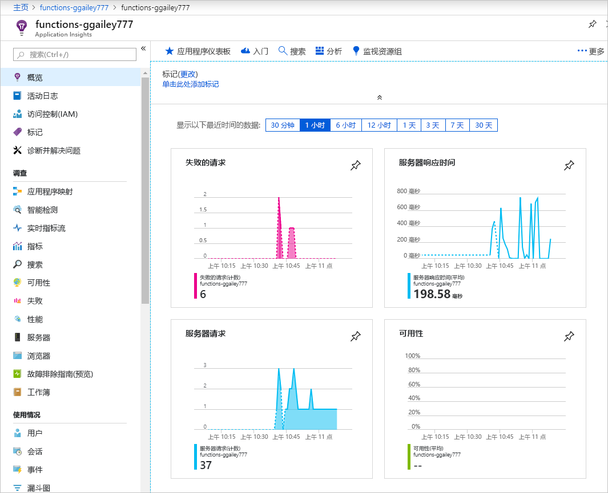
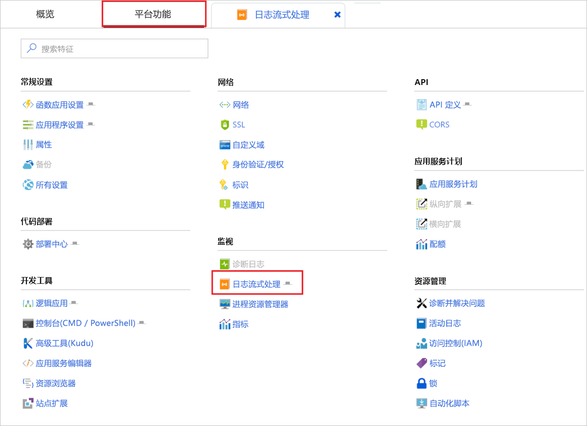

# <a name="monitor-azure-functions"></a>监视 Azure Functions

[Azure Functions](functions-overview.md) 提供与 [Azure Application Insights](../azure-monitor/app/app-insights-overview.md) 的内置集成来监视函数。 本文介绍如何配置 Azure Functions 来将系统生成的日志文件发送到 Application Insights。

建议使用 Application Insights，因为这可收集日志、性能和错误数据。 它将自动检测性能异常，并且包含了强大的分析工具来帮助诊断问题，以及了解函数的使用方式。 Application Insights 有助于持续提高性能与可用性。 你甚至可以在本地函数应用项目开发过程中使用 Application Insights。 有关详细信息，请参阅[什么是 Application Insights？](../azure-monitor/app/app-insights-overview.md)。

由于所需的 Application Insights 检测内置于 Azure Functions 中，因此只需一个有效的检测密钥即可将函数应用连接到 Application Insights 资源。 在 Azure 中创建函数应用资源后，应将检测密钥添加到应用程序设置中。 如果函数应用还没有此密钥，则可以进行[手动设置](#enable-application-insights-integration)。  

## <a name="application-insights-pricing-and-limits"></a>Application Insights 定价和限制

可以免费试用 Application Insights 与 Azure Functions 的集成。 每日可免费处理的数据量有限。 在测试期间可能会达到此限制。 当你达到每日限制时，Azure 会提供门户和电子邮件通知。 如果未收到这些警报并达到限制，则新日志不会显示在 Application Insights 查询中。 请注意限制，以免在故障排除上花费不必要的时间。 有关详细信息，请参阅[在 Application Insights 中管理定价和数据量](../azure-monitor/app/pricing.md)。

> [!IMPORTANT]
> Application Insights 具有[采样](../azure-monitor/app/sampling.md)功能，可以防止在峰值负载时为已完成的执行生成过多的遥测数据。 采样功能默认处于启用状态。 如果你看起来缺少数据，则可能需要调整采样设置来适应你的具体监视方案。 若要了解详细信息，请参阅[配置采样](#configure-sampling)。

[适用于 Azure Functions 的 Application Insights 支持的功能](../azure-monitor/app/azure-functions-supported-features.md)中详细介绍了函数应用可用的 Application Insights 功能的完整列表。

## <a name="view-telemetry-in-monitor-tab"></a>在“监视”选项卡中查看遥测数据

[启用 Application Insights 集成](#enable-application-insights-integration)后，可以在“监视”选项卡中查看遥测数据。

1. 在函数应用页中，选择在配置 Application Insights 之后至少运行过一次的函数。 然后，在左窗格中选择“监视”。 定期选择“刷新”，直到显示函数调用列表。

   

    > [!NOTE]
    > 在遥测客户端对数据进行批处理以传输到服务器时，最长可能需要 5 分钟的时间才会显示该列表。 这种延迟不适用于[实时指标流](../azure-monitor/app/live-stream.md)。 加载页面时，该服务会连接到 Functions 主机，因此，日志会直接流式传输到页面。

1. 若要查看特定函数调用的日志，选择该调用对应的“日期 (UTC)”列链接。 该调用的日志记录输出显示在新页中。

   

1. 选择“在 Application Insights 中运行”，以查看在 Azure 日志中检索 Azure Monitor 日志数据的查询源。 如果这是首次在订阅中使用 Azure Log Analytics，系统会要求启用它。

1. 启用 Log Analytics 后，将显示以下查询。 可以看到查询结果仅限于最近 30 天 (`where timestamp > ago(30d)`)。 此外，结果最多显示 20 行 (`take 20`)。 相比之下，函数的调用详细信息列表显示最近 30 天的信息，没有任何限制。

   

有关详细信息，请参阅本文稍后的[查询遥测数据](#query-telemetry-data)。

## <a name="view-telemetry-in-application-insights"></a>在 Application Insights 中查看遥测

若要从 Azure 门户中的函数应用打开 Application Insights，请在左侧页面中的“设置”下选择“Application Insights” 。 如果这是首次将 Application Insights 与订阅一起使用，则系统会提示启用它：选择“打开 Application Insights”，然后在下一页上选择“应用” 。



有关如何使用 Application Insights 的信息，请参阅 [Application Insights 文档](/azure/application-insights/)。 本部分介绍如何在 Application Insights 中查看数据的一些示例。 如果已经熟悉 Application Insights，则可以直接转到[有关如何配置和自定义遥测数据的部分](#configure-categories-and-log-levels)。



在评估函数中的行为、性能和错误时，Application Insights 的以下方面可能会有所帮助：

| 调查 | 说明 |
| ---- | ----------- |
| **[失败](../azure-monitor/app/asp-net-exceptions.md)** |  基于函数失败和服务器异常来创建图表和警报。 操作名称是函数名称。 不显示依赖项中的失败，除非为依赖项实现了自定义遥测。 |
| **[性能](../azure-monitor/app/performance-counters.md)** | 通过查看每个 Cloud 角色实例的资源利用率和吞吐量来分析性能问题。 在函数阻碍基础资源的调试方案下，此数据非常有用。 |
| **[指标](../azure-monitor/platform/metrics-charts.md)** | 创建基于指标的图表和警报。 指标包括函数调用次数、执行时间和成功率。 |
| **[实时指标    ](../azure-monitor/app/live-stream.md)** | 近实时地查看创建的指标数据。 |

## <a name="query-telemetry-data"></a>查询遥测数据

借助 [Application Insights Analytics](../azure-monitor/log-query/log-query-overview.md)，便可以访问数据库中以表形式存储的所有遥测数据。 Analytics 提供了一种用于提取、处理和可视化数据的查询语言。 

选择“日志”以浏览或查询记录的事件。


下面是一个查询示例，它显示过去 30 分钟内每个辅助角色的请求的分布。

<pre>
requests
| where timestamp > ago(30m) 
| summarize count() by cloud_RoleInstance, bin(timestamp, 1m)
| render timechart
</pre>

可用的表会显示在左侧的“架构”选项卡中。 可以在下表中找到由函数调用生成的数据：

| 表 | 说明 |
| ----- | ----------- |
| **traces** | 由运行时和函数代码创建的日志。 |
| **requests** | 一个请求用于一个函数调用。 |
| **异常** | 由运行时引发的任何异常。 |
| **customMetrics** | 成功和失败调用的计数、成功率和持续时间。 |
| **customEvents** | 运行时跟踪的事件，例如：触发函数的 HTTP 请求。 |
| **performanceCounters** | 有关运行函数的服务器的性能的信息。 |

其他表适用于可用性测试、客户端和浏览器遥测。 可以实现自定义遥测以向其中添加数据。

在每个表内，一些函数特定的数据位于 `customDimensions` 字段。  例如，以下查询检索所有具有日志级别 `Error` 的跟踪。

<pre>
traces 
| where customDimensions.LogLevel == "Error"
</pre>

运行时提供了 `customDimensions.LogLevel` 和 `customDimensions.Category` 字段。 可以在日志中提供在函数代码中编写的其他字段。 请参阅本文后面部分中的[结构化日志记录](#structured-logging)。

## <a name="configure-categories-and-log-levels"></a>配置类别和日志级别

可以使用 Application Insights 而无需任何自定义配置。 默认配置可能会产生大量数据。 如果使用的是 Visual Studio Azure 订阅，可能会达到 Application Insights 的数据上限。 本文后面的部分将介绍如何配置和自定义函数发送到 Application Insights 的数据。 对于函数应用，在 [host.json] 文件中配置日志记录。

### <a name="categories"></a>类别

对于每个日志，Azure Functions 记录器都包含一个类别。 类别指示运行时代码或函数代码的哪个部分编写日志。 下表描述了运行时创建的日志的主要类别。 

| 类别 | 说明 |
| ----- | ----- | 
| Host.Results | 这些日志在 Application Insights 中显示为“requests”。 它们指示函数的成功或失败。 所有这些日志均在 `Information` 级别编写。 如果在 `Warning` 或更高级别进行筛选，则不会看到任何这些数据。 |
| Host.Aggregator | 这些日志在一段[可配置](#configure-the-aggregator)的时间内提供函数调用的计数和平均值。 默认时段为 30 秒或 1,000 个结果，以先满足的条件为准。 日志位于 Application Insights 中的 **customMetrics** 表内。 示例包括运行数、成功率和持续时间。 所有这些日志均在 `Information` 级别编写。 如果在 `Warning` 或更高级别进行筛选，则不会看到任何这些数据。 |

除了这些类别，其余类别的所有日志在 Application Insights 的“traces”表中提供。

由 Functions 运行时编写以 `Host` 开头的类别的所有日志。 “函数已启动”和“函数已完成”日志的类别为 `Host.Executor` 。 对于成功运行，这些日志属于 `Information` 级别。 异常在 `Error` 级别记录。 运行时还创建 `Warning` 级别日志，例如：已发送到病毒邮件队列的队列邮件。

Functions 运行时创建具有以“Host”开头的类别的日志。 在版本 1.x 中，`function started`、`function executed` 和 `function completed` 日志的类别为 `Host.Executor`。 从版本 2.x 开始，这些日志的类别为 `Function.<YOUR_FUNCTION_NAME>`。

如果在函数代码中编写日志，则类别为 `Function.<YOUR_FUNCTION_NAME>.User`，并且可以是任何日志级别。 在 Functions 运行时的版本 1.x 中，类别为 `Function`。

### <a name="log-levels"></a>日志级别

此外，对于每个日志，Azure Functions 记录器都会包含一个日志级别。 [LogLevel](/dotnet/api/microsoft.extensions.logging.loglevel) 是一个枚举，整数代码指示相对重要性：

|LogLevel    |代码|
|------------|---|
|跟踪       | 0 |
|调试       | 1 |
|信息 | 2 |
|警告     | 3 |
|错误       | 4 |
|严重    | 5 |
|无        | 6 |

日志级别 `None` 将在下一节中进行介绍。 

### <a name="log-configuration-in-hostjson"></a>host.json 中的日志配置

[Host.json] 文件配置函数应用发送到 Application Insights 的日志记录数量。 对于每个类别，均可以指示要发送的最小日志级别。 有两个示例：第一个示例针对 Functions 运行时[版本 2.x 和更高版本](functions-versions.md#version-2x)（具有 .NET Core），第二个示例针对版本 1.x 运行时。

### <a name="version-2x-and-higher"></a>版本 2.x 和更高版本

版本 v2.x 和更高版本的 Functions 运行时使用 [.NET Core 日志记录筛选器层次结构](/aspnet/core/fundamentals/logging/?view=aspnetcore-2.1#log-filtering)。 

```json
{
  "logging": {
    "fileLoggingMode": "always",
    "logLevel": {
      "default": "Information",
      "Host.Results": "Error",
      "Function": "Error",
      "Host.Aggregator": "Trace"
    }
  }
}
```

### <a name="version-1x"></a>版本 1.x

```json
{
  "logger": {
    "categoryFilter": {
      "defaultLevel": "Information",
      "categoryLevels": {
        "Host.Results": "Error",
        "Function": "Error",
        "Host.Aggregator": "Trace"
      }
    }
  }
}
```

此示例设置以下规则：

* 对于 `Host.Results` 或 `Function` 类别的日志，仅将 `Error` 级别及更高级别发送到 Application Insights。 `Warning` 级别及以下级别的日志将被忽略。
* 对于 `Host.Aggregator` 类别的日志，将所有日志发送到 Application Insights。 `Trace` 日志级别与某些记录器称为 `Verbose` 的日志级别相同，但在 [host.json] 文件中请使用 `Trace`。
* 对于所有其他日志，仅向 Application Insights 发送 `Information` 级别及更高级别。

[host.json] 中的类别值控制所有以相同值开头的类别的日志记录。 [host.json] 中的 `Host` 控制 `Host.General`、`Host.Executor`、`Host.Results` 等等的日志记录。

如果 [host.json] 包含以相同字符串开头的多个类别，则先匹配较长的类别。 假设想要让运行时中除 `Host.Aggregator` 之外的所有内容都在 `Error` 级别记录，而想让 `Host.Aggregator` 在 `Information` 级别记录：

### <a name="version-2x-and-later"></a>版本 2.x 和更高版本

```json
{
  "logging": {
    "fileLoggingMode": "always",
    "logLevel": {
      "default": "Information",
      "Host": "Error",
      "Function": "Error",
      "Host.Aggregator": "Information"
    }
  }
}
```

### <a name="version-1x"></a>版本 1.x 

```json
{
  "logger": {
    "categoryFilter": {
      "defaultLevel": "Information",
      "categoryLevels": {
        "Host": "Error",
        "Function": "Error",
        "Host.Aggregator": "Information"
      }
    }
  }
}
```

若要禁止某个类别的所有日志，可以使用日志级别 `None`。 不存在使用该类别编写的日志，该类别上也没有日志级别。

## <a name="configure-the-aggregator"></a>配置聚合器

如前一部分中所述，运行时聚合一段时间内有关函数执行的数据。 默认时段为 30 秒或 1,000 次运行，以先满足的条件为准。 可以在 [host.json] 文件中配置此设置。  下面是一个示例：

```json
{
    "aggregator": {
      "batchSize": 1000,
      "flushTimeout": "00:00:30"
    }
}
```

## <a name="configure-sampling"></a>配置采样

Application Insights 具有[采样](../azure-monitor/app/sampling.md)功能，可以防止在峰值负载时为已完成的执行生成过多的遥测数据。 当传入执行的速率超过指定的阈值时，Application Insights 开始随机忽略某些传入执行。 每秒执行的最大次数的默认设置为 20（版本 1.x 中为 5）。 可以在 [host.json](./functions-host-json.md#applicationinsights) 中配置采样。  下面是一个示例：

### <a name="version-2x-and-later"></a>版本 2.x 和更高版本

```json
{
  "logging": {
    "applicationInsights": {
      "samplingSettings": {
        "isEnabled": true,
        "maxTelemetryItemsPerSecond" : 20,
        "excludedTypes": "Request"
      }
    }
  }
}
```

在版本2.x 中，可以从采样中排除某些类型的遥测数据。 在上面的示例中，类型的数据 `Request` 从采样中排除。 这可确保记录*所有*函数执行（请求），而其他类型的遥测仍会受到采样的限制。

### <a name="version-1x"></a>版本 1.x 

```json
{
  "applicationInsights": {
    "sampling": {
      "isEnabled": true,
      "maxTelemetryItemsPerSecond" : 5
    }
  }
}
```

## <a name="write-logs-in-c-functions"></a>在 C# 函数中编写日志

可以在 Application Insights 中显示为 traces 的函数代码中编写日志。

### <a name="ilogger"></a>ILogger

在函数中使用 [ILogger](/dotnet/api/microsoft.extensions.logging.ilogger) 参数，而不是 `TraceWriter` 参数。 通过使用 `TraceWriter` 创建的日志会转到 Application Insights，但借助 `ILogger` 可执行[结构化日志记录](https://softwareengineering.stackexchange.com/questions/312197/benefits-of-structured-logging-vs-basic-logging)。

使用 `ILogger` 对象，可以调用 [ILogger 上的 `Log<level>` 扩展方法](/dotnet/api/microsoft.extensions.logging.loggerextensions#methods)来创建日志。 下面的代码编写类别为“Function.<YOUR_FUNCTION_NAME>.User.”的 `Information` 日志

```cs
public static async Task<HttpResponseMessage> Run(HttpRequestMessage req, ILogger logger)
{
    logger.LogInformation("Request for item with key={itemKey}.", id);
```

### <a name="structured-logging"></a>结构化日志记录

占位符的顺序（而不是其名称）确定日志消息中使用的参数。 假设有以下代码：

```csharp
string partitionKey = "partitionKey";
string rowKey = "rowKey";
logger.LogInformation("partitionKey={partitionKey}, rowKey={rowKey}", partitionKey, rowKey);
```

如果保留相同的消息字符串并颠倒参数的顺序，则生成的消息文本将在错误的位置生成值。

以这种方式处理占位符，以便可以执行结构化日志记录。 Application Insights 存储参数名称值对和消息字符串。 结果是消息参数变为可以查询的字段。

如果记录器方法调用类似于前面的示例，则可以查询字段 `customDimensions.prop__rowKey`。 添加 `prop__` 前缀以确保运行时添加的字段和函数代码添加的字段之间没有冲突。

此外，可以通过引用字段 `customDimensions.prop__{OriginalFormat}` 查询原始消息字符串。  

下面是 `customDimensions` 数据的示例 JSON 表示形式：

```json
{
  "customDimensions": {
    "prop__{OriginalFormat}":"C# Queue trigger function processed: {message}",
    "Category":"Function",
    "LogLevel":"Information",
    "prop__message":"c9519cbf-b1e6-4b9b-bf24-cb7d10b1bb89"
  }
}
```

### <a name="custom-metrics-logging"></a>自定义指标日志记录

在 C# 脚本函数中，可以使用 `ILogger` 上的 `LogMetric` 扩展方法来在 Application Insights 中创建自定义指标。 下面是示例方法调用：

```csharp
logger.LogMetric("TestMetric", 1234);
```

此代码是一种替代方法，使用适用于 .NET 的 Application Insights API 调用 `TrackMetric`。

## <a name="write-logs-in-javascript-functions"></a>在 JavaScript 函数中写入日志

在 Node.js 函数中，使用 `context.log` 编写日志。 结构化日志记录未启用。

```
context.log('JavaScript HTTP trigger function processed a request.' + context.invocationId);
```

### <a name="custom-metrics-logging"></a>自定义指标日志记录

在 Functions 运行时的 [1.x 版](functions-versions.md#creating-1x-apps)上运行时，Node.js 函数可以使用 `context.log.metric` 方法在 Application Insights 中创建自定义指标。 版本 2.x 和更高版本目前不支持此方法。 下面是示例方法调用：

```javascript
context.log.metric("TestMetric", 1234);
```

此代码是一种替代方法，使用适用于 Application Insights 的 Node.js SDK 调用 `trackMetric`。

## <a name="log-custom-telemetry-in-c-functions"></a>在 C# 函数中记录自定义遥测

Functions 特定版本的 Application Insights SDK 可用于将自定义遥测数据从函数发送到 Application Insights：[Microsoft.Azure.WebJobs.Logging.ApplicationInsights](https://www.nuget.org/packages/Microsoft.Azure.WebJobs.Logging.ApplicationInsights)。 在命令提示符中使用以下命令来安装此包：

# <a name="command"></a>[命令](#tab/cmd)

```cmd
dotnet add package Microsoft.Azure.WebJobs.Logging.ApplicationInsights --version <VERSION>
```

# <a name="powershell"></a>[PowerShell](#tab/powershell)

```powershell
Install-Package Microsoft.Azure.WebJobs.Logging.ApplicationInsights -Version <VERSION>
```

---

在此命令中，将 `<VERSION>` 替换为此包的版本，该版本支持 [Microsoft.Azure.WebJobs](https://www.nuget.org/packages/Microsoft.Azure.WebJobs/) 的已安装版本。 

以下 C# 示例使用[自定义遥测 API](../azure-monitor/app/api-custom-events-metrics.md)。 示例针对的是 .NET 类库，但对于 C# 脚本，Application Insights 代码是相同的。

### <a name="version-2x-and-later"></a>版本 2.x 和更高版本

版本 2.x 和更高版本运行时使用 Application Insights 中的较新功能自动将遥测与当前操作进行关联。 不需要手动设置操作 `Id`、`ParentId` 或 `Name` 字段。

```cs
using System;
using System.Threading.Tasks;
using Microsoft.AspNetCore.Mvc;
using Microsoft.Azure.WebJobs;
using Microsoft.Azure.WebJobs.Extensions.Http;
using Microsoft.AspNetCore.Http;
using Microsoft.Extensions.Logging;

using Microsoft.ApplicationInsights;
using Microsoft.ApplicationInsights.DataContracts;
using Microsoft.ApplicationInsights.Extensibility;
using System.Linq;

namespace functionapp0915
{
    public class HttpTrigger2
    {
        private readonly TelemetryClient telemetryClient;

        /// Using dependency injection will guarantee that you use the same configuration for telemetry collected automatically and manually.
        public HttpTrigger2(TelemetryConfiguration telemetryConfiguration)
        {
            this.telemetryClient = new TelemetryClient(telemetryConfiguration);
        }

        [FunctionName("HttpTrigger2")]
        public Task<IActionResult> Run(
            [HttpTrigger(AuthorizationLevel.Anonymous, "get", Route = null)]
            HttpRequest req, ExecutionContext context, ILogger log)
        {
            log.LogInformation("C# HTTP trigger function processed a request.");
            DateTime start = DateTime.UtcNow;

            // Parse query parameter
            string name = req.Query
                .FirstOrDefault(q => string.Compare(q.Key, "name", true) == 0)
                .Value;

            // Track an Event
            var evt = new EventTelemetry("Function called");
            evt.Context.User.Id = name;
            this.telemetryClient.TrackEvent(evt);

            // Track a Metric
            var metric = new MetricTelemetry("Test Metric", DateTime.Now.Millisecond);
            metric.Context.User.Id = name;
            this.telemetryClient.TrackMetric(metric);

            // Track a Dependency
            var dependency = new DependencyTelemetry
            {
                Name = "GET api/planets/1/",
                Target = "swapi.co",
                Data = "https://swapi.co/api/planets/1/",
                Timestamp = start,
                Duration = DateTime.UtcNow - start,
                Success = true
            };
            dependency.Context.User.Id = name;
            this.telemetryClient.TrackDependency(dependency);

            return Task.FromResult<IActionResult>(new OkResult());
        }
    }
}
```

[GetMetric](../azure-monitor/app/api-custom-events-metrics.md#getmetric) 是当前建议用于创建指标的 API。

### <a name="version-1x"></a>版本 1.x

```cs
using System;
using System.Net;
using Microsoft.ApplicationInsights;
using Microsoft.ApplicationInsights.DataContracts;
using Microsoft.ApplicationInsights.Extensibility;
using Microsoft.Azure.WebJobs;
using System.Net.Http;
using System.Threading.Tasks;
using Microsoft.Azure.WebJobs.Extensions.Http;
using Microsoft.Extensions.Logging;
using System.Linq;

namespace functionapp0915
{
    public static class HttpTrigger2
    {
        private static string key = TelemetryConfiguration.Active.InstrumentationKey = 
            System.Environment.GetEnvironmentVariable(
                "APPINSIGHTS_INSTRUMENTATIONKEY", EnvironmentVariableTarget.Process);

        private static TelemetryClient telemetryClient = 
            new TelemetryClient() { InstrumentationKey = key };

        [FunctionName("HttpTrigger2")]
        public static async Task<HttpResponseMessage> Run(
            [HttpTrigger(AuthorizationLevel.Anonymous, "get", "post", Route = null)]
            HttpRequestMessage req, ExecutionContext context, ILogger log)
        {
            log.LogInformation("C# HTTP trigger function processed a request.");
            DateTime start = DateTime.UtcNow;

            // Parse query parameter
            string name = req.GetQueryNameValuePairs()
                .FirstOrDefault(q => string.Compare(q.Key, "name", true) == 0)
                .Value;

            // Get request body
            dynamic data = await req.Content.ReadAsAsync<object>();

            // Set name to query string or body data
            name = name ?? data?.name;
         
            // Track an Event
            var evt = new EventTelemetry("Function called");
            UpdateTelemetryContext(evt.Context, context, name);
            telemetryClient.TrackEvent(evt);
            
            // Track a Metric
            var metric = new MetricTelemetry("Test Metric", DateTime.Now.Millisecond);
            UpdateTelemetryContext(metric.Context, context, name);
            telemetryClient.TrackMetric(metric);
            
            // Track a Dependency
            var dependency = new DependencyTelemetry
                {
                    Name = "GET api/planets/1/",
                    Target = "swapi.co",
                    Data = "https://swapi.co/api/planets/1/",
                    Timestamp = start,
                    Duration = DateTime.UtcNow - start,
                    Success = true
                };
            UpdateTelemetryContext(dependency.Context, context, name);
            telemetryClient.TrackDependency(dependency);
        }
        
        // Correlate all telemetry with the current Function invocation
        private static void UpdateTelemetryContext(TelemetryContext context, ExecutionContext functionContext, string userName)
        {
            context.Operation.Id = functionContext.InvocationId.ToString();
            context.Operation.ParentId = functionContext.InvocationId.ToString();
            context.Operation.Name = functionContext.FunctionName;
            context.User.Id = userName;
        }
    }    
}
```

请勿调用 `TrackRequest` 或 `StartOperation<RequestTelemetry>`，因为将显示函数调用的重复请求。  Functions 运行时自动跟踪请求。

不要设置 `telemetryClient.Context.Operation.Id`。 当多个函数同时运行时，这种全局设置会导致不正确的关联。 请改为创建新的遥测实例（`DependencyTelemetry`、`EventTelemetry`）并修改其 `Context` 属性。 然后将遥测实例传入到 `TelemetryClient` 的相应 `Track` 方法（`TrackDependency()`、`TrackEvent()`、`TrackMetric()`）。 此方法可确保遥测具有当前函数调用的正确关联详细信息。

## <a name="log-custom-telemetry-in-javascript-functions"></a>在 JavaScript 函数中记录自定义遥测

下面是用[Application Insights Node.js SDK](https://github.com/microsoft/applicationinsights-node.js)发送自定义遥测数据的示例代码片段：

### <a name="version-2x-and-later"></a>版本 2.x 和更高版本

```javascript
const appInsights = require("applicationinsights");
appInsights.setup();
const client = appInsights.defaultClient;

module.exports = function (context, req) {
    context.log('JavaScript HTTP trigger function processed a request.');

    // Use this with 'tagOverrides' to correlate custom telemetry to the parent function invocation.
    var operationIdOverride = {"ai.operation.id":context.traceContext.traceparent};

    client.trackEvent({name: "my custom event", tagOverrides:operationIdOverride, properties: {customProperty2: "custom property value"}});
    client.trackException({exception: new Error("handled exceptions can be logged with this method"), tagOverrides:operationIdOverride});
    client.trackMetric({name: "custom metric", value: 3, tagOverrides:operationIdOverride});
    client.trackTrace({message: "trace message", tagOverrides:operationIdOverride});
    client.trackDependency({target:"http://dbname", name:"select customers proc", data:"SELECT * FROM Customers", duration:231, resultCode:0, success: true, dependencyTypeName: "ZSQL", tagOverrides:operationIdOverride});
    client.trackRequest({name:"GET /customers", url:"http://myserver/customers", duration:309, resultCode:200, success:true, tagOverrides:operationIdOverride});

    context.done();
};
```

### <a name="version-1x"></a>版本 1.x

```javascript
const appInsights = require("applicationinsights");
appInsights.setup();
const client = appInsights.defaultClient;

module.exports = function (context, req) {
    context.log('JavaScript HTTP trigger function processed a request.');

    // Use this with 'tagOverrides' to correlate custom telemetry to the parent function invocation.
    var operationIdOverride = {"ai.operation.id":context.operationId};

    client.trackEvent({name: "my custom event", tagOverrides:operationIdOverride, properties: {customProperty2: "custom property value"}});
    client.trackException({exception: new Error("handled exceptions can be logged with this method"), tagOverrides:operationIdOverride});
    client.trackMetric({name: "custom metric", value: 3, tagOverrides:operationIdOverride});
    client.trackTrace({message: "trace message", tagOverrides:operationIdOverride});
    client.trackDependency({target:"http://dbname", name:"select customers proc", data:"SELECT * FROM Customers", duration:231, resultCode:0, success: true, dependencyTypeName: "ZSQL", tagOverrides:operationIdOverride});
    client.trackRequest({name:"GET /customers", url:"http://myserver/customers", duration:309, resultCode:200, success:true, tagOverrides:operationIdOverride});

    context.done();
};
```

`tagOverrides` 参数将 `operation_Id` 设置为函数的调用 ID。 通过此设置，可为给定的函数调用关联所有自动生成的遥测和自定义遥测。

## <a name="dependencies"></a>依赖项

Functions v2 自动收集 HTTP 请求、ServiceBus、EventHub 和 SQL 的依赖项。

可以编写自定义代码来显示这些依赖项。 有关示例，请参阅 [C# 自定义遥测部分](#log-custom-telemetry-in-c-functions)中的示例代码。 该示例代码会导致 Application Insights 中出现如下图所示的应用程序映射：


> [!NOTE]
> 依赖关系是在信息级别编写的。 如果在警告或更高版本中进行筛选，将看不到此数据。 此外，自动收集依赖项在非用户范围内进行。 因此，请确保级别至少设置为 host.js上的用户范围外的**信息**（即函数之外的 <YOUR_FUNCTION_NAME>。用户密钥）（如果你想要捕获这些依赖项）。

## <a name="enable-application-insights-integration"></a>启用 Application Insights 集成

对于将数据发送到 Application Insights 的函数应用，它需要知道 Application Insights 资源的检测密钥。 该密钥必须位于名为 **APPINSIGHTS_INSTRUMENTATIONKEY** 的应用设置中。

[在 Azure 门户中](functions-create-first-azure-function.md)创建函数应用时，请在命令行中使用 [Azure Functions Core Tools](functions-create-first-azure-function-azure-cli.md) 或 [Visual Studio Code](functions-create-first-function-vs-code.md)，默认情况下会启用 Application Insights 集成。 Application Insights 资源的名称与函数应用的相同，并且在同一区域或最接近的区域中创建。

### <a name="new-function-app-in-the-portal"></a>门户中的新函数应用

若要查看正在创建的 Application Insights 资源，请选择该资源，展开“Application Insights”窗口。 可以更改“新建资源名称”，或者在 [Azure 地理位置](https://azure.microsoft.com/global-infrastructure/geographies/)中选择另一个需要在其中存储数据的“位置” 。


选择“创建”时，Application Insights 资源通过函数应用创建，该函数应用在应用程序设置中设置了 `APPINSIGHTS_INSTRUMENTATIONKEY`。 一切准备就绪。

<a id="manually-connect-an-app-insights-resource"></a>
### <a name="add-to-an-existing-function-app"></a>添加到现有函数应用 

使用 [Visual Studio](functions-create-your-first-function-visual-studio.md) 创建函数应用时，必须创建 Application Insights 资源。 然后，可以添加该资源中的检测密钥，作为函数应用中的[应用程序设置](functions-how-to-use-azure-function-app-settings.md#settings)。

[!INCLUDE [functions-connect-new-app-insights.md](../../includes/functions-connect-new-app-insights.md)]

早期版本的 Functions 使用了内置监视功能，现不再建议使用该功能。 为此类函数应用启用 Application Insights 集成时，还必须[禁用内置日志记录功能](#disable-built-in-logging)。  

## <a name="report-issues"></a>报告问题

若要报告 Functions 中的 Application Insights 集成问题，或提出建议或请求，请[在 GitHub 中创建问题](https://github.com/Azure/Azure-Functions/issues/new)。

## <a name="streaming-logs"></a>流式处理日志

开发应用程序时，通常需要了解在 Azure 中运行时，以近乎实时的速度写入日志的内容。

可以通过两种方式查看由函数执行生成的日志文件流。

* **内置日志流式处理**：借助应用服务平台即可查看应用程序日志文件流。 这等效于在[本地开发](functions-develop-local.md)期间调试函数时以及在门户中使用“测试”选项卡时所显示的输出。 此时将显示所有基于日志的信息。 有关详细信息，请参阅[流式处理日志](../app-service/troubleshoot-diagnostic-logs.md#stream-logs)。 这种流式处理方法仅支持单个实例，不能用于在消耗计划中的 Linux 上运行的应用。

* **实时指标流**：当函数应用[连接到 Application Insights](#enable-application-insights-integration) 时，可以使用[实时指标流](../azure-monitor/app/live-stream.md)在 Azure 门户中近实时地查看日志数据和其他指标。 当监视在多个实例或消耗计划中的 Linux 上运行的函数时，请使用此方法。 此方法使用[抽样数据](#configure-sampling)。

可以在门户和大多数本地开发环境中查看日志流。 

### <a name="portal"></a>门户

可以在门户中查看这两种类型的日志流。

#### <a name="built-in-log-streaming"></a>内置日志流式处理

若要在门户中查看流式处理日志，请在函数应用中选择“平台功能”选项卡。 然后，在“监视”下，选择“日志流式处理” 。



这会将应用连接到日志流式处理服务，窗口中将显示应用程序日志。 可以在“应用程序日志”和“Web 服务器日志”之间切换 。  


#### <a name="live-metrics-stream"></a>实时指标流

若要查看应用的实时指标流，请选择函数应用的“概述”选项卡。 Application Insights 启用后，“配置的功能”下将显示“Application Insights”链接 。 使用此链接将转到应用的“Application Insights”页。

在 Application Insights 中，选择“实时指标流”。 “示例遥测”下降显示[采样日志条目](#configure-sampling)。

 

### <a name="visual-studio-code"></a>Visual Studio Code

[!INCLUDE [functions-enable-log-stream-vs-code](../../includes/functions-enable-log-stream-vs-code.md)]

### <a name="core-tools"></a>Core Tools

[!INCLUDE [functions-streaming-logs-core-tools](../../includes/functions-streaming-logs-core-tools.md)]

### <a name="azure-cli"></a>Azure CLI

可以使用 [Azure CLI](/cli/azure/install-azure-cli) 启用流式处理日志。 使用以下命令登录，选择订阅并流式传输日志文件：

```azurecli
az login
az account list
az account set --subscription <subscriptionNameOrId>
az webapp log tail --resource-group <RESOURCE_GROUP_NAME> --name <FUNCTION_APP_NAME>
```

### <a name="azure-powershell"></a>Azure PowerShell

可以使用 [Azure PowerShell](/powershell/azure/) 启用流式处理日志。 对于 PowerShell，请使用[AzWebApp](/powershell/module/az.websites/set-azwebapp)命令在 function app 上启用日志记录，如以下代码片段所示： 

:::code language="powershell" source="~/powershell_scripts/app-service/monitor-with-logs/monitor-with-logs.ps1" range="19-20":::

有关详细信息，请参阅[完整的代码示例](../app-service/scripts/powershell-monitor.md#sample-script)。 

## <a name="scale-controller-logs-preview"></a>缩放控制器日志（预览）

此功能为预览版。 

[Azure Functions 缩放控制器](./functions-scale.md#runtime-scaling)监视运行应用的 Azure Functions 主机的实例。 此控制器根据当前性能决定何时添加或删除实例。 可以让规模控制器发出日志 Application Insights 或 Blob 存储，以便更好地了解规模控制器为 function app 做出的决策。

若要启用此功能，请添加一个名为的新应用程序设置 `SCALE_CONTROLLER_LOGGING_ENABLED` 。 此设置的值必须采用 `<DESTINATION>:<VERBOSITY>` 以下格式：

[!INCLUDE [functions-scale-controller-logging](../../includes/functions-scale-controller-logging.md)]

例如，以下 Azure CLI 命令将启用从规模控制器到 Application Insights 的详细日志记录：

```azurecli-interactive
az functionapp config appsettings set --name <FUNCTION_APP_NAME> \
--resource-group <RESOURCE_GROUP_NAME> \
--settings SCALE_CONTROLLER_LOGGING_ENABLED=AppInsights:Verbose
```

在此示例中， `<FUNCTION_APP_NAME>` 请 `<RESOURCE_GROUP_NAME>` 将和分别替换为函数应用的名称和资源组名称。 

以下 Azure CLI 命令通过将详细级别设置为来禁用日志记录 `None` ：

```azurecli-interactive
az functionapp config appsettings set --name <FUNCTION_APP_NAME> \
--resource-group <RESOURCE_GROUP_NAME> \
--settings SCALE_CONTROLLER_LOGGING_ENABLED=AppInsights:None
```

还可以通过 `SCALE_CONTROLLER_LOGGING_ENABLED` 使用以下 Azure CLI 命令删除设置来禁用日志记录：

```azurecli-interactive
az functionapp config appsettings delete --name <FUNCTION_APP_NAME> \
--resource-group <RESOURCE_GROUP_NAME> \
--setting-names SCALE_CONTROLLER_LOGGING_ENABLED
```

## <a name="disable-built-in-logging"></a>禁用内置日志记录

启用 Application Insights 时，请禁用使用 Azure 存储的内置日志记录。 内置日志记录对于使用轻工作负载测试非常有用，但不适合在高负载生产环境中使用。 对于生产监视，建议使用 Application Insights。 如果在生产环境中使用内置日志记录，日志记录可能因 Azure 存储限制而不完整。

若要禁用内置日志记录，请删除 `AzureWebJobsDashboard` 应用设置。 有关如何在 Azure 门户中删除应用设置的信息，请参阅[如何管理函数应用](functions-how-to-use-azure-function-app-settings.md#settings)的“应用程序设置”部分。 在删除应用设置之前，请确保同一函数应用中没有任何现有的函数将此设置用于 Azure 存储触发器或绑定。

## <a name="next-steps"></a>后续步骤

有关详细信息，请参阅以下资源：

* [Application Insights](/azure/application-insights/)
* [ASP.NET Core 日志记录](/aspnet/core/fundamentals/logging/)

[host.json]: functions-host-json.md
