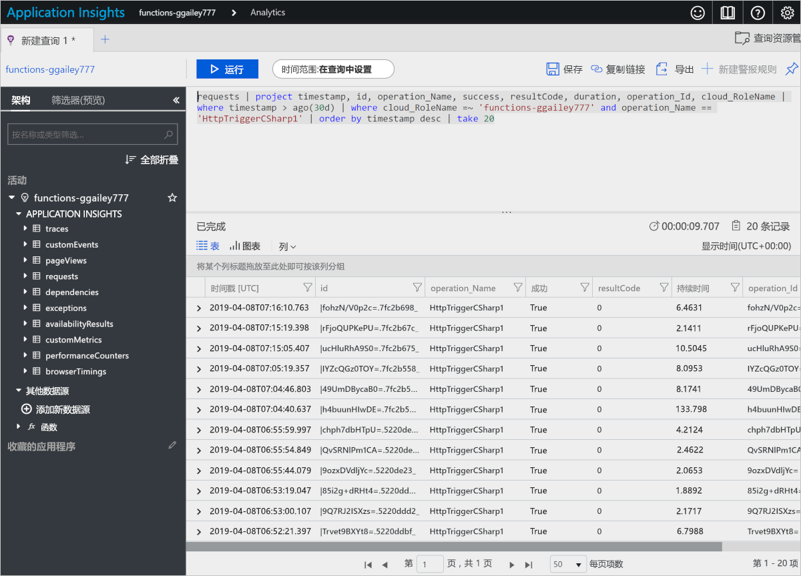
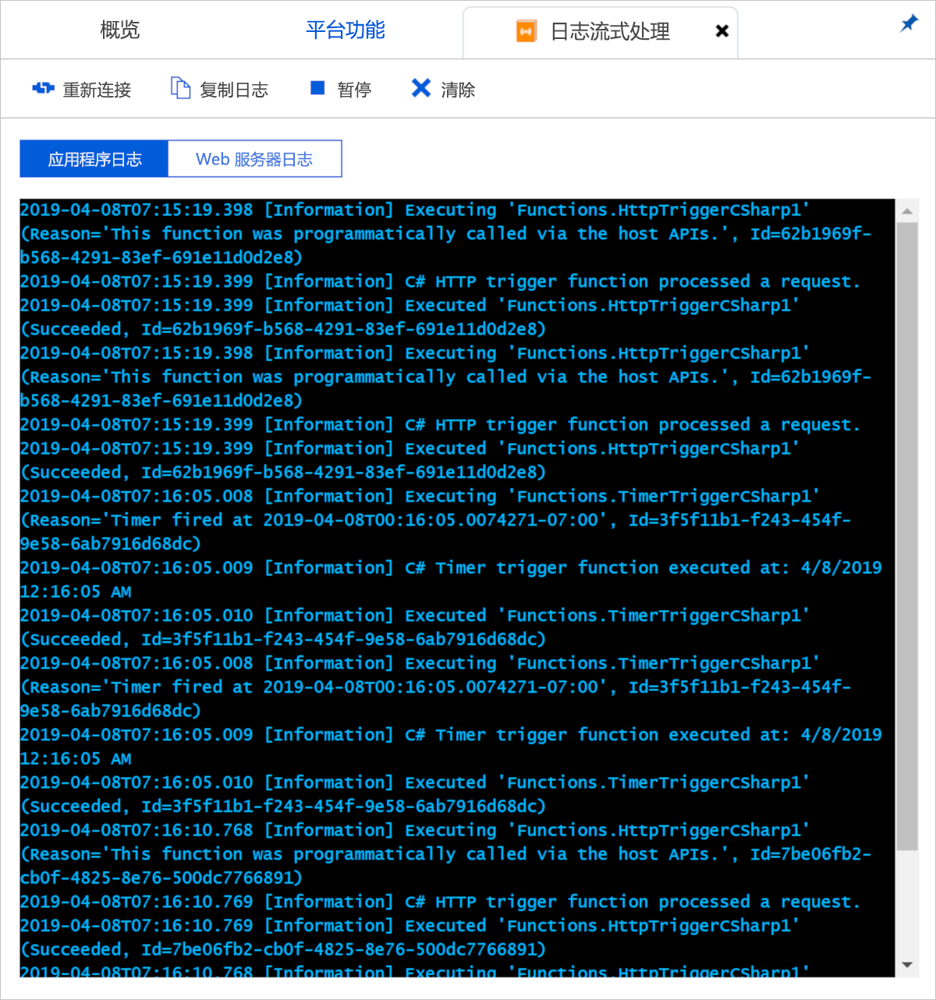

# <a name="monitor-azure-functions"></a>监视 Azure Functions

[Azure Functions](functions-overview.md)提供内置与[Azure 应用程序 Insights](../azure-monitor/app/app-insights-overview.md)的集成来监视函数。 本文介绍如何配置 Azure Functions 以将系统生成的日志文件发送到 Application Insights。

建议使用 Application Insights，因为它收集日志、性能和错误数据。 它会自动检测性能异常，并提供强大的分析工具来帮助你诊断问题并了解函数的使用方式。 Application Insights 有助于持续提高性能与可用性。 你甚至可以在本地函数应用项目开发过程中使用 Application Insights。 有关详细信息，请参阅[什么是 Application Insights？](../azure-monitor/app/app-insights-overview.md)。

由于所需的 Application Insights 检测内置于 Azure Functions 中，你只需一个有效的检测密钥即可将函数应用连接到 Application Insights 资源。

## <a name="application-insights-pricing-and-limits"></a>Application Insights 定价和限制

可以免费试用 Application Insights 与函数应用的集成。 每日限制可免费处理的数据量。 在测试期间，你可能会遇到此限制。 当你达到每日限制时，Azure 会提供门户和电子邮件通知。 如果错过了这些警报并达到了限制，则新日志不会出现在 Application Insights 查询中。 请注意限制，以避免不必要的故障排除时间。 有关详细信息，请参阅[在 Application Insights 中管理定价和数据量](../azure-monitor/app/pricing.md)。

函数应用可用 Application Insights 功能的完整列表详细介绍了[Azure Functions 支持的功能 Application Insights](../azure-monitor/app/azure-functions-supported-features.md)。

## <a name="enable-application-insights-integration"></a>启用 Application Insights 集成

对于将数据发送到 Application Insights 的函数应用，它需要知道 Application Insights 资源的检测密钥。 该密钥必须位于名为 **APPINSIGHTS_INSTRUMENTATIONKEY** 的应用设置中。

### <a name="new-function-app-in-the-portal"></a>门户中的新函数应用

[在 Azure 门户中创建函数应用](functions-create-first-azure-function.md)时，默认情况下会启用 Application Insights 集成。 Application Insights 资源具有与 function app 相同的名称，并且它是在同一区域或最近的区域中创建的。

若要查看正在创建的 Application Insights 资源，请选择它以展开 " **Application Insights** " 窗口。 你可以更改**新的资源名称**，或在要存储数据的[Azure 地理](https://azure.microsoft.com/global-infrastructure/geographies/)位置中选择其他**位置**。


选择 "**创建**" 时，将使用函数应用创建一个 Application Insights 资源，其中在应用程序设置中设置了 @no__t。 一切准备就绪。

<a id="manually-connect-an-app-insights-resource"></a>
### <a name="add-to-an-existing-function-app"></a>添加到现有函数应用 

使用[Azure CLI](functions-create-first-azure-function-azure-cli.md)、 [Visual Studio](functions-create-your-first-function-visual-studio.md)或[Visual Studio Code](functions-create-first-function-vs-code.md)创建 function app 时，必须创建 Application Insights 资源。 然后，你可以在 function app 中添加该资源的检测密钥作为应用程序设置。

[!INCLUDE [functions-connect-new-app-insights.md](../../includes/functions-connect-new-app-insights.md)]

早期版本的函数使用了内置监视功能，这不再推荐使用。 为此类函数应用启用 Application Insights 集成时，还必须[禁用内置日志记录](#disable-built-in-logging)。  

## <a name="view-telemetry-in-monitor-tab"></a>在“监视”选项卡中查看遥测数据

[启用 Application Insights 集成](#enable-application-insights-integration)后，可以在 "**监视**" 选项卡中查看遥测数据。

1. 在 "函数应用" 页中，选择在配置 Application Insights 后至少运行一次的函数。 然后选择 "**监视**" 选项卡。

   

1. 选择 "定期**刷新**"，直到出现函数调用列表。

   在遥测客户端分批传输要传输到服务器的数据时，可能需要长达五分钟的时间才会显示列表。 （延迟不适用于[实时指标流](../azure-monitor/app/live-stream.md)。 加载页面时，该服务会连接到 Functions 主机，因此，日志会直接流式传输到页面。）

   

1. 若要查看特定函数调用的日志，选择该调用对应的“日期”列链接。

   

   该调用的日志记录输出显示在新页中。

   

您可以看到，这两个页面都有 "**运行于" Application Insights**链接到检索数据的 Application Insights Analytics 查询。


将显示以下查询。 你可以看到，调用列表限制为过去30天。 此列表中显示的行数不能超过20行（`where timestamp > ago(30d) | take 20`）。 "调用详细信息" 列表适用于过去30天，无限制。



有关详细信息，请参阅本文稍后的[查询遥测数据](#query-telemetry-data)。

## <a name="view-telemetry-in-application-insights"></a>在 Application Insights 中查看遥测

若要从 Azure 门户中的函数应用打开 Application Insights，请参阅函数应用的 "**概述**" 页。 在 "**已配置功能**" 下，选择**Application Insights**。


有关如何使用 Application Insights 的信息，请参阅 [Application Insights 文档](https://docs.microsoft.com/azure/application-insights/)。 本部分介绍如何在 Application Insights 中查看数据的一些示例。 如果你已熟悉 Application Insights，则可以直接参阅[有关如何配置和自定义遥测数据的部分](#configure-categories-and-log-levels)。


评估函数中的行为、性能和错误时，以下 Application Insights 区域可能会有所帮助：

| Tab | 描述 |
| ---- | ----------- |
| **[故障](../azure-monitor/app/asp-net-exceptions.md)** |  根据函数失败和服务器异常来创建图表和警报。 操作名称是函数名称。 除非为依赖项实现自定义遥测，否则不会显示依赖项中的故障。 |
| **[性能](../azure-monitor/app/performance-counters.md)** | 分析性能问题。 |
| **服务器** | 查看每个服务器的资源利用率和吞吐量。 在函数阻碍基础资源的调试方案下，此数据非常有用。 服务器被称为云角色实例。 |
| **[指标](../azure-monitor/app/metrics-explorer.md)** | 创建基于指标的图表和警报。 度量值包括函数调用数、执行时间和成功率。 |
| **[实时指标流](../azure-monitor/app/live-stream.md)** | 查看以实时方式创建的指标数据。 |

## <a name="query-telemetry-data"></a>查询遥测数据

[Application Insights 分析](../azure-monitor/app/analytics.md)提供了对数据库中的表形式的所有遥测数据的访问。 Analytics 提供了一种用于提取、处理和可视化数据的查询语言。


下面是一个查询示例，它显示过去 30 分钟内每个辅助角色的请求的分布。

```
requests
| where timestamp > ago(30m) 
| summarize count() by cloud_RoleInstance, bin(timestamp, 1m)
| render timechart
```

可用的表显示在左侧的 "**架构**" 选项卡中。 可以在下表中找到由函数调用生成的数据：

| 表 | 描述 |
| ----- | ----------- |
| **断** | 由运行时和函数代码创建的日志。 |
| **requests** | 针对每个函数调用的一个请求。 |
| **异常** | 由运行时引发的任何异常。 |
| **customMetrics** | 成功和失败的调用、成功率和持续时间的计数。 |
| **customEvents** | 由运行时跟踪的事件，例如：触发函数的 HTTP 请求。 |
| **performanceCounters** | 有关运行函数的服务器的性能的信息。 |

其他表适用于可用性测试和客户端和浏览器遥测。 可以实现自定义遥测以向其中添加数据。

在每个表内，一些函数特定的数据位于 `customDimensions` 字段。  例如，以下查询检索所有具有日志级别 `Error` 的跟踪。

```
traces 
| where customDimensions.LogLevel == "Error"
```

运行时提供 @no__t 0 和 @no__t 字段。 您可以在 "日志" 中提供您在函数代码中编写的其他字段。 请参阅本文后面部分中的[结构化日志记录](#structured-logging)。

## <a name="configure-categories-and-log-levels"></a>配置类别和日志级别

无需任何自定义配置即可使用 Application Insights。 默认配置可能会导致大量的数据。 如果使用的是 Visual Studio Azure 订阅，可能会达到 Application Insights 的数据上限。 本文稍后将介绍如何配置和自定义函数发送到 Application Insights 的数据。 对于函数应用，请在[Host.json]文件中配置日志记录。

### <a name="categories"></a>类别

对于每个日志，Azure Functions 记录器都包含一个类别。 类别指示运行时代码或函数代码的哪个部分编写日志。 

函数运行时创建具有以 "Host" 开头的类别的日志。 在版本1.x 中，`function started`、`function executed` 和 @no__t 2 日志的 @no__t 类别均为3。 从版本2.x 开始，这些日志的类别为 `Function.<YOUR_FUNCTION_NAME>`。

如果在函数代码中编写日志，则类别在函数运行时的版本1.x 中 `Function`。 在版本2.x 中，类别为 `Function.<YOUR_FUNCTION_NAME>.User`。

### <a name="log-levels"></a>日志级别

Azure Functions 记录器还包括每个日志的*日志级别*。 [LogLevel](/dotnet/api/microsoft.extensions.logging.loglevel) 是一个枚举，整数代码指示相对重要性：

|LogLevel    |代码|
|------------|---|
|跟踪       | 0 |
|调试       | 第 |
|信息 | 2 |
|警告     | 3 |
|错误       | 4 |
|严重    | 5 |
|None        | 6 |

日志级别 `None` 将在下一节中进行介绍。 

### <a name="log-configuration-in-hostjson"></a>Host json 中的日志配置

[Host.json] 文件配置函数应用发送到 Application Insights 的日志记录数量。 对于每个类别，均可以指示要发送的最小日志级别。 有两个示例：第一个示例以[版本2.x 运行时](functions-versions.md#version-2x)（.net Core）为目标，第二个示例用于版本1.x 运行时。

### <a name="version-2x"></a>版本 2.x

v2.x 运行时使用 [.NET Core 日志记录筛选器层次结构](https://docs.microsoft.com/aspnet/core/fundamentals/logging/?view=aspnetcore-2.1#log-filtering)。 

```json
{
  "logging": {
    "fileLoggingMode": "always",
    "logLevel": {
      "default": "Information",
      "Host.Results": "Error",
      "Function": "Error",
      "Host.Aggregator": "Trace"
    }
  }
}
```

### <a name="version-1x"></a>版本 1.x

```json
{
  "logger": {
    "categoryFilter": {
      "defaultLevel": "Information",
      "categoryLevels": {
        "Host.Results": "Error",
        "Function": "Error",
        "Host.Aggregator": "Trace"
      }
    }
  }
}
```

此示例设置以下规则：

* 对于类别为 `Host.Results` 或 `Function` 的日志，只将 `Error` 级别和更高版本发送到 Application Insights。 `Warning` 级别及以下级别的日志将被忽略。
* 对于 `Host.Aggregator` 类别的日志，将所有日志发送到 Application Insights。 `Trace` 日志级别与某些记录器称为 `Verbose` 的日志级别相同，但在 [Host.json] 文件中请使用 `Trace`。
* 对于所有其他日志，仅向 Application Insights 发送 `Information` 级别及更高级别。

[Host.json] 中的类别值控制所有以相同值开头的类别的日志记录。 在[Host.json]中 `Host` 控制 `Host.General`、`Host.Executor`、`Host.Results` 等日志记录。

如果 [Host.json] 包含以相同字符串开头的多个类别，则先匹配较长的类别。 假设你想要从运行时中除 `Host.Aggregator` 以外的所有内容登录到 @no__t 级别，但你希望 @no__t 2 在 @no__t 级别进行记录：

### <a name="version-2x"></a>版本 2.x 

```json
{
  "logging": {
    "fileLoggingMode": "always",
    "logLevel": {
      "default": "Information",
      "Host": "Error",
      "Function": "Error",
      "Host.Aggregator": "Information"
    }
  }
}
```

### <a name="version-1x"></a>版本 1.x 

```json
{
  "logger": {
    "categoryFilter": {
      "defaultLevel": "Information",
      "categoryLevels": {
        "Host": "Error",
        "Function": "Error",
        "Host.Aggregator": "Information"
      }
    }
  }
}
```

若要禁止某个类别的所有日志，可以使用日志级别 `None`。 没有与该类别一起写入的日志，也没有日志级别。

以下各部分描述了运行时创建的日志的主要类别。 

### <a name="category-hostresults"></a>类别 Host.Results

这些日志在 Application Insights 中显示为“requests”。 它们指示函数的成功或失败。


所有这些日志均以 @no__t 级别写入。 如果你筛选 `Warning` 或更高版本，你将看不到此数据。

### <a name="category-hostaggregator"></a>类别 Host.Aggregator

这些日志在一段[可配置](#configure-the-aggregator)的时间内提供函数调用的计数和平均值。 默认时段为 30 秒或 1,000 个结果，以先满足的条件为准。 

日志位于 Application Insights 中的 **customMetrics** 表内。 例如，运行数、成功率和持续时间。


所有这些日志均以 @no__t 级别写入。 如果你筛选 `Warning` 或更高版本，你将看不到此数据。

### <a name="other-categories"></a>其他类别

除了已经列出的类别，其余类别的所有日志在 Application Insights 的 **traces** 表中提供。


所有类别以 `Host` 开头的日志都由函数运行时写入。 "函数已启动" 和 "函数已完成" 日志的类别 @no__t 为0。 如果成功运行，则这些日志 @no__t 级别。 异常记录在 `Error` 级别。 运行时还创建 `Warning` 级别日志，例如：已发送到病毒邮件队列的队列邮件。

函数代码编写的日志具有类别 `Function`，可以是任何日志级别。

## <a name="configure-the-aggregator"></a>配置聚合器

如前一部分中所述，运行时聚合一段时间内有关函数执行的数据。 默认时段为 30 秒或 1,000 次运行，以先满足的条件为准。 可以在 [Host.json] 文件中配置此设置。  下面是一个示例：

```json
{
    "aggregator": {
      "batchSize": 1000,
      "flushTimeout": "00:00:30"
    }
}
```

## <a name="configure-sampling"></a>配置采样

Application Insights 提供了一项[采样](../azure-monitor/app/sampling.md)功能，可防止在负载高峰时为已完成的执行生成过多的遥测数据。 当传入执行速率超出指定阈值时，Application Insights 会开始随机忽略某些传入的执行。 每秒执行的最大次数的默认设置为20（版本1.x 中的5个）。 可以在 [Host.json] 中配置采样。  下面是一个示例：

### <a name="version-2x"></a>版本 2.x 

```json
{
  "logging": {
    "applicationInsights": {
      "samplingSettings": {
        "isEnabled": true,
        "maxTelemetryItemsPerSecond" : 20
      }
    }
  }
}
```

### <a name="version-1x"></a>版本 1.x 

```json
{
  "applicationInsights": {
    "sampling": {
      "isEnabled": true,
      "maxTelemetryItemsPerSecond" : 5
    }
  }
}
```

> [!NOTE]
> [采样](../azure-monitor/app/sampling.md)是默认启用的。 如果你似乎缺少数据，则可能需要调整采样设置以适应特定的监视方案。

## <a name="write-logs-in-c-functions"></a>在 C# 函数中编写日志

可以在 Application Insights 中显示为 traces 的函数代码中编写日志。

### <a name="ilogger"></a>ILogger

在函数中使用 [ILogger](https://docs.microsoft.com/dotnet/api/microsoft.extensions.logging.ilogger) 参数，而不是 `TraceWriter` 参数。 使用 @no__t 创建的日志会转向 Application Insights，但 @no__t 为-1，则可以进行[结构化日志记录](https://softwareengineering.stackexchange.com/questions/312197/benefits-of-structured-logging-vs-basic-logging)。

使用 `ILogger` 对象，可以调用 `Log<level>`ILogger 上的 [ 扩展方法](https://docs.microsoft.com/dotnet/api/microsoft.extensions.logging.loggerextensions#methods)来创建日志。 下面的代码写入类别为 "Function" `Information` 日志。

```cs
public static async Task<HttpResponseMessage> Run(HttpRequestMessage req, ILogger logger)
{
    logger.LogInformation("Request for item with key={itemKey}.", id);
```

### <a name="structured-logging"></a>结构化日志记录

占位符的顺序（而不是其名称）确定日志消息中使用的参数。 假设你有以下代码：

```csharp
string partitionKey = "partitionKey";
string rowKey = "rowKey";
logger.LogInformation("partitionKey={partitionKey}, rowKey={rowKey}", partitionKey, rowKey);
```

如果保留相同的消息字符串并颠倒参数的顺序，则生成的消息文本将在错误的位置生成值。

以这种方式处理占位符，以便可以执行结构化日志记录。 Application Insights 存储参数名称-值对和消息字符串。 结果是消息参数变为可以查询的字段。

如果记录器方法调用与前面的示例类似，则可以查询字段 `customDimensions.prop__rowKey`。 添加 @no__t 的前缀以确保运行时添加的字段和函数代码添加的字段之间没有冲突。

此外，可以通过引用字段 `customDimensions.prop__{OriginalFormat}` 查询原始消息字符串。  

下面是 `customDimensions` 数据的示例 JSON 表示形式：

```json
{
  customDimensions: {
    "prop__{OriginalFormat}":"C# Queue trigger function processed: {message}",
    "Category":"Function",
    "LogLevel":"Information",
    "prop__message":"c9519cbf-b1e6-4b9b-bf24-cb7d10b1bb89"
  }
}
```

### <a name="custom-metrics-logging"></a>自定义指标日志记录

在 C# 脚本函数中，可以使用 `ILogger` 上的 `LogMetric` 扩展方法来在 Application Insights 中创建自定义指标。 下面是示例方法调用：

```csharp
logger.LogMetric("TestMetric", 1234);
```

此代码是使用 Application Insights API for .NET 调用 @no__t 的替代方法。

## <a name="write-logs-in-javascript-functions"></a>在 JavaScript 函数中写入日志

在 Node.js 函数中，使用 `context.log` 编写日志。 不启用结构化日志记录。

```
context.log('JavaScript HTTP trigger function processed a request.' + context.invocationId);
```

### <a name="custom-metrics-logging"></a>自定义指标日志记录

当你在函数运行时的[版本](functions-versions.md#creating-1x-apps)1.x 上运行时，node.js 函数可以使用 `context.log.metric` 方法在 Application Insights 中创建自定义度量值。 版本2.x 当前不支持此方法。 下面是示例方法调用：

```javascript
context.log.metric("TestMetric", 1234);
```

此代码是使用 node.js SDK for Application Insights 调用 `trackMetric` 的替代方法。

## <a name="log-custom-telemetry-in-c-functions"></a>在函数中C#记录自定义遥测

可以使用 [Microsoft.ApplicationInsights](https://www.nuget.org/packages/Microsoft.ApplicationInsights/) NuGet 程序包将自定义遥测数据发送到 Application Insights。 以下 C# 示例使用[自定义遥测 API](../azure-monitor/app/api-custom-events-metrics.md)。 示例针对的是 .NET 类库，但对于 C# 脚本，Application Insights 代码是相同的。

### <a name="version-2x"></a>版本 2.x

版本 2.x 运行时使用 Application Insights 中的较新功能自动将遥测与当前操作进行关联。 无需手动设置操作 `Id`、`ParentId` 或 `Name` 字段。

```cs
using System;
using System.Linq;
using System.Threading.Tasks;
using Microsoft.ApplicationInsights;
using Microsoft.ApplicationInsights.DataContracts;
using Microsoft.AspNetCore.Http;
using Microsoft.AspNetCore.Mvc;
using Microsoft.Azure.WebJobs;
using Microsoft.Azure.WebJobs.Extensions.Http;
using Microsoft.Extensions.Logging;

namespace functionapp0915
{
    public class HttpTrigger2
    {
        private readonly TelemetryClient telemetryClient;

        /// Using dependency injection will guarantee that you use the same configuration for telemetry collected automatically and manually.
        public HttpTrigger2(TelemetryConfiguration telemetryConfiguration)
        {
            this.telemetryClient = new TelemetryClient(telemetryConfiguration);
        }

        [FunctionName("HttpTrigger2")]
        public Task<IActionResult> Run(
            [HttpTrigger(AuthorizationLevel.Anonymous, "get", Route = null)]
            HttpRequest req, ExecutionContext context, ILogger log)
        {
            log.LogInformation("C# HTTP trigger function processed a request.");
            DateTime start = DateTime.UtcNow;

            // Parse query parameter
            string name = req.Query
                .FirstOrDefault(q => string.Compare(q.Key, "name", true) == 0)
                .Value;

            // Track an Event
            var evt = new EventTelemetry("Function called");
            evt.Context.User.Id = name;
            this.telemetryClient.TrackEvent(evt);

            // Track a Metric
            var metric = new MetricTelemetry("Test Metric", DateTime.Now.Millisecond);
            metric.Context.User.Id = name;
            this.telemetryClient.TrackMetric(metric);

            // Track a Dependency
            var dependency = new DependencyTelemetry
            {
                Name = "GET api/planets/1/",
                Target = "swapi.co",
                Data = "https://swapi.co/api/planets/1/",
                Timestamp = start,
                Duration = DateTime.UtcNow - start,
                Success = true
            };
            dependency.Context.User.Id = name;
            this.telemetryClient.TrackDependency(dependency);

            return Task.FromResult<IActionResult>(new OkResult());
        }
    }
}
```

### <a name="version-1x"></a>版本 1.x

```cs
using System;
using System.Net;
using Microsoft.ApplicationInsights;
using Microsoft.ApplicationInsights.DataContracts;
using Microsoft.ApplicationInsights.Extensibility;
using Microsoft.Azure.WebJobs;
using System.Net.Http;
using System.Threading.Tasks;
using Microsoft.Azure.WebJobs.Extensions.Http;
using Microsoft.Extensions.Logging;
using System.Linq;

namespace functionapp0915
{
    public static class HttpTrigger2
    {
        private static string key = TelemetryConfiguration.Active.InstrumentationKey = 
            System.Environment.GetEnvironmentVariable(
                "APPINSIGHTS_INSTRUMENTATIONKEY", EnvironmentVariableTarget.Process);

        private static TelemetryClient telemetryClient = 
            new TelemetryClient() { InstrumentationKey = key };

        [FunctionName("HttpTrigger2")]
        public static async Task<HttpResponseMessage> Run(
            [HttpTrigger(AuthorizationLevel.Anonymous, "get", "post", Route = null)]
            HttpRequestMessage req, ExecutionContext context, ILogger log)
        {
            log.LogInformation("C# HTTP trigger function processed a request.");
            DateTime start = DateTime.UtcNow;

            // Parse query parameter
            string name = req.GetQueryNameValuePairs()
                .FirstOrDefault(q => string.Compare(q.Key, "name", true) == 0)
                .Value;

            // Get request body
            dynamic data = await req.Content.ReadAsAsync<object>();

            // Set name to query string or body data
            name = name ?? data?.name;
         
            // Track an Event
            var evt = new EventTelemetry("Function called");
            UpdateTelemetryContext(evt.Context, context, name);
            telemetryClient.TrackEvent(evt);
            
            // Track a Metric
            var metric = new MetricTelemetry("Test Metric", DateTime.Now.Millisecond);
            UpdateTelemetryContext(metric.Context, context, name);
            telemetryClient.TrackMetric(metric);
            
            // Track a Dependency
            var dependency = new DependencyTelemetry
                {
                    Name = "GET api/planets/1/",
                    Target = "swapi.co",
                    Data = "https://swapi.co/api/planets/1/",
                    Timestamp = start,
                    Duration = DateTime.UtcNow - start,
                    Success = true
                };
            UpdateTelemetryContext(dependency.Context, context, name);
            telemetryClient.TrackDependency(dependency);
        }
        
        // Correlate all telemetry with the current Function invocation
        private static void UpdateTelemetryContext(TelemetryContext context, ExecutionContext functionContext, string userName)
        {
            context.Operation.Id = functionContext.InvocationId.ToString();
            context.Operation.ParentId = functionContext.InvocationId.ToString();
            context.Operation.Name = functionContext.FunctionName;
            context.User.Id = userName;
        }
    }    
}
```

请勿调用 `TrackRequest` 或 `StartOperation<RequestTelemetry>`，因为你将看到对函数调用的重复请求。  Functions 运行时自动跟踪请求。

不要设置 `telemetryClient.Context.Operation.Id`。 当许多函数同时运行时，此全局设置将导致相关错误。 请改为创建新的遥测实例（`DependencyTelemetry`、`EventTelemetry`）并修改其 `Context` 属性。 然后将遥测实例传入到 `TelemetryClient` 的相应 `Track` 方法（`TrackDependency()`、`TrackEvent()`）。 此方法确保遥测为当前函数调用提供了正确的相关详细信息。

## <a name="log-custom-telemetry-in-javascript-functions"></a>在 JavaScript 函数中记录自定义遥测

下面是一个示例代码片段，它使用[Application Insights NODE.JS SDK](https://github.com/microsoft/applicationinsights-node.js)发送自定义遥测数据：

```javascript
const appInsights = require("applicationinsights");
appInsights.setup();
const client = appInsights.defaultClient;

module.exports = function (context, req) {
    context.log('JavaScript HTTP trigger function processed a request.');

    client.trackEvent({name: "my custom event", tagOverrides:{"ai.operation.id": context.invocationId}, properties: {customProperty2: "custom property value"}});
    client.trackException({exception: new Error("handled exceptions can be logged with this method"), tagOverrides:{"ai.operation.id": context.invocationId}});
    client.trackMetric({name: "custom metric", value: 3, tagOverrides:{"ai.operation.id": context.invocationId}});
    client.trackTrace({message: "trace message", tagOverrides:{"ai.operation.id": context.invocationId}});
    client.trackDependency({target:"http://dbname", name:"select customers proc", data:"SELECT * FROM Customers", duration:231, resultCode:0, success: true, dependencyTypeName: "ZSQL", tagOverrides:{"ai.operation.id": context.invocationId}});
    client.trackRequest({name:"GET /customers", url:"http://myserver/customers", duration:309, resultCode:200, success:true, tagOverrides:{"ai.operation.id": context.invocationId}});

    context.done();
};
```

@No__t 参数将 @no__t 设置为函数的调用 ID。 通过此设置，可为给定的函数调用关联所有自动生成的遥测和自定义遥测。

## <a name="dependencies"></a>依赖项

函数 v2 自动收集 HTTP 请求、处理程序和 SQL 的依赖关系。

您可以编写自定义代码来显示依赖项。 有关示例，请参阅[ C#自定义遥测节](#log-custom-telemetry-in-c-functions)中的示例代码。 示例代码会在 Application Insights 中生成一个*应用程序映射*，如下图所示：


## <a name="report-issues"></a>报告问题

若要报告 Functions 中的 Application Insights 集成问题，或提出建议或请求，请[在 GitHub 中创建问题](https://github.com/Azure/Azure-Functions/issues/new)。

## <a name="streaming-logs"></a>流式处理日志

开发应用程序时，通常需要了解在 Azure 中运行时，实时写入日志的内容。

可以通过两种方式查看由函数执行生成的日志文件流。

* **内置日志流式处理**：应用服务平台使你可以查看应用程序日志文件的流。 这等效于在[本地开发](functions-develop-local.md)期间调试函数时以及在门户中使用 "**测试**" 选项卡时所显示的输出。 将显示所有基于日志的信息。 有关详细信息，请参阅[流日志](../app-service/troubleshoot-diagnostic-logs.md#stream-logs)。 此流处理方法仅支持单个实例，不能用于在消耗计划中运行 Linux 的应用。

* **实时指标流**：当函数应用[连接到 Application Insights](#enable-application-insights-integration)时，你可以使用[实时指标流](../azure-monitor/app/live-stream.md)以近乎实时的 Azure 门户查看日志数据和其他指标。 当监视消耗计划中在多个实例上或在 Linux 上运行的函数时，请使用此方法。 此方法使用[抽样数据](#configure-sampling)。

可以在门户中和大多数本地开发环境中查看日志流。 

### <a name="portal"></a>门户

可以在门户中查看这两种类型的日志流。

#### <a name="built-in-log-streaming"></a>内置日志流式处理

若要在门户中查看流式处理日志，请在函数应用中选择 "**平台功能**" 选项卡。 然后，在 "**监视**" 下选择 "**日志流**"。


这会将你的应用连接到日志流式处理服务，应用程序日志将显示在窗口中。 可以在**应用程序日志**和**Web 服务器日志**之间切换。  



#### <a name="live-metrics-stream"></a>实时指标流

若要查看应用的实时指标流，请选择 function app 的 "**概述**" 选项卡。 Application Insights 启用后，会在 "**已配置功能**" 下看到**Application Insights**链接。 此链接会将你转到应用的 "Application Insights" 页。

在 Application Insights 中，选择 "**实时指标流**"。 [采样的日志项](#configure-sampling)显示在 "**示例遥测**" 下。

 

### <a name="visual-studio-code"></a>Visual Studio Code

[!INCLUDE [functions-enable-log-stream-vs-code](../../includes/functions-enable-log-stream-vs-code.md)]

### <a name="core-tools"></a>核心工具

[!INCLUDE [functions-streaming-logs-core-tools](../../includes/functions-streaming-logs-core-tools.md)]

### <a name="azure-cli"></a>Azure CLI

您可以使用[Azure CLI](/cli/azure/install-azure-cli)启用流式处理日志。 使用以下命令登录，选择你的订阅，然后流式传输日志文件：

```azurecli
az login
az account list
az account set --subscription <subscriptionNameOrId>
az webapp log tail --resource-group <RESOURCE_GROUP_NAME> --name <FUNCTION_APP_NAME>
```

### <a name="azure-powershell"></a>Azure PowerShell

您可以使用[Azure PowerShell](/powershell/azure/overview)启用流式处理日志。 对于 PowerShell，请使用以下命令添加 Azure 帐户，选择订阅并流式传输日志文件：

```powershell
Add-AzAccount
Get-AzSubscription
Get-AzSubscription -SubscriptionName "<subscription name>" | Select-AzSubscription
Get-AzWebSiteLog -Name <FUNCTION_APP_NAME> -Tail
```

## <a name="disable-built-in-logging"></a>禁用内置日志记录

启用 Application Insights 时，请禁用使用 Azure 存储的内置日志记录。 内置日志记录适用于测试轻型工作负荷，但不适用于高负载生产。 对于生产监视，我们建议 Application Insights。 如果在生产中使用内置日志记录，则日志记录可能不完整，因为对 Azure 存储的限制。

若要禁用内置日志记录，请删除 `AzureWebJobsDashboard` 应用设置。 有关如何在 Azure 门户中删除应用设置的信息，请参阅[如何管理函数应用](functions-how-to-use-azure-function-app-settings.md#settings)的“应用程序设置”部分。 在删除应用设置之前，请确保同一 function app 中没有现有函数使用 Azure 存储触发器或绑定的设置。

## <a name="next-steps"></a>后续步骤

有关详细信息，请参阅以下资源：

* [Application Insights](/azure/application-insights/)
* [ASP.NET Core 日志记录](/aspnet/core/fundamentals/logging/)

[Host.json]: functions-host-json.md
