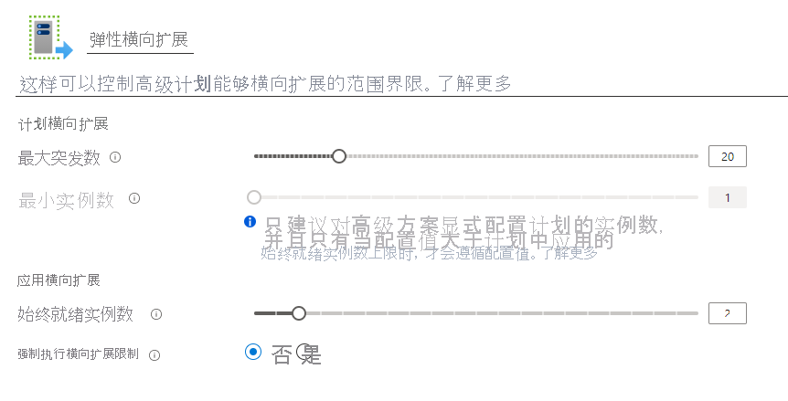

# <a name="azure-functions-premium-plan"></a>Azure Functions 高级计划

Azure Functions 高级计划 (有时称为弹性高级计划) 是函数应用的托管选项。 高级计划提供 VNet 连接、无冷启动和高级硬件等功能。  可以将多个函数应用部署到相同的高级计划，该计划允许配置计算实例大小、基本计划大小和最大计划大小。  有关高级计划以及其他计划和托管类型的比较，请参阅 [函数缩放和宿主选项](functions-scale.md)。

## <a name="create-a-premium-plan"></a>创建高级计划

[!INCLUDE [functions-premium-create](../../includes/functions-premium-create.md)]

你还可以在 Azure CLI 中使用 [az functionapp plan create](/cli/azure/functionapp/plan#az-functionapp-plan-create) 创建高级计划。 以下示例创建一个 _弹性高级版 1_ 层计划：

```azurecli-interactive
az functionapp plan create --resource-group <RESOURCE_GROUP> --name <PLAN_NAME> \
--location <REGION> --sku EP1
```

在此示例中， `<RESOURCE_GROUP>` 将替换为资源组，并将替换为在 `<PLAN_NAME>` 资源组中唯一的计划的名称。 指定[支持 `<REGION>` ](https://azure.microsoft.com/global-infrastructure/services/?products=functions)的。 若要创建支持 Linux 的高级计划，请包括 `--is-linux` 选项。

创建计划后，可以使用 [az functionapp create](/cli/azure/functionapp#az-functionapp-create) 创建 function app。 在门户中，计划和应用都同时创建。 有关完整 Azure CLI 脚本的示例，请参阅 [在高级计划中创建函数应用](scripts/functions-cli-create-premium-plan.md)。

## <a name="features"></a>功能

以下功能可用于部署到高级计划的函数应用。

### <a name="always-ready-instances"></a>始终可用实例

如果当前在消耗计划中未发生任何事件和执行，则应用可能会向零个实例进行缩放。 当出现新事件时，需要使用在其上运行的应用程序来专用化新的实例。  专用化新实例可能需要一些时间，具体取决于应用程序。  第一次调用的额外延迟通常称为应用冷启动。

在高级计划中，你可以让应用始终准备好指定数量的实例。  始终可用实例的最大数目为20。  事件开始触发应用时，它们首先路由到始终可用的实例。  当该函数变为活动状态时，其他实例将被准备好为缓冲区。  此缓冲区可防止在缩放期间需要对新实例进行冷启动。  这些缓冲的实例称为 [准备好实例](#pre-warmed-instances)。  结合使用 always ready 实例和预准备好缓冲器后，应用可以有效地消除冷启动。

> [!NOTE]
> 每个高级计划将至少具有一个活动和计费的实例。

您可以通过选择 **Function App**，转到 " **平台功能** " 选项卡，然后选择 " **Scale Out** " 选项，在 Azure 门户中配置始终可用的实例数。 在函数应用编辑窗口中，always ready 实例特定于该应用。



你还可以使用 Azure CLI 配置应用的始终可用实例。

```azurecli-interactive
az resource update -g <resource_group> -n <function_app_name>/config/web --set properties.minimumElasticInstanceCount=<desired_always_ready_count> --resource-type Microsoft.Web/sites 
```

#### <a name="pre-warmed-instances"></a>准备好实例

准备好实例是在缩放和激活事件期间准备好为缓冲区的实例数。  在达到最大扩展限制之前，准备好实例将继续进行缓冲。  默认的预准备好实例计数为1，在大多数情况下，它应保留为1。  如果某个应用的长时间预热 (如自定义容器映像) ，你可能希望增加此缓冲区。  只有在充分利用了所有活动的实例后，准备好实例才会变为活动状态。

请考虑此示例，了解始终可用实例和预准备好实例如何协同工作。  高级函数应用已配置五个始终可用实例，默认值为一个 prewarmed 实例。  当应用处于空闲状态且未触发任何事件时，将在五个实例上预配并运行应用。  

第一次触发器进入后，五个 always ready 实例会变为活动状态，并分配一个额外的准备好实例。  应用现在正在运行六个预配的实例：五个现已激活的始终可用实例，以及第六个准备好和非活动缓冲。  如果执行速率持续增加，最终将使用五个活动实例。  当平台决定扩展到超过五个实例时，它将扩展到准备好实例。  发生这种情况时，现在会有六个活动实例，并将立即预配第七个实例并填充准备好缓冲区。  此缩放顺序和预预热将继续，直到达到应用的最大实例计数。  任何实例都不会提前准备好或激活，超过最大值。

可以使用 Azure CLI 修改应用的预准备好实例数。

```azurecli-interactive
az resource update -g <resource_group> -n <function_app_name>/config/web --set properties.preWarmedInstanceCount=<desired_prewarmed_count> --resource-type Microsoft.Web/sites 
```

#### <a name="maximum-instances-for-an-app"></a>应用的最大实例数

除了 [计划最大实例计数](#plan-and-sku-settings)之外，还可以配置每个应用的最大值。  应用最大值可以使用 [应用规模限制](./functions-scale.md#limit-scale-out)进行配置。

### <a name="private-network-connectivity"></a>专用网络连接

部署到高级计划的 Azure Functions 将利用 [适用于 web 应用的新 VNet 集成](../app-service/web-sites-integrate-with-vnet.md)。  配置后，你的应用可以与 VNet 中的资源通信，或通过服务终结点进行保护。  应用上也提供了 IP 限制，以限制传入流量。

在高级计划中向函数应用分配子网时，需要一个子网，其中每个潜在实例都有足够的 IP 地址。 需要至少具有100个可用地址的 IP 块。

有关详细信息，请参阅 [将 function app 与 VNet 集成](functions-create-vnet.md)。

### <a name="rapid-elastic-scale"></a>快速弹性缩放

使用与消耗计划相同的快速缩放逻辑，为你的应用自动添加其他计算实例。 同一应用服务计划中的应用将基于单个应用的需求彼此独立地进行扩展。 但是，同一应用服务计划中的函数应用会共享 VM 资源，以帮助降低成本（如果可能）。 与 VM 关联的应用数取决于每个应用的占用量和 VM 大小。

若要详细了解缩放的工作方式，请参阅 [函数缩放和宿主](./functions-scale.md#how-the-consumption-and-premium-plans-work)。

### <a name="longer-run-duration"></a>运行持续时间较长

对于单个执行，消耗计划中的 Azure Functions 限制为10分钟。  在高级计划中，运行持续时间默认为30分钟，以防止执行失控。 不过，你可以 [修改配置 host.js](./functions-host-json.md#functiontimeout) 以使高级计划应用的持续时间无限长， (确保60分钟) 。

## <a name="plan-and-sku-settings"></a>计划和 SKU 设置

创建计划时，有两个计划大小设置：实例的最小数目 (或计划大小) 和最大突发限制。

如果你的应用程序需要的实例超出了始终可用的实例，它可以继续横向扩展，直到实例数达到最大猝发限制。  仅当计划规模正在运行且为你租借时，才会向你收费。  我们将尽最大努力将应用扩展到其定义的最大限制。

您可以通过在 "**平台功能**") 下，通过选择部署到该 (计划的计划或函数应用中的**Scale Out**选项，在 Azure 门户中配置计划大小和最大值。

还可以增加 Azure CLI 的最大猝发限制：

```azurecli-interactive
az resource update -g <resource_group> -n <premium_plan_name> --set properties.maximumElasticWorkerCount=<desired_max_burst> --resource-type Microsoft.Web/serverfarms 
```

每个计划的最小值至少为一个实例。  系统会根据计划中的应用请求的始终可用实例自动配置最小实例数。  例如，如果应用 A 请求5个始终可用实例，并且应用 B 在同一计划中请求两个始终可用实例，则最小计划大小将计算为5。  应用 A 将在所有5上运行，应用 B 将仅在2上运行。

> [!IMPORTANT]
> 对于在最小实例计数中分配的每个实例，无论函数是否正在执行，都将向你收费。

在大多数情况下，此 autocalculated 的最小值应该足以满足需要。  但是，最佳做法是在最少的情况下进行缩放。  虽然不太可能，但如果其他实例不可用，则可能会延迟特定的时间扩展。  通过将最小值设置为 "最小值"，可以在横向扩展时保留实例 autocalculated。

可以使用 Azure CLI 增加计算计划的最小值。

```azurecli-interactive
az resource update -g <resource_group> -n <premium_plan_name> --set sku.capacity=<desired_min_instances> --resource-type Microsoft.Web/serverfarms 
```

### <a name="available-instance-skus"></a>可用实例 Sku

创建或缩放计划时，可以在三种实例大小之间进行选择。  将按照内核总数和每秒使用的内存数计费。  应用可根据需要自动向外扩展到多个实例。  

|SKU|核心数|内存|存储|
|--|--|--|--|
|EP1|1|3.5 GB|250GB|
|EP2|2|7GB|250GB|
|EP3|4|14GB|250GB|

### <a name="memory-utilization-considerations"></a>内存使用率注意事项
在具有更多内存的计算机上运行并不一定意味着函数应用将使用所有可用内存。

例如，JavaScript 函数应用受 Node.js 中默认内存限制的限制。 若要增加此固定内存限制，请添加 `languageWorkers:node:arguments` 值为的应用设置 `--max-old-space-size=<max memory in MB>` 。

## <a name="region-max-scale-out"></a>区域最大 Scale Out

下面是每个区域和 OS 配置中单个计划的当前支持的最大缩放值。 若要请求增加，请打开支持票证。

请参阅此处的功能的完整区域可用性： [Azure.com](https://azure.microsoft.com/global-infrastructure/services/?products=functions)

|区域| Windows | Linux |
|--| -- | -- |
|澳大利亚中部| 100 | 不可用 |
|澳大利亚中部 2| 100 | 不可用 |
|澳大利亚东部| 100 | 20 |
|Australia Southeast | 100 | 20 |
|Brazil South| 100 | 20 |
|加拿大中部| 100 | 20 |
|美国中部| 100 | 20 |
|中国东部 2| 100 | 20 |
|中国北部 2| 100 | 20 |
|东亚| 100 | 20 |
|美国东部 | 100 | 20 |
|美国东部 2| 100 | 20 |
|法国中部| 100 | 20 |
|德国中西部| 100 | 不可用 |
|Japan East| 100 | 20 |
|日本西部| 100 | 20 |
|韩国中部| 100 | 20 |
|韩国南部| 不可用 | 20 |
|美国中北部| 100 | 20 |
|北欧| 100 | 20 |
|挪威东部| 100 | 20 |
|美国中南部| 100 | 20 |
|印度南部 | 100 | 不可用 |
|Southeast Asia| 100 | 20 |
|瑞士北部| 100 | 不可用 |
|瑞士西部| 100 | 不可用 |
|英国南部| 100 | 20 |
|英国西部| 100 | 20 |
|USGov Arizona| 100 | 20 |
|USGov Virginia| 100 | 20 |
|USNat 东部| 100 | 不可用 |
|USNat 西| 100 | 不可用 |
|西欧| 100 | 20 |
|印度西部| 100 | 20 |
|美国中西部| 100 | 20 |
|美国西部| 100 | 20 |
|美国西部 2| 100 | 20 |

## <a name="next-steps"></a>后续步骤

> [!div class="nextstepaction"]
> [了解 Azure Functions 缩放和托管选项](functions-scale.md)
