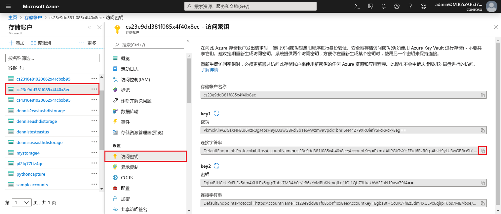
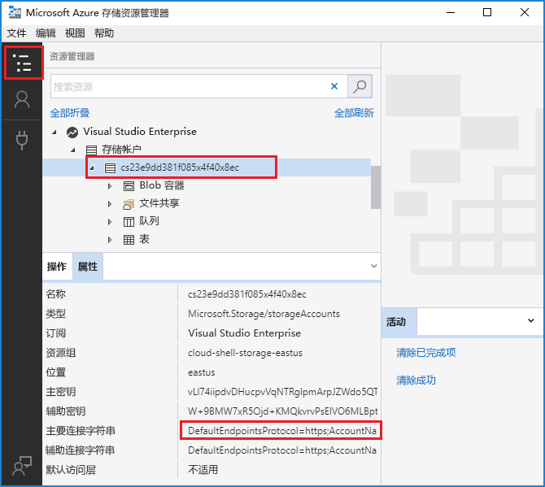

# <a name="work-with-azure-functions-core-tools"></a>使用 Azure Functions Core Tools

使用 Azure Functions Core Tools 可以在本地计算机上通过命令提示符或终端开发和测试函数。 本地函数可以连接到实时 Azure 服务，你可以在本地计算机上使用完整的 Functions 运行时调试函数。 甚至可以将函数应用部署到 Azure 订阅。

[!INCLUDE [Don't mix development environments](../../includes/functions-mixed-dev-environments.md)]

按照以下基本步骤在本地计算机上开发函数并使用 Core Tools 将其发布到 Azure：

> [!div class="checklist"]
> * [安装 Core Tools 和依赖项](#v2)。
> * [从特定于语言的模板创建函数应用项目](#create-a-local-functions-project)。
> * [注册触发器和绑定扩展](#register-extensions)。
> * [定义存储和其他连接](#local-settings-file)。
> * [从触发器和特定于语言的模板创建函数](#create-func)。
> * [在本地运行函数。](#start)
> * [将项目发布到 Azure。](#publish)

## <a name="core-tools-versions"></a>Core Tools 版本

Azure Functions Core Tools 有三个版本。 使用的版本取决于本地开发环境、[所选的语言](supported-languages.md)以及所需的支持级别：

+ [版本 3.x/2.x](#v2)：支持 [3.x 或 2.x 版的 Azure Functions 运行时](functions-versions.md)。 这些版本支持 [Windows](?tabs=windows#v2)、[macOS](?tabs=macos#v2) 和 [Linux](?tabs=linux#v2)，并使用特定于平台的包管理器或 npm 进行安装。

+ **版本 1.x**：支持 1.x 版的 Azure Functions 运行时。 此 Tools 版本仅在 Windows 计算机上受支持，需从 [npm 包](https://www.npmjs.com/package/azure-functions-core-tools)安装。

你只能在给定计算机上安装一个版本的核心工具。 除非另有说明，否则本文中的示例适用于版本 3.x。

## <a name="prerequisites"></a>先决条件

Azure Functions Core Tools 当前依赖于 Azure CLI 通过 Azure 帐户进行身份验证。 这意味着必须[在本地安装 Azure CLI](/cli/azure/install-azure-cli)，才能从 Azure Functions Core Tools [发布到 Azure](#publish)。 

## <a name="install-the-azure-functions-core-tools"></a>安装 Azure Functions Core Tools

[Azure Functions Core Tools] 包含同一运行时的另一版本，该版本为本地开发计算机上可运行的 Azure Functions 运行时提供支持。 它还提供用于创建函数、连接到 Azure 和部署函数项目的命令。

### <a name="version-3x-and-2x"></a><a name="v2"></a>版本 3.x 和 2.x

3\.x/2.x 版工具使用构建在 .NET Core 之上的 Azure Functions 运行时。 .NET Core 支持的所有平台（包括 [Windows](?tabs=windows#v2)、[macOS](?tabs=macos#v2) 和 [Linux](?tabs=linux#v2)）都支持此版本。 

> [!IMPORTANT]
> 可以使用[扩展捆绑包]绕过安装 .NET Core SDK 的要求。

# <a name="windows"></a>[Windows](#tab/windows)

以下步骤使用 Windows 安装程序 (MSI) 安装 Core Tools v3.x。 若要详细了解安装 Core Tools v2.x 所需的其他基于包的安装程序，请参阅 [Core Tools 自述文件](https://github.com/Azure/azure-functions-core-tools/blob/master/README.md#windows)。

1. 基于Windows 版本下载并运行 Core Tools 安装程序：

    - [v3.x - Windows 64 位](https://go.microsoft.com/fwlink/?linkid=2135274)（推荐。 [Visual Studio Code 调试](functions-develop-vs-code.md#debugging-functions-locally)需要 64 位。）
    - [v3.x - Windows 32 位](https://go.microsoft.com/fwlink/?linkid=2135275)

1. 如果不打算使用[扩展捆绑包](functions-bindings-register.md#extension-bundles)，请安装[用于 Windows 的 .NET Core 3.x SDK](https://dotnet.microsoft.com/download)。

# <a name="macos"></a>[macOS](#tab/macos)

以下步骤使用 Homebrew 在 macOS 上安装 Core Tools。

1. 安装 [Homebrew](https://brew.sh/)（如果尚未安装）。

1. 安装 Core Tools 包：

    ##### <a name="v3x-recommended"></a>v3.x（推荐）

    ```bash
    brew tap azure/functions
    brew install azure-functions-core-tools@3
    # if upgrading on a machine that has 2.x installed
    brew link --overwrite azure-functions-core-tools@3
    ```
    
    ##### <a name="v2x"></a>v2.x

    ```bash
    brew tap azure/functions
    brew install azure-functions-core-tools@2
    ```
    
1. 如果不打算使用[扩展捆绑包](functions-bindings-register.md#extension-bundles)，请安装[用于 macOS 的 .NET Core 3.x SDK](https://dotnet.microsoft.com/download)。

# <a name="linux"></a>[Linux](#tab/linux)

以下步骤使用 [APT](https://wiki.debian.org/Apt) 在 Ubuntu/Debian Linux 发行版上安装 Core Tools。 有关其他 Linux 发行版，请参阅 [Core Tools 自述文件](https://github.com/Azure/azure-functions-core-tools/blob/master/README.md#linux)。

1. 安装 Microsoft 包存储库 GPG 密钥，以验证包完整性：

    ```bash
    curl https://packages.microsoft.com/keys/microsoft.asc | gpg --dearmor > microsoft.gpg
    sudo mv microsoft.gpg /etc/apt/trusted.gpg.d/microsoft.gpg
    ```

1. 在进行 APT 更新之前，设置 APT 源列表。

    ##### <a name="ubuntu"></a>Ubuntu

    ```bash
    sudo sh -c 'echo "deb [arch=amd64] https://packages.microsoft.com/repos/microsoft-ubuntu-$(lsb_release -cs)-prod $(lsb_release -cs) main" > /etc/apt/sources.list.d/dotnetdev.list'
    ```

    ##### <a name="debian"></a>Debian

    ```bash
    sudo sh -c 'echo "deb [arch=amd64] https://packages.microsoft.com/debian/$(lsb_release -rs | cut -d'.' -f 1)/prod $(lsb_release -cs) main" > /etc/apt/sources.list.d/dotnetdev.list'
    ```

1. 查看 `/etc/apt/sources.list.d/dotnetdev.list` 文件以获取下面列出的相应 Linux 版本字符串之一：

    | Linux 分发版 | 版本 |
    | --------------- | ----------- |
    | Debian 10 | `buster`  |
    | Debian 9  | `stretch` |
    | Ubuntu 20.04    | `focal`     |
    | Ubuntu 19.04    | `disco`     |
    | Ubuntu 18.10    | `cosmic`    |
    | Ubuntu 18.04    | `bionic`    |
    | Ubuntu 17.04    | `zesty`     |
    | Ubuntu 16.04/Linux Mint 18    | `xenial`  |

1. 启动 APT 源更新：

    ```bash
    sudo apt-get update
    ```

1. 安装 Core Tools 包：

    ##### <a name="v3x-recommended"></a>v3.x（推荐）
    ```bash
    sudo apt-get update
    sudo apt-get install azure-functions-core-tools-3
    ```
    
    ##### <a name="v2x"></a>v2.x
    ```bash
    sudo apt-get update
    sudo apt-get install azure-functions-core-tools-2
    ```

1. 如果不打算使用[扩展捆绑包](functions-bindings-register.md#extension-bundles)，请安装[用于 Linux 的 .NET Core 3.x SDK](https://dotnet.microsoft.com/download)。

---

## <a name="create-a-local-functions-project"></a>创建本地 Functions 项目

Functions 项目目录包含文件 [host.json](functions-host-json.md) 和 [local.settings.json](#local-settings-file) 以及若干个子文件夹，这些子文件夹包含各个函数的代码。 此目录相当于 Azure 中的一个函数应用。 若要详细了解 Functions 文件夹的结构，请参阅 [Azure Functions 开发人员指南](functions-reference.md#folder-structure)。

版本 3.x/2.x 要求在初始化项目时为项目选择默认语言。 在版本 3.x/2.x 中，添加的所有函数均使用默认语言模板。 在版本 1.x 中，每次创建函数时都要指定语言。

在终端窗口中或者在命令提示符下，运行以下命令创建项目和本地 Git 存储库：

```
func init MyFunctionProj
```

>[!IMPORTANT]
> Java 使用 Maven archetype 来创建本地 Functions 项目，以及第一个由 HTTP 触发的函数。 使用以下命令创建 Java 项目：`mvn archetype:generate -DarchetypeGroupId=com.microsoft.azure -DarchetypeArtifactId=azure-functions-archetype`。 有关使用 Maven archetype 的示例，请参阅[命令行快速入门](./functions-create-first-azure-function-azure-cli.md?pivots=programming-language-java)。  

提供项目名称后，系统就会创建并初始化使用该名称的新文件夹， 否则会初始化当前文件夹。  
在版本 3.x/2.x 中运行命令时，必须为项目选择一个运行时。 

<pre>
Select a worker runtime:
dotnet
node
python 
powershell
</pre>

使用向上/向下箭头键选择语言，然后按 Enter。 如果计划开发 JavaScript 或 TypeScript 函数，请选择“节点”，然后选择语言。 TypeScript 具有[一些其他要求](functions-reference-node.md#typescript)。 

JavaScript 项目的输出如以下示例所示：

<pre>
Select a worker runtime: node
Writing .gitignore
Writing host.json
Writing local.settings.json
Writing C:\myfunctions\myMyFunctionProj\.vscode\extensions.json
Initialized empty Git repository in C:/myfunctions/myMyFunctionProj/.git/
</pre>

`func init` 支持以下选项。除非另有说明，否则这些选项仅限版本 3.x/2.x：

| 选项     | 描述                            |
| ------------ | -------------------------------------- |
| **`--csx`** | 以 C# 脚本的形式创建 .NET 函数，这是版本 1.x 行为。 仅对 `--worker-runtime dotnet` 有效。 |
| **`--docker`** | 使用基于所选 `--worker-runtime` 的基础映像创建容器的 Dockerfile。 如果打算发布到自定义 Linux 容器，请使用此选项。 |
| **`--docker-only`** |  将 Dockerfile 添加到现有项目中。 如果未在 local.settings.json 中指定或设置 worker-runtime，则会进行相应提示。 如果你打算将现有项目发布到自定义 Linux 容器，请使用此选项。 |
| **`--force`** | 即使项目中存在现有的文件，也要初始化该项目。 此设置会覆盖同名的现有文件。 项目文件夹中的其他文件不受影响。 |
| **`--language`** | 初始化特定于语言的项目。 当前在 `--worker-runtime` 设为 `node` 时受支持。 选项包括 `typescript` 和 `javascript`。 你也可使用 `--worker-runtime javascript` 或 `--worker-runtime typescript`。  |
| **`--managed-dependencies`**  | 安装托管的依赖项。 目前只有 PowerShell 辅助运行时支持此功能。 |
| **`--source-control`** | 控制是否创建 git 存储库。 默认不会创建存储库。 如果为 `true`，则会创建存储库。 |
| **`--worker-runtime`** | 设置项目的语言运行时。 支持的值包括： `csharp` 、 `dotnet` 、 `javascript` 、 `node` (JavaScript) 、 `powershell` 、 `python` 和 `typescript` 。 对于 Java 使用 [Maven](functions-reference-java.md#create-java-functions)。如果未设置，则初始化期间系统会提示你选择运行时。 |
|
> [!IMPORTANT]
> 默认情况下，Core Tools 2.x 及更高版本会为 .NET 运行时创建函数应用项目作为 [C# 类项目](functions-dotnet-class-library.md) (.csproj)。 这些 C# 项目可以与 Visual Studio 或 Visual Studio Code 结合使用，在测试期间以及发布到 Azure 时进行编译。 如果希望创建并使用在版本 1.x 和门户中创建的相同 C# 脚本 (.csx) 文件，则在创建和部署函数时必须包含 `--csx` 参数。

## <a name="register-extensions"></a>注册扩展

除了 HTTP 和计时器触发器外，运行时 2.x 版及更高版本中的 Functions 绑定是以扩展包的形式实现的。 HTTP 绑定和计时器触发器不需要扩展。 

为了降低不同扩展包之间的不兼容性，可以使用函数，让你可以引用 host.json 项目文件中的扩展捆绑包。 如果选择不使用扩展捆绑包，则还需要在本地安装 .NET Core 2.x SDK，并在 functions 项目中维护 extensions.csproj。  

在 2.x 版及更高版本的 Azure Functions 运行时中，必须显式注册在函数中使用的绑定类型的扩展。 可以选择单独安装绑定扩展，也可以将扩展捆绑包引用添加到 host.json 项目文件。 扩展捆绑包可避免在使用多种绑定类型时出现包兼容性问题。 建议使用此方法来注册绑定扩展。 扩展捆绑包还无需安装 .NET Core 2.x SDK。 

### <a name="use-extension-bundles"></a>使用扩展捆绑包

[!INCLUDE [Register extensions](../../includes/functions-extension-bundles.md)]

若要了解更多信息，请参阅[注册 Azure Functions 绑定扩展](functions-bindings-register.md#extension-bundles)。 在将绑定添加到 function.json 文件之前，应该先将扩展捆绑包添加到 host.json。

### <a name="explicitly-install-extensions"></a>显式安装扩展

[!INCLUDE [functions-extension-register-core-tools](../../includes/functions-extension-register-core-tools.md)]

[!INCLUDE [functions-local-settings-file](../../includes/functions-local-settings-file.md)]

默认情况下，将项目发布到 Azure 时，这些设置不会自动迁移。 [发布时](#publish)使用 `--publish-local-settings` 开关确保已将这些设置添加到 Azure 中的函数应用。 请注意，**ConnectionStrings** 中的值永远不会发布。

还可以在代码中将函数应用设置值读取为环境变量。 有关详细信息，请参阅以下特定于语言的参考主题的“环境变量”部分：

* [预编译 C#](functions-dotnet-class-library.md#environment-variables)
* [C# 脚本 (.csx)](functions-reference-csharp.md#environment-variables)
* [Java](functions-reference-java.md#environment-variables)
* [JavaScript](functions-reference-node.md#environment-variables)
* [PowerShell](functions-reference-powershell.md#environment-variables)
* [Python](functions-reference-python.md#environment-variables)

如果没有为 [`AzureWebJobsStorage`] 设置有效的存储连接字符串并且没有使用模拟器，则会显示以下错误消息：

> local.settings.json 中的 AzureWebJobsStorage 缺少值。 该值对除 HTTP 以外的所有触发器都是必需的。 可运行“func azure functionapp fetch-app-settings \<functionAppName\>”或在 local.settings.json 中指定连接字符串。

### <a name="get-your-storage-connection-strings"></a>获取存储连接字符串

即使使用 Microsoft Azure 存储模拟器进行开发，也可能需要使用实际的存储连接进行测试。 假设已[创建了存储帐户](../storage/common/storage-account-create.md)，则可以通过下列方式之一获取有效的存储连接字符串：

- 在 [Azure 门户]中，搜索并选择“存储帐户”。 
  
  
  选择你的存储帐户，在“设置”中选择“访问密钥”，然后复制其中一个**连接字符串**值。 
  

- 使用 [Azure 存储资源管理器](https://storageexplorer.com/)连接到你的 Azure 帐户。 在“资源管理器”中，展开你的订阅，展开“存储帐户”，选择你的存储帐户，然后复制主或辅助连接字符串。

  

+ 使用项目根目录中的核心工具通过下列命令之一从 Azure 下载连接字符串：

  + 从现有函数应用下载所有设置：

    ```
    func azure functionapp fetch-app-settings <FunctionAppName>
    ```

  + 获取特定存储帐户的连接字符串。

    ```
    func azure storage fetch-connection-string <StorageAccountName>
    ```

    如果你尚未登录到 Azure，系统会要求登录。 这些命令将覆盖 local.settings.json 文件中的任何现有设置。 

## <a name="create-a-function"></a><a name="create-func"></a>创建函数

若要创建函数，请运行以下命令：

```
func new
```

在版本 3.x/2.x 中运行 `func new` 时，系统会提示你选择采用函数应用默认语言的模板，另外还会提示你选择函数的名称。 在版本 1.x 中，系统还会提示你选择语言。

<pre>
Select a language: Select a template:
Blob trigger
Cosmos DB trigger
Event Grid trigger
HTTP trigger
Queue trigger
SendGrid
Service Bus Queue trigger
Service Bus Topic trigger
Timer trigger
</pre>

函数代码在具有所提供的函数名称的子文件夹中生成，如以下队列触发器输出中所示：

<pre>
Select a language: Select a template: Queue trigger
Function name: [QueueTriggerJS] MyQueueTrigger
Writing C:\myfunctions\myMyFunctionProj\MyQueueTrigger\index.js
Writing C:\myfunctions\myMyFunctionProj\MyQueueTrigger\readme.md
Writing C:\myfunctions\myMyFunctionProj\MyQueueTrigger\sample.dat
Writing C:\myfunctions\myMyFunctionProj\MyQueueTrigger\function.json
</pre>

也可以在命令中使用以下参数指定这些选项：

| 参数     | 描述                            |
| ------------------------------------------ | -------------------------------------- |
| **`--csx`** | （2.x 及更高版本。）生成版本 1.x 和门户所用的相同 C# 脚本 (.csx) 模板。 |
| **`--language`**, **`-l`**| C#、F# 或 JavaScript 等模板编程语言。 此选项在版本 1.x 中是必需的。 在 2.x 及更高版本中，请不要使用此选项或选择与辅助角色运行时匹配的语言。 |
| **`--name`**, **`-n`** | 函数名称。 |
| **`--template`**, **`-t`** | 使用 `func templates list` 命令查看每种受支持语言的可用模板的完整列表。   |


例如，若要在单个命令中创建 JavaScript HTTP 触发器，请运行：

```
func new --template "Http Trigger" --name MyHttpTrigger
```

若要在单个命令中创建队列触发的函数，请运行：

```
func new --template "Queue Trigger" --name QueueTriggerJS
```

## <a name="run-functions-locally"></a><a name="start"></a>在本地运行函数

若要运行 Functions 项目，请运行 Functions 主机。 主机会为项目中的所有函数启用触发器。 启动命令因项目语言而异。

# <a name="c"></a>[C\#](#tab/csharp)

```
func start --build
```

# <a name="java"></a>[Java](#tab/java)

```
mvn clean package 
mvn azure-functions:run
```

# <a name="javascript"></a>[JavaScript](#tab/node)

```
func start
```

# <a name="python"></a>[Python](#tab/python)

```
func start
```
此命令必须 [在虚拟环境中运行](./functions-create-first-azure-function-azure-cli.md?pivots=programming-language-python#create-venv)。

# <a name="typescript"></a>[TypeScript](#tab/ts)

```
npm install
npm start     
```

---

>[!NOTE]  
> 1\.x 版的 Functions 运行时需要 `host` 命令，如下例所示：
>
> ```
> func host start
> ```

`func start` 支持以下选项：

| 选项     | 说明                            |
| ------------ | -------------------------------------- |
| **`--no-build`** | 在运行之前请勿生成当前项目。 仅限于 dotnet 项目。 默认设置为 false。 版本 1.x 不支持。 |
| **`--cors-credentials`** | 允许跨域身份验证的请求（即 cookie 和 Authentication 标头），版本 1.x 不支持。 |
| **`--cors`** | 以逗号分隔的 CORS 来源列表，其中不包含空格。 |
| **`--language-worker`** | 用于配置语言辅助角色的参数。 例如，可以通过提供[调试端口和其他所需参数](https://github.com/Azure/azure-functions-core-tools/wiki/Enable-Debugging-for-language-workers)，为语言辅助角色启用调试。 版本 1.x 不支持。 |
| **`--cert`** | 包含私钥的 .pfx 文件的路径。 只能与 `--useHttps` 配合使用。 版本 1.x 不支持。 |
| **`--password`** | 密码或包含 .pfx 文件密码的文件。 只能与 `--cert` 配合使用。 版本 1.x 不支持。 |
| **`--port`**, **`-p`** | 要侦听的本地端口。 默认值：7071。 |
| **`--pause-on-error`** | 退出进程前，暂停增加其他输入。 仅当从集成开发环境 (IDE) 启动 Core Tools 时才使用。|
| **`--script-root`**, **`--prefix`** | 用于指定要运行或部署的函数应用的根目录路径。 此选项用于可在子文件夹中生成项目文件的已编译项目。 例如，生成 C# 类库项目时，将在某个根子文件夹中生成 host.json、local.settings.json 和 function.json 文件，其路径类似于 `MyProject/bin/Debug/netstandard2.0`。 在这种情况下，请将前缀设置为 `--script-root MyProject/bin/Debug/netstandard2.0`。 这是在 Azure 中运行的函数应用的根目录。 |
| **`--timeout`**, **`-t`** | Functions 主机启动的超时时间（以秒为单位）。 默认值：20 秒。|
| **`--useHttps`** | 绑定到 `https://localhost:{port}` ，而不是绑定到 `http://localhost:{port}` 。 默认情况下，此选项会在计算机上创建可信证书。|

Functions 主机启动时，会输出 HTTP 触发的函数的 URL：

<pre>
Found the following functions:
Host.Functions.MyHttpTrigger

Job host started
Http Function MyHttpTrigger: http://localhost:7071/api/MyHttpTrigger
</pre>

>[!IMPORTANT]
>在本地运行时，不会对 HTTP 终结点强制执行授权操作。 这意味着所有本地 HTTP 请求都将作为 `authLevel = "anonymous"` 处理。 有关详细信息，请参阅 [HTTP 绑定](functions-bindings-http-webhook-trigger.md#authorization-keys)一文。

### <a name="passing-test-data-to-a-function"></a>将测试数据传递给函数

若要在本地测试函数，请[启动 Functions 主机](#start)，并在本地服务器上使用 HTTP 请求调用终结点。 你调用的终结点要取决于函数的类型。

>[!NOTE]
> 本主题中的示例使用 cURL 工具从终端或命令提示符发送 HTTP 请求。 你可以使用所选的工具将 HTTP 请求发送到本地服务器。 默认情况下，cURL 工具在基于 Linux 的系统和 Windows 10 内部版本 17063 及更高版本上可用。 在较旧的 Windows 上，必须先下载并安装 [cURL 工具](https://curl.haxx.se/)。

有关测试函数的更多常规信息，请参阅[在 Azure Functions 中测试代码的策略](functions-test-a-function.md)。

#### <a name="http-and-webhook-triggered-functions"></a>HTTP 和 webhook 触发的函数

调用以下终结点，以在本地运行 HTTP 和 webhook 触发的函数：

```
http://localhost:{port}/api/{function_name}
```

请确保使用相同的服务器名称和 Functions 主机正在侦听的端口。 在启动 Function 主机时所生成的输出中可以看到该信息。 可以使用触发器所支持的任何 HTTP 方法来调用此 URL。

以下 cURL 命令使用查询字符串中传递的 name 参数从 GET 请求触发 `MyHttpTrigger` quickstart 函数。

```
curl --get http://localhost:7071/api/MyHttpTrigger?name=Azure%20Rocks
```

下面的示例是在请求主体中传递 name 的 POST 请求中调用的相同函数：

# <a name="bash"></a>[Bash](#tab/bash)
```bash
curl --request POST http://localhost:7071/api/MyHttpTrigger --data '{"name":"Azure Rocks"}'
```
# <a name="cmd"></a>[Cmd](#tab/cmd)
```cmd
curl --request POST http://localhost:7071/api/MyHttpTrigger --data "{'name':'Azure Rocks'}"
```
---

可以从在查询字符串中传递数据的浏览器发出 GET 请求。 对于所有其他 HTTP 方法，必须使用 cURL、Fiddler、Postman 或类似的 HTTP 测试工具。

#### <a name="non-http-triggered-functions"></a>非 HTTP 触发的函数

对于 HTTP 触发器、Webhook 和事件网格触发器以外的所有类型函数，你可以通过调用管理终结点在本地测试函数。 在本地服务器上通过 HTTP POST 请求调用此终结点会触发该函数。 

若要在本地测试事件网格触发函数，请参阅[使用查看器 Web 应用进行本地测试](functions-bindings-event-grid-trigger.md#local-testing-with-viewer-web-app)。

可以选择通过 POST 请求正文将测试数据传递给执行。 此功能类似于 Azure 门户中的“测试”选项卡。

可以调用以下管理员终结点以触发非 HTTP 函数：

```
http://localhost:{port}/admin/functions/{function_name}
```

若要将测试数据传递给函数的管理员终结点，必须在 POST 请求消息的正文中提供数据。 消息正文需要具有以下 JSON 格式：

```JSON
{
    "input": "<trigger_input>"
}
```

`<trigger_input>` 值包含函数所需格式的数据。 下面的 cURL 示例是指向 `QueueTriggerJS` 函数的 POST。 在这种情况下，输入是一个字符串，等同于期望在队列中找到的消息。

# <a name="bash"></a>[Bash](#tab/bash)
```bash
curl --request POST -H "Content-Type:application/json" --data '{"input":"sample queue data"}' http://localhost:7071/admin/functions/QueueTrigger
```
# <a name="cmd"></a>[Cmd](#tab/cmd)
```bash
curl --request POST -H "Content-Type:application/json" --data "{'input':'sample queue data'}" http://localhost:7071/admin/functions/QueueTrigger
```
---

#### <a name="using-the-func-run-command-version-1x-only"></a>使用 `func run` 命令（仅限版本 1.x）

>[!IMPORTANT]
> `func run` 命令仅在该工具的 1.x 版中受支持。 有关详细信息，请参阅主题[如何指向 Azure Functions 运行时版本](set-runtime-version.md)。

在版本 1.x 中，也可以使用 `func run <FunctionName>` 直接调用函数并为函数提供输入数据。 此命令类似于在 Azure 门户中使用“测试”选项卡运行函数。

`func run` 支持以下选项：

| 选项     | 说明                            |
| ------------ | -------------------------------------- |
| **`--content`**, **`-c`** | 内联内容。 |
| **`--debug`**, **`-d`** | 运行函数前，将调试程序附加到主机进程。|
| **`--timeout`**, **`-t`** | 本地 Functions 主机准备就绪前的等待时间（以秒为单位）。|
| **`--file`**, **`-f`** | 要用作内容的文件名。|
| **`--no-interactive`** | 不提示输入。 适用于自动化方案。|

例如，若要调用 HTTP 触发的函数并传递内容正文，请运行以下命令：

```
func run MyHttpTrigger -c '{\"name\": \"Azure\"}'
```

## <a name="publish-to-azure"></a><a name="publish"></a>发布到 Azure

Azure Functions Core Tools 支持两种类型的部署：通过 [Zip Deploy](functions-deployment-technologies.md#zip-deploy) 将函数项目文件直接部署到函数应用，以及[部署自定义 Docker 容器](functions-deployment-technologies.md#docker-container)。 必须已[在 Azure 订阅中创建了一个函数应用](functions-cli-samples.md#create)，你将向其部署代码。 应该生成需要编译的项目，以便部署二进制文件。

>[!IMPORTANT]
>必须在本地安装 [Azure CLI](/cli/azure/install-azure-cli)，才能从 Core Tools 发布到 Azure。  

项目文件夹可能包含不应该发布的特定于语言的文件和目录。 排除的项在根项目文件夹的 .funcignore 文件中列出。     

### <a name="deploy-project-files"></a><a name="project-file-deployment"></a>部署项目文件

若要将本地代码发布到 Azure 中的函数应用，请使用 `publish` 命令：

```
func azure functionapp publish <FunctionAppName>
```

>[!IMPORTANT]
> Java 使用 Maven 将本地项目发布到 Azure。 使用以下命令发布到 Azure：`mvn azure-functions:deploy`。 Azure 资源是在初始部署期间创建的。

此命令发布到 Azure 中的现有函数应用。 如果尝试发布到订阅中不存在的 `<FunctionAppName>`，则会收到错误。 若要了解如何使用 Azure CLI 从命令提示符或终端窗口创建函数应用，请参阅[为无服务器执行创建函数应用](./scripts/functions-cli-create-serverless.md)。 默认情况下，此命令使用[远程生成](functions-deployment-technologies.md#remote-build)并将应用部署为[从部署包运行](run-functions-from-deployment-package.md)。 若要禁用此建议的部署模式，请使用 `--nozip` 选项。

>[!IMPORTANT]
> 在 Azure 门户中创建函数应用时，该应用默认使用 3.x 版函数运行时。 若要让函数应用使用 1.x 版运行时，请遵照[在版本 1.x 上运行](functions-versions.md#creating-1x-apps)中的说明操作。
> 无法为包含现有函数的函数应用更改运行时版本。

以下发布选项适用于所有版本：

| 选项     | 说明                            |
| ------------ | -------------------------------------- |
| **`--publish-local-settings -i`** |  将 local.settings.json 中的设置发布到 Azure，如果该设置已存在，则提示进行覆盖。 如果使用的是 Microsoft Azure 存储模拟器，请先将应用设置更改为 [实际的存储连接](#get-your-storage-connection-strings)。 |
| **`--overwrite-settings -y`** | 使用 `--publish-local-settings -i` 时隐藏覆盖应用设置的提示。|

以下发布选项仅在 2.x 及更高版本中受支持：

| 选项     | 说明                            |
| ------------ | -------------------------------------- |
| **`--publish-settings-only`**, **`-o`** |  仅发布设置，并跳过内容。 默认为提示。 |
|**`--list-ignored-files`** | 基于 .funcignore 文件显示发布期间忽略的文件列表。 |
| **`--list-included-files`** | 基于 .funcignore 文件显示发布的文件列表。 |
| **`--nozip`** | 关闭默认的 `Run-From-Package` 模式。 |
| **`--build-native-deps`** | 发布 Python 函数应用时跳过生成车轮文件夹。 |
| **`--build`**, **`-b`** | 部署到 Linux 函数应用时执行生成操作。 接受：`remote` 和 `local`。 |
| **`--additional-packages`** | 构建本机依赖项时要安装的包列表。 例如：`python3-dev libevent-dev`。 |
| **`--force`** | 在某些情况下会忽略预发布验证。 |
| **`--csx`** | 发布 C# 脚本 (.csx) 项目。 |
| **`--no-build`** | 发布过程中不生成项目。 对于 Python，则 `pip install` 不执行。 |
| **`--dotnet-cli-params`** | 发布编译的 C# (.csproj) 函数时，Core Tools 将调用“dotnet build --output bin/publish”。 传递到此选项的任何参数将追加到命令行。 |

### <a name="deploy-custom-container"></a>部署自定义容器

Azure Functions 可让你在[自定义 Docker 容器](functions-deployment-technologies.md#docker-container)中部署函数项目。 有关详细信息，请参阅[使用自定义映像在 Linux 上创建函数](functions-create-function-linux-custom-image.md)。 自定义容器必须有一个 Dockerfile。 若要使用 Dockerfile 创建应用，请在 `func init` 中使用 -dockerfile 选项。

```
func deploy
```

可使用以下自定义容器部署选项：

| 选项     | 说明                            |
| ------------ | -------------------------------------- |
| **`--registry`** | 当前用户登录到的 Docker 注册表的名称。 |
| **`--platform`** | 函数应用的托管平台。 有效选项为 `kubernetes` |
| **`--name`** | 函数应用名称。 |
| **`--max`**  | （可选）设置要部署到的最大函数应用实例数。 |
| **`--min`**  | （可选）设置要部署到的最小函数应用实例数。 |
| **`--config`** | 设置可选的部署配置文件。 |

## <a name="monitoring-functions"></a>监视函数

监视函数执行的建议方法是与 Azure Application Insights 集成。 还可以将执行日志流式传输到本地计算机。 若要了解详细信息，请参阅[监视 Azure Functions](functions-monitoring.md)。

### <a name="application-insights-integration"></a>Application Insights 集成

在 Azure 中创建函数应用时，应启用 Application Insights 集成。 如果由于某种原因，函数应用未连接到 Application Insights 实例，则在 Azure 门户中可以轻松地进行此集成。 若要了解详细信息，请参阅 [启用 Application Insights 集成](configure-monitoring.md#enable-application-insights-integration)。

### <a name="enable-streaming-logs"></a>启用流式传输日志

可以在本地计算机的命令行会话中查看函数正在生成的日志文件流。 

[!INCLUDE [functions-streaming-logs-core-tools](../../includes/functions-streaming-logs-core-tools.md)]

这种类型的流式传输日志需要为函数应用启用了 Application Insights 集成。   


## <a name="next-steps"></a>后续步骤

了解如何使用 Azure Functions Core Tools 开发、测试和发布 Azure Functions [Microsoft 学习模块](/learn/modules/develop-test-deploy-azure-functions-with-core-tools/) Azure Functions Core Tools 是[开源工具，托管在 GitHub 上](https://github.com/azure/azure-functions-cli)。  
若要提交 bug 或功能请求，[请打开 GitHub 问题](https://github.com/azure/azure-functions-cli/issues)。

<!-- LINKS -->

[Azure Functions Core Tools]: https://www.npmjs.com/package/azure-functions-core-tools
[Azure 门户]: https://portal.azure.com 
[Node.js]: https://docs.npmjs.com/getting-started/installing-node#osx-or-windows
[`FUNCTIONS_WORKER_RUNTIME`]: functions-app-settings.md#functions_worker_runtime
[`AzureWebJobsStorage`]: functions-app-settings.md#azurewebjobsstorage
[扩展捆绑包]: functions-bindings-register.md#extension-bundles