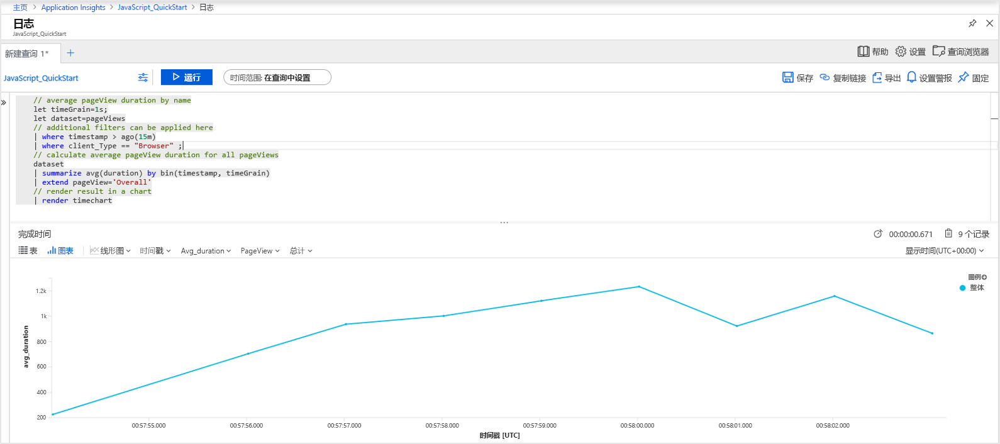
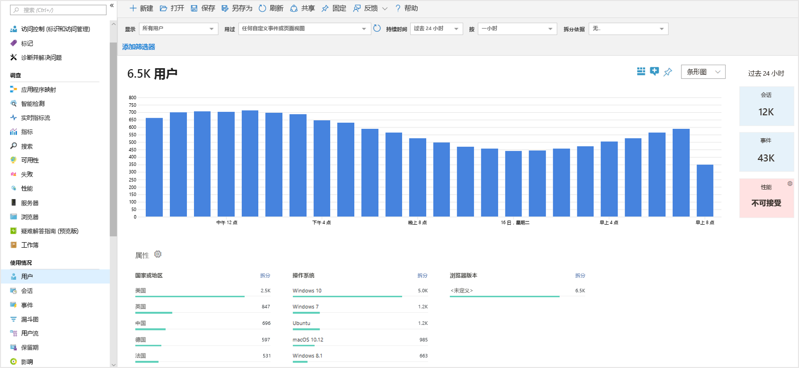
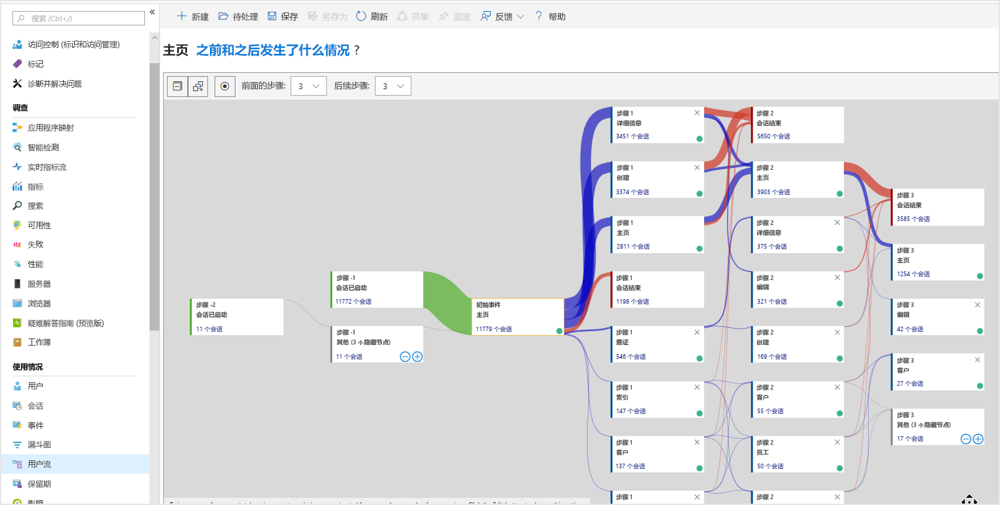

# <a name="quickstart-start-monitoring-your-website-with-azure-monitor-application-insights"></a>快速入门：开始使用 Azure Monitor Application Insights 监视你的网站

在本快速入门中，你将了解如何将开源 Application Insights JavaScript SDK 添加到你的网站。 你还将了解如何更好地了解你的网站访问者的客户端/浏览器体验。

使用 Azure Monitor Application Insights，可轻松监视网站的可用性、性能和使用情况。 还可以快速确定并诊断应用程序中的错误，而无需等待用户报告这些错误。 Application Insights 提供了服务器端监视和客户端/浏览器端监视功能。

## <a name="prerequisites"></a>先决条件

* 具有活动订阅的 Azure 帐户。 [免费创建帐户](https://azure.microsoft.com/free/?ref=microsoft.com&utm_source=microsoft.com&utm_medium=docs&utm_campaign=visualstudio)。
* 可以将 Application Insights JavaScript SDK 添加到其中的网站。

## <a name="enable-application-insights"></a>启用 Application Insights

Application Insights 可以从任何连接 Internet 的应用程序收集遥测数据，不管是在本地运行还是在云中运行。 使用以下步骤查看此数据：

1. 登录到 [Azure 门户](https://portal.azure.com/)。
1. 选择“创建资源” > “管理工具” > “Application Insights”。

   > [!NOTE]
   >如果这是你第一次创建 Application Insights 资源，请参阅[创建 Application Insights 资源](./create-new-resource.md)。
1. 显示配置框后，请使用下表填写输入字段：

    | 设置        | Value           | 说明  |
   | ------------- |:-------------|:-----|
   | **名称**      | 全局唯一值 | 标识所监视的应用的名称。 |
   | **资源组**     | MyResourceGroup      | 用于托管 Application Insights 数据的新资源组的名称。 可创建新的资源组或使用现有资源组。 |
   | **位置** | 美国东部 | 选择离你近的位置或离托管应用的位置近的位置。 |
1. 选择“创建” 。

## <a name="create-an-html-file"></a>创建一个 HTML 文件

1. 在本地计算机上创建名为 ``hello_world.html`` 的文件。 对于本示例，请在 C 驱动器的根目录中创建该文件，即 ``C:\hello_world.html``。
1. 复制以下脚本并将其粘贴到 ``hello_world.html`` 中：

    ```html
    <!DOCTYPE html>
    <html>
    <head>
    <title>Azure Monitor Application Insights</title>
    </head>
    <body>
    <h1>Azure Monitor Application Insights Hello World!</h1>
    <p>You can use the Application Insights JavaScript SDK to perform client/browser-side monitoring of your website. To learn about more advanced JavaScript SDK configurations, visit the <a href="https://github.com/Microsoft/ApplicationInsights-JS/blob/master/API-reference.md" title="API Reference">API reference</a>.</p>
    </body>
    </html>
    ```

## <a name="configure-application-insights-sdk"></a>配置 Application Insights SDK

1. 选择“概览” > “概要”，然后复制应用程序的“检测密钥”。

   

1. 将以下脚本添加到 ``hello_world.html`` 文件中的结束标记 ``</head>`` 之前：

   ```javascript
   <script type="text/javascript">
      var sdkInstance="appInsightsSDK";window[sdkInstance]="appInsights";var aiName=window[sdkInstance],aisdk=window[aiName]||function(e){function n(e){t[e]=function(){var n=arguments;t.queue.push(function(){t[e].apply(t,n)})}}var t={config:e};t.initialize=!0;var i=document,a=window;setTimeout(function(){var n=i.createElement("script");n.src=e.url||"https://az416426.vo.msecnd.net/scripts/b/ai.2.min.js",i.getElementsByTagName("script")[0].parentNode.appendChild(n)});try{t.cookie=i.cookie}catch(e){}t.queue=[],t.version=2;for(var r=["Event","PageView","Exception","Trace","DependencyData","Metric","PageViewPerformance"];r.length;)n("track"+r.pop());n("startTrackPage"),n("stopTrackPage");var s="Track"+r[0];if(n("start"+s),n("stop"+s),n("setAuthenticatedUserContext"),n("clearAuthenticatedUserContext"),n("flush"),!(!0===e.disableExceptionTracking||e.extensionConfig&&e.extensionConfig.ApplicationInsightsAnalytics&&!0===e.extensionConfig.ApplicationInsightsAnalytics.disableExceptionTracking)){n("_"+(r="onerror"));var o=a[r];a[r]=function(e,n,i,a,s){var c=o&&o(e,n,i,a,s);return!0!==c&&t["_"+r]({message:e,url:n,lineNumber:i,columnNumber:a,error:s}),c},e.autoExceptionInstrumented=!0}return t}(
      {
         instrumentationKey:"INSTRUMENTATION_KEY"
      }
      );window[aiName]=aisdk,aisdk.queue&&0===aisdk.queue.length&&aisdk.trackPageView({});
   </script>
   ```

1. 编辑 ``hello_world.html``，添加检测密钥。

1. 在本地浏览器会话中打开 ``hello_world.html``。 此操作创建单个页面视图。 可以刷新浏览器，生成多个测试性的页面视图。

## <a name="monitor-your-website-in-the-azure-portal"></a>在 Azure 门户中监视网站

1. 在 Azure 门户中重新打开 Application Insights“概览”页，查看当前正在运行的应用程序的详细信息。 “概述”页面是你检索你的检测密钥的位置。

   概览页上的四个默认图表局限于服务器端应用程序数据。 由于我们要检测客户端/浏览器端与 JavaScript SDK 的交互，因此该特定视图不会应用，除非我们也安装了服务器端 SDK。

1. 选择“Analytics”。  此操作将打开“Analytics”，该软件提供丰富的查询语言，可用于分析 Application Insights 收集的所有数据。 若要查看与客户端浏览器请求相关的数据，请运行以下查询：

    ```kusto
    // average pageView duration by name
    let timeGrain=1s;
    let dataset=pageViews
    // additional filters can be applied here
    | where timestamp > ago(15m)
    | where client_Type == "Browser" ;
    // calculate average pageView duration for all pageViews
    dataset
    | summarize avg(duration) by bin(timestamp, timeGrain)
    | extend pageView='Overall'
    // render result in a chart
    | render timechart
    ```

   

1. 返回到“概览”页。 在“调查”标题下选择“浏览器”，然后选择“性能”  。  此时会显示与网站性能相关的指标。 有一个用于分析网站中故障和异常的相应视图。 可以选择“示例”来访问[端到端事务详细信息](./transaction-diagnostics.md)。

   

1. 在 Application Insights 主菜单的“使用情况”标题下选择“[用户](./usage-segmentation.md)”，开始探索[用户行为分析工具](./usage-overview.md) 。 由于我们是在单台计算机中进行测试，因此只会看到一个用户的数据。 对于实时网站，用户的分布可能如下所示：

     

1. 对于包含多个页面的复杂网站，可以使用[用户流](./usage-flows.md)工具跟踪访客在浏览网站各个部分时采用的路径。

   

若要了解更多用于监视网站的高级配置，请参阅 [JavaScript SDK API 参考](https://github.com/Microsoft/ApplicationInsights-JS/blob/master/API-reference.md)。

## <a name="clean-up-resources"></a>清理资源

如果打算继续学习其他快速入门或教程，请不要清理在本快速入门中创建的资源。 否则，请在 Azure 门户中执行以下步骤，删除本快速入门创建的所有资源。

> [!NOTE]
> 如果使用了现有资源组，则以下说明不适用。 只需删除单个 Application Insights 资源即可。 请记住，在删除某个资源组时，属于该组的所有底层资源也会一并删除。

1. 在 Azure 门户的左侧菜单中选择“资源组”，然后选择“myResourceGroup”或临时资源组的名称。
1. 在资源组页上选择“删除”，在文本框中输入 **myResourceGroup**，然后选择“删除”。

## <a name="next-steps"></a>后续步骤

> [!div class="nextstepaction"]
> [查找和诊断性能问题](../log-query/log-query-overview.md)

