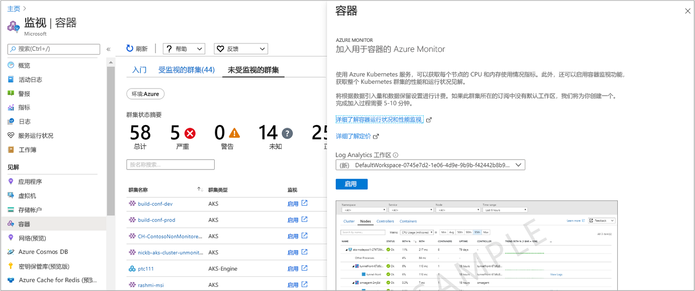

# <a name="configure-azure-red-hat-openshift-clusters-with-azure-monitor-for-containers"></a>使用容器的 Azure 监视器配置 Azure 红帽打开 Shift 群集

容器的 Azure 监视器为 Azure 库伯奈服务 （AKS） 和 AKS 引擎群集提供了丰富的监视体验。 本文介绍如何启用对[Azure 红帽 OpenShift](../../openshift/intro-openshift.md)上托管的 Kubernetes 群集的监视，以实现类似的监视体验。

>[!NOTE]
>目前，对 Azure Red Hat OpenShift 的支持是公共预览版中的一项功能。
>

可以使用以下支持的方法为容器启用 Azure 红帽 OpenShift 的一个或多个现有部署的 Azure 红帽 OpenShift 的 Azure 监视器监视器：

- 对于 Azure 门户或使用 Azure 资源管理器模板的现有群集。
- 对于使用 Azure 资源管理器模板的新群集，或使用[Azure CLI](https://docs.microsoft.com/cli/azure/openshift?view=azure-cli-latest#az-openshift-create)创建新群集时。

## <a name="supported-and-unsupported-features"></a>支持且不受支持的功能

容器的 Azure 监视器支持监视 Azure 红帽 OpenShift，[如概述](container-insights-overview.md)文章中所述，以下功能除外：

- 实时数据（预览）
- 从群集节点和窗格[收集指标](container-insights-update-metrics.md)并将其存储在 Azure 监视器指标数据库中

## <a name="prerequisites"></a>先决条件

- 要启用和访问容器 Azure 监视器中的功能，至少需要成为 Azure 订阅中的 Azure*参与者*角色的成员，以及配置了用于容器的 Azure 监视器的[*日志分析工作区的日志分析参与者*](../platform/manage-access.md#manage-access-using-azure-permissions)角色的成员。

- 要查看监视数据，您是[*日志分析读取器*](../platform/manage-access.md#manage-access-using-azure-permissions)角色权限的成员，日志分析工作区配置了用于容器的 Azure 监视器。

## <a name="enable-for-a-new-cluster-using-an-azure-resource-manager-template"></a>使用 Azure 资源管理器模板为新群集启用

执行以下步骤以部署启用监视的 Azure 红帽 OpenShift 群集。 在继续之前，请查看教程["创建 Azure 红帽 OpenShift"群集](../../openshift/tutorial-create-cluster.md#prerequisites)，以了解需要配置的依赖项，以便正确设置环境。

此方法包含两个 JSON 模板。 一个模板指定部署启用监视的群集的配置，另一个模板包含您配置为指定以下内容的参数值：

- Azure 红帽 OpenShift 群集资源 ID。

- 群集部署在其中的资源组。

- [Azure 活动目录租户 ID](../../openshift/howto-create-tenant.md#create-a-new-azure-ad-tenant)在执行创建一个或一个已创建的步骤后记录。

- [Azure 活动目录客户端应用程序 ID](../../openshift/howto-aad-app-configuration.md#create-an-azure-ad-app-registration)在执行创建一个或一个已创建的步骤后记录。

- [Azure 活动目录客户端密钥](../../openshift/howto-aad-app-configuration.md#create-a-client-secret)在执行创建已创建一个或一个的步骤后记录。

- [Azure AD 安全组](../../openshift/howto-aad-app-configuration.md#create-an-azure-ad-security-group)在执行创建一个或一个已创建的步骤后指出。

- 现有日志分析工作区的资源 ID。

- 要在群集中创建的主节点数。

- 代理池配置文件中的计算节点数。

- 代理池配置文件中的基础结构节点数。

如果不熟悉使用模板部署资源的概念，请参阅：

- [使用 Resource Manager 模板和 Azure PowerShell 部署资源](../../azure-resource-manager/templates/deploy-powershell.md)

- [使用资源管理器模板和 Azure CLI 部署资源](../../azure-resource-manager/templates/deploy-cli.md)

如果选择使用 Azure CLI，首先需要在本地安装和使用 CLI。 您必须运行 Azure CLI 版本 2.0.65 或更高版本。 若要确定版本，请运行 `az --version`。 如果需要安装或升级 Azure CLI，请参阅[安装 Azure CLI](https://docs.microsoft.com/cli/azure/install-azure-cli)。

必须创建 Log Analytics 工作区，然后才能使用 Azure PowerShell 或 CLI 来启用监视。 若要创建工作区，可通过 [Azure 资源管理器](../../azure-monitor/platform/template-workspace-configuration.md)、[PowerShell](../scripts/powershell-sample-create-workspace.md?toc=%2fpowershell%2fmodule%2ftoc.json) 或在 [Azure 门户](../../azure-monitor/learn/quick-create-workspace.md)中进行设置。

1. 下载并保存到本地文件夹 Azure 资源管理器模板和参数文件，以便使用以下命令创建具有监视加载项的群集：

    `curl -LO https://raw.githubusercontent.com/microsoft/OMS-docker/ci_feature/docs/aro/enable_monitoring_to_new_cluster/newClusterWithMonitoring.json`

    `curl -LO https://raw.githubusercontent.com/microsoft/OMS-docker/ci_feature/docs/aro/enable_monitoring_to_new_cluster/newClusterWithMonitoringParam.json`

2. 登录 Azure

    ```azurecli
    az login    
    ```

    如果你有权访问多个订阅，请运行 `az account set -s {subscription ID}`（将 `{subscription ID}` 替换为要使用的订阅）。

3. 如果尚未创建资源组，请为群集创建资源组。 有关在 Azure 上支持 OpenShift 的 Azure 区域的列表，请参阅[支持区域](../../openshift/supported-resources.md#azure-regions)。

    ```azurecli
    az group create -g <clusterResourceGroup> -l <location>
    ```

4. 编辑 JSON 参数文件**newCluster 与监视Param.json**并更新以下值：

    - *位置*
    - *群集名称*
    - *阿德特里德*
    - *aadClientId*
    - *阿德客户秘密*
    - *aadCustomerAdminGroupId*
    - *workspaceResourceId*
    - *主节点计数*
    - *计算节点计数*
    - *红外线计数*

5. 以下步骤部署使用 Azure CLI 启用监视的群集。

    ```azurecli
    az group deployment create --resource-group <ClusterResourceGroupName> --template-file ./newClusterWithMonitoring.json --parameters @./newClusterWithMonitoringParam.json
    ```

    输出如下所示：

    ```output
    provisioningState       : Succeeded
    ```

## <a name="enable-for-an-existing-cluster"></a>为现有群集启用

执行以下步骤，以启用监视部署在 Azure 中的 Azure 红帽 OpenShift 群集。 可以从 Azure 门户或使用提供的模板完成此目的。

### <a name="from-the-azure-portal"></a>通过 Azure 门户

1. 登录到 Azure[门户](https://portal.azure.com)。

2. 在 Azure 门户菜单或主页上，选择**Azure 监视器**。 在“见解”部分，选择“容器”。********

3. 在“监视 - 容器”页上，选择“非监视群集”********。

4. 从非受监视群集列表中，查找列表中的群集 **，然后单击启用**。 您可以通过在列**CLUSTER TYPE**下查找值**ARO**来标识列表中的结果。

5. 在“载入到用于容器的 Azure Monitor”页上，如果现有 Log Analytics 工作区与群集在同一订阅中，请从下拉列表中选择该工作区****。  
    该列表预先选择群集在订阅中部署到的默认工作区和位置。

    

    >[!NOTE]
    >如果想要创建新的 Log Analytics 工作区用于存储来自群集的监视数据，请按照[创建 Log Analytics 工作区](../../azure-monitor/learn/quick-create-workspace.md)中的说明进行操作。 请确保在部署 RedHat OpenShift 群集的同一订阅中创建工作区。

启用监视后，可能需要约 15 分钟才能查看群集的运行状况指标。

### <a name="enable-using-an-azure-resource-manager-template"></a>使用 Azure 资源管理器模板来启用

此方法包含两个 JSON 模板。 一个模板指定用于启用监视的配置，另一个模板包含参数值，通过配置这些参数值可指定：

- Azure 红帽开放移位群集资源 ID。

- 群集部署在其中的资源组。

- Log Analytics 工作区。

如果不熟悉使用模板部署资源的概念，请参阅：

- [使用 Resource Manager 模板和 Azure PowerShell 部署资源](../../azure-resource-manager/templates/deploy-powershell.md)

- [使用资源管理器模板和 Azure CLI 部署资源](../../azure-resource-manager/templates/deploy-cli.md)

如果选择使用 Azure CLI，首先需要在本地安装和使用 CLI。 您必须运行 Azure CLI 版本 2.0.65 或更高版本。 若要确定版本，请运行 `az --version`。 如果需要安装或升级 Azure CLI，请参阅[安装 Azure CLI](https://docs.microsoft.com/cli/azure/install-azure-cli)。

必须创建 Log Analytics 工作区，然后才能使用 Azure PowerShell 或 CLI 来启用监视。 若要创建工作区，可通过 [Azure 资源管理器](../../azure-monitor/platform/template-workspace-configuration.md)、[PowerShell](../scripts/powershell-sample-create-workspace.md?toc=%2fpowershell%2fmodule%2ftoc.json) 或在 [Azure 门户](../../azure-monitor/learn/quick-create-workspace.md)中进行设置。

1. 下载模板和参数文件，使用以下命令使用监视加载项更新群集：

    `curl -LO https://raw.githubusercontent.com/microsoft/OMS-docker/ci_feature/docs/aro/enable_monitoring_to_existing_cluster/existingClusterOnboarding.json`

    `curl -LO https://raw.githubusercontent.com/microsoft/OMS-docker/ci_feature/docs/aro/enable_monitoring_to_existing_cluster/existingClusterParam.json`

2. 登录 Azure

    ```azurecli
    az login    
    ```

    如果你有权访问多个订阅，请运行 `az account set -s {subscription ID}`（将 `{subscription ID}` 替换为要使用的订阅）。

3. 指定 Azure RedHat OpenShift 群集的订阅。

    ```azurecli
    az account set --subscription "Subscription Name"  
    ```

4. 运行以下命令以标识群集位置和资源 ID：

    ```azurecli
    az openshift show -g <clusterResourceGroup> -n <clusterName>
    ```

5. 编辑JSON参数文件**现有的ClusterParam.json**并更新值*阿拉资源Id*和*阿拉雷索鲁塞定位*。 **workspaceResourceId** 的值是 Log Analytics 工作区的完整资源 ID，其中包含工作区名称。

6. 若要使用 Azure CLI 进行部署，请运行下列命令：

    ```azurecli
    az group deployment create --resource-group <ClusterResourceGroupName> --template-file ./ExistingClusterOnboarding.json --parameters @./existingClusterParam.json
    ```

    输出如下所示：

    ```output
    provisioningState       : Succeeded
    ```

## <a name="next-steps"></a>后续步骤

- 启用监视以收集 RedHat OpenShift 群集的运行状况和资源利用率以及运行在它们的工作负载后，[了解如何将](container-insights-analyze.md)Azure 监视器用于容器。

- 要了解如何停止使用 Azure 监视器监视群集的容器，请参阅[如何停止监视 Azure 红帽 OpenShift 群集](container-insights-optout-openshift.md)。
