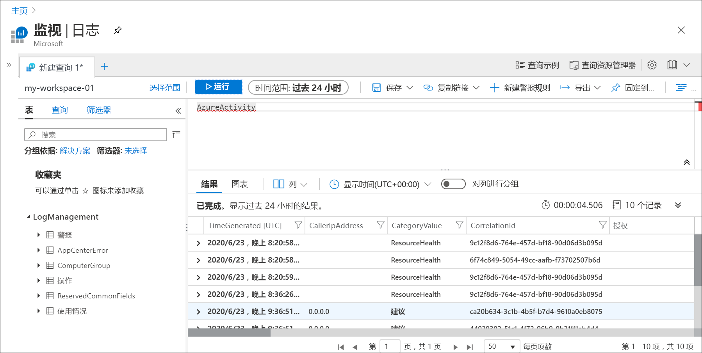
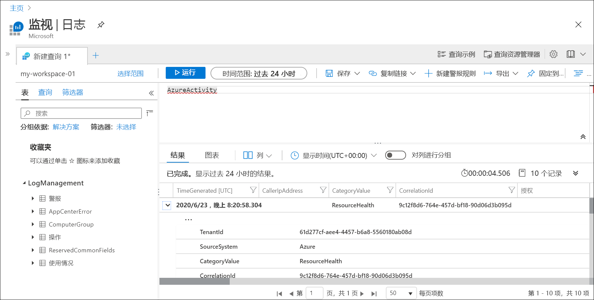
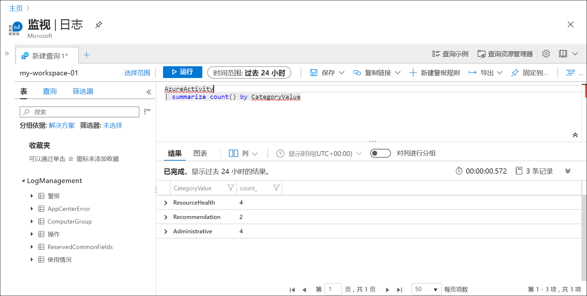

# <a name="quickstart-send-azure-activity-log-to-log-analytics-workspace-using-an-arm-template"></a>快速入门：使用 ARM 模板将 Azure 活动日志发送到 Log Analytics 工作区

活动日志是 Azure 中的一种平台日志，可用于深入了解订阅级事件。 这包括何时修改了资源或何时启动了虚拟机等信息。 可以查看 Azure 门户中的活动日志，或使用 PowerShell 和 CLI 检索条目。 本快速入门介绍如何使用 Azure 资源管理器模板（ARM 模板）创建 Log Analytics 工作区和诊断设置，以将活动日志发送到 Azure Monitor 日志，可在此位置使用[日志查询](../log-query/log-query-overview.md)对活动日志进行分析，并启用其他功能，例如[日志警报](../platform/alerts-log-query.md)和[工作簿](../platform/workbooks-overview.md)。

[!INCLUDE [About Azure Resource Manager](../../../includes/resource-manager-quickstart-introduction.md)]

## <a name="prerequisites"></a>先决条件

- 如果没有 Azure 订阅，请在开始之前创建一个[免费帐户](https://azure.microsoft.com/free/?WT.mc_id=A261C142F)。
- 若要从本地计算机运行命令，请安装 Azure CLI 或 Azure PowerShell 模块。 有关详细信息，请参阅[安装 Azure CLI](/cli/azure/install-azure-cli) 和[安装 Azure PowerShell](/powershell/azure/install-az-ps)。

## <a name="create-a-log-analytics-workspace"></a>创建 Log Analytics 工作区

### <a name="review-the-template"></a>查看模板

下面的模板创建一个空的 Log Analytics 工作区。 将此模板保存为 CreateWorkspace.json。

```json
{
  "$schema": "https://schema.management.azure.com/schemas/2019-04-01/deploymentTemplate.json#",
  "contentVersion": "1.0.0.0",
  "parameters": {
    "workspaceName": {
      "type": "string",
        "metadata": {
          "description": "Name of the workspace."
        }
    },
    "sku": {
      "type": "string",
      "allowedValues": [
        "pergb2018",
        "Free",
        "Standalone",
        "PerNode",
        "Standard",
        "Premium"
      ],
      "defaultValue": "pergb2018",
      "metadata": {
        "description": "Pricing tier: PerGB2018 or legacy tiers (Free, Standalone, PerNode, Standard or Premium) which are not available to all customers."
      }
    },
    "location": {
      "type": "string",
      "allowedValues": [
        "australiacentral",
        "australiaeast",
        "australiasoutheast",
        "brazilsouth",
        "canadacentral",
        "centralindia",
        "centralus",
        "eastasia",
        "eastus",
        "eastus2",
        "francecentral",
        "japaneast",
        "koreacentral",
        "northcentralus",
        "northeurope",
        "southafricanorth",
        "southcentralus",
        "southeastasia",
        "switzerlandnorth",
        "switzerlandwest",
        "uksouth",
        "ukwest",
        "westcentralus",
        "westeurope",
        "westus",
        "westus2"
      ],
      "metadata": {
        "description": "Specifies the location for the workspace."
      }
    },
    "retentionInDays": {
      "type": "int",
      "defaultValue": 120,
      "metadata": {
        "description": "Number of days to retain data."
      }
    },
    "resourcePermissions": {
      "type": "bool",
      "defaultValue": true,
      "metadata": {
        "description": "true to use resource or workspace permissions. false to require workspace permissions."
      }
    }
  },
  "resources": [
    {
      "type": "Microsoft.OperationalInsights/workspaces",
      "apiVersion": "2020-03-01-preview",
      "name": "[parameters('workspaceName')]",
      "location": "[parameters('location')]",
      "properties": {
        "sku": {
          "name": "[parameters('sku')]"
        },
        "retentionInDays": "[parameters('retentionInDays')]",
        "features": {
          "searchVersion": 1,
          "legacy": 0,
          "enableLogAccessUsingOnlyResourcePermissions": "[parameters('resourcePermissions')]"
        }
      }
    }
  ]
}
```

此模板定义一个资源：

- [Microsoft.OperationalInsights/workspaces](/azure/templates/microsoft.operationalinsights/workspaces)

### <a name="deploy-the-template"></a>部署模板

使用[部署 ARM 模板](../../azure-resource-manager/templates/deploy-portal.md)的任何标准方法来部署模板，如以下使用 CLI 和 PowerShell 的示例。 将“资源组”、“workspaceName”和“位置”的示例值替换为环境的相应值  。 工作区名称在所有 Azure 订阅中必须唯一。

# <a name="cli"></a>[CLI](#tab/CLI)

```azurecli
az login
az deployment group create \
    --name CreateWorkspace \
    --resource-group my-resource-group \
    --template-file CreateWorkspace.json \
    --parameters workspaceName='my-workspace-01' location='eastus'

```

# <a name="powershell"></a>[PowerShell](#tab/PowerShell)

```powershell
Connect-AzAccount
Select-AzSubscription -SubscriptionName my-subscription
New-AzResourceGroupDeployment -Name AzureMonitorDeployment -ResourceGroupName my-resource-group -TemplateFile CreateWorkspace.json -workspaceName my-workspace-01 -location eastus
```

---

### <a name="validate-the-deployment"></a>验证部署

验证是否已使用以下命令之一创建工作区。 将“资源组”和“workspaceName”的示例值替换为上面使用的值 。

# <a name="cli"></a>[CLI](#tab/CLI)

```azurecli
az monitor log-analytics workspace show --resource-group my-workspace-01 --workspace-name my-resource-group
```

# <a name="powershell"></a>[PowerShell](#tab/PowerShell)

```powershell
Get-AzOperationalInsightsWorkspace -Name my-workspace-01 -ResourceGroupName my-resource-group
```

---

## <a name="create-diagnostic-setting"></a>创建诊断设置

### <a name="review-the-template"></a>查看模板

以下模板创建将活动日志发送到 Log Analytics 工作区的诊断设置。 将此模板保存为 CreateDiagnosticSetting.json。

```json
{
  "$schema": "https://schema.management.azure.com/schemas/2019-04-01/deploymentTemplate.json#",
  "contentVersion": "1.0.0.0",
  "parameters": {
    "settingName": {
        "type": "String"
    },
    "workspaceId": {
        "type": "String"
    }
  },
  "resources": [
    {
      "type": "Microsoft.Insights/diagnosticSettings",
      "apiVersion": "2017-05-01-preview",
      "name": "[parameters('settingName')]",
      "dependsOn": [],
      "properties": {
        "workspaceId": "[parameters('workspaceId')]",
        "logs": [
          {
          "category": "Administrative",
          "enabled": true
          },
          {
          "category": "Alert",
          "enabled": true
          },
          {
          "category": "Autoscale",
          "enabled": true
          },
          {
          "category": "Policy",
          "enabled": true
          },
          {
          "category": "Recommendation",
          "enabled": true
          },
          {
          "category": "ResourceHealth",
          "enabled": true
          },
          {
          "category": "Security",
          "enabled": true
          },
          {
          "category": "ServiceHealth",
          "enabled": true
          }
        ]
      }
    }
  ]
}
```

此模板定义一个资源：

- [Microsoft.Insights/diagnosticSettings](/azure/templates/microsoft.insights/diagnosticsettings)

### <a name="deploy-the-template"></a>部署模板

使用[部署 ARM 模板](../../azure-resource-manager/templates/deploy-portal.md)的任何标准方法来部署模板，如以下使用 CLI 和 PowerShell 的示例。 将“资源组”、“workspaceName”和“位置”的示例值替换为环境的相应值  。 工作区名称在所有 Azure 订阅中必须唯一。

# <a name="cli"></a>[CLI](#tab/CLI)

```azurecli
az deployment sub create --name CreateDiagnosticSetting --location eastus --template-file CreateDiagnosticSetting.json --parameters settingName='Send Activity log to workspace' workspaceId='/subscriptions/00000000-0000-0000-0000-000000000000/resourcegroups/my-resource-group/providers/microsoft.operationalinsights/workspaces/my-workspace-01'

```

# <a name="powershell"></a>[PowerShell](#tab/PowerShell)

```powershell
New-AzSubscriptionDeployment -Name CreateDiagnosticSetting -location eastus -TemplateFile CreateDiagnosticSetting.json -settingName="Send Activity log to workspace" -workspaceId "/subscriptions/00000000-0000-0000-0000-000000000000/resourcegroups/my-resource-group/providers/microsoft.operationalinsights/workspaces/my-workspace-01"
```
---

### <a name="validate-the-deployment"></a>验证部署

验证是否已使用以下命令之一创建诊断设置。 将订阅和设置名称的示例值替换为上面使用的值。

> [!NOTE]
> 当前无法使用 PowerShell 检索订阅级诊断设置。

```azurecli
az monitor diagnostic-settings show --resource '/subscriptions/00000000-0000-0000-0000-000000000000' --name 'Send Activity log to workspace'
```

## <a name="generate-log-data"></a>生成日志数据

仅将新的活动日志条目发送到 Log Analytics 工作区，因此将记录在订阅中执行的一些操作，例如启动或停止虚拟机，或者创建或修改其他资源。 可能需要等待几分钟，才能创建诊断设置并将数据首次写入工作区。 此延迟过后，所有写入活动日志的事件将在几秒钟内发送到工作区。

## <a name="retrieve-data-with-a-log-query"></a>通过日志查询检索数据

通过 Azure 门户使用 Log Analytics 从工作区检索数据。 在 Azure 门户中，搜索并选择“监视”。


在“Azure Monitor”菜单中选择“日志” 。 关闭“示例查询”页。 如果范围未设置为所创建的工作区，则单击“选择范围”并进行查找。


在查询窗口中，键入 `AzureActivity`，然后单击“运行”。 这是一个简单的查询，它返回“AzureActivity”表中的所有记录，该表中包含从活动日志发送的所有记录。



展开其中一条记录以查看其详细属性。



尝试使用较为复杂的查询，例如 `AzureActivity | summarize count() by CategoryValue`，该查询提供按类别汇总的事件计数。



## <a name="clean-up-resources"></a>清理资源

如果打算继续使用后续的快速入门和教程，则可能需要保留这些资源。 如果不再需要资源组，可以将其删除，这将删除警报规则和相关的资源。 使用 Azure CLI 或 Azure PowerShell 删除资源组

# <a name="cli"></a>[CLI](#tab/CLI)

```azurecli
az group delete --name my-resource-group
```

# <a name="powershell"></a>[PowerShell](#tab/PowerShell)

```powershell
Remove-AzResourceGroup -Name my-resource-group
```

---

## <a name="next-steps"></a>后续步骤

在本快速入门中，你已将活动日志配置为发送到 Log Analytics 工作区。 现可配置要收集到工作区中的其他数据，在工作区中可以使用 Azure Monitor 中的[日志查询](../log-query/log-query-overview.md)来一起分析它，并利用[日志警报](../platform/alerts-log-query.md)和[工作簿](../platform/workbooks-overview.md)等功能。 接下来，应从 Azure 资源中收集[资源日志](../platform/resource-logs.md)，以补充活动日志中的数据，从而深入了解各资源内执行的操作。

> [!div class="nextstepaction"]
> [使用 Azure Monitor 收集和分析资源日志](tutorial-resource-logs.md)