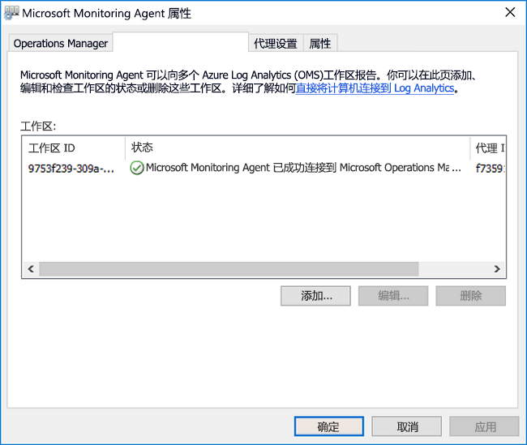
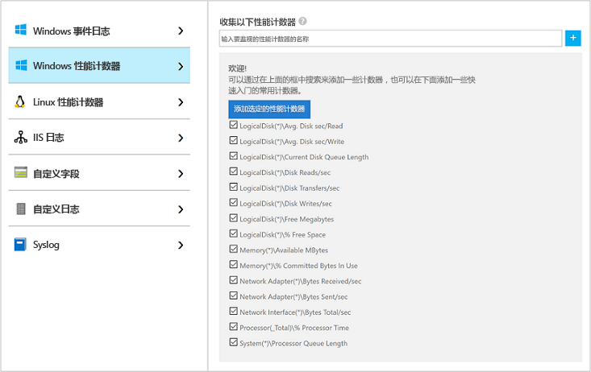

# 使用 Azure Monitor 从混合环境中的 Windows 计算机收集数据

[Azure Monitor](../overview.md) 可以直接从环境中的物理或虚拟 Windows 计算机将数据收集到 Log Analytics 工作区中，以便进行详细分析和关联。 安装 [Log Analytics 代理](../platform/log-analytics-agent.md)可让 Azure Monitor 从数据中心或其他云环境收集数据。 本快速入门介绍如何通过几个简单步骤，从 Windows 计算机中配置或收集数据。 有关 Azure Windows VM 的信息，请参阅[收集有关 Azure 虚拟机的数据](../../azure-monitor/learn/quick-collect-azurevm.md)。  

若要了解支持的配置，请参阅[支持的 Windows 操作系统](../../azure-monitor/platform/log-analytics-agent.md#supported-windows-operating-systems)和[网络防火墙配置](../../azure-monitor/platform/log-analytics-agent.md#network-firewall-requirements)。
 
如果没有 Azure 订阅，请在开始之前创建一个[免费帐户](https://azure.microsoft.com/free/?WT.mc_id=A261C142F)。

## 登录到 Azure 门户

在 [https://portal.azure.com](https://portal.azure.com) 中登录 Azure 门户。 

## 创建工作区

1. 在 Azure 门户中，选择“所有服务”。  在资源列表中，键入“Log Analytics”  。 开始键入时，会根据输入筛选该列表。 选择“Log Analytics 工作区”  。

       

2. 选择“创建”  ，然后为以下各项选择选项：

   * 为新的 Log Analytics 工作区  提供名称，如 DefaultLAWorkspace  。  
   * 如果选择的默认值不合适，请从下拉列表中选择要链接到的**订阅**。
   * 对于“资源组”  ，选择包含一个或多个 Azure 虚拟机的现有资源组。  
   * 选择向其部署 VM 的“位置”  。  如需其他信息，请参阅[提供 Log Analytics 的区域](https://azure.microsoft.com/regions/services/)。
   * 如果在 2018 年 4 月 2 日后创建的新订阅中创建工作区，则它将自动使用“每 GB”  定价计划，并且不提供用于选择定价层的选项。  如果是为 4 月 2 日之前创建的现有订阅创建工作区，或者是为绑定到现有 EA 注册的订阅创建工作区，则可以选择首选定价层。  有关特定层的其他信息，请参阅 [Log Analytics 定价详细信息](https://azure.microsoft.com/pricing/details/log-analytics/)。
  
         

3. 在“Log Analytics 工作区”窗格中提供所需的信息后，选择“确定”。    

在验证信息和创建工作区时，可以在菜单中的“通知”下面跟踪操作进度  。 

## 获取工作区 ID 和密钥

在安装适用于 Windows 的 Log Analytics 代理（也称为 Microsoft Monitoring Agent (MMA)）之前，需要 Log Analytics 工作区的工作区 ID 和密钥。 安装向导需要使用此信息来正确配置代理，并确保它能与 Azure Monitor 通信。  

1. 在 Azure 门户左上角选择“所有服务”  。 在搜索框中输入 **Log Analytics**。 键入时，列表会根据输入的内容进行筛选。 选择“Log Analytics 工作区”  。

2. 在 Log Analytics 工作区列表中，选择前面创建的工作区。 （可能已将其命名为 **DefaultLAWorkspace**。）

3. 选择“高级设置”： 

    
  
4. 选择“已连接的源”，然后选择“Windows 服务器”   。

5. 复制“工作区 ID”和“主密钥”右侧的值   。 将其粘贴到你偏爱的编辑器中。

## 安装适用于 Windows 的代理

以下步骤将安装并配置 Azure 和 Azure 政府版中用于 Log Analytics 的代理。 你将使用 Microsoft Monitoring Agent 安装程序在计算机上安装该代理。

1. 延续前面的步骤，在“Windows 服务器”页上，选择要下载的 **Windows 代理**版本。  选择适用于你的 Windows 操作系统处理器体系结构的版本。

2. 运行安装程序在计算机上安装该代理。

3. 在“欢迎”页上，选择“下一步”。  

4. 在“许可条款”页面上阅读许可协议，然后选择“我接受”   。

5. 在“目标文件夹”页面上更改或保留默认安装文件夹，然后选择“下一步”   。

6. 在“代理安装选项”页上，将代理连接到 Azure Log Analytics，然后选择“下一步”。  

7. 在“Azure Log Analytics”页上完成以下步骤： 

   1. 粘贴前面复制的“工作区 ID”和“工作区密钥(主密钥)”。   如果计算机应向 Azure 政府版中的 Log Analytics 工作区报告，请在“Azure 云”下拉列表中选择“Azure 美国政府”。    
   2. 如果计算机需要通过代理服务器来与 Log Analytics 服务通信，请选择“高级”并提供代理服务器的 URL 和端口号。  如果代理服务器要求身份验证，请输入用于在代理服务器上进行身份验证的用户名和密码，然后选择“下一步”。   

8. 添加配置设置后，选择“下一步”： 

    

9. 在“准备安装”页上检查所做的选择，并选择“安装”   。

10. 在“配置已成功完成”页上，选择“完成”。  

完成安装和设置后，Microsoft Monitoring Agent 将显示在控制面板中。 可以检查配置，并验证代理是否已连接到 Log Analytics 工作区。 连接后，在“Azure Log Analytics”选项卡上，代理将显示以下消息：  Microsoft Monitoring Agent 已成功连接到 Microsoft Log Analytics 服务。    

## 收集的事件和性能数据

Azure Monitor 可从 Windows 事件日志以及性能计数器中收集指定的事件用于长期分析和报告。 检测到特定的状况时，它还可以采取措施。 首先，请按照下列步骤操作，配置 Windows 事件日志以及几个常见性能计数器中收集事件。  

1. 在 Azure 门户左下角选择“更多服务”  。 在搜索框中输入 **Log Analytics**。 键入时，列表会根据输入的内容进行筛选。 选择“Log Analytics 工作区”  。

2. 选择“高级设置”： 

    
 
3. 选择“数据”  ，然后选择“Windows 事件日志”  。  

4. 可通过输入日志名称来添加事件日志。 输入“系统”，然后选择加号 ( **+** )。   

5. 在表中，选择“错误”和“警告”严重性。  

6. 在页面顶部选择“保存”  。

7. 选择“Windows 性能计数器”  ，在 Windows 计算机上启用性能计数器收集。

8. 首次为新的 Log Analytics 工作区配置 Windows 性能计数器时，可以选择快速创建几个通用的计数器。 每个选项将会列出，其旁边带有一个复选框：

    .
    
    选择“添加所选性能计数器”  。 随即会添加这些计数器，并为其预设 10 秒收集采样间隔。

9. 在页面顶部选择“保存”  。

## 查看收集的数据

启用数据收集后，让我们开始运行一个简单的日志搜索，以查看来自目标计算机的某些数据。  

1. 在所选工作区中，从左侧窗格中选择“日志”  。

2. 在日志查询页上，在查询编辑器中键入 `Perf`，然后选择“运行”  。
 
    

    例如，下图中的查询返回了 10,000 条性能记录。 结果会大大减少。

    

## 清理资源

如果不再需要，可从计算机中删除该代理，并删除 Log Analytics 工作区。  

若要删除代理，请完成以下步骤：

1. 打开控制面板。

2. 打开“程序和功能”。 

3. 在“程序和功能”中选择“Microsoft Monitoring Agent”，然后选择“卸载”。   

若要删除前面创建的 Log Analytics 工作区，请将其选中，然后在资源页上选择“删除”： 

## 后续步骤

从 Windows 计算机收集操作和性能数据时，可以轻松地开始免费浏览、分析和处理收集的数据。   

若要了解如何查看和分析数据，请继续学习以下教程：

> [!div class="nextstepaction"]
> [在 Log Analytics 中查看或分析数据](tutorial-viewdata.md)
