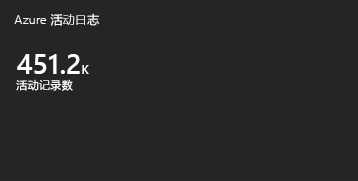
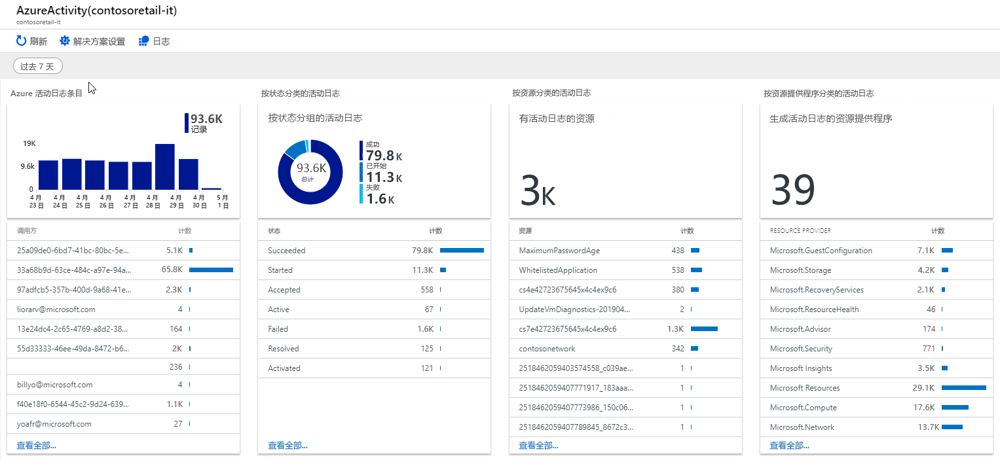

# <a name="collect-and-analyze-azure-activity-log-in-azure-monitor"></a>在 Azure 监视器中收集和分析 Azure 活动日志
[Azure 活动日志](platform-logs-overview.md)是一种方便用户深入了解 Azure 中发生的订阅级别事件的[平台日志](platform-logs-overview.md)。 虽然可以在 Azure 门户中查看活动日志，但应将其配置为发送到日志分析工作区以启用 Azure 监视器的其他功能。 本文介绍如何执行此配置以及如何将活动日志发送到 Azure 存储和事件中心。

在日志分析工作区中收集活动日志具有以下优点：

- 日志分析工作区中存储的活动日志数据无需数据引入或数据保留费用。
- 将活动日志数据与 Azure 监视器收集的其他监视数据相关联。
- 使用日志查询进行复杂的分析，深入了解活动日志条目的情况。
- 将日志警报与活动条目一起使用，允许更复杂的警报逻辑。
- 存储活动日志条目超过 90 天。
- 将多个 Azure 订阅和租户的日志条目合并到一个位置，以便一起分析。


## <a name="collecting-activity-log"></a>收集活动日志
活动日志将自动收集，以便[在 Azure 门户中查看](activity-log-view.md)。 要在日志分析工作区中收集它或将其发送 Azure 存储或事件中心，请创建[一个诊断设置](diagnostic-settings.md)。 这是资源日志使用的方法，使其对所有[平台日志](platform-logs-overview.md)保持一致。  

要为活动日志创建诊断设置，请从 Azure 监视器中的 **"活动日志**"菜单中选择 **"诊断"设置**。 有关创建设置的详细信息，请参阅[创建诊断设置以在 Azure 中收集平台日志和指标](diagnostic-settings.md)。 有关可以筛选的类别的说明，请参阅[活动日志中的类别](activity-log-view.md#categories-in-the-activity-log)。 如果您有任何旧版设置，请确保在创建诊断设置之前禁用它们。 同时启用两者可能会导致数据重复。


> [!NOTE]
> 目前，您只能使用 Azure 门户和资源管理器模板创建订阅级诊断设置。 


## <a name="legacy-settings"></a>旧版设置 
虽然诊断设置是将活动日志发送到不同目标的首选方法，但如果不选择替换为诊断设置，旧方法将继续工作。 与旧方法不同，诊断设置具有以下优势，建议您更新配置：

- 用于收集所有平台日志的一致方法。
- 跨多个订阅和租户收集活动日志。
- 筛选集合，以便仅收集特定类别的日志。
- 收集所有活动日志类别。 部分类别不是使用旧版方法收集的。
- 更短的日志引入延迟。 以前的方法的延迟大约为 15 分钟，而诊断设置仅会增加约 1 分钟的延迟。


### <a name="log-profiles"></a>日志配置文件
日志配置文件是将活动日志发送到 Azure 存储或事件中心的传统方法。 使用以下过程继续使用日志配置文件或禁用它，以便迁移到诊断设置。

1. 从 Azure 门户上的 Azure Monitor 菜单中，选择“活动日志”********。
3. 单击 **"诊断设置**"。

   

4. 单击紫色横幅了解旧版体验。

    

### <a name="log-analytics-workspace"></a>Log Analytics 工作区
将活动日志收集到日志分析工作区的传统方法是在工作区配置中连接日志。 

1. 在 Azure 门户的“Log Analytics 工作区”菜单中，**** 选择要收集活动日志的工作区。
1. 在工作区的菜单的“工作区数据源”部分，选择“Azure 活动日志”。********
1. 单击要连接的订阅。

    

1. 单击“连接”，将订阅中的活动日志连接到所选工作区。**** 如果订阅已连接到其他工作区，请先单击“断开连接”将其断开连接。****

    


要禁用该设置，请执行相同的过程，然后单击 **"断开连接**"以从工作区中删除订阅。


## <a name="analyze-activity-log-in-log-analytics-workspace"></a>在日志分析工作区中分析活动日志
将活动日志连接到 Log Analytics 工作区时，条目会写入到工作区的名为 *AzureActivity* 的表中，该表可以使用[日志查询](../log-query/log-query-overview.md)进行检索。 此表的结构因[日志条目的类别](activity-log-view.md#categories-in-the-activity-log)而异。 有关每个类别的说明，请参阅 [Azure 活动日志事件架构](activity-log-schema.md)。


### <a name="data-structure-changes"></a>数据结构更改
诊断设置收集的数据与用于收集活动日志的旧方法相同的数据，对*AzureActivity*表的结构进行了一些更改。

下表中的列已弃用更新的架构。 它们仍然存在于*AzureActivity 中，* 但它们将没有数据。 这些列的替换不是新的，但它们包含的数据与弃用列相同。 它们采用不同的格式，因此您可能需要修改使用它们的日志查询。 

| 已弃用列 | 替换列 |
|:---|:---|
| ActivityStatus    | ActivityStatusValue    |
| ActivitySubstatus | 活动子状态值 |
| OperationName     | 操作名称值     |
| ResourceProvider  | 资源提供者价值  |

> [!IMPORTANT]
> 在某些情况下，这些列中的值可能在所有大写中。 如果查询包含这些列，则应使用[* 运算符](https://docs.microsoft.com/azure/kusto/query/datatypes-string-operators)执行不区分大小写的比较。

以下列已添加到更新的架构中的*AzureActivity：*

- Authorization_d
- Claims_d
- Properties_d


## <a name="activity-logs-analytics-monitoring-solution"></a>Activity Logs Analytics 监视解决方案
Azure 日志分析监视解决方案将很快弃用，并使用日志分析工作区中更新的架构替换为工作簿。 如果已启用该解决方案，您仍可以使用该解决方案，但只能使用旧版设置收集活动日志时才能使用它。 


### <a name="use-the-solution"></a>使用解决方案
可以在 Azure 门户的“监视器”菜单中访问监视解决方案。**** 在“见解”部分选择“更多”，打开包含解决方案磁贴的“概览”页************。 “Azure 活动日志”磁贴显示工作区中 **AzureActivity** 记录的计数。****




单击“Azure 活动日志”**** 磁贴，打开“Azure 活动日志”**** 视图。 视图包含下表中的可视化部件。 每个部件按照指定时间范围列出了匹配该部件条件的最多 10 个项。 可通过单击部件底部的“查看全部”**** 运行返回所有匹配记录的日志查询。




### <a name="enable-the-solution-for-new-subscriptions"></a>启用新订阅的解决方案
您将很快不再能够使用 Azure 门户将活动日志分析解决方案添加到订阅中。 您可以使用以下过程与资源管理器模板一起添加它。 

1. 将以下 json 复制到名为*活动日志模板*.json 的文件。

    ```json
    {
    "$schema": "https://schema.management.azure.com/schemas/2014-04-01-preview/deploymentTemplate.json#",
    "contentVersion": "1.0.0.0",
    "parameters": {
        "workspaceName": {
            "type": "String",
            "defaultValue": "my-workspace",
            "metadata": {
              "description": "Specifies the name of the workspace."
            }
        },
        "location": {
            "type": "String",
            "allowedValues": [
              "east us",
              "west us",
              "australia central",
              "west europe"
            ],
            "defaultValue": "australia central",
            "metadata": {
              "description": "Specifies the location in which to create the workspace."
            }
        }
      },
        "resources": [
        {
            "type": "Microsoft.OperationalInsights/workspaces",
            "name": "[parameters('workspaceName')]",
            "apiVersion": "2015-11-01-preview",
            "location": "[parameters('location')]",
            "properties": {
                "features": {
                    "searchVersion": 2
                }
            }
        },
        {
            "type": "Microsoft.OperationsManagement/solutions",
            "apiVersion": "2015-11-01-preview",
            "name": "[concat('AzureActivity(', parameters('workspaceName'),')')]",
            "location": "[parameters('location')]",
            "dependsOn": [
                "[resourceId('microsoft.operationalinsights/workspaces', parameters('workspaceName'))]"
            ],
            "plan": {
                "name": "[concat('AzureActivity(', parameters('workspaceName'),')')]",
                "promotionCode": "",
                "product": "OMSGallery/AzureActivity",
                "publisher": "Microsoft"
            },
            "properties": {
                "workspaceResourceId": "[resourceId('microsoft.operationalinsights/workspaces', parameters('workspaceName'))]",
                "containedResources": [
                    "[concat(resourceId('microsoft.operationalinsights/workspaces', parameters('workspaceName')), '/views/AzureActivity(',parameters('workspaceName'))]"
                ]
            }
        },
        {
          "type": "Microsoft.OperationalInsights/workspaces/datasources",
          "kind": "AzureActivityLog",
          "name": "[concat(parameters('workspaceName'), '/', subscription().subscriptionId)]",
          "apiVersion": "2015-11-01-preview",
          "location": "[parameters('location')]",
          "dependsOn": [
              "[parameters('WorkspaceName')]"
          ],
          "properties": {
              "linkedResourceId": "[concat(subscription().Id, '/providers/microsoft.insights/eventTypes/management')]"
          }
        }
      ]
    }    
    ```

2. 使用以下 PowerShell 命令部署模板：

    ```PowerShell
    Connect-AzAccount
    Select-AzSubscription <SubscriptionName>
    New-AzResourceGroupDeployment -Name activitysolution -ResourceGroupName <ResourceGroup> -TemplateFile <Path to template file>
    ```


## <a name="next-steps"></a>后续步骤

- 了解有关[活动日志](platform-logs-overview.md)的更多内容。
- 详细了解 [Azure Monitor 数据平台](data-platform.md)。
- 使用[日志查询](../log-query/log-query-overview.md)查看活动日志中的详细信息。
