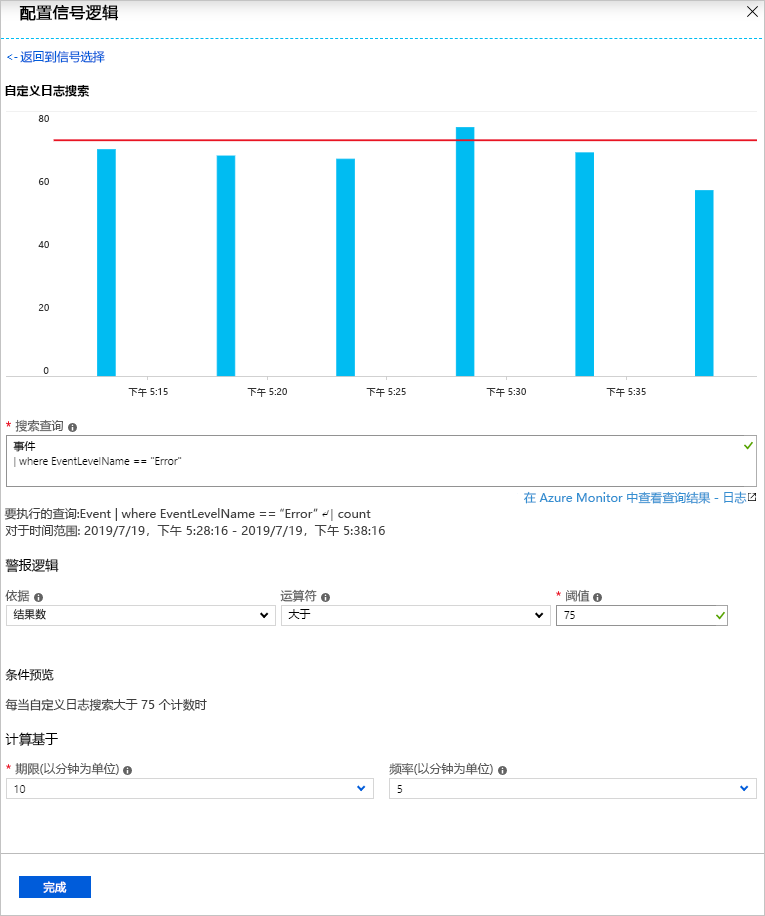
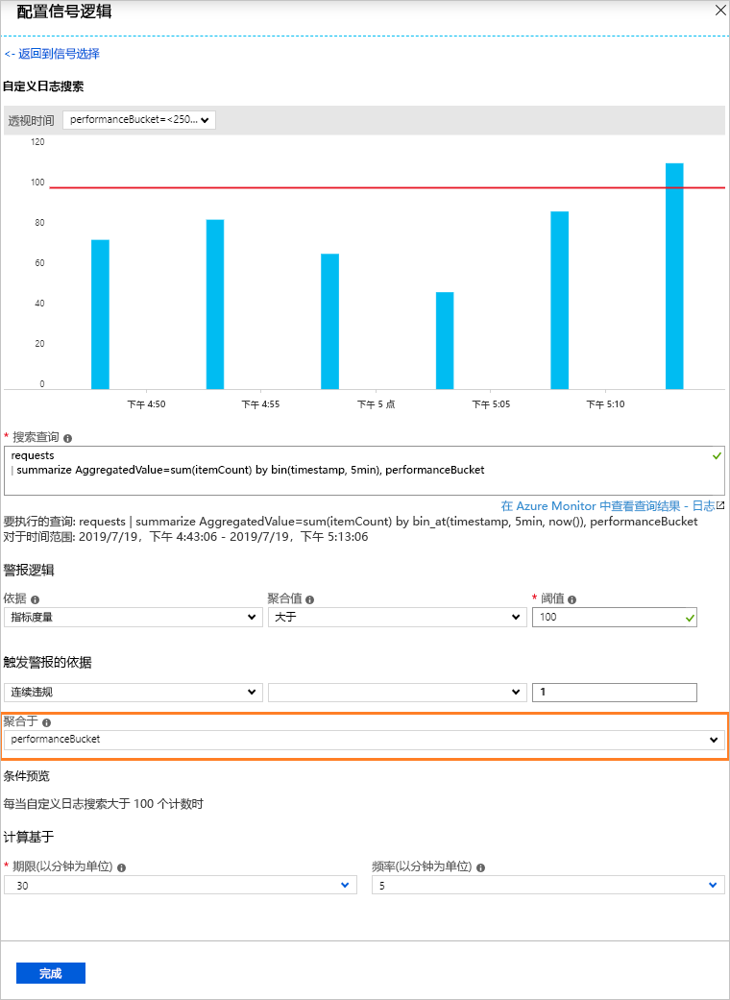
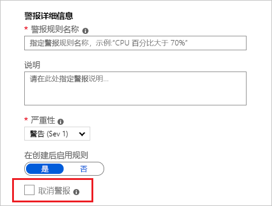
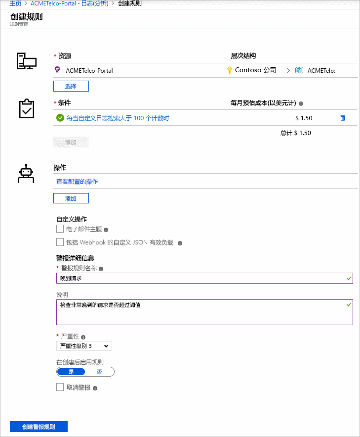
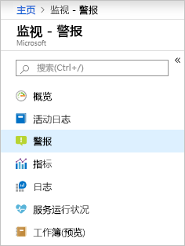
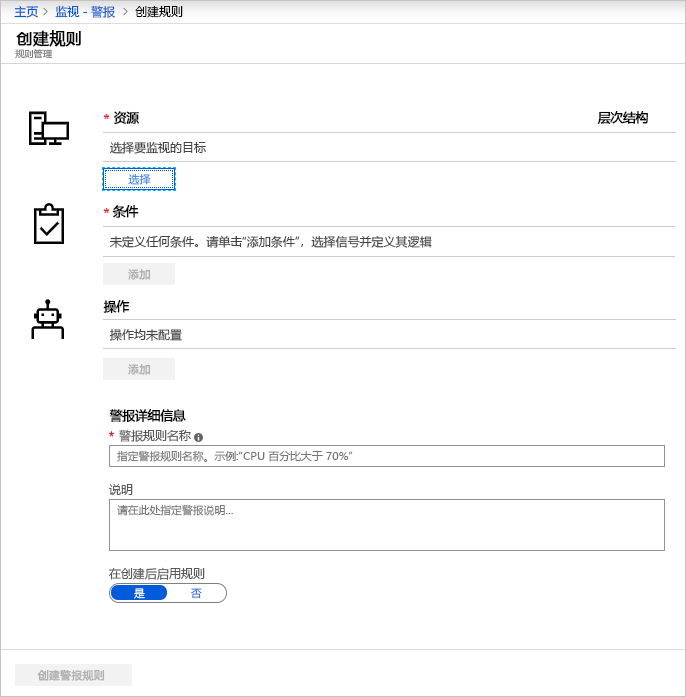
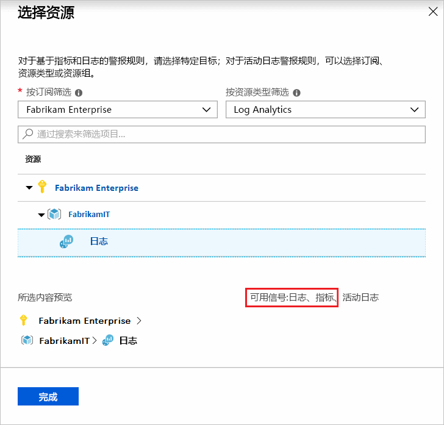
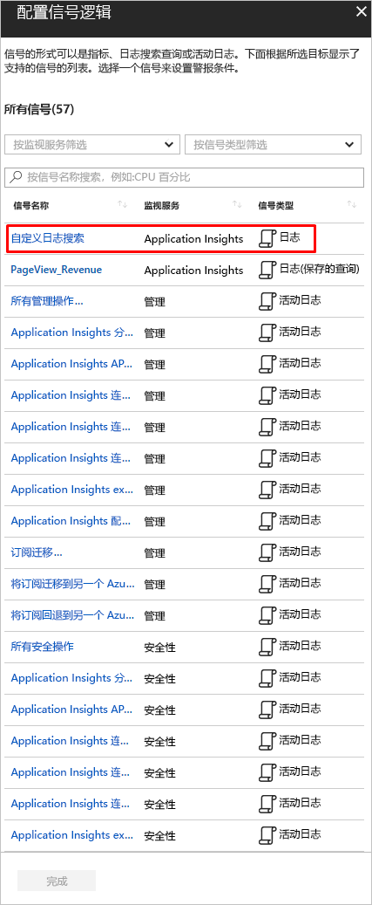

# <a name="create-view-and-manage-log-alerts-using-azure-monitor"></a>使用 Azure Monitor 创建、查看和管理日志警报

## <a name="overview"></a>概述

通过日志警报，用户可以使用 [Log Analytics](../log-query/get-started-portal.md) 查询按每个设置的频率评估资源日志，并根据结果触发警报。 规则可以使用[操作组](./action-groups.md)触发一个或多个操作。 [详细了解日志警报的功能和术语](alerts-unified-log.md)。

本文说明如何使用 Azure Monitor 创建和管理日志警报。 警报规则由三个组件定义：
- 目标：要监视的特定 Azure 资源。
- 条件：要评估的逻辑。 如果满足，则触发警报。  
- 操作：通知或自动化 - 电子邮件、短信、Webhook 等。

也可以使用 Azure 资源管理器模板创建日志预警规则，该方法在[单独的文章](alerts-log-create-templates.md)中进行了介绍。

> [!NOTE]
> 可以将 [Log Analytics 工作区](../log-query/get-started-portal.md)中的日志数据发送到 Azure Monitor 指标存储。 指标警报具有[不同的行为](alerts-metric-overview.md)，该行为可能更可取，具体取决于你要使用的数据。 要了解如何将日志路由到指标，请参阅[日志的指标警报](alerts-metric-logs.md)。

## <a name="create-a-log-alert-rule-with-the-azure-portal"></a>使用 Azure 门户创建日志警报规则

以下是开始编写警报查询的步骤：

1. 转到想要对其发出警报的资源。
1. 在“监视器”下，选择“日志” 。
1. 查询可以指示问题的日志数据。 可以使用[警报查询示例主题](../log-query/saved-queries.md)来了解可发现的内容或[开始编写你自己的查询](../log-query/get-started-portal.md)。 此外，[了解如何创建优化的警报查询](alerts-log-query.md)。
1. 按“+ 新建预警规则”按钮启动警报创建流。

    

> [!NOTE]
> 建议在对日志使用资源访问模式时大规模创建警报，该模式在使用资源组或订阅范围的多个资源上运行。 大规模警报会减少规则管理开销。 为了能够以资源为目标，请在结果中包含“资源 ID”列。 [详细了解如何按维度拆分警报](alerts-unified-log.md#split-by-alert-dimensions)。

### <a name="log-alert-for-log-analytics-and-application-insights"></a>Log Analytics 和 Application Insights 的日志警报

1. 如果查询语法正确，将以图表形式显示查询的历史数据，同时显示用于调整图表时间段（从过去六小时到过去一周）的选项。
 
    如果查询结果包含汇总数据或[项目](/azure/kusto/query/projectoperator)特定列（不包含时间列），则图表将显示单个值。

    

1. 使用[“时段”](alerts-unified-log.md#query-time-range)选项，选择评估指定条件的时间范围。

1. 日志警报可以基于两种类型的[“度量值”](alerts-unified-log.md#measure)：
    1. **结果数** - 查询返回的记录的计数。
    1. **指标度量** - 使用通过按选择的表达式和 [bin()](/azure/kusto/query/binfunction) 选择分组的汇总计算得出的聚合值。 例如：

    ```Kusto
    // Reported errors
    union Event, Syslog // Event table stores Windows event records, Syslog stores Linux records
    | where EventLevelName == "Error" // EventLevelName is used in the Event (Windows) records
    or SeverityLevel== "err" // SeverityLevel is used in Syslog (Linux) records
    | summarize AggregatedValue = count() by Computer, bin(TimeGenerated, 15m)
    ```

1. 对于指标度量警报逻辑，可以选择使用“聚合对象”选项来指定[如何按维度拆分警报](alerts-unified-log.md#split-by-alert-dimensions)。 行分组表达式必须唯一且已排序。

    > [!NOTE]
    > 由于 [bin()](/azure/kusto/query/binfunction) 可能导致不均匀的时间间隔，因此，警报服务会自动将 [bin()](/azure/kusto/query/binfunction) 函数转换为针对运行时的相应时间的 [bin_at()](/azure/kusto/query/binatfunction) 函数，以确保生成针对确定时间点的结果。

    > [!NOTE]
    > 按警报维度拆分仅适用于当前的 scheduledQueryRules API。 如果使用旧版 [Log Analytics 警报 API](api-alerts.md)，则需要切换。 [了解有关切换的详细信息](./alerts-log-api-switch.md)。 仅在 API 版本 `2020-05-01-preview` 及更高版本中支持大规模的以资源为中心的警报。

    

1. 接下来，根据预览数据设置[“运算符”、“阈值”](alerts-unified-log.md#threshold-and-operator)和[“频率”](alerts-unified-log.md#frequency)  。

1. 还可以选择使用“总计或连续违规次数”来设置[触发警报的违规次数](alerts-unified-log.md#number-of-violations-to-trigger-alert)。

1. 选择“完成”  。 

1. 定义“预警规则名称”、“描述”，然后选择警报“严重性”  。 这些详细信息将用于所有警报操作。 此外，可以通过选择“创建后启用规则”，选择在创建后不激活该预警规则。

1. 如需选择是否要在触发警报后的一段时间内阻止规则操作，可以使用[“阻止警报”](alerts-unified-log.md#state-and-resolving-alerts)选项。 该规则仍会运行并创建警报，但不会触发操作，从而避免干扰。 静音操作值必须大于警报频率才能生效。

    

1. 指定预警规则是否应在满足警报条件时触发一个或多个[“操作组”](action-groups.md#webhook)。

    > [!NOTE]
    > 有关可以执行的操作的限制，请参阅 [Azure 订阅服务限制](../../azure-resource-manager/management/azure-subscription-service-limits.md)。  

1. 可以选择在日志预警规则中自定义操作：

    - **自定义电子邮件主题**：替代电子邮件操作的电子邮件主题。 无法修改邮件正文，并且该字段不能用于电子邮件地址。
    - **包含自定义 JSON 有效负载**：假定操作组包含 Webhook 操作，则替代操作组使用的 Webhook JSON。 详细了解[用于日志警报的 Webhook 操作](./alerts-log-webhook.md)。

    

1. 如果正确设置了所有字段，则可以单击“创建预警规则”按钮，并创建一个警报。

    几分钟后，警报将处于活动状态，并按前面所述进行触发。

    

#### <a name="creating-log-alert-for-log-analytics-and-application-insights-from-the-alerts-management"></a>通过警报管理为 Log Analytics 和 Application Insights 创建日志警报

> [!NOTE]
> 以资源为中心的日志当前不支持从警报管理创建

1. 在[门户](https://portal.azure.com/)中，选择“Monitor”，然后选择“警报” 。

    

1. 选择“新建预警规则”。 

    

1. 随即显示“创建警报”窗格。 它有四个部分： 
    - 应用警报的资源。
    - 要检查的条件。
    - 条件为 true 时要执行的操作。
    - 命名和描述警报的详细信息。 

    

1. 按“选择资源”按钮。 选择“订阅”和“资源类型”进行筛选，然后选择一个资源 。 确保资源具有可用的日志。

   

1. 接下来，使用添加“条件”按钮查看可用于该资源的信号选项列表。 选择“自定义日志搜索”选项。

   

   > [!NOTE]
   > 警报门户列出了 Log Analytics 和 Application Insights 中保存的查询，这些查询可用作模板警报查询。

1. 选择后，在“搜索查询”字段中编写、粘贴或编辑警报查询。

1. 继续执行[最后一部分](#log-alert-for-log-analytics-and-application-insights)中所述的后续步骤。

### <a name="log-alert-for-all-other-resource-types"></a>所有其他资源类型的日志警报

> [!NOTE]
> 当前不对 API 版本 `2020-05-01-preview` 和以资源为中心的日志警报收取额外费用。  未来将公布预览版中的功能的定价以及开始计费之前提供的通知。 如果你选择在通知期后继续使用新 API 版本和以资源为中心的日志警报，则将按照适用的费率缴费。

1. 从“条件”选项卡开始：

    1. 请检查[“度量值”](alerts-unified-log.md#measure)、[聚合类型”](alerts-unified-log.md#aggregation-type)和[“聚合粒度”](alerts-unified-log.md#aggregation-granularity)是否正确  。 
        1. 默认情况下，该规则将计算过去 5 分钟内的结果数。
        1. 如果我们检测到汇总查询结果，则该规则将在几秒钟内自动更新以捕获该结果。

    1. 如果需要，可以选择[按维度拆分警报](alerts-unified-log.md#split-by-alert-dimensions)： 
       - 资源 ID 列（如果已检测到）将自动选中，并将触发的警报的上下文更改为记录的资源。 
       - 可以取消选择资源 ID 列以触发针对订阅或资源组的警报。 如果查询结果基于交叉资源，则取消选择非常有用。 例如，用于检查资源组中是否 80% 的虚拟机的 CPU 使用率都很高的查询。
       - 对于使用维度表的任何数字或文本列类型，还可以最多选择六个附加的拆分。
       - 警报根据基于唯一组合的拆分单独触发，警报有效负载包括此信息。
    
        

    1. “预览”图表显示一段时间内的查询评估结果。 可以更改图表时间段，或选择按维度进行的唯一警报拆分产生的时序。

        

    1. 接下来，根据预览数据设置“警报逻辑”、[“运算符”、“阈值”](alerts-unified-log.md#threshold-and-operator)和[“频率”](alerts-unified-log.md#frequency)   。

        

    1. 可以选择在“高级选项”部分中设置[“触发警报的违规次数”](alerts-unified-log.md#number-of-violations-to-trigger-alert) 。
    
        

1. 在“操作”选项卡中，选择或创建所需的[操作组](action-groups.md)。

    

1. 在“详细信息”选项卡中，定义“预警规则详细信息”和“项目详细信息”  。 可以选择设置是否“立即开始运行”，或是否在预警规则触发后的一段时间内[“将操作设置为静音”](alerts-unified-log.md#state-and-resolving-alerts) 。

    > [!NOTE]
    > 日志预警规则当前是无状态的，并且每次创建警报时都会触发操作，除非定义了静音。

    

1. 在“标记”选项卡中，在预警规则资源上设置任何必需的标记。

    

1. 在“审核 + 创建”选项卡中，将运行验证并告知所有问题。 审核并批准规则定义。
1. 如果所有字段均正确，请选择“创建”按钮，然后完成预警规则的创建。 可以从警报管理查看所有警报。
 
    

## <a name="view--manage-log-alerts-in-azure-portal"></a>在 Azure 门户中查看和管理日志警报

1. 在[门户](https://portal.azure.com/)中，选择相关资源或“Monitor”服务。 然后，在“Monitor”部分中选择“警报”。

1. 警报管理将显示触发的所有警报。 [详细了解警报管理](alerts-managing-alert-instances.md)。

    > [!NOTE]
    > 日志预警规则当前为[无状态且未解析](alerts-unified-log.md#state-and-resolving-alerts)。

1. 在顶部栏中选择“管理预警规则”按钮以编辑规则：

    

## <a name="managing-log-alerts-using-powershell"></a>使用 PowerShell 管理日志警报

[!INCLUDE [updated-for-az](../../../includes/updated-for-az.md)]

> [!NOTE]
> API 版本 `2020-05-01-preview` 当前不支持 PowerShell

下面列出的 PowerShell cmdlet 可用于使用[计划查询规则 API](/rest/api/monitor/scheduledqueryrules/) 来管理规则。

- [New-AzScheduledQueryRule](/powershell/module/az.monitor/new-azscheduledqueryrule)：用于新建日志警报规则的 PowerShell cmdlet。
- [Set-AzScheduledQueryRule](/powershell/module/az.monitor/set-azscheduledqueryrule)：用于更新现有日志警报规则的 PowerShell cmdlet。
- [New-AzScheduledQueryRuleSource](/powershell/module/az.monitor/new-azscheduledqueryrulesource)：用于创建或更新对象的 PowerShell cmdlet，该对象为日志警报指定源参数。 由 [New-AzScheduledQueryRule](/powershell/module/az.monitor/new-azscheduledqueryrule) 和 [Set-AzScheduledQueryRule](/powershell/module/az.monitor/set-azscheduledqueryrule) cmdlet 用作输入。
- [New-AzScheduledQueryRuleSchedule](/powershell/module/az.monitor/new-azscheduledqueryruleschedule)：用于创建或更新对象的 PowerShell cmdlet，该对象为日志警报指定计划参数。 由 [New-AzScheduledQueryRule](/powershell/module/az.monitor/new-azscheduledqueryrule) 和 [Set-AzScheduledQueryRule](/powershell/module/az.monitor/set-azscheduledqueryrule) cmdlet 用作输入。
- [New-AzScheduledQueryRuleAlertingAction](/powershell/module/az.monitor/new-azscheduledqueryrulealertingaction)：用于创建或更新对象的 PowerShell cmdlet，该对象为日志警报指定操作参数。 由 [New-AzScheduledQueryRule](/powershell/module/az.monitor/new-azscheduledqueryrule) 和 [Set-AzScheduledQueryRule](/powershell/module/az.monitor/set-azscheduledqueryrule) cmdlet 用作输入。
- [New-AzScheduledQueryRuleAznsActionGroup](/powershell/module/az.monitor/new-azscheduledqueryruleaznsactiongroup)：用于创建或更新对象的 PowerShell cmdlet，该对象为日志警报指定操作组参数。 由 [New-AzScheduledQueryRuleAlertingAction](/powershell/module/az.monitor/new-azscheduledqueryrulealertingaction) cmdlet 用作输入。
- [New-AzScheduledQueryRuleTriggerCondition](/powershell/module/az.monitor/new-azscheduledqueryruletriggercondition)：用于创建或更新对象的 PowerShell cmdlet，该对象为日志警报指定触发器条件参数。 由 [New-AzScheduledQueryRuleAlertingAction](/powershell/module/az.monitor/new-azscheduledqueryrulealertingaction) cmdlet 用作输入。
- [New-AzScheduledQueryRuleLogMetricTrigger](/powershell/module/az.monitor/new-azscheduledqueryrulelogmetrictrigger)：用于创建或更新对象的 PowerShell cmdlet，该对象为[指标度量值类型日志警报](./alerts-unified-log.md#calculation-of-measure-based-on-a-numeric-column-such-as-cpu-counter-value)指定触发器条件参数。 由 [New-AzScheduledQueryRuleTriggerCondition](/powershell/module/az.monitor/new-azscheduledqueryruletriggercondition) cmdlet 用作输入。
- [Get-AzScheduledQueryRule](/powershell/module/az.monitor/get-azscheduledqueryrule)：用于列出现有日志警报规则或指定日志警报规则的 PowerShell cmdlet
- [Update-AzScheduledQueryRule](/powershell/module/az.monitor/update-azscheduledqueryrule)：用于启用或禁用日志警报规则的 PowerShell cmdlet
- [Remove-AzScheduledQueryRule](/powershell/module/az.monitor/remove-azscheduledqueryrule)：用于删除现有日志警报规则的 PowerShell cmdlet

> [!NOTE]
> ScheduledQueryRules PowerShell cmdlets 只能管理在当前[计划查询规则 API](/rest/api/monitor/scheduledqueryrules/) 中创建的规则。 仅在[切换到计划的查询规则 api](alerts-log-api-switch.md)之后，才能使用旧版[Log Analytics 警报 api](api-alerts.md)创建的日志警报规则才能使用 PowerShell 进行管理。

以下是使用 PowerShell 创建日志预警规则的示例步骤：

```powershell
$source = New-AzScheduledQueryRuleSource -Query 'Heartbeat | summarize AggregatedValue = count() by bin(TimeGenerated, 5m), _ResourceId' -DataSourceId "/subscriptions/a123d7efg-123c-1234-5678-a12bc3defgh4/resourceGroups/contosoRG/providers/microsoft.OperationalInsights/workspaces/servicews"

$schedule = New-AzScheduledQueryRuleSchedule -FrequencyInMinutes 15 -TimeWindowInMinutes 30

$metricTrigger = New-AzScheduledQueryRuleLogMetricTrigger -ThresholdOperator "GreaterThan" -Threshold 2 -MetricTriggerType "Consecutive" -MetricColumn "_ResourceId"

$triggerCondition = New-AzScheduledQueryRuleTriggerCondition -ThresholdOperator "LessThan" -Threshold 5 -MetricTrigger $metricTrigger

$aznsActionGroup = New-AzScheduledQueryRuleAznsActionGroup -ActionGroup "/subscriptions/a123d7efg-123c-1234-5678-a12bc3defgh4/resourceGroups/contosoRG/providers/microsoft.insights/actiongroups/sampleAG" -EmailSubject "Custom email subject" -CustomWebhookPayload "{ `"alert`":`"#alertrulename`", `"IncludeSearchResults`":true }"

$alertingAction = New-AzScheduledQueryRuleAlertingAction -AznsAction $aznsActionGroup -Severity "3" -Trigger $triggerCondition

New-AzScheduledQueryRule -ResourceGroupName "contosoRG" -Location "Region Name for your Application Insights App or Log Analytics Workspace" -Action $alertingAction -Enabled $true -Description "Alert description" -Schedule $schedule -Source $source -Name "Alert Name"
```

还可以通过 PowerShell 使用[模板和参数](./alerts-log-create-templates.md)文件创建日志警报：

```powershell
Connect-AzAccount

Select-AzSubscription -SubscriptionName <yourSubscriptionName>

New-AzResourceGroupDeployment -Name AlertDeployment -ResourceGroupName ResourceGroupofTargetResource `
  -TemplateFile mylogalerttemplate.json -TemplateParameterFile mylogalerttemplate.parameters.json
```

## <a name="managing-log-alerts-using-cli"></a>使用 CLI 管理日志警报

> [!NOTE]
> Azure CLI 支持仅适用于 scheduledQueryRules API 版本 `2020-05-01-preview` 和更高版本。 以前的 API 版本可将 Azure 资源管理器 CLI 与模板配合使用，如下所述。 如果使用旧版 [Log Analytics 警报 API](api-alerts.md)，则需要切换到使用 CLI。 [了解有关切换的详细信息](./alerts-log-api-switch.md)。

前面几个部分介绍了如何使用 Azure 门户创建、查看和管理日志预警规则。 本部分将介绍如何使用跨平台 [Azure CLI](/cli/azure/get-started-with-azure-cli) 实现相同的结果。 使用 Azure CLI 的最快捷方式是通过 [Azure Cloud Shell](../../cloud-shell/overview.md)。 对于本文，我们将使用 Cloud Shell。

1. 请参阅 Azure 门户，选择 **Cloud Shell**。

1. 在提示符下，可以结合 ``--help`` 选项使用命令来详细了解相应的命令及其用法。 例如，以下命令显示可用于创建、查看和管理日志警报的命令列表：

    ```azurecli
    az monitor scheduled-query --help
    ```

1. 可以创建日志预警规则来监视系统事件错误的数目：

    ```azurecli
    az monitor scheduled-query create -g {ResourceGroup} -n {nameofthealert} --scopes {vm_id} --condition "count \'union Event, Syslog | where TimeGenerated > ago(1h) | where EventLevelName == \"Error\" or SeverityLevel== \"err\"\' > 2" --description {descriptionofthealert}
    ```

1. 可以使用以下命令查看资源组中的所有日志警报：

    ```azurecli
    az monitor scheduled-query list -g {ResourceGroup}
    ```

1. 可以使用规则的名称或资源 ID 查看特定日志预警规则的详细信息：

    ```azurecli
    az monitor scheduled-query show -g {ResourceGroup} -n {AlertRuleName}
    ```

    ```azurecli
    az monitor scheduled-query show --ids {RuleResourceId}
    ```

1. 可以使用以下命令禁用日志预警规则：

    ```azurecli
    az monitor scheduled-query update -g {ResourceGroup} -n {AlertRuleName} --enabled false
    ```

1. 可以使用以下命令删除日志预警规则：

    ```azurecli
    az monitor scheduled-query delete -g {ResourceGroup} -n {AlertRuleName}
    ```

也可以将 Azure 资源管理器 CLI 与[模板](./alerts-log-create-templates.md)文件一起使用：

```azurecli
az login

az group deployment create \
    --name AlertDeployment \
    --resource-group ResourceGroupofTargetResource \
    --template-file mylogalerttemplate.json \
    --parameters @mylogalerttemplate.parameters.json
```

创建成功后，将返回 201。 更新成功后，将返回 200。

## <a name="next-steps"></a>后续步骤

* 了解[日志警报](./alerts-unified-log.md)。
* 使用 [Azure 资源管理器模板](./alerts-log-create-templates.md)创建日志警报。
* 了解[用于日志警报的 Webhook 操作](./alerts-log-webhook.md)。
* 了解有关[日志查询](../log-query/log-query-overview.md)的详细信息。

