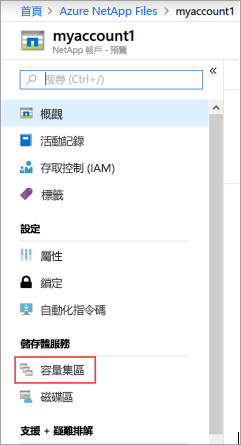
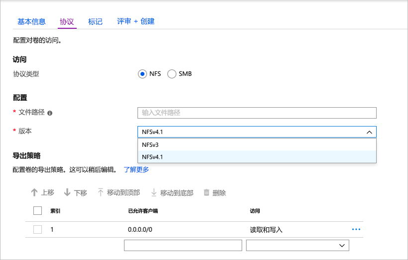
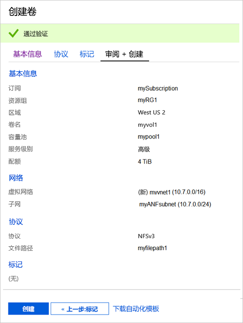

# <a name="quickstart-set-up-azure-netapp-files-and-create-an-nfs-volume"></a>快速入门：设置 Azure NetApp 文件并创建 NFS 卷 

本文介绍如何快速设置 Azure NetApp 文件和创建卷。 

在本快速入门中，你将设置以下项：

- Azure NetApp 文件和 NetApp 资源提供程序注册
- 一个 NetApp 帐户
- 一个容量池
- 一个用于 Azure NetApp 文件的 NFS 卷

如果没有 Azure 订阅，请在开始之前创建一个[免费帐户](https://azure.microsoft.com/free/?WT.mc_id=A261C142F)。

## <a name="before-you-begin"></a>开始之前 

> [!IMPORTANT] 
> 你需要被授予对 Azure NetApp 文件服务的访问权限。  若要请求对该服务的访问权限，请参阅 [Azure NetApp 文件候补名单提交页面](https://forms.office.com/Pages/ResponsePage.aspx?id=v4j5cvGGr0GRqy180BHbR8cq17Xv9yVBtRCSlcD_gdVUNUpUWEpLNERIM1NOVzA5MzczQ0dQR1ZTSS4u)。  你必须等待来自 Azure NetApp 文件团队的官方确认电子邮件，然后才能继续操作。 

[!INCLUDE [cloud-shell-try-it.md](../../includes/cloud-shell-try-it.md)]

---

## <a name="register-for-azure-netapp-files-and-netapp-resource-provider"></a>注册 Azure NetApp 文件和 NetApp 资源提供程序

> [!NOTE]
> 注册过程可能需要一些时间才能完成。
>

# <a name="portal"></a>[门户](#tab/azure-portal)

对于使用门户的注册步骤，请按照上面所述打开 Cloud Shell 会话，然后执行以下 Azure CLI 步骤：

[!INCLUDE [azure-netapp-files-cloudshell-include](../../includes/azure-netapp-files-azure-cloud-shell-window.md)]

# <a name="powershell"></a>[PowerShell](#tab/azure-powershell)

本操作指南文章需要 Azure PowerShell 模块 Az 2.6.0 或更高版本。 运行 `Get-Module -ListAvailable Az` 即可查找当前版本。 如果需要进行安装或升级，请参阅[安装 Azure PowerShell 模块](/powershell/azure/install-Az-ps)。 如果你愿意，可以改为在 PowerShell 会话中使用 Cloud Shell 控制台。

1. 在 PowerShell 命令提示符（或 PowerShell Cloud Shell 会话）中，为 Azure NetApp 文件指定已列入允许列表的订阅：
    ```powershell-interactive
    Select-AzSubscription -Subscription <subscriptionId>
    ```

2. 注册 Azure 资源提供程序：
    ```powershell-interactive
    Register-AzResourceProvider -ProviderNamespace Microsoft.NetApp
    ```

# <a name="azure-cli"></a>[Azure CLI](#tab/azure-cli)

[!INCLUDE [azure-netapp-files-cloudshell-include](../../includes/azure-netapp-files-azure-cloud-shell-window.md)]

---

## <a name="create-a-netapp-account"></a>创建 NetApp 帐户

# <a name="portal"></a>[门户](#tab/azure-portal)

1. 在 Azure 门户的搜索框中输入“Azure NetApp 文件”，然后从显示的列表中选择“Azure NetApp 文件”。  

      

2. 单击“+ 添加”  来创建新的 NetApp 帐户。

     

3. 在“新建 NetApp 帐户”窗口中提供以下信息： 
   1. 输入 **myaccount1** 作为帐户名称。 
   2. 选择订阅。
   3. 选择“新建”以创建新的资源组。  输入 **myRG1** 作为资源组名称。 单击“确定”。  
   4. 选择帐户位置。  

        

      

4. 单击“创建”以创建新的 NetApp 帐户。 

# <a name="powershell"></a>[PowerShell](#tab/azure-powershell)

1. 定义一些变量，以便我们可以在其余示例中引用它们：

    ```powershell-interactive
    $resourceGroup = "myRG1"
    $location = "eastus"
    $anfAccountName = "myaccount1"
    ``` 

    > [!NOTE]
    > 有关受支持区域的列表，请参阅[可用产品(按区域)](https://azure.microsoft.com/global-infrastructure/services/?products=netapp&regions=all)。
    > 若要获取命令行工具支持的区域名称，请使用 `Get-AzLocation | select Location`
    >

1. 使用 [New-AzResourceGroup](/powershell/module/az.resources/new-azresourcegroup) 命令创建新的资源组：

    ```powershell-interactive
    New-AzResourceGroup -Name $resourceGroup -Location $location
    ```

2. 使用 [New-AzNetAppFilesAccount](/powershell/module/az.netappfiles/New-AzNetAppFilesAccount) 命令创建 Azure NetApp 文件帐户：
   
    ```powershell-interactive
    New-AzNetAppFilesAccount -ResourceGroupName $resourceGroup -Location $location -Name $anfAccountName
    ```

# <a name="azure-cli"></a>[Azure CLI](#tab/azure-cli)

1. 定义一些变量，以便我们可以在其余示例中引用它们：

    ```azurecli-interactive
    RESOURCE_GROUP="myRG1"
    LOCATION="eastus"
    ANF_ACCOUNT_NAME="myaccount1"
    ``` 

    > [!NOTE]
    > 有关受支持区域的列表，请参阅[可用产品(按区域)](https://azure.microsoft.com/global-infrastructure/services/?products=netapp&regions=all)。
    > 若要获取命令行工具支持的区域名称，请使用 `az account list-locations -query "[].{Region:name}" --out table`
    >

2. 使用 [az group create](/cli/azure/group#az-group-create) 命令创建新的资源组：

    ```azurecli-interactive
    az group create \
        --name $RESOURCE_GROUP \
        --location $LOCATION
    ```

3. 使用 [az netappfiles account create](/cli/azure/netappfiles/account#az-netappfiles-account-create) 命令创建 Azure NetApp 文件帐户：
   
    ```azurecli-interactive
    az netappfiles account create \
        --resource-group $RESOURCE_GROUP \
        --location $LOCATION \
        --account-name $ANF_ACCOUNT_NAME
    ```
---

## <a name="set-up-a-capacity-pool"></a>设置容量池

# <a name="portal"></a>[门户](#tab/azure-portal)

1. 在 Azure NetApp 文件管理边栏选项卡中，选择你的 NetApp 帐户 (**myaccount1**)。

      

2. 在 NetApp 帐户的 Azure NetApp 文件管理边栏选项卡中，单击“容量池”。 

      

3. 单击“+ 添加池”。  

      

4. 提供容量池的信息： 
    1. 输入 **mypool1** 作为池名称。
    2. 选择“高级”作为服务级别。  
    3. 指定“4 (TiB)”作为池大小。  

5. 单击“确定”。 

# <a name="powershell"></a>[PowerShell](#tab/azure-powershell)

1. 定义一些新变量以供将来引用

    ```powershell-interactive
    $poolName = "mypool1"
    $poolSizeBytes = 4398046511104 # 4TiB
    $serviceLevel = "Premium" # Valid values are Standard, Premium and Ultra
    ```

1. 使用 [New-AzNetAppFilesPool](/powershell/module/az.netappfiles/new-aznetappfilespool) 创建新的容量池

    ```powershell-interactive
    New-AzNetAppFilesPool -ResourceGroupName $resourceGroup -Location $location -AccountName $anfAccountName -Name $poolName -PoolSize $poolSizeBytes -ServiceLevel $serviceLevel
    ```

# <a name="azure-cli"></a>[Azure CLI](#tab/azure-cli)

1. 定义一些新变量以供将来引用

    ```azurecli-interactive
    POOL_NAME="mypool1"
    POOL_SIZE_TiB=4 # Size in Azure CLI needs to be in TiB unit (minimum 4 TiB)
    SERVICE_LEVEL="Premium" # Valid values are Standard, Premium and Ultra
    ```

2. 使用 [az netappfiles pool create](/cli/azure/netappfiles/pool#az-netappfiles-pool-create) 创建新的容量池 

    ```azurecli-interactive
    az netappfiles pool create \
        --resource-group $RESOURCE_GROUP \
        --location $LOCATION \
        --account-name $ANF_ACCOUNT_NAME \
        --pool-name $POOL_NAME \
        --size $POOL_SIZE_TiB \
        --service-level $SERVICE_LEVEL
    ```

---

## <a name="create-nfs-volume-for-azure-netapp-files"></a>创建用于 Azure NetApp 文件的 NFS 卷

# <a name="portal"></a>[门户](#tab/azure-portal)

1. 在 NetApp 帐户的 Azure NetApp 文件管理边栏选项卡中，单击“卷”。 

      

2. 单击“+ 添加卷”。 

      

3. 在“创建卷”窗口中提供卷的信息： 
   1. 输入 **myvol1** 作为卷名称。 
   2. 选择容量池 (**mypool1**)。
   3. 对配额使用默认值。 
   4. 在“虚拟网络”下，单击“新建”以创建新的 Azure 虚拟网络 (VNet)。   然后填写以下信息：
       * 输入 **myvnet1** 作为 VNet 名称。
       * 指定设置的地址空间，例如 10.7.0.0/16
       * 输入 **myANFsubnet** 作为子网名称。
       * 指定子网地址范围，例如 10.7.0.0/24。 不能与其他资源共享专用子网。
       * 选择“Microsoft.NetApp/volumes”作为子网委托。 
       * 单击“确定”以创建 VNet。 
   5. 在子网中，选择新建的 VNet (**myvnet1**) 作为委托子网。

        

        

4. 单击“协议”  ，然后完成以下操作： 
    * 选择“NFS”  作为卷的协议类型。  
    * 输入 **myfilepath1** 作为文件路径，该路径用于创建卷的导出路径。  
    * 选择卷的 NFS 版本（**NFSv3** 或 **NFSv4.1**）。  
      有关 NFS 版本，请参阅[注意事项](azure-netapp-files-create-volumes.md#considerations)和[最佳做法](azure-netapp-files-create-volumes.md#best-practice)。 
      
  

5. 单击“查看 + 创建”  。

      

6. 查看卷的信息，然后单击“创建”。   
    创建的卷将显示在“卷”边栏选项卡中。

      

# <a name="powershell"></a>[PowerShell](#tab/azure-powershell)

1. 使用 [New-AzDelegation](/powershell/module/az.network/new-azdelegation) 命令创建对“Microsoft.NetApp/volumes”的子网委派。

    ```powershell-interactive
    $anfDelegation = New-AzDelegation -Name ([guid]::NewGuid().Guid) -ServiceName "Microsoft.NetApp/volumes"
    ```

2. 使用 [New-AzVirtualNetworkSubnetConfig](/powershell/module/az.network/new-azvirtualnetworksubnetconfig) 命令创建子网配置。

    ```powershell-interactive
    $subnet = New-AzVirtualNetworkSubnetConfig -Name "myANFSubnet" -AddressPrefix "10.7.0.0/24" -Delegation $anfDelegation
    ```

3. 使用 [New-AzVirtualNetwork](/powershell/module/az.network/new-azvirtualnetwork) 命令创建虚拟网络。
    
    ```powershell-interactive
    $vnet = New-AzVirtualNetwork -Name "myvnet1" -ResourceGroupName $resourceGroup -Location $location -AddressPrefix "10.7.0.0/16" -Subnet $subnet
    ```

4. 使用 [New-AzNetAppFilesVolume](/powershell/module/az.netappfiles/new-aznetappfilesvolume) 命令创建卷。
   
    ```powershell-interactive
    $volumeSizeBytes = 1099511627776 # 100GiB
    $subnetId = $vnet.Subnets[0].Id

    New-AzNetAppFilesVolume -ResourceGroupName $resourceGroup `
        -Location $location `
        -AccountName $anfAccountName `
        -PoolName $poolName `
        -Name "myvol1" `
        -UsageThreshold $volumeSizeBytes `
        -SubnetId $subnetId `
        -CreationToken "myfilepath1" `
        -ServiceLevel $serviceLevel `
        -ProtocolType NFSv3
    ```

# <a name="azure-cli"></a>[Azure CLI](#tab/azure-cli)

1. 定义一些变量供以后使用。
    
    ```azurecli-interactive
    VNET_NAME="myvnet1"
    SUBNET_NAME="myANFSubnet"
    ```

1. 使用 [az network vnet create](/cli/azure/network/vnet#az-network-vnet-create) 命令创建没有子网的虚拟网络。
    
    ```azurecli-interactive
    az network vnet create \
        --resource-group $RESOURCE_GROUP \
        --name $VNET_NAME \
        --location $LOCATION \
        --address-prefix "10.7.0.0/16"

    ```

2. 使用 [az network vnet subnet create](/cli/azure/network/vnet/subnet#az-network-vnet-subnet-create) 命令创建委托子网。

    ```azurecli-interactive
    az network vnet subnet create \
        --resource-group $RESOURCE_GROUP \
        --vnet-name $VNET_NAME \
        --name $SUBNET_NAME \
        --address-prefixes "10.7.0.0/24" \
        --delegations "Microsoft.NetApp/volumes"
    ```

3. 使用 [az netappfiles volume create](/cli/azure/netappfiles/volume#az-netappfiles-volume-create) 命令创建卷。
   
    ```azurecli-interactive
    VNET_ID=$(az network vnet show --resource-group $RESOURCE_GROUP --name $VNET_NAME --query "id" -o tsv)
    SUBNET_ID=$(az network vnet subnet show --resource-group $RESOURCE_GROUP --vnet-name $VNET_NAME --name $SUBNET_NAME --query "id" -o tsv)
    VOLUME_SIZE_GiB=100 # 100 GiB
    UNIQUE_FILE_PATH="myfilepath2" # Please note that creation token needs to be unique within subscription and region

    az netappfiles volume create \
        --resource-group $RESOURCE_GROUP \
        --location $LOCATION \
        --account-name $ANF_ACCOUNT_NAME \
        --pool-name $POOL_NAME \
        --name "myvol1" \
        --service-level $SERVICE_LEVEL \
        --vnet $VNET_ID \
        --subnet $SUBNET_ID \
        --usage-threshold $VOLUME_SIZE_GiB \
        --file-path $UNIQUE_FILE_PATH \
        --protocol-types "NFSv3"
    ```

---

## <a name="clean-up-resources"></a>清理资源

# <a name="portal"></a>[门户](#tab/azure-portal)

完成后，如果需要，你可以删除资源组。 删除资源组的操作不可逆。  

> [!IMPORTANT]
> 资源组中的所有资源将被永久删除，并且无法撤消。 

1. 在 Azure 门户的搜索框中输入“Azure NetApp 文件”，然后从显示的列表中选择“Azure NetApp 文件”。  

2. 在订阅列表中，单击你要删除的资源组 (myRG1)。 

    


3. 在资源组页面上，单击“删除资源组”。 

     

    此时会打开一个窗口，其中显示有关将要与资源组一起删除的资源的警告。

4. 输入资源组的名称 (myRG1) 以确认你要永久删除该资源组及其中的所有资源，然后单击“删除”  。

     

# <a name="powershell"></a>[PowerShell](#tab/azure-powershell)

完成后，如果需要，你可以删除资源组。 删除资源组的操作不可逆。  

> [!IMPORTANT]
> 资源组中的所有资源将被永久删除，并且无法撤消。

1. 使用 [Remove-AzResourceGroup](/powershell/module/az.resources/remove-azresourcegroup) 命令删除资源组。
   
    ```powershell-interactive
    Remove-AzResourceGroup -Name $resourceGroup
    ```

# <a name="azure-cli"></a>[Azure CLI](#tab/azure-cli)

完成后，如果需要，你可以删除资源组。 删除资源组的操作不可逆。  

> [!IMPORTANT]
> 资源组中的所有资源将被永久删除，并且无法撤消。

1. 使用 [az group delete](/cli/azure/group#az-group-delete) 命令删除资源组。
   
    ```azurecli-interactive
    az group delete \
        --name $RESOURCE_GROUP
    ```
---

## <a name="next-steps"></a>后续步骤  

> [!div class="nextstepaction"]
> [使用 Azure NetApp 文件管理卷](azure-netapp-files-manage-volumes.md)  
