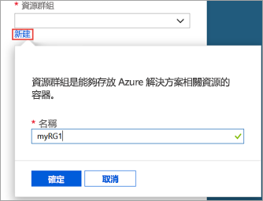
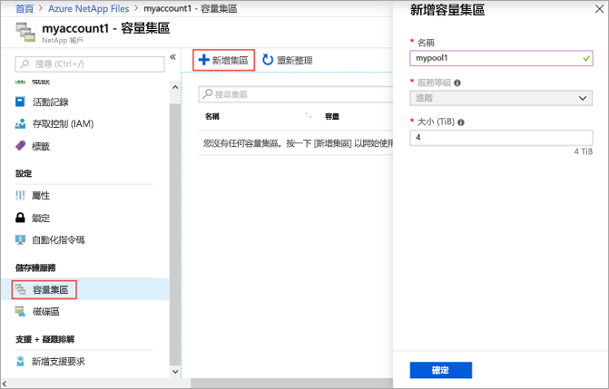
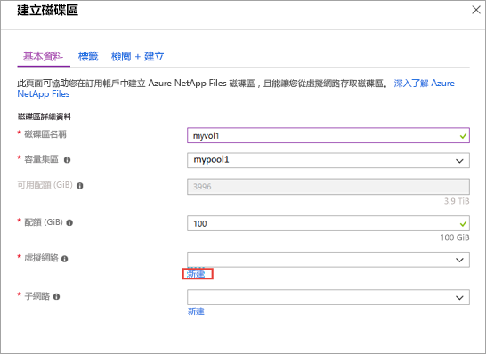

# 设置 Azure NetApp 文件并创建卷 

本文介绍如何快速设置 Azure NetApp 文件，并创建卷。 

## 开始之前 

你需要加入公共预览版计划并且列入允许列表，然后才能访问 Microsoft.NetApp 资源提供程序。 有关加入公共预览版计划的详细信息，请参阅 [Azure NetApp 文件公共预览版注册页](https://aka.ms/nfspublicpreview)。 

## 注册 Azure 的 NetApp 文件和 NetApp 资源提供程序

1. 从 Azure 门户中，单击右上角上的 Azure Cloud Shell 图标。

      

2. 指定已被列入 Azure NetApp 文件的允许列表的订阅：
    
        az account set --subscription <subscriptionId>

3. 注册 Azure 资源提供程序： 
    
        az provider register --namespace Microsoft.NetApp --wait  

    注册过程可能需要一些时间才能完成。

## 创建 NetApp 帐户

1. 在 Azure 门户的搜索框中，输入**Azure NetApp 文件**，然后选择**Azure NetApp 文件 （预览版）** 从显示的列表。

      

2. 单击“+ 添加”来创建新的 NetApp 帐户。

     

3. 在新的 NetApp 帐户窗口中，提供以下信息： 
   1. 输入**myaccount1**帐户名称。 
   2. 选择订阅。
   3. 选择**新建**若要创建新的资源组。 输入**myRG1**为资源组名称。 单击“确定”。 
   4. 选择你帐户的位置。  

        

      

4. 单击**创建**若要创建新的 NetApp 帐户。

## 设置容量池

1. 从 Azure NetApp 文件管理边栏选项卡，选择你的 NetApp 帐户 (**myaccount1**)。

      

2. 从 Azure NetApp 文件管理边栏选项卡的 NetApp 帐户，单击**容量池**。

      

3. 单击 **+ 将池添加**。 

      

4. 提供容量池的信息： 
    1. 输入**mypool1**与池的名称。
    2. 选择**高级**的服务级别。 
    3. 指定**4 (TiB)** 作为池大小。 

5. 单击“确定”。

## 为 Azure NetApp 文件创建卷

1. 从 Azure NetApp 文件管理边栏选项卡的 NetApp 帐户，单击**卷**。

      

2. 单击“+ 添加卷”。

      

3. 在创建卷窗口中，提供该卷的信息： 
   1. 输入**myvol1**作为卷名称。 
   2. 输入**myfilepath1**作为文件路径将用于创建该卷的导出路径。
   3. 选择容量池 (**mypool1**)。
   4. 对于配额使用默认值。 
   5. 在虚拟网络中，单击**新建**若要创建新的 Azure 虚拟网络 (Vnet)。  然后填写以下信息：
       * 输入**myvnet1**作为 Vnet 名称。
       * 指定的地址空间，例如，10.7.0.0/16。
       * 输入**myANFsubnet**作为子网名称。
       * 指定子网地址范围，例如，10.7.0.0/24。
       * 选择**Microsoft.NetApp/volumes**为子网委派。
       * 单击**确定**以创建该 Vnet。
   6. 在子网中，选择新创建的 Vnet (**myvnet1**) 作为委托子网。

        

        

4. 单击“查看 + 创建”。

      

5. 查看该卷的信息，然后单击**创建**。  
    创建的卷将显示在卷边栏选项卡。

      

## 后续步骤  

* [了解 Azure NetApp 文件的存储层次结构](azure-netapp-files-understand-storage-hierarchy.md)
* [通过使用 Azure 的 NetApp 文件管理卷](azure-netapp-files-manage-volumes.md) 
