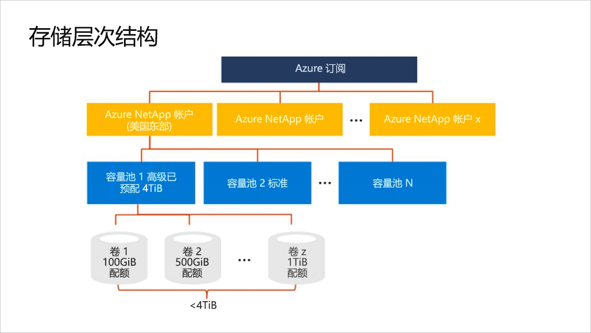

# 了解 Azure NetApp 文件的存储层次结构

在 Azure NetApp 文件中创建卷之前，必须为预配的容量购买和设置池。  若要设置容量池，必须具有 NetApp 帐户。 了解存储层次结构可以帮助你设置和管理 Azure NetApp 文件资源。

## NetApp 帐户

- NetApp 帐户用作成分容量池的管理组。  
- NetApp 帐户不同于常规的 Azure 存储帐户。 
- NetApp 帐户从作用域角度而言是区域性的。   
- 在一个区域中可以有多个 NetApp 帐户，但每个 NetApp 帐户仅绑定到单个区域。

## 容量池

- 容量池是按其预配的容量度量的。  
- 该容量预配为你购买的固定 SKU 数（例如 4-TiB 容量）。
- 单个容量池的最小大小为 4 TiB，最大大小为 500 TiB。 
- 容量池只能有一个服务级别。  
  目前，仅提供了高级服务级别。
- 每个容量池可以仅属于一个 NetApp 帐户。 但是，你可以在一个 NetApp 帐户中拥有多个容量池。  
- 容量池无法在 NetApp 帐户之间移动。   
  例如，在下面的[存储层次结构的概念图](#conceptual_diagram_of_storage_hierarchy)中，无法将容量池 1 从 NetApp 帐户 US East 移动到 NetApp 帐户 US West 2。  

## 卷

- 卷按逻辑容量消耗进行度量，并且是可缩放的。 单个卷的最小大小为 100 GiB，最大大小为 92 TiB。
- 卷的容量消耗是依据其池的预配容量计数的。
-   每个区域每个 Azure 订阅最多可以有 100 个卷。 
- 每个卷只属于一个池，但一个池可以包含多个卷。 
- 在同一 NetApp 帐户中，可以在池之间移动卷。    
  例如，在下面的[存储层次结构的概念图](#conceptual_diagram_of_storage_hierarchy)中，可以将卷从容量池 1 移动到容量池 2。

## 存储层次结构的概念图 
下面的示例显示了 Azure 订阅、NetApp 帐户、容量池和卷之间的关系。   

## 后续步骤

[注册 Azure NetApp 文件](azure-netapp-files-register.md)
