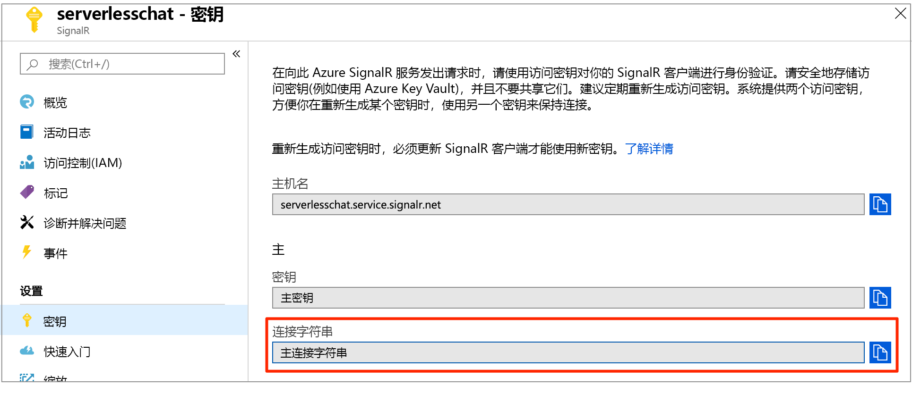

# <a name="quickstart-use-javascript-to-create-a-chat-room-with-azure-functions-and-signalr-service"></a>快速入门：通过 JavaScript 使用 Azure Functions 和 SignalR 服务创建聊天室

Azure SignalR 服务可让你轻松地向应用程序添加实时功能，而 Azure Functions 是一个无服务器平台，可让你无需管理任何基础结构即可运行代码。 在本快速入门中，你将通过 JavaScript 使用 SignalR 服务和 Functions 构建一个无服务器的实时聊天应用程序。

## <a name="prerequisites"></a>先决条件

- 代码编辑器，如 [Visual Studio Code](https://code.visualstudio.com/)
- 具有活动订阅的 Azure 帐户。 [免费创建帐户](https://azure.microsoft.com/free/?ref=microsoft.com&utm_source=microsoft.com&utm_medium=docs&utm_campaign=visualstudio)。
- [Azure Functions Core Tools](https://github.com/Azure/azure-functions-core-tools#installing) 版本 2 或更高版本。 用于在本地运行 Azure Functions 应用。
- [Node.js](https://nodejs.org/en/download/) 版本 10.x

   > [!NOTE]
   > 这些示例应使用其他版本的 Node.js，有关详细信息，请参阅 [Azure Functions 运行时版本文档](../azure-functions/functions-versions.md#languages)。

> [!NOTE]
> 本快速入门可以在 macOS、Windows 或 Linux 上运行。

[存在问题？请告诉我们。](https://aka.ms/asrs/qsjs)

## <a name="log-in-to-azure"></a>登录 Azure

使用 Azure 帐户登录到 <https://portal.azure.com/> 的 Azure 门户。

[存在问题？请告诉我们。](https://aka.ms/asrs/qsjs)

[!INCLUDE [Create instance](includes/signalr-quickstart-create-instance.md)]

[存在问题？请告诉我们。](https://aka.ms/asrs/qsjs)

[!INCLUDE [Clone application](includes/signalr-quickstart-clone-application.md)]

[存在问题？请告诉我们。](https://aka.ms/asrs/qsjs)

## <a name="configure-and-run-the-azure-function-app"></a>配置和运行 Azure 函数应用

1. 在打开 Azure门户的浏览器中，通过在门户顶部的搜索框中搜索先前部署的 SignalR 服务实例的名称，确认该实例已成功创建。 选择该实例以将其打开。

    

1. 选择“密钥”**** 以查看 SignalR 服务实例的连接字符串。

1. 选择并复制主连接字符串。

    

1. 在代码编辑器中，打开克隆存储库中的 *src/chat/javascript* 文件夹。

1. 将 *local.settings.sample.json* 重命名为 *local.settings.json*。

1. 在 **local.settings.json** 中，将连接字符串粘贴到 **AzureSignalRConnectionString** 设置的值中。 保存文件。

1. JavaScript 函数将组织到文件夹中。 每个文件夹中有两个文件：*function.json* 定义函数中使用的绑定，*index.js* 是函数的主体。 此函数应用中有两个 HTTP 触发的函数：

    - **negotiate** - 使用 *SignalRConnectionInfo* 输入绑定生成并返回有效的连接信息。
    - **messages** - 在请求正文中接收聊天消息，并使用 *SignalR* 输出绑定将消息广播到所有连接的客户端应用程序。

1. 在终端中，确保你位于 *src/chat/javascript* 文件夹中。 运行函数应用。

    ```bash
    func start
    ```

    

[存在问题？请告诉我们。](https://aka.ms/asrs/qsjs)

[!INCLUDE [Run web application](includes/signalr-quickstart-run-web-application.md)]

[存在问题？请告诉我们。](https://aka.ms/asrs/qsjs)

[!INCLUDE [Cleanup](includes/signalr-quickstart-cleanup.md)]

[存在问题？请告诉我们。](https://aka.ms/asrs/qsjs)

## <a name="next-steps"></a>后续步骤

在本快速入门中，你在 VS Code 中生成并运行了一个实时无服务器应用程序。 接下来，详细了解如何从 VS Code 中部署 Azure Functions。

> [!div class="nextstepaction"]
> [使用 VS Code 部署 Azure Functions](/azure/developer/javascript/tutorial-vscode-serverless-node-01)

[存在问题？请告诉我们。](https://aka.ms/asrs/qsjs)
