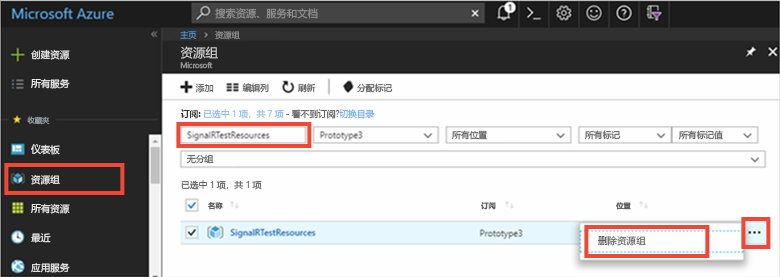

# <a name="quickstart-create-a-chat-room-with-signalr-service"></a>快速入门：使用 SignalR 服务创建聊天室

Microsoft Azure SignalR 服务目前提供[公共预览版](https://azure.microsoft.com/support/legal/preview-supplemental-terms/)。

Azure SignalR 服务是一项 Azure 服务，可帮助开发者轻松生成具有实时功能的 Web 应用程序。 此服务基于[适用于 ASP.NET Core 2.0 的 SignalR](https://docs.microsoft.com/aspnet/core/signalr/introduction)。

本文介绍如何开始使用 Azure SignalR 服务。 在本快速入门中，将使用 ASP.NET Core MVC Web 应用创建聊天应用程序。 此应用将与 Azure SignalR 服务资源建立连接，以启用实时内容更新。 将在本地托管该 Web 应用程序并与多个浏览器客户端连接。 每个客户端都可以将内容更新推送到所有其他客户端。 


可使用任何代码编辑器来完成本快速入门中的步骤。 但是，[Visual Studio Code](https://code.visualstudio.com/) 是一个很好的选项，可用于 Windows、macOS 和 Linux 平台。

本教程所用代码可在 [AzureSignalR-samples GitHub 存储库](https://github.com/aspnet/AzureSignalR-samples/tree/master/samples/ChatRoom)下载。  此外，可以使用[创建 SignalR 服务脚本](scripts/signalr-cli-create-service.md)创建此快速入门中所用的 Azure 资源。


[!INCLUDE [quickstarts-free-trial-note](../../includes/quickstarts-free-trial-note.md)]


## <a name="prerequisites"></a>先决条件

* 安装 [.NET Core SDK](https://www.microsoft.com/net/download/windows)
* 下载或克隆 [AzureSignalR-sample](https://github.com/aspnet/AzureSignalR-samples) GitHub 存储库。 

## <a name="create-an-azure-signalr-resource"></a>创建 Azure SignalR 资源

[!INCLUDE [azure-signalr-create](../../includes/signalr-create.md)]

## <a name="create-an-aspnet-core-web-app"></a>创建一个 ASP.NET Core Web 应用

在本部分中，使用 [.NET Core命令行接口 (CLI)](https://docs.microsoft.com/dotnet/core/tools/) 创建新的 ASP.NET Core MVC Web 应用项目。 通过 Visual Studio 使用 .NET Core CLI 的优点是，它可用于 Windows、macOS 和 Linux 平台。 

1. 为项目新建一个文件夹。 本快速入门使用 E:\Testing\chattest 文件夹。

2. 在新文件夹中，执行以下命令，创建新的 ASP.NET Core MVC Web 应用项目：

        dotnet new mvc


## <a name="add-secret-manager-to-the-project"></a>向项目添加机密管理器

在本部分中，将向项目添加[机密管理器工具](https://docs.microsoft.com/aspnet/core/security/app-secrets)。 机密管理器工具存储敏感数据，以便用于项目树之外的开发工作。 此方法有助于防止意外共享源代码中的应用密码。

1. 打开 .csproj 文件。 添加 `DotNetCliToolReference` 元素以包含 Microsoft.Extensions.SecretManager.Tools。 同时添加 `UserSecretsId` 元素（如下所示），并保存文件。

    chattest.csproj:

    ```xml
    <Project Sdk="Microsoft.NET.Sdk.Web">
    <PropertyGroup>
        <TargetFramework>netcoreapp2.0</TargetFramework>
        <UserSecretsId>SignalRChatRoomEx</UserSecretsId>
    </PropertyGroup>
    <ItemGroup>
        <PackageReference Include="Microsoft.AspNetCore.All" Version="2.0.0" />
    </ItemGroup>
    <ItemGroup>
        <DotNetCliToolReference Include="Microsoft.VisualStudio.Web.CodeGeneration.Tools" Version="2.0.0" />
        <DotNetCliToolReference Include="Microsoft.Extensions.SecretManager.Tools" Version="2.0.0" />
    </ItemGroup>
    </Project>    
    ```

## <a name="add-azure-signalr-to-the-web-app"></a>将 Azure SignalR 添加到 Web 应用

1. 通过执行以下命令，添加对 `Microsoft.Azure.SignalR` NuGet 包的引用：

        dotnet add package Microsoft.Azure.SignalR -v 1.0.0-*

2. 执行以下命令，还原项目包。

        dotnet restore

3. 向机密管理器添加名为“Azure: SignalR:ConnectionString”的机密。 

    此机密将包含用于访问 SignalR 服务资源的连接字符串。 Azure: SignalR:ConnectionString 是 SignalR 为建立连接而查找的默认配置密钥。 将以下命令中的值替换为 SignalR 服务资源的连接字符串。

    必须在 .csproj 文件所在的同一目录中执行此命令。

    ```
    dotnet user-secrets set Azure:SignalR:ConnectionString "Endpoint=<Your endpoint>;AccessKey=<Your access key>;"    
    ```

    机密管理器将仅用于在本地托管 Web 应用时对其进行测试。 以后的教程中会将聊天 Web 应用部署到 Azure。 将 Web 应用部署到 Azure 后，将使用应用程序设置，而不是使用机密管理器存储连接字符串。

    此机密使用配置 API 进行访问。 在所有支持的平台上，冒号 (:) 可以在配置 API 的配置名称中使用。请参阅[按环境进行的配置](https://docs.microsoft.com/aspnet/core/fundamentals/configuration/index?tabs=basicconfiguration&view=aspnetcore-2.0#configuration-by-environment)。 


4. 打开 Startup.cs，并通过调用 `services.AddSignalR().AddAzureSignalR()` 方法更新 `ConfigureServices` 方法，从而使用 Azure SignalR 服务：

    ```csharp
    public void ConfigureServices(IServiceCollection services)
    {
        services.AddMvc();
        services.AddSignalR().AddAzureSignalR();
    }
    ```

    通过不向 `AddAzureSignalR()` 传递参数，此代码使用默认配置密钥（即 Azure: SignalR:ConnectionString），作为 SignalR 服务资源连接字符串。

5. 另外，在 Startup.cs 中，通过将 `app.UseStaticFiles()` 的调用替换为以下代码，更新 `Configure` 方法并保存该文件。

    ```csharp
    app.UseFileServer();
    app.UseAzureSignalR(routes =>
    {
        routes.MapHub<Chat>("/chat");
    });
    ```            

### <a name="add-a-hub-class"></a>添加集线器类

在 SignalR 中，集线器是核心组件，用于公开一组可从客户端调用的方法。 本部分通过两种方法定义集线器类： 

* `Broadcast`：此方法向所有客户端广播消息。
* `Echo`：此方法将消息发送回调用方。

这两种方法均使用 ASP.NET Core SignalR SDK 提供的 `Clients` 接口。 通过此接口，可访问所有连接的客户端，从而能将内容推送到客户端。

1. 在项目目录中，添加名为“Hub”的新文件夹。 向该新文件夹添加名为“Chat.cs”的新集线器代码文件。

2. 将以下代码添加到 Chat.cs 以定义集线器类，并保存该文件。 

    如果使用的项目名称与 chattest 不同，请更新此类的命名空间。

    ```csharp
    using Microsoft.AspNetCore.SignalR;

    namespace chattest
    {

        public class Chat : Hub
        {
            public void BroadcastMessage(string name, string message)
            {
                Clients.All.SendAsync("broadcastMessage", name, message);
            }

            public void Echo(string name, string message)
            {
                Clients.Client(Context.ConnectionId).SendAsync("echo", name, message + " (echo from server)");
            }
        }
    }
    ```

### <a name="add-the-web-app-client-interface"></a>添加 Web 应用客户端界面

此聊天室应用的客户端用户界面将由 wwwroot 目录中名为 index.html 的文件中的 HTML 和 JavaScript 组成。

将[样本存储库](https://github.com/aspnet/AzureSignalR-samples/tree/master/samples/ChatRoom/wwwroot)的 wwwroot 文件夹中的 index.html 文件、css 文件夹和 scripts 文件夹复制到项目的 wwwroot 文件夹中。

index.html 的主代码： 

```javascript
var connection = new signalR.HubConnectionBuilder()
                            .withUrl('/chat')
                            .build();
bindConnectionMessage(connection);
connection.start()
    .then(function () {
        onConnected(connection);
    })
    .catch(function (error) {
        console.error(error.message);
    });
```    

*index.html* 中的代码调用 `HubConnectionBuilder.build()`，与 Azure SignalR 资源建立 HTTP 连接。

如果连接成功，则会将该连接传递到 `bindConnectionMessage`，这会向客户端添加传入内容推送的事件处理程序。 

`HubConnection.start()` 启动与中心之间的通信。 启动通信后，`onConnected()` 会添加按钮事件处理程序。 这些处理程序使用连接，让此客户端将内容更新推送到所有连接的客户端。

## <a name="add-a-development-runtime-profile"></a>添加开发运行时配置文件

本部分将为 ASP.NET Core 添加开发运行时环境。 有关 ASP.NET Core 的运行时环境的详细信息，请参阅[在 ASP.NET Core 中使用多个环境](https://docs.microsoft.com/aspnet/core/fundamentals/environments)。

1. 在名为“属性”的项目中新建文件夹。

2. 将包含以下内容的名为“launchSettings.json”的新文件添加到文件夹中，然后保存文件。

    ```json
    {
        "profiles" : 
        {
            "ChatRoom": 
            {
                "commandName": "Project",
                "launchBrowser": true,
                "environmentVariables": 
                {
                    "ASPNETCORE_ENVIRONMENT": "Development"
                },
                "applicationUrl": "http://localhost:5000/"
            }
        }
    }
    ```


## <a name="build-and-run-the-app-locally"></a>在本地生成并运行应用

1. 若要使用 .NET Core CLI 生成应用，请在命令行界面中执行以下命令：

        dotnet build

2. 成功完成应用生成后，执行以下命令，在本地运行 Web 应用：

        dotnet run

    根据开发运行时配置文件中的配置，该应用将在端口 5000 上本地托管：

        E:\Testing\chattest>dotnet run
        Hosting environment: Development
        Content root path: E:\Testing\chattest
        Now listening on: http://localhost:5000
        Application started. Press Ctrl+C to shut down.    

3. 启动两个浏览器窗口且均导航到 `http://localhost:5000`。 系统会提示用户输入姓名。 为两个客户端输入客户端名称，并使用“发送”按钮测试能否在两个客户端之间推送消息内容。

    


## <a name="clean-up-resources"></a>清理资源

如果还将继续下一教程，可保留此快速入门中创建的资源，并在下一教程中重复使用。

否则，如果已完成快速入门示例应用程序，则可删除此快速入门中创建的 Azure 资源，避免产生费用。 

> [!IMPORTANT]
> 删除资源组的操作不可逆，资源组以及其中的所有资源将被永久删除。 请确保不会意外删除错误的资源组或资源。 如果在现有资源组（其中包含要保留的资源）中为托管此示例而创建了相关资源，可从各自的边栏选项卡逐个删除这些资源，而不要删除资源组。
> 
> 

登录到 [Azure 门户](https://portal.azure.com)，并单击“资源组”。

在“按名称筛选...”文本框中键入资源组的名称。 本快速入门的说明使用了名为“SignalRTestResources”的资源组。 在结果列表中的资源组上，单击“...”，然后单击“删除资源组”。

   



系统会要求确认是否删除资源组。 键入资源组的名称进行确认，然后单击“删除”。
   
片刻之后，将会删除该资源组及其包含的所有资源。


## <a name="next-steps"></a>后续步骤

本快速入门中已创建新的 Azure SignalR 服务资源，并将其与 ASP.NET Core Web 应用结合使用，从而将内容更新实时推送到多个连接的客户端。 若要深入了解如何使用 Azure SignalR 服务，请继续学习下一个教程，其中将介绍如何进行身份验证。

> [!div class="nextstepaction"]
> [Azure SignalR 服务身份验证](./signalr-authenticate-oauth.md)


