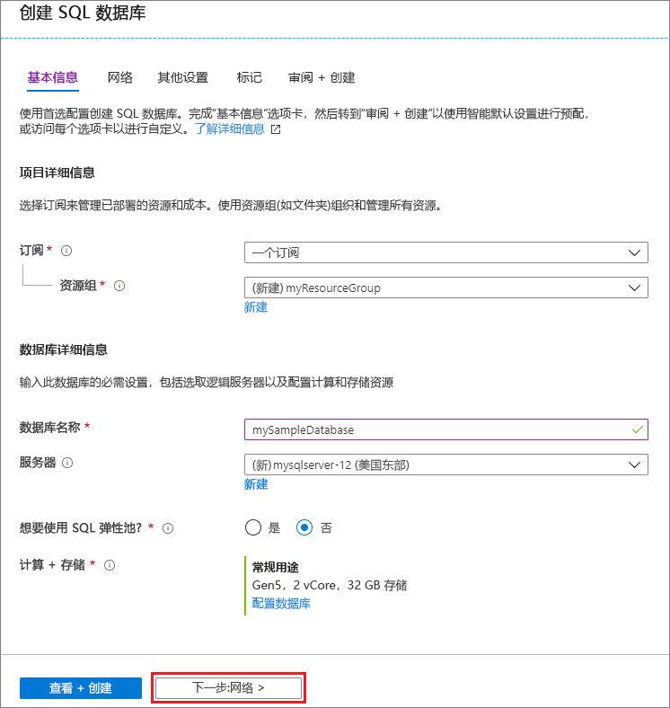
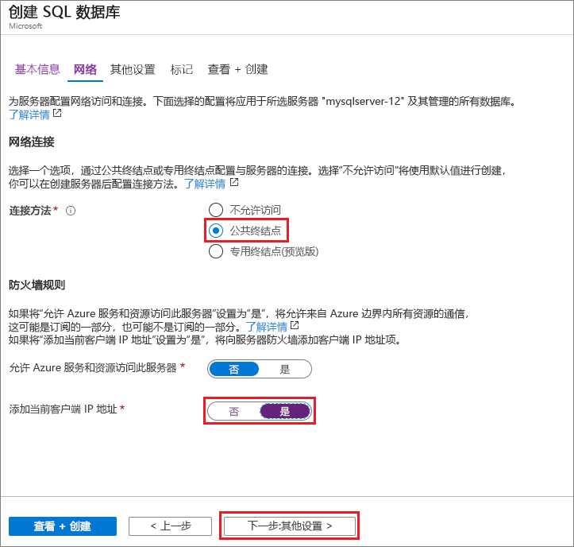
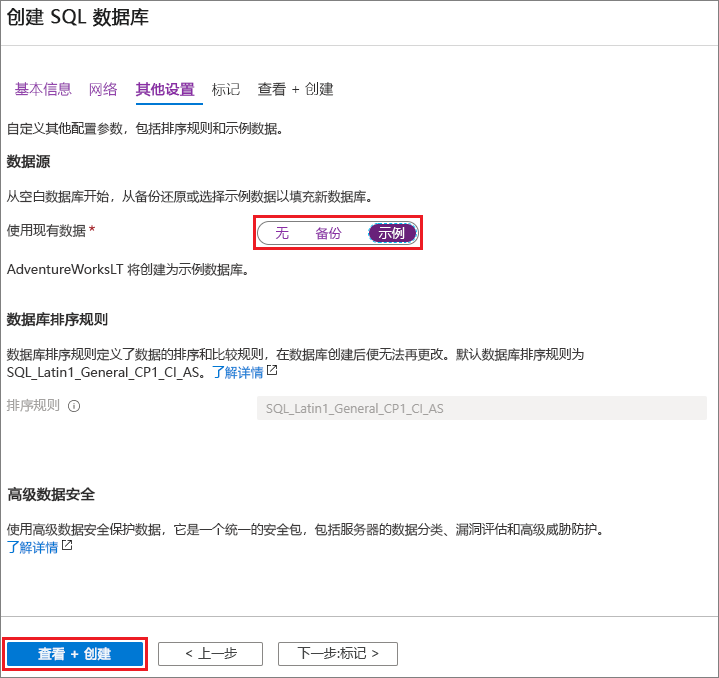

在此步骤中，你将创建[逻辑 SQL 服务器](../database/logical-servers.md)和使用 AdventureWorksLT 示例数据的[单一数据库](../database/single-database-overview.md)。 可以通过使用 Azure 门户菜单和屏幕，或通过在 Azure Cloud Shell 中使用 Azure CLI 或 PowerShell 脚本来创建数据库。

所有方法都包括设置服务器级防火墙规则，以允许用于访问服务器的计算机的公共 IP 地址。 有关创建服务器级防火墙规则的详细信息，请参阅[创建服务器级防火墙](../database/firewall-create-server-level-portal-quickstart.md)。 还可以设置数据库级防火墙规则。 请参阅[创建数据库级防火墙规则](/sql/relational-databases/system-stored-procedures/sp-set-database-firewall-rule-azure-sql-database)。

# <a name="portal"></a>[门户](#tab/azure-portal)

若要在 Azure 门户中创建资源组、服务器和单一数据库，请执行以下操作：

1. 登录[门户](https://portal.azure.com)。
1. 从搜索栏中，搜索并选择“Azure SQL”。
1. 在“Azure SQL”页上，选择“添加”。

   

1. 在“选择 SQL 部署选项”页上，选择“SQL 数据库”磁贴，其中“单一数据库”位于“资源类型”下 。 可以通过选择“显示详细信息”来查看有关不同数据库的更多信息。
1. 选择“创建”。

   

1. 在“创建 SQL 数据库”窗体的“基本信息”选项卡上的“项目详细信息”下，选择正确的 Azure订阅（如果尚未选择）。
1. 在“资源组”下选择“新建”，输入“MyResourceGroup”，然后选择“确定” 。
1. 在“数据库详细信息”下，为“数据库名称”输入“mySampleDatabase”。
1. 对于“服务器”，选择“新建”，并按如下所示在“新服务器”窗体中填写信息：
   - **服务器名称**：输入“mysqlserver”和一些字符以实现唯一性。
   - **服务器管理员登录名**：输入“azureuser”。
   - 密码：输入符合要求的密码，然后在“确认密码”字段中再次输入该密码。
   - 位置：单击下拉箭头并选择一个位置，例如“(美国)美国东部”。

   选择“确定”。

   

   请记录服务器管理员登录名和密码，以便可以登录服务器及其数据库。 如果忘记了登录名或密码，那么在数据库创建之后，可在“SQL 服务器”页上获取登录名或重置密码。 若要打开“SQL 服务器”页，请在数据库“概述”页上选择服务器名称 。

1. 在“计算 + 存储”下，若要重新配置默认值，请选择“配置数据库”。

   在“配置”页上，可以选择：
   - 将“计算层”从“预配”更改为“无服务器”。
   - 查看并更改“Vcore”和“数据最大大小”设置 。
   - 选择“更改配置”来更改硬件代系。

   进行更改后，请选择“应用”。

1. 在完成时选择“下一步:网络”。

   

1. 在“网络”选项卡上的“连接方法”下，选择“公共终结点”。
1. 在“防火墙规则”下，将“添加当前客户端 IP 地址”设置为“是”。
1. 在完成时选择“下一步:其他设置”。

   
  
   有关防火墙设置的详细信息，请参阅[允许 Azure 服务和资源访问此服务器](../database/network-access-controls-overview.md)和[添加专用终结点](../database/private-endpoint-overview.md)。

1. 在“其他设置”选项卡上的“数据源”部分中，对于“使用现有数据”，请选择“示例”。
1. 在页面底部选择“查看 + 创建”。

   

1. 查看设置后，选择“创建”。

# <a name="azure-cli"></a>[Azure CLI](#tab/azure-cli)

可以使用 Azure 命令行接口 (Azure CLI) 创建 Azure 资源组、服务器和单一数据库。 如果不想使用 Azure Cloud Shell，请在计算机上[安装 Azure CLI](/cli/azure/install-azure-cli)。

若要在 Azure Cloud Shell 中运行下面的代码示例，请选择代码示例标题栏中的“试用”。 当 Cloud Shell 打开时，选择代码示例标题栏中的“复制”，并将代码示例粘贴到 Cloud Shell 窗口中。 在代码中，将 `<Subscription ID>` 替换为你的 Azure 订阅 ID，对于 `$startip` 和 `$endip`，将 `0.0.0.0` 替换为你正在使用的计算机的公共 IP 地址。

按照屏幕上的提示登录到 Azure 并运行代码。

还可以从 Azure 门户中通过选择顶部栏中的 Cloud Shell 图标来使用 Azure Cloud Shell。

   

首次在门户中使用 Cloud Shell 时，请在“欢迎使用”对话框中选择“Bash” 。 后续会话将在 Bash 环境中使用 Azure CLI，或者你可以从 Cloud Shell 控件条中选择“Bash”。

以下 Azure CLI 代码将创建用于访问服务器的资源组、服务器、单一数据库和服务器级 IP 防火墙规则。 请确保记录生成的资源组和服务器名称，以便可以在以后管理这些资源。

```azurecli-interactive
#!/bin/bash

# Sign in to Azure and set execution context (if necessary)
az login
az account set --subscription <Subscription ID>

# Set the resource group name and location for your server
resourceGroupName=myResourceGroup-$RANDOM
location=westus2

# Set an admin login and password for your database
adminlogin=azureuser
password=Azure1234567

# Set a server name that is unique to Azure DNS (<server_name>.database.windows.net)
servername=server-$RANDOM

# Set the ip address range that can access your database
startip=0.0.0.0
endip=0.0.0.0

# Create a resource group
az group create \
    --name $resourceGroupName \
    --location $location

# Create a server in the resource group
az sql server create \
    --name $servername \
    --resource-group $resourceGroupName \
    --location $location  \
    --admin-user $adminlogin \
    --admin-password $password

# Configure a server-level firewall rule for the server
az sql server firewall-rule create \
    --resource-group $resourceGroupName \
    --server $servername \
    -n AllowYourIp \
    --start-ip-address $startip \
    --end-ip-address $endip

# Create a gen5 2 vCore database in the server
az sql db create \
    --resource-group $resourceGroupName \
    --server $servername \
    --name mySampleDatabase \
    --sample-name AdventureWorksLT \
    --edition GeneralPurpose \
    --family Gen5 \
    --capacity 2 \
```

前面的代码使用以下 Azure CLI 命令：

| Command | 说明 |
|---|---|
| [az account set](/cli/azure/account?view=azure-cli-latest#az-account-set) | 将订阅设置为当前的活动订阅。 |
| [az group create](/cli/azure/group#az-group-create) | 创建用于存储所有资源的资源组。 |
| [az sql server create](/cli/azure/sql/server#az-sql-server-create) | 创建托管数据库和弹性池的服务器。 |
| [az sql server firewall-rule create](/cli/azure/sql/server/firewall-rule##az-sql-server-firewall-rule-create) | 创建服务器级防火墙规则。 |
| [az sql db create](/cli/azure/sql/db#az-sql-db-create?view=azure-cli-latest) | 创建数据库。 |

若要查看更多 Azure SQL Database Azure CLI 示例，请参阅 [Azure CLI 示例](../database/az-cli-script-samples-content-guide.md)。

# <a name="powershell"></a>[PowerShell](#tab/azure-powershell)

可以使用 Windows PowerShell 创建资源组、服务器和单一数据库。 如果不想使用 Azure Cloud Shell，请[安装 Azure PowerShell 模块](/powershell/azure/install-az-ps)。

[!INCLUDE [updated-for-az](../../../includes/updated-for-az.md)]

若要在 Azure Cloud Shell 中运行下面的代码示例，请选择代码标题栏中的“试用”。 当 Cloud Shell 打开时，选择代码示例标题栏中的“复制”，并将代码示例粘贴到 Cloud Shell 窗口中。 在代码中，将 `<Subscription ID>` 替换为你的 Azure 订阅 ID，对于 `$startIp` 和 `$endIp`，将 `0.0.0.0` 替换为你正在使用的计算机的公共 IP 地址。

按照屏幕上的提示登录到 Azure 并运行代码。

还可以从 Azure 门户中通过选择顶部栏中的 Cloud Shell 图标来使用 Azure Cloud Shell。

   

首次从门户中使用 Cloud Shell 时，请在“欢迎使用”对话框中选择“PowerShell” 。 后续会话将使用 PowerShell，或者你也可以从 Cloud Shell 控件条中选择它。

以下 PowerShell 代码将创建用于访问服务器的 Azure 资源组、服务器、单一数据库和防火墙规则。 请确保记录生成的资源组和服务器名称，以便可以在以后管理这些资源。

   ```powershell-interactive
   # Set variables for your server and database
   $subscriptionId = '<SubscriptionID>'
   $resourceGroupName = "myResourceGroup-$(Get-Random)"
   $location = "West US"
   $adminLogin = "azureuser"
   $password = "Azure1234567"
   $serverName = "mysqlserver-$(Get-Random)"
   $databaseName = "mySampleDatabase"

   # The ip address range that you want to allow to access your server
   $startIp = "0.0.0.0"
   $endIp = "0.0.0.0"

   # Show randomized variables
   Write-host "Resource group name is" $resourceGroupName
   Write-host "Server name is" $serverName

   # Connect to Azure
   Connect-AzAccount

   # Set subscription ID
   Set-AzContext -SubscriptionId $subscriptionId

   # Create a resource group
   Write-host "Creating resource group..."
   $resourceGroup = New-AzResourceGroup -Name $resourceGroupName -Location $location -Tag @{Owner="SQLDB-Samples"}
   $resourceGroup

   # Create a server with a system wide unique server name
   Write-host "Creating primary server..."
   $server = New-AzSqlServer -ResourceGroupName $resourceGroupName `
      -ServerName $serverName `
      -Location $location `
      -SqlAdministratorCredentials $(New-Object -TypeName System.Management.Automation.PSCredential `
      -ArgumentList $adminLogin, $(ConvertTo-SecureString -String $password -AsPlainText -Force))
   $server

   # Create a server firewall rule that allows access from the specified IP range
   Write-host "Configuring firewall for primary server..."
   $serverFirewallRule = New-AzSqlServerFirewallRule -ResourceGroupName $resourceGroupName `
      -ServerName $serverName `
      -FirewallRuleName "AllowedIPs" -StartIpAddress $startIp -EndIpAddress $endIp
   $serverFirewallRule

   # Create General Purpose Gen4 database with 1 vCore
   Write-host "Creating a gen5 2 vCore database..."
   $database = New-AzSqlDatabase  -ResourceGroupName $resourceGroupName `
      -ServerName $serverName `
      -DatabaseName $databaseName `
      -Edition GeneralPurpose `
      -VCore 2 `
      -ComputeGeneration Gen5 `
      -MinimumCapacity 2 `
      -SampleName "AdventureWorksLT"
   $database
   ```

前面的代码使用以下 PowerShell 命令：

| Command | 说明 |
|---|---|
| [New-AzResourceGroup](/powershell/module/az.resources/new-azresourcegroup) | 创建用于存储所有资源的资源组。 |
| [New-AzSqlServer](/powershell/module/az.sql/new-azsqlserver) | 创建托管数据库和弹性池的服务器。 |
| [New-AzSqlServerFirewallRule](/powershell/module/az.sql/new-azsqlserverfirewallrule) | 为服务器创建服务器级防火墙规则。 |
| [New-AzSqlDatabase](/powershell/module/az.sql/new-azsqldatabase) | 创建数据库。 |

若要查看更多 Azure SQL 数据库 PowerShell 示例，请参阅 [Azure PowerShell 示例](../database/powershell-script-content-guide.md)。

---
