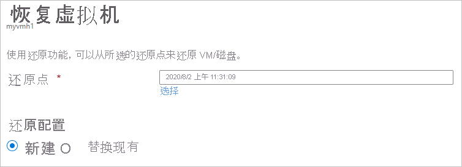
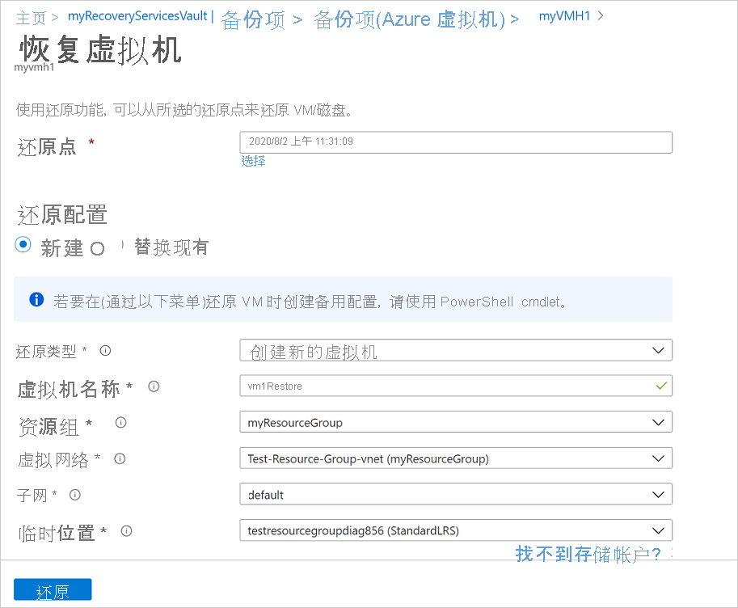
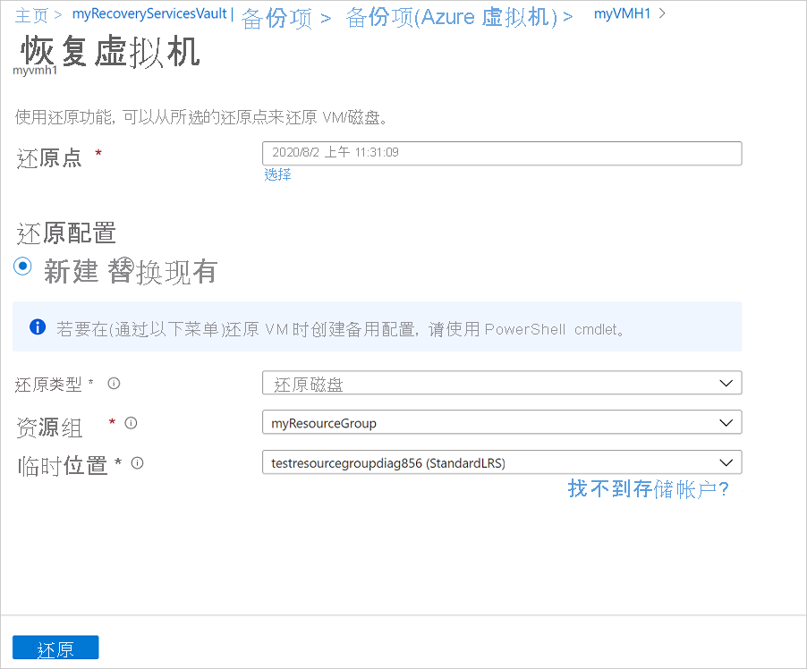
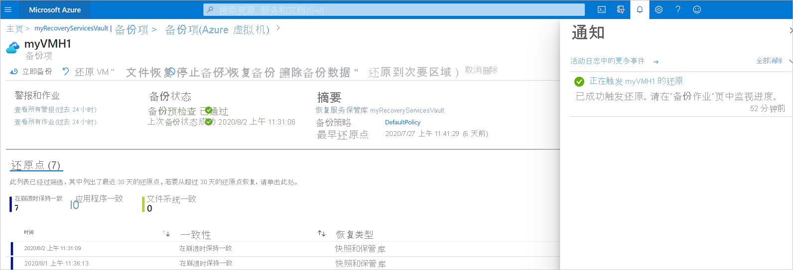

# <a name="how-to-restore-azure-vm-data-in-azure-portal"></a>如何在 Azure 门户中还原 Azure VM 数据

本文介绍如何从 [Azure 备份](backup-overview.md)恢复服务保管库中存储的恢复点还原 Azure VM 数据。

## <a name="restore-options"></a>还原选项

Azure 备份提供多种方法用于还原 VM。

**还原选项** | **详细信息**
--- | ---
**创建新的 VM** | 从还原点快速创建并正常运行一个基本的 VM。<br/><br/> 可以为 VM 指定名称，选择要将其放入的资源组和虚拟网络 (VNet)，并为还原的 VM 指定存储帐户。 新 VM 必须在源 VM 所在的区域创建。
**还原磁盘** | 还原某个 VM 磁盘，然后使用它来创建新的 VM。<br/><br/> Azure 备份提供一个模板来帮助你自定义和创建 VM。 <br/><br> 还原作业会生成一个模板，可以下载该模板，并使用它来指定自定义的 VM 设置和创建 VM。<br/><br/> 磁盘将复制到指定的资源组。<br/><br/> 或者，可将磁盘附加到现有 VM，或使用 PowerShell 创建新的 VM。<br/><br/> 若要自定义 VM、添加在备份时不存在的配置设置，或添加必须使用模板或 PowerShell 配置的设置，则此选项非常有用。
**替换现有** | 可以还原某个磁盘，并使用它来替换现有 VM 上的磁盘。<br/><br/> 必须存在当前 VM。 如果已删除此选项，则无法使用此选项。<br/><br/> Azure 备份将在替换磁盘前创建现有 VM 的快照，并将其存储在指定的暂存位置中。 连接到该 VM 的现有磁盘将替换为所选的还原点。<br/><br/> 该快照将复制到保管库，并根据保留策略予以保留。 <br/><br/> 更换磁盘操作后，原始磁盘将保留在资源组中。 如果不需要原始磁盘，可以选择手动删除它们。 <br/><br/>支持替换现有未加密的托管 VM，包括[使用自定义映像创建的](https://azure.microsoft.com/resources/videos/create-a-custom-virtual-machine-image-in-azure-resource-manager-with-powershell/)VM。 对于经典 VM，它不受支持。<br/><br/> 如果还原点中的磁盘数多于或少于当前 VM 中的磁盘数，则还原点中的磁盘数只反映 VM 配置。<br><br> 对于链接资源（如[用户分配的托管标识](https://docs.microsoft.com/azure/active-directory/managed-identities-azure-resources/overview)或[密钥保管库](https://docs.microsoft.com/azure/key-vault/key-vault-overview)），VM 不支持替换现有资源，因为在执行还原时，备份客户端应用对这些资源没有权限。
**跨区域（次要区域）** | 跨区域还原可用于还原辅助区域中的 Azure VM，辅助区域是 Azure[配对区域](https://docs.microsoft.com/azure/best-practices-availability-paired-regions#what-are-paired-regions)。<br><br> 如果备份是在辅助区域中完成的，则可以还原所选恢复点的所有 Azure VM。<br><br> 此功能可用于以下选项：<br> * [创建 VM](https://docs.microsoft.com/azure/backup/backup-azure-arm-restore-vms#create-a-vm) <br> * [还原磁盘](https://docs.microsoft.com/azure/backup/backup-azure-arm-restore-vms#restore-disks) <br><br> 我们目前不支持["替换现有磁盘"](https://docs.microsoft.com/azure/backup/backup-azure-arm-restore-vms#replace-existing-disks)选项。<br><br> 权限<br> 备份管理员和应用程序管理员可以对辅助区域执行还原操作。

> [!NOTE]
> 还可以恢复 Azure VM 上的特定文件和文件夹。 [了解详细信息](backup-azure-restore-files-from-vm.md)。

## <a name="storage-accounts"></a>存储帐户

一些有关存储帐户的详细信息：

- **创建 VM：** 创建新 VM 时，VM 将放置在指定的存储帐户中。
- **还原磁盘**：还原磁盘时，磁盘将复制到指定的存储帐户。 还原作业会生成一个模板，你可以下载该模板，并使用它来指定自定义的 VM 设置。 此模板放置于指定的存储帐户中。
- **替换磁盘**：替换现有 VM 上的磁盘时，Azure 备份在替换磁盘之前获取现有 VM 的快照。 该快照存储在指定的暂存位置（存储帐户）中。 此存储帐户用于在还原过程中临时存储快照，我们建议创建一个新帐户来执行此存储操作，该帐户随后可以被轻松删除。
- **存储帐户位置**：存储帐户必须与保管库位于同一区域。 仅显示这些帐户。 如果该位置中没有任何存储帐户，你需要创建一个存储帐户。
- **存储类型**：不支持 Blob 存储。
- **存储冗余**：不支持区域冗余存储 （ZRS）。 帐户的复制和冗余信息显示在帐户名之后的括号内。
- **高级存储**：
  - 在还原非高级 VM 时，高级存储帐户不受支持。
  - 在还原托管 VM 时，使用网络规则配置的高级存储帐户不受支持。

## <a name="before-you-start"></a>开始之前

若要还原 VM（创建新的 VM），请确保对“还原 VM”操作具有正确的基于角色的访问控制 (RBAC) [权限](backup-rbac-rs-vault.md#mapping-backup-built-in-roles-to-backup-management-actions)。

如果没有权限，则可以[还原磁盘](#restore-disks)，然后在该磁盘还原后，可以[使用模板](#use-templates-to-customize-a-restored-vm)（在执行还原操作的过程中生成）来创建新的 VM。

## <a name="select-a-restore-point"></a>选择还原点

1. 在与要还原的 VM 关联的保管库中，单击 **"备份项** > **Azure 虚拟机**"。
2. 单击某个 VM。 VM 仪表板默认会显示过去 30 天的恢复点。 可以显示 30 天以前的恢复点，或者根据日期、时间范围和不同类型的快照一致性进行筛选，以找到所需的恢复点。
3. 若要还原 VM，请单击“还原 VM”。****

    

4. 选择用于恢复的还原点。

## <a name="choose-a-vm-restore-configuration"></a>选择 VM 还原配置

1. 在“还原配置”中选择一个还原选项：****
    - **创建新**：如果要创建新 VM，请使用此选项。 可以使用简单的设置创建 VM，或还原某个磁盘并创建自定义的 VM。
    - **替换现有**：如果要替换现有 VM 上的磁盘，请使用此选项。

        

2. 为选定的还原选项指定设置。

## <a name="create-a-vm"></a>创建 VM

作为[还原选项](#restore-options)之一，你可以使用基本的设置从还原点快速创建 VM。

1. 在**还原配置** > **创建新** > **还原类型**中，选择 **"创建虚拟机**"。
2. 在**虚拟机名称**中，指定订阅中不存在的 VM。
3. 在“资源组”中，为新 VM 选择现有资源组，或创建具有全局唯一名称的新资源组****。 如果分配的名称已存在，则 Azure 将为该组分配与 VM 相同的名称。
4. 在“虚拟网络”中，选择将放置 VM 的 VNet****。 将显示与订阅关联的所有 VNet。 选择子网。 默认情况下选择第一个子网。
5. 在“存储位置”中****，为该 VM 指定存储帐户。 [了解详细信息](#storage-accounts)。

    

6. 在“还原配置”中，选择“确定”********。 在“还原”中，单击“还原”以触发还原操作********。

## <a name="restore-disks"></a>还原磁盘

作为[还原选项](#restore-options)之一，你可以从还原点快速创建磁盘。 然后可以使用该磁盘执行以下操作之一：

- 使用执行还原操作期间生成的模板来自定义设置，并触发 VM 部署。 可编辑默认模板设置，并提交 VM 部署模板。
- [将已还原的磁盘附加](https://docs.microsoft.com/azure/virtual-machines/windows/attach-managed-disk-portal)到现有 VM。
- 使用 PowerShell 从还原的磁盘[创建新 VM。](https://docs.microsoft.com/azure/backup/backup-azure-vms-automation#create-a-vm-from-restored-disks)

1. 在**还原配置** > **中 创建新** > **的还原类型**，选择**还原磁盘**。
2. 在“资源组”中，为还原的磁盘选择现有资源组，或创建具有全局唯一名称的新资源组****。
3. 在“存储帐户”中，指定要将 VHD 复制到的帐户****。 [了解详细信息](#storage-accounts)。

    

4. 在“还原配置”中，选择“确定”********。 在“还原”中，单击“还原”以触发还原操作********。

当虚拟机使用托管磁盘并选择"**创建虚拟机**"选项时，Azure 备份不使用指定的存储帐户。 在使用“还原磁盘”**** 和“即时还原”**** 时，存储帐户仅用于存储模板。 在指定的资源组中创建了托管磁盘。
当虚拟机使用非托管磁盘时，它们会以 Blob 的形式还原到存储帐户。

### <a name="use-templates-to-customize-a-restored-vm"></a>使用模板自定义还原 VM

还原磁盘后，使用执行还原操作期间生成的模板进行自定义并创建新的 VM：

1. 打开相关作业的“还原作业详细信息”。****

2. 在“还原作业详细信息”中，选择“部署模板”启动模板部署********。

    

3. 若要自定义模板中提供的 VM 设置，请单击“编辑模板”。**** 若要添加其他自定义项，请单击“编辑参数”。****
    - [详细了解](../azure-resource-manager/templates/deploy-portal.md#deploy-resources-from-custom-template)如何从自定义模板部署资源。
    - [详细了解](../azure-resource-manager/templates/template-syntax.md)如何创作模板。

   

4. 输入 VM 的自定义值，接受“条款和条件”，然后单击“购买”。********

   

## <a name="replace-existing-disks"></a>替换现有磁盘

作为[还原选项](#restore-options)之一，你可以使用选定的还原点替换现有的 VM 磁盘。 [查看](#restore-options)所有还原选项。

1. 在“还原配置”中，单击“替换现有”********。
2. 在“还原类型”中，选择“替换磁盘”。******** 这是用于替换现有 VM 磁盘的还原点。
3. 在“暂存位置”中****，指定在还原过程中应将当前托管磁盘的快照保存到的位置。 [了解详细信息](#storage-accounts)。

   

## <a name="cross-region-restore"></a>跨区域恢复

作为[还原选项](https://docs.microsoft.com/azure/backup/backup-azure-arm-restore-vms#restore-options)之一，跨区域还原 （CRR） 允许您在辅助区域（即 Azure 配对区域）中还原 Azure VM。

要在预览期间加入该功能，请阅读["开始之前"部分](https://docs.microsoft.com/azure/backup/backup-create-rs-vault#set-cross-region-restore)。

要查看是否启用了 CRR，请按照[配置跨区域还原](backup-create-rs-vault.md#configure-cross-region-restore)中的说明操作

### <a name="view-backup-items-in-secondary-region"></a>查看辅助区域中的备份项

如果启用了 CRR，则可以查看辅助区域中的备份项。

1. 从门户转到**恢复服务保管库** > **备份项目**
2. 单击 **"辅助区域**"以查看辅助区域中的项。


### <a name="restore-in-secondary-region"></a>在辅助区域中还原

辅助区域还原用户体验将类似于主区域还原用户体验。 在"还原配置"边栏选项卡中配置详细信息以配置还原时，系统将提示您仅提供辅助区域参数。


- 要还原和创建 VM，请参阅[创建 VM](https://docs.microsoft.com/azure/backup/backup-azure-arm-restore-vms#create-a-vm)。
- 要还原为磁盘，请参阅[还原磁盘](https://docs.microsoft.com/azure/backup/backup-azure-arm-restore-vms#restore-disks)。

>[!NOTE]
>触发还原并在数据传输阶段后，无法取消还原作业。

### <a name="monitoring-secondary-region-restore-jobs"></a>监视辅助区域还原作业

1. 从门户转到**恢复服务保管库** > **备份作业**
2. 单击 **"辅助区域**"以查看辅助区域中的项。


## <a name="restore-vms-with-special-configurations"></a>采用特殊配置还原 VM

在许多常见情况下，可能需要还原 VM。

**方案** | **指南**
--- | ---
**通过混合使用权益还原 VM** | 如果 Windows VM 使用[混合使用权益 (HUB) 许可](../virtual-machines/windows/hybrid-use-benefit-licensing.md)，请还原磁盘，并使用提供的模板（将“许可证类型”设置为“Windows_Server”）或 PowerShell 创建新的 VM。********  创建 VM 后也可以应用此设置。
**在发生 Azure 数据中心灾难期间还原 VM** | 如果保管库使用 GRS 并且 VM 的主数据中心出现故障，Azure 备份支持将已备份的 VM 还原到配对的数据中心。 在配对的数据中心选择一个存储帐户，然后像平时一样进行还原。 Azure 备份使用配对区域中的计算服务来创建已还原的 VM。 [详细了解](../resiliency/resiliency-technical-guidance-recovery-loss-azure-region.md)数据中心复原能力。
**还原单个域中的单个域控制器 VM** | 像还原其他任何 VM 一样还原该 VM。 请注意：<br/><br/> 从 Active Directory 的角度来看，Azure VM 与任何其他 VM 类似。<br/><br/> 还可使用目录服务还原模式 (DSRM)，因此所有 Active Directory 恢复方案都是可行的。 [详细了解](https://docs.microsoft.com/azure/backup/backup-azure-arm-restore-vms#post-restore-steps)虚拟化域控制器的备份和还原注意事项。
**还原单一域中的多个域控制器 VM** | 如果可以通过网络访问同一个域中的其他域控制器，则可以像还原任何 VM 一样还原域控制器。 对于域中剩余的最后一个域控制器，或者在隔离的网络中执行恢复，请使用[林恢复](https://docs.microsoft.com/windows-server/identity/ad-ds/manage/ad-forest-recovery-single-domain-in-multidomain-recovery)。
**还原一个林中的多个域** | 建议使用[林恢复](https://docs.microsoft.com/windows-server/identity/ad-ds/manage/ad-forest-recovery-single-domain-in-multidomain-recovery)。
**裸机还原** | Azure VM 与本地虚拟机监控程序之间的主要差别是 Azure 中不提供 VM 控制台。 某些方案（如使用裸机恢复 (BMR) 类型备份进行恢复）需要控制台。 但是，通过保管库进行 VM 还原完全取代了 BMR。
**还原采用特殊网络配置的 VM** | 特殊网络配置包括使用内部或外部负载均衡、使用多个 NIC 或多个保留 IP 地址的 VM。 可使用[还原磁盘选项](#restore-disks)还原这些 VM。 此选项将 VHD 的副本复制到指定的存储帐户中，然后您可以根据您的配置创建具有[内部](https://azure.microsoft.com/documentation/articles/load-balancer-internal-getstarted/)或[外部](/azure/load-balancer/quickstart-create-standard-load-balancer-powershell)负载均衡器、[多个 NICS](../virtual-machines/windows/multiple-nics.md)或[多个保留 IP 地址的](../virtual-network/virtual-network-multiple-ip-addresses-powershell.md)VM。
**NIC/子网上的网络安全组 （NSG）** | Azure VM 备份支持在 VNet、子网和 NIC 级别备份和还原 NSG 信息。
**区域固定的 VM** | Azure Backup 支持备份和还原区域固定的 VM。 [了解更多信息](https://azure.microsoft.com/global-infrastructure/availability-zones/)

## <a name="track-the-restore-operation"></a>跟踪还原操作

触发还原操作后，备份服务会创建一个作业用于跟踪。 Azure 备份在门户中显示有关作业的通知。 如果未显示通知，请选择“通知”符号，然后选择“查看所有作业”，此时即可看到“还原过程状态”。********



 按如下所述跟踪还原：

1. 若要查看针对作业的操作，请单击通知超链接。 或者，在保管库中单击“备份作业”，然后单击相关的 VM。****

    

2. 若要监视还原进度，请单击状态为“正在进行”的任何还原作业。**** 此时会出现进度栏，其中显示了有关还原进度的信息：

    - **估计还原时间**：最初提供完成还原操作所需要时间。 随着操作的不断进行，该时间会不断减少，还原操作完成后，将显示为 0。
    - **还原百分比**。 显示还原操作的完成百分比。
    - **传输的字节数**：如果您通过创建新 VM 进行还原，则显示根据要传输的字节总数传输的字节数。

## <a name="post-restore-steps"></a>还原后的步骤

还原 VM 之后，还需要注意一些事项：

- 将安装备份配置期间存在的扩展，但不会启用这些扩展。 如果出现问题，请重新安装这些扩展。
- 如果备份的 VM 使用了静态 IP 地址，则还原的 VM 将使用动态 IP 地址，以避免冲突。 可[将静态 IP 地址添加到还原的 VM](https://docs.microsoft.com/powershell/module/az.network/set-aznetworkinterfaceipconfig?view=azps-3.5.0#description)。
- 还原的 VM 没有可用性集。 如果使用了还原磁盘选项，则使用提供的模板或 PowerShell 从磁盘创建 VM 时，可以[指定可用性集](../virtual-machines/windows/tutorial-availability-sets.md)。
- 如果使用基于 cloud-init 的 Linux 分发版（例如 Ubuntu），出于安全原因，还原后将阻止密码。 请在还原的 VM 上使用 VMAccess 扩展 [重置密码](../virtual-machines/linux/reset-password.md)。 我们建议在这些分发版中使用 SSH 密钥，这样，在还原后就无需重置密码。
- 如果在还原后因 VM 与域控制器的关系被破坏而无法访问 VM，请按以下步骤操作，以便启动 VM：
  - 将 OS 磁盘作为数据磁盘附加到恢复的 VM。
  - 如果发现 Azure 代理无响应，请按此[链接](https://docs.microsoft.com/azure/virtual-machines/troubleshooting/install-vm-agent-offline)的要求手动安装 VM 代理。
  - 在 VM 上启用串行控制台访问，以允许命令行访问 VM

  ```cmd
    bcdedit /store <drive letter>:\boot\bcd /enum
    bcdedit /store <VOLUME LETTER WHERE THE BCD FOLDER IS>:\boot\bcd /set {bootmgr} displaybootmenu yes
    bcdedit /store <VOLUME LETTER WHERE THE BCD FOLDER IS>:\boot\bcd /set {bootmgr} timeout 5
    bcdedit /store <VOLUME LETTER WHERE THE BCD FOLDER IS>:\boot\bcd /set {bootmgr} bootems yes
    bcdedit /store <VOLUME LETTER WHERE THE BCD FOLDER IS>:\boot\bcd /ems {<<BOOT LOADER IDENTIFIER>>} ON
    bcdedit /store <VOLUME LETTER WHERE THE BCD FOLDER IS>:\boot\bcd /emssettings EMSPORT:1 EMSBAUDRATE:115200
    ```

  - 重新生成 VM 后，请通过 Azure 门户重置本地管理员帐户和密码
  - 使用串行控制台访问和 CMD，使 VM 从域中脱离

    ```cmd
    cmd /c "netdom remove <<MachineName>> /domain:<<DomainName>> /userD:<<DomainAdminhere>> /passwordD:<<PasswordHere>> /reboot:10 /Force"
    ```

- VM 脱离并重启后，即可使用本地管理员凭据成功地通过 RDP 连接到 VM，并将 VM 成功地重新加入域。

## <a name="backing-up-restored-vms"></a>备份已还原的 VM

- 如果将 VM 还原到了与最初备份 VM 时所在的资源组同名的资源组，则还原之后，会继续备份该 VM。
- 如果将 VM 还原到了其他资源组或者为还原的 VM 指定了其他名称，则需要为还原的 VM 设置备份。

## <a name="next-steps"></a>后续步骤

- 如果在还原过程中遇到难题，请[查看](backup-azure-vms-troubleshoot.md#restore)常见问题和错误。
- 还原 VM 后，请了解如何[管理虚拟机](backup-azure-manage-vms.md)
