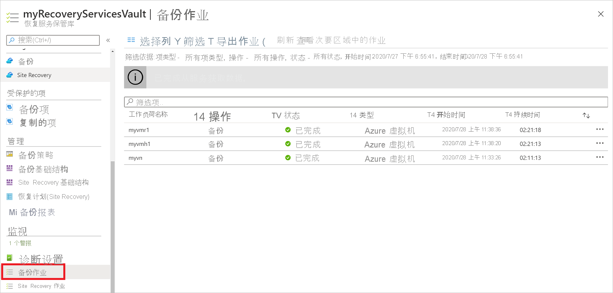
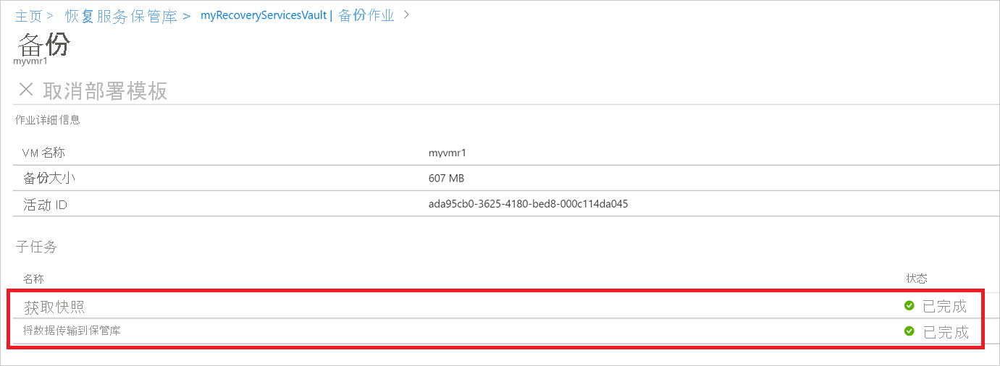

# 将 Azure VM 备份到恢复服务保管库中

本文介绍如何使用 [Azure 备份](backup-overview.md)服务将 Azure VM 备份到恢复服务保管库中。

在本文中，学习如何：

> [!div class="checklist"]
>
> * 准备 Azure VM。
> * 创建保管库。
> * 发现 VM 并配置备份策略。
> * 为 Azure VM 启用备份。
> * 运行初始备份。

> [!NOTE]
> 本文介绍如何设置保管库并选择要备份的 VM。 若要备份多个 VM，则本文的内容会有所帮助。 或者，可以直接从 VM 设置[备份单个 Azure VM](backup-azure-vms-first-look-arm.md)。

## 开始之前

* [查看](backup-architecture.md#architecture-built-in-azure-vm-backup) Azure VM 备份体系结构。
* [了解](backup-azure-vms-introduction.md) Azure VM 备份和备份扩展。
* 在配置备份之前，[查看支持矩阵](backup-support-matrix-iaas.md)。

此外，在某些情况下，可能需要执行以下几个操作：

* 在 VM 上安装 VM 代理：Azure 备份通过为在计算机上运行的 Azure VM 代理安装一个扩展来备份 Azure VM。 如果 VM 是根据 Azure 市场映像创建的，则代理将安装并运行。 如果创建自定义 VM，或迁移本地计算机，则可能需要[手动安装代理](#install-the-vm-agent)。

[!INCLUDE [How to create a Recovery Services vault](../../includes/backup-create-rs-vault.md)]

### 修改存储复制

默认情况下，保管库使用[异地冗余存储 (GRS)](../storage/common/storage-redundancy.md#geo-redundant-storage)。

* 如果保管库是你的主要备份机制，则建议使用 GRS。
* 可以使用 [本地冗余存储 (LRS) ](../storage/common/storage-redundancy.md#locally-redundant-storage) ，以提供更便宜的选项。
* [区域冗余存储 (ZRS) ](../storage/common/storage-redundancy.md#zone-redundant-storage) 在 [可用性区域](https://docs.microsoft.com/azure/availability-zones/az-overview#availability-zones)中复制数据，从而在同一区域中保证数据的驻留和复原能力。

按如下所示修改存储复制类型：

1. 在新保管库中，选择 "**设置**" 部分中的 "**属性**"。
2. 在 " **属性**" 中的 " **备份配置**" 下，选择 " **更新**"。
3. 选择存储复制类型，然后选择“保存”。

      

> [!NOTE]
   > 保管库已设置并包含备份项后，无法修改存储复制类型。 如果要执行此操作，则需要重新创建保管库。

## 应用备份策略

为保管库配置备份策略。

1. 在保管库中，选择 "**概述**" 部分中的 " **+ 备份**"。

   

1. 在“备份目标” > “你的工作负荷在哪里运行?”中，选择“Azure”。   在“要备份哪些内容?”中，选择“虚拟机” >  “确定”。   这会在保管库中注册 VM 扩展。

   

1. 在“备份策略”中，选择要与保管库关联的策略。
    * 默认策略每天备份一次 VM。 每日备份保留 30 天。 即时恢复快照保留两天。

      

    * 如果不想使用默认策略，请选择“新建”，然后按照下一过程中所述创建自定义策略。

1. 在“虚拟机”下，选择“添加”。

      

1. 将打开“选择虚拟机”窗格。 使用策略选择要备份的 Vm。 然后选择“确定”。 

   * 随后将验证选定的 VM。
   * 只能选择与保管库位于同一区域中的 VM。
   * 只能在单个保管库中备份 VM。

     

    >[!NOTE]
    > 与保管库位于同一区域和订阅中的所有 Vm 都可用于配置备份。 配置备份时，你可以浏览到虚拟机名称及其资源组，即使你对这些 Vm 没有所需的权限。 如果 VM 处于软删除状态，则在此列表中不可见。 如果需要重新保护 VM，则需要等待软删除周期过期或从软删除列表中删除 VM。 有关详细信息，请参阅 [适用于 vm 的软删除文章](soft-delete-virtual-machines.md#soft-delete-for-vms-using-azure-portal)。

1. 在“备份”中，选择“启用备份”。  这会将策略部署到保管库和 VM，并在 Azure VM 上运行的 VM 代理中安装备份扩展。

启用备份后：

* 无论 VM 是否在运行，备份服务都会安装备份扩展。
* 初始备份将根据备份计划运行。
* 运行备份时，请注意：
  * 正在运行的 VM 具有捕获应用程序一致恢复点的最大机会。
  * 但是，即使 VM 已关闭，也会进行备份。 此类 VM 称为脱机 VM。 在这种情况下，恢复点将是崩溃一致性恢复点。
* 若要备份 Azure Vm，无需显式出站连接。

### 创建自定义策略

如果选择了创建新备份策略，请填写策略设置。

1. 在“策略名称”中，指定一个有意义的名称。
2. 在“备份计划”中，指定应何时进行备份。 可以对 Azure VM 执行每日或每周备份。
3. 在“即时还原”中，指定要在本地保留快照以进行即时还原的时间长度。
    * 还原时，已备份的 VM 磁盘将通过网络从存储复制到恢复存储位置。 使用即时还原，你可以利用在备份作业期间拍摄的本地存储的快照，而无需等待备份数据传输到保管库。
    * 可以将快照保留 1 到 5 天以进行即时还原。 默认设置是 2 天。
4. 在“保留范围”中，指定要保留每日或每周备份点的时间长度。
5. 对于每 **月备份点** 和每 **年备份点的保留**期，请指定是否要保留每月或每年备份的每月或每年备份。
6. 选择 **"确定"** 保存策略。

    

> [!NOTE]
   > Azure 备份不支持根据 Azure VM 备份的夏令时时差自动调整时钟。 随着时间的推移，根据需要手动修改备份策略。

## 触发初始备份

初始备份将根据计划运行，但可以按如下所示立即运行：

1. 在保管库菜单中，选择 " **备份项**"。
2. 在 " **备份项目**" 中，选择 " **Azure 虚拟机**"。
3. 在 " **备份项** " 列表中，选择省略号 ( ") "。
4. 选择 " **立即备份**"。
5. 在“立即备份”中，使用日历控件选择恢复点的最后保留日期。 然后选择“确定”。 
6. 监视门户通知。 可以在保管库仪表板 >“备份作业” > “进行中”监视作业进度。  创建初始备份可能需要一些时间，具体取决于 VM 的大小。

## 验证备份作业状态

每个 VM 备份的备份作业详细信息包括两个阶段，先是“快照”阶段，然后是“将数据传输到保管库”阶段 。 
“快照”阶段可保证与磁盘一起存储的恢复点的可用性以进行即时还原，并且最多可以使用 5 天，具体取决于用户配置的快照保留期。 “将数据传输到保管库”阶段会在保管库中创建恢复点以实现长期保留。 仅在“快照”阶段完成后，才会开始“将数据传输到保管库”阶段。

  

后端上运行了两 **个子任务** ，一项用于前端备份作业，可以在 " **备份作业** 详细信息" 窗格中检查这些任务，如下所示：

  

“将数据传输到保管库”阶段可能需要数天才能完成，具体取决于磁盘的大小、每个磁盘的变动率和若干其他因素。

作业状态可能因以下情况而有所不同：

**快照** | 将数据传输到保管库 | **作业状态**
--- | --- | ---
已完成 | 正在进行 | 正在进行
已完成 | 已跳过 | 已完成
已完成 | 已完成 | 已完成
已完成 | 失败 | 已完成，但出现警告
失败 | 失败 | 失败

现在借助此功能，对于同一 VM，两个备份可以并行运行，但在任一阶段（快照、将数据传输到保管库）中，只有一个子任务可以运行。 因此，在正在进行的备份作业导致第二天的备份失败时，这种分离功能将避免这种情况。 后续几天的备份可以完成快照，而如果之前的备份作业正在进行状态，则会跳过将 **数据传输到保管库** 的过程。
在保管库中创建的增量恢复点将捕获保管库中创建的最近恢复点的所有改动。 用户不会对用户造成任何影响。

## 可选步骤

### 安装 VM 代理

Azure 备份通过为在计算机上运行的 Azure VM 代理安装一个扩展来备份 Azure VM。 如果 VM 是根据 Azure 市场映像创建的，则代理将安装并运行。 如果创建自定义 VM，或迁移本地计算机，则可能需要手动安装代理，如下表中所示。

**VM** | **详细信息**
--- | ---
**Windows** | 1.[下载并安装](https://go.microsoft.com/fwlink/?LinkID=394789&clcid=0x409)代理 MSI 文件。   2.使用管理员权限在计算机上进行安装。   3.验证安装。 在 VM 上的 C:\WindowsAzure\Packages 中，右键单击“WaAppAgent.exe” > “属性” 。 在“详细信息”选项卡上，“产品版本”应为 2.6.1198.718 或更高。    如果要更新代理，请确保没有备份操作正在运行，并[重新安装代理](https://go.microsoft.com/fwlink/?LinkID=394789&clcid=0x409)。
**Linux** | 使用发行版的包存储库中的 RPM 或 DEB 包进行安装。 这是安装和升级 Azure Linux 代理的首选方法。 所有[认可的分发版提供商](../virtual-machines/linux/endorsed-distros.md)会将 Azure Linux 代理包集成到其映像和存储库。 [GitHub](https://github.com/Azure/WALinuxAgent) 上提供了该代理，但我们不建议从此处安装。   如果要更新代理，请确保没有备份操作正在运行，并更新二进制文件。

## 后续步骤

* 排查 [Azure VM 代理](backup-azure-troubleshoot-vm-backup-fails-snapshot-timeout.md)或 [Azure VM 备份](backup-azure-vms-troubleshoot.md)出现的任何问题。
* [还原](backup-azure-arm-restore-vms.md) Azure VM。
