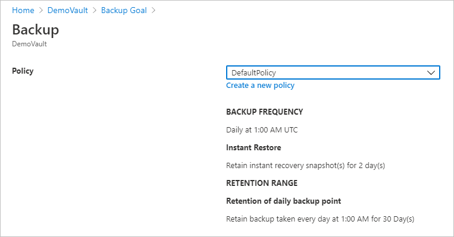
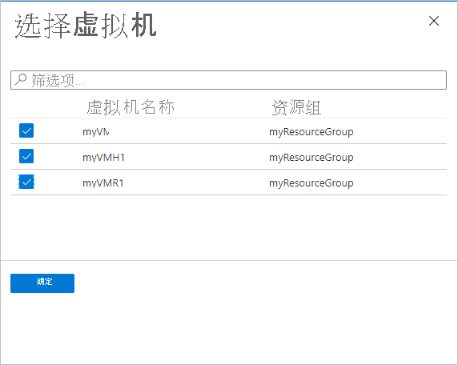

# 将 Azure VM 备份到恢复服务保管库中

本文介绍如何使用 [Azure 备份](backup-overview.md)服务将 Azure VM 备份到恢复服务保管库中。

在本文中，学习如何：

> [!div class="checklist"]
>
> * 准备 Azure VM。
> * 创建保管库。
> * 发现 VM 并配置备份策略。
> * 为 Azure VM 启用备份。
> * 运行初始备份。

> [!NOTE]
> 本文将会介绍如何设置保管库以及选择要备份的 VM。 若要备份多个 VM，则本文的内容会有所帮助。 或者，可以直接从 VM 设置[备份单个 Azure VM](backup-azure-vms-first-look-arm.md)。

## 开始之前

* [查看](backup-architecture.md#architecture-built-in-azure-vm-backup) Azure VM 备份体系结构。
* [了解](backup-azure-vms-introduction.md) Azure VM 备份和备份扩展。
* 在配置备份之前，请[查看支持矩阵](backup-support-matrix-iaas.md)。

此外，在某些情况下，还需要完成几项操作：

* 在**vm 上安装 vm 代理**： azure 备份通过将扩展安装到在计算机上运行的 Azure VM 代理来备份 azure vm。 如果 VM 是从 Azure 市场映像创建的，则代理已安装并正在运行。 如果创建了自定义 VM 或者迁移了本地计算机，则可能需要[手动安装代理](#install-the-vm-agent)。

## 创建保管库

 保管库可以存储备份以及在不同时间创建的恢复点，并可以存储与备份的计算机相关联的备份策略。 按如下所述创建保管库：

1. 登录 [Azure 门户](https://portal.azure.com/)。
2. 在搜索框中键入“恢复服务”。**** 在“服务”下，单击“恢复服务保管库”********。

     

3. 在“恢复服务保管库”菜单中，单击“+添加”********。

     

4. 在“恢复服务保管库”中，键入一个易记名称用于标识保管库。****
    * 名称对于 Azure 订阅需要是唯一的。
    * 该名称可以包含 2 到 50 个字符。
    * 名称必须以字母开头，只能包含字母、数字和连字符。
5. 选择要在其中创建保管库的 Azure 订阅、资源组和地理区域。 然后单击“创建”****。
    * 创建保管库可能需要一段时间。
    * 可以在门户的右上区域中监视状态通知。

创建保管库后，它会显示在恢复服务保管库列表中。 如果未看到创建的保管库，请选择“刷新”****。

>[!NOTE]
> Azure 备份现在允许自定义由 Azure 备份服务创建的资源组名称。 有关详细信息，请参阅[虚拟机的 Azure 备份资源组](backup-during-vm-creation.md#azure-backup-resource-group-for-virtual-machines)。

### 修复存储复制

默认情况下，保管库使用[异地冗余存储 (GRS)](https://docs.microsoft.com/azure/storage/common/storage-redundancy-grs)。

* 如果保管库是主要备份机制，我们建议使用 GRS。
* [本地冗余存储 (LRS)](https://docs.microsoft.com/azure/storage/common/storage-redundancy-lrs?toc=%2fazure%2fstorage%2fblobs%2ftoc.json) 的费用更低。

按如下所述修改存储复制类型：

1. 在新保管库的“设置”**** 部分单击“属性”****。
2. 在“属性”**** 中的“备份配置”**** 下，单击“更新”****。
3. 选择存储复制类型，然后单击“保存”****。

      

> [!NOTE]
   > 在保管库经过设置并且包含备份项之后，无法修改存储复制类型。 若要修改，需要重新创建保管库。

## 应用备份策略

配置保管库的备份策略。

1. 在保管库的“概述”部分，单击“+备份”********。

   

2. 在**备份目标** > 中，**你的工作负载在哪里运行？** 选择**Azure**。 在“要备份哪些内容?”中，选择“虚拟机” >  “确定”。************ 这会在保管库中注册 VM 扩展。

   

3. 在“备份策略”中，选择要与保管库关联的策略。****
    * 默认策略每天备份 VM 一次。 每日备份将保留 30 天。 即时恢复快照将保留两天。
    * 如果不想要使用默认策略，请选择“新建”，然后按下一过程中所述创建自定义策略。****

      

4. 在“选择虚拟机”中，选择要使用该策略备份的 VM。****  。

   * 随后将验证选定的 VM。
   * 只能选择与保管库位于同一区域中的 VM。
   * 只能在单个保管库中备份 VM。

     

5. 在“备份”中，单击“启用备份”。******** 这会将策略部署到保管库和 VM，并在 Azure VM 上运行的 VM 代理中安装备份扩展。

     

启用备份后：

* 无论 VM 是否在运行，备份服务都会安装备份扩展。
* 初始备份将根据备份计划运行。
* 运行备份时，请注意：
  * 正在运行的 VM 最有可能捕获应用程序一致的恢复点。
  * 但是，即使 VM 已关闭，也仍会将其备份。 此类 VM 称为脱机 VM。 在这种情况下，恢复点是崩溃一致的。
* 若要备份 Azure Vm，无需显式出站连接。

### 创建自定义策略

如果已选择创建新的备份策略，请填写策略设置。

1. 在“策略名称”中指定有意义的名称。****
2. 在“备份计划”中指定何时创建备份。**** 可为 Azure VM 创建每日或每周备份。
3. 在“即时还原”中，指定要在本地将用于即时还原的快照保留多长时间。****
    * 还原时，已备份的 VM 磁盘将通过网络从存储复制到恢复存储位置。 使用即时还原时，可以利用在执行备份作业期间创建的存储于本地的快照，而无需等待将备份数据传输到保管库。
    * 可将用于即时还原的快照保留一到五天。 默认设置为两天。
4. 在“保留期”中，指定要将每日或每周备份点保留多长时间。****
5. 在“保留每月备份点”中，指定是否要保留每日或每周备份的每月备份。****
6. 单击 **“确定”** 保存策略。

    

> [!NOTE]
   > Azure 备份不支持根据 Azure VM 备份的夏令时时差自动调整时钟。 发生时间变化时，可根据需要手动修改备份策略。

## 触发初始备份

初始备份将根据计划运行，但你可以按如下所述手动运行：

1. 在保管库菜单中，单击“备份项”****。
2. 在 "**备份项**" 中，单击 " **Azure 虚拟机**"。
3. 在 "**备份项**" 列表中，单击省略号（...）。
4. 单击“立即备份”****。
5. 在“立即备份”中，使用日历控件选择恢复点的最后保留日期****。  。
6. 监视门户通知。 你可以在保管库仪表板中监视作业进度 >**备份作业** > **正在进行中**。 创建初始备份可能需要一些时间，具体取决于 VM 的大小。

## 验证备份作业状态

对于每个 VM 备份，备份作业详细信息包含两个阶段：“快照”**** 阶段和跟随其后的“将数据传输到保管库”**** 阶段。 
“快照”阶段保证随同磁盘一起存储的恢复点可用于“即时还原”****，并且可用时间最长可达 5 天，具体视用户配置的快照保留期而定。 “将数据传输到保管库”阶段在保管库中创建一个恢复点，以实现长期保留。 仅当“快照”阶段完成后，“将数据传输到保管库”阶段才启动。

  

有两个“子任务”**** 正在后端运行，一个子任务用于前端备份作业，该备份作业可从“备份作业”详细信息边栏选项卡进行查看，如下所示****：

  

“将数据传输到保管库”**** 阶段可能需要数日才能完成，具体取决于磁盘大小、每个磁盘的改动情况以及其他若干因素。

作业状态可能因以下情况而异：

**快照** | **将数据传输到保管库** | **作业状态**
--- | --- | ---
已完成 | 正在进行 | 正在进行
已完成 | 已跳过 | 已完成
已完成 | 已完成 | 已完成
已完成 | Failed | 已完成，但出现警告
已失败 | 已失败 | Failed

现在，借助此功能，对于相同的 VM，两个备份可以并行运行，但是，无论处于哪个阶段（“快照”、“将数据传输到保管库”），都只能有一个子任务处于运行状态。 因此，对于进行中的备份作业导致了第二天备份失败的情况，就会通过此分离功能加以避免。 如果以前某天的备份作业处于正在进行的状态，那么当“将数据传输到保管库”**** 阶段已跳过时，次日的备份快照可以被完成。
在保管库中创建的增量恢复点将从在该保管库中创建的最后一个恢复点捕获所有的改动。 不会对用户产生任何成本影响。

## 可选步骤

### 安装 VM 代理

Azure 备份通过为在计算机上运行的 Azure VM 代理安装一个扩展来备份 Azure VM。 如果 VM 是从 Azure 市场映像创建的，则代理已安装并正在运行。 如果创建了自定义 VM 或者迁移了本地计算机，则可能需要根据下表中的摘要手动安装代理。

**VM** | **详细信息**
--- | ---
**Windows** | 1.[下载并安装](https://go.microsoft.com/fwlink/?LinkID=394789&clcid=0x409)代理 MSI 文件。   2. 在计算机上安装具有管理员权限。   3. 验证安装。 在 VM 上的“C:\WindowsAzure\Packages”中，右键单击“WaAppAgent.exe” >  选择“属性”。********** 在“详细信息”选项卡上，“产品版本”应为 2.6.1198.718 或更高。********   若要更新代理，请确保没有备份操作正在运行，并[重新安装代理](https://go.microsoft.com/fwlink/?LinkID=394789&clcid=0x409)。
**Linux** | 使用分发版包存储库中的 RPM 或 DEB 包安装代理。 这是安装和升级 Azure Linux 代理的首选方法。 所有[认可的分发版提供商](https://docs.microsoft.com/azure/virtual-machines/linux/endorsed-distros)会将 Azure Linux 代理包集成到其映像和存储库。 [GitHub](https://github.com/Azure/WALinuxAgent) 上提供了该代理，但我们不建议从此处安装。   若要更新代理，请确保没有备份操作正在运行，并更新二进制文件。

>[!NOTE]
> **Azure 备份现在支持使用 Azure 虚拟机备份解决方案进行选择性磁盘备份和还原。**
>
>如今，Azure 备份支持使用虚拟机备份解决方案，将 VM 中的所有磁盘（操作系统和数据）备份到一起。 使用排除磁盘功能，你可以选择从 VM 的多个数据磁盘中备份一个或多个数据磁盘。 这为备份和还原需求提供高效且经济高效的解决方案。 每个恢复点都包含备份操作中包含的磁盘数据，在还原操作过程中，您还可以使用该数据的一个子集从给定的恢复点还原。 这适用于从快照和保管库还原。
>
>**若要注册预览版，请向我们写信AskAzureBackupTeam@microsoft.com**

## 后续步骤

* 排查 [Azure VM 代理](backup-azure-troubleshoot-vm-backup-fails-snapshot-timeout.md)或 [Azure VM 备份](backup-azure-vms-troubleshoot.md)出现的任何问题。
* [还原](backup-azure-arm-restore-vms.md)Azure Vm。
