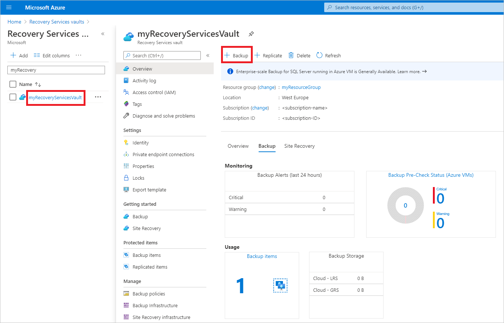

# <a name="back-up-azure-vms-in-a-recovery-services-vault"></a>将 Azure VM 备份到恢复服务保管库中

本文介绍如何使用 [Azure 备份](backup-overview.md)服务将 Azure VM 备份到恢复服务保管库中。

在本文中，学习如何：

> [!div class="checklist"]
> * 准备 Azure VM。
> * 创建保管库。
> * 发现 VM 并配置备份策略。
> * 为 Azure VM 启用备份。
> * 运行初始备份。


> [!NOTE]
> 本文将会介绍如何设置保管库以及选择要备份的 VM。 若要备份多个 VM，则本文的内容会有所帮助。 或者，可以直接从 VM 设置[备份单个 Azure VM](backup-azure-vms-first-look-arm.md)。

## <a name="before-you-start"></a>开始之前


- [查看](backup-architecture.md#architecture-direct-backup-of-azure-vms) Azure VM 备份体系结构。
- [了解](backup-azure-vms-introduction.md) Azure VM 备份和备份扩展。
- [复查支持矩阵，](backup-support-matrix-iaas.md)配置备份之前。

此外，在某些情况下，还需要完成几项操作：

- **在 VM 上安装 VM 代理**：Azure 备份通过为在计算机上运行的 Azure VM 代理安装一个扩展来备份 Azure VM。 如果 VM 是从 Azure 市场映像创建的，则代理已安装并正在运行。 如果创建了自定义 VM 或者迁移了本地计算机，则可能需要[手动安装代理](#install-the-vm-agent)。
- **显式允许出站访问**：一般情况下，无需显式允许 Azure VM 的出站网络访问即可让它与 Azure 备份进行通信。 但是，某些 VM 在尝试进行连接时可能会遇到连接问题并显示 **ExtensionSnapshotFailedNoNetwork** 错误。 如果发生这种情况，应该[显式允许出站访问](#explicitly-allow-outbound-access)，使 Azure 备份扩展能够与备份流量的 Azure 公共 IP 地址通信。


## <a name="create-a-vault"></a>创建保管库

 保管库可以存储备份以及在不同时间创建的恢复点，并可以存储与备份的计算机相关联的备份策略。 按如下所述创建保管库：

1. 登录到 [Azure 门户](https://portal.azure.com/)。
2. 在搜索框中键入“恢复服务”。  在“服务”下，单击“恢复服务保管库”   。

      <br/>

3. 在“恢复服务保管库”菜单中，单击“+添加”   。

     

4. 在“恢复服务保管库”中，键入一个易记名称用于标识保管库。 
    - 名称对于 Azure 订阅需要是唯一的。
    - 该名称可以包含 2 到 50 个字符。
    - 名称必须以字母开头，只能包含字母、数字和连字符。
5. 选择要在其中创建保管库的 Azure 订阅、资源组和地理区域。 然后单击“创建”  。
    - 创建保管库可能需要一段时间。
    - 可以在门户的右上区域中监视状态通知。


 创建保管库后，它会显示在恢复服务保管库列表中。 如果未看到创建的保管库，请选择“刷新”  。


> [!NOTE]
> Azure 备份服务创建单独的资源组 （而不是 VM 资源组） 来存储快照，使用的命名格式**AzureBackupRG_geography_number** (示例：AzureBackupRG_northeurope_1）。 此资源组中的数据将保留以天为单位中指定的持续时间*保留即时恢复快照*部分中的 Azure 虚拟机备份策略。  对此资源组应用锁可能会导致备份失败。

### <a name="modify-storage-replication"></a>修复存储复制

默认情况下，保管库使用[异地冗余存储 (GRS)](https://docs.microsoft.com/azure/storage/common/storage-redundancy-grs)。

- 如果保管库是主要备份机制，我们建议使用 GRS。
- [本地冗余存储 (LRS)](https://docs.microsoft.com/azure/storage/common/storage-redundancy-lrs?toc=%2fazure%2fstorage%2fblobs%2ftoc.json) 的费用更低。

按如下所述修改存储复制类型：

1. 在新保管库的“设置”  部分单击“属性”  。
2. 在“属性”  中的“备份配置”  下，单击“更新”  。
3. 选择存储复制类型，然后单击“保存”  。

      
> [!NOTE]
   > 在保管库经过设置并且包含备份项之后，无法修改存储复制类型。 若要修改，需要重新创建保管库。

## <a name="apply-a-backup-policy"></a>应用备份策略

配置保管库的备份策略。

1. 在保管库的“概述”部分，单击“+备份”   。

   


2. 在“备份目标” > “工作负荷在哪里运行?”中，选择“Azure”。    在“要备份哪些内容?”中，选择“虚拟机” >  “确定”。    这会在保管库中注册 VM 扩展。

   

3. 在“备份策略”中，选择要与保管库关联的策略。 
    - 默认策略每天备份 VM 一次。 每日备份将保留 30 天。 即时恢复快照将保留两天。
    - 如果不想要使用默认策略，请选择“新建”，然后按下一过程中所述创建自定义策略。 

      

4. 在“选择虚拟机”中，选择要使用该策略备份的 VM。  然后单击“确定”  。

   - 随后将验证选定的 VM。
   - 只能选择与保管库位于同一区域中的 VM。
   - 只能在单个保管库中备份 VM。

     

5. 在“备份”中，单击“启用备份”。   这会将策略部署到保管库和 VM，并在 Azure VM 上运行的 VM 代理中安装备份扩展。

     

启用备份后：

- 无论 VM 是否在运行，备份服务都会安装备份扩展。
- 初始备份将根据备份计划运行。
- 运行备份时，请注意：
    - 正在运行的 VM 最有可能捕获应用程序一致的恢复点。
    - 但是，即使 VM 已关闭，也仍会将其备份。 此类 VM 称为脱机 VM。 在这种情况下，恢复点是崩溃一致的。


### <a name="create-a-custom-policy"></a>创建自定义策略

如果已选择创建新的备份策略，请填写策略设置。

1. 在“策略名称”中指定有意义的名称。 
2. 在“备份计划”中指定何时创建备份。  可为 Azure VM 创建每日或每周备份。
2. 在“即时还原”中，指定要在本地将用于即时还原的快照保留多长时间。 
    - 还原时，已备份的 VM 磁盘将通过网络从存储复制到恢复存储位置。 使用即时还原时，可以利用在执行备份作业期间创建的存储于本地的快照，而无需等待将备份数据传输到保管库。
    - 可将用于即时还原的快照保留一到五天。 默认设置为两天。
3. 在“保留期”中，指定要将每日或每周备份点保留多长时间。 
4. 在“保留每月备份点”中，指定是否要保留每日或每周备份的每月备份。 
5. 单击“确定”  保存策略。

    

> [!NOTE]
   > Azure 备份不支持根据 Azure VM 备份的夏令时时差自动调整时钟。 发生时间变化时，可根据需要手动修改备份策略。

## <a name="trigger-the-initial-backup"></a>触发初始备份

初始备份将根据计划运行，但你可以按如下所述手动运行：

1. 在保管库菜单中，单击“备份项”  。
2. 在“备份项”  中，单击“Azure 虚拟机”  。
3. 在“备份项”  列表中，单击省略号 (...)。
4. 单击“立即备份”  。
5. 在“立即备份”中，使用日历控件选择恢复点的最后保留日期  。 然后单击“确定”  。
6. 监视门户通知。 可以在保管库仪表板 >“备份作业” > “进行中”监视作业进度。   创建初始备份可能需要一些时间，具体取决于 VM 的大小。

## <a name="verify-backup-job-status"></a>验证备份作业状态

备份作业详细信息中的 2 个阶段，包括每个 VM 备份**快照**阶段后跟**将数据传输到保管库**阶段。<br/>
快照阶段可保证恢复点存储在一起的磁盘的可用性**即时还原**和可用于根据用户配置的快照保留 5 天的最大值。 传输数据到保管库以进行长期保留保管库中创建一个恢复点。 将数据传输到保管库仅启动后完成的快照阶段。

  

有两个**的子任务**由后端，另一个用于前端的备份作业可以从检查运行**备份作业**详细信息边栏选项卡中与给定的相同：

  

**将数据传输到保管库**阶段可能需要好几天才能完成具体取决于磁盘的大小，每个磁盘和若干其他因素变化。

作业状态可以根据以下方案而有所不同：

**快照** | **将数据传输到保管库** | **作业状态**
--- | --- | ---
已完成 | 正在进行 | 正在进行
已完成 | 已跳过 | 已完成
已完成 | 已完成 | 已完成
已完成 | 已失败 | 已完成，但警告
已失败 | 已失败 | 已失败


现在借助此功能，对于相同的 VM 中，两个备份可以并行运行，但在任一阶段 （快照，传输数据到保管库） 中只有一个子任务可以运行。 在方案处于进行中的备份作业导致第二天的备份失败会避免使用与此分离功能。 具有快照其后一天的备份时已完成**将数据传输到保管库**跳过早一天的备份作业是否处于正在进行状态。
在保管库中创建的增量恢复点将捕获在保管库中创建的最后一个恢复点从所有改动。 用户没有任何成本影响。


## <a name="optional-steps-install-agentallow-outbound"></a>可选步骤（安装代理/允许出站访问）
### <a name="install-the-vm-agent"></a>安装 VM 代理

Azure 备份通过为在计算机上运行的 Azure VM 代理安装一个扩展来备份 Azure VM。 如果 VM 是从 Azure 市场映像创建的，则代理已安装并正在运行。 如果创建了自定义 VM 或者迁移了本地计算机，则可能需要根据下表中的摘要手动安装代理。

**VM** | **详细信息**
--- | ---
**Windows** | 1.[下载并安装](https://go.microsoft.com/fwlink/?LinkID=394789&clcid=0x409)代理 MSI 文件。<br/><br/> 2.使用管理员权限在计算机上进行安装。<br/><br/> 3.验证安装。 在 VM 上的“C:\WindowsAzure\Packages”中，右键单击“WaAppAgent.exe” >  选择“属性”。    在“详细信息”选项卡上，“产品版本”应为 2.6.1198.718 或更高。  <br/><br/> 若要更新代理，请确保没有备份操作正在运行，并[重新安装代理](https://go.microsoft.com/fwlink/?LinkID=394789&clcid=0x409)。
**Linux** | 使用分发版包存储库中的 RPM 或 DEB 包安装代理。 这是安装和升级 Azure Linux 代理的首选方法。 所有[认可的分发版提供商](https://docs.microsoft.com/azure/virtual-machines/linux/endorsed-distros)会将 Azure Linux 代理包集成到其映像和存储库。 [GitHub](https://github.com/Azure/WALinuxAgent) 上提供了该代理，但我们不建议从此处安装。<br/><br/> 若要更新代理，请确保没有备份操作正在运行，并更新二进制文件。

### <a name="explicitly-allow-outbound-access"></a>显式允许出站访问

VM 上运行的备份扩展需要对 Azure 公共 IP 地址进行出站访问。

- 一般情况下，无需显式允许 Azure VM 的出站网络访问即可让它与 Azure 备份进行通信。
- 如果 VM 连接遇到问题，或者在尝试连接时出现 **ExtensionSnapshotFailedNoNetwork** 错误，应显式允许访问，使备份扩展能够与备份流量的 Azure 公共 IP 地址通信。 下表汇总了访问方法。


**选项** | **Action** | **详细信息**
--- | --- | ---
**设置 NSG 规则** | 允许 [Azure 数据中心 IP 范围](https://www.microsoft.com/download/details.aspx?id=41653)。<br/><br/> 可以添加一个允许使用[服务标记](backup-azure-arm-vms-prepare.md#set-up-an-nsg-rule-to-allow-outbound-access-to-azure)访问 Azure 备份服务的规则，而无需允许并管理每个地址范围。 | [详细了解](../virtual-network/security-overview.md#service-tags)服务标记。<br/><br/> 服务标记可以简化访问管理，且不会产生额外的费用。
**部署代理** | 部署 HTTP 代理服务器来路由流量。 | 允许访问整个 Azure，而不只是存储。<br/><br/> 允许对存储 URL 进行精细控制。<br/><br/> 对 VM 进行单点 Internet 访问。<br/><br/> 代理不产生额外的成本。
**设置 Azure 防火墙** | 使用 Azure 备份服务的 FQDN 标记允许流量通过 VM 上的 Azure 防火墙 | 如果在 VNet 子网中设置了 Azure 防火墙，则 FQDN 标记很容易使用。<br/><br/> 无法创建自己的 FQDN 标记，无法修改标记中的 FQDN。<br/><br/> 如果 Azure VM 包含托管磁盘，则你可能需要在防火墙上额外打开一个端口 (8443)。

#### <a name="establish-network-connectivity"></a>建立网络连接

通过代理或防火墙与 NSG 建立连接

##### <a name="set-up-an-nsg-rule-to-allow-outbound-access-to-azure"></a>设置一个 NSG 规则以允许对 Azure 进行出站访问

如果对 VM 的访问由 NSG 管理，请允许通过所需的范围和端口对备份存储进行出站访问。

1. 在 VM 属性 >“网络”中，选择“添加出站端口规则”。  
2. 在“添加出站安全规则”中，选择“高级”。  
3. 在“源”中，选择“VirtualNetwork”。  
4. 在“源端口范围”中输入一个星号 (*)，以允许从任何端口进行出站访问。 
5. 在“目标”中，选择“服务标记”。   从列表中选择“Storage.region”。  区域是保管库和要备份的 VM 所在的位置。
6. 在“目标端口范围”中选择端口。 
    - 使用未加密存储帐户的非托管 VM：80
    - 使用加密存储帐户的非托管 VM：443（默认设置）
    - 托管 VM：8443。
7. 在“协议”中，选择“TCP”。  
8. 在“优先级”中，为此规则指定一个优先级值，该值必须小于任何具有更高优先级的拒绝规则。 

   如果某个规则拒绝访问，则新的允许规则的优先级必须更高。 例如，如果为 **Deny_All** 规则设置的优先级为 1000，则必须将新规则的优先级设置为 1000 以下。
9. 提供规则的名称和说明，然后选择“确定”。 

可以将 NSG 规则应用于多个 VM 来允许出站访问。 此视频可引导你完成该过程。

>[!VIDEO https://www.youtube.com/embed/1EjLQtbKm1M]


##### <a name="route-backup-traffic-through-a-proxy"></a>通过代理路由备份流量

可以通过代理路由备份流量，然后允许代理访问所需的 Azure 区域。 将代理 VM 配置为允许以下操作：

- Azure VM 应该通过代理路由所有发往公共 Internet 的 HTTP 流量。
- 代理应该允许适用虚拟网络中的 VM 传入的流量。
- NSG **NSF-lockdown** 需要使用一个规则允许来自代理 VM 的出站 Internet 流量。

###### <a name="set-up-the-proxy"></a>设置代理

如果你没有系统帐户代理，请按如下所述设置一个：

1. 下载 [PsExec](https://technet.microsoft.com/sysinternals/bb897553)。
2. 运行 **PsExec.exe -i -s cmd.exe**，以便在系统帐户下运行命令提示符。
3. 在系统上下文中运行浏览器。 例如：对于 Internet Explorer，请使用 **%PROGRAMFILES%\Internet Explorer\iexplore.exe**。  
4. 定义代理设置。
   - 在 Linux 计算机上：
     - 将以下代码行添加到 **/etc/environment** 文件：
       - **http_proxy=http:\//代理 IP 地址:代理端口**
     - 将以下代码行添加到 **/etc/waagent.conf** 文件：
         - **HttpProxy.Host=proxy IP address**
         - **HttpProxy.Port=proxy port**
   - 在 Windows 计算机上的浏览器设置中，指定要使用代理。 如果当前在用户帐户中使用代理，则可以使用此脚本在系统帐户级别应用该设置。
       ```powershell
      $obj = Get-ItemProperty -Path Registry::"HKEY_CURRENT_USER\Software\Microsoft\Windows\CurrentVersion\Internet Settings\Connections"
      Set-ItemProperty -Path Registry::"HKEY_USERS\S-1-5-18\Software\Microsoft\Windows\CurrentVersion\Internet Settings\Connections" -Name DefaultConnectionSettings -Value $obj.DefaultConnectionSettings
      Set-ItemProperty -Path Registry::"HKEY_USERS\S-1-5-18\Software\Microsoft\Windows\CurrentVersion\Internet Settings\Connections" -Name SavedLegacySettings -Value $obj.SavedLegacySettings
      $obj = Get-ItemProperty -Path Registry::"HKEY_CURRENT_USER\Software\Microsoft\Windows\CurrentVersion\Internet Settings"
      Set-ItemProperty -Path Registry::"HKEY_USERS\S-1-5-18\Software\Microsoft\Windows\CurrentVersion\Internet Settings" -Name ProxyEnable -Value $obj.ProxyEnable
      Set-ItemProperty -Path Registry::"HKEY_USERS\S-1-5-18\Software\Microsoft\Windows\CurrentVersion\Internet Settings" -Name Proxyserver -Value $obj.Proxyserver

       ```

###### <a name="allow-incoming-connections-on-the-proxy"></a>在代理上允许传入连接

在代理设置中允许传入连接。

1. 在 Windows 防火墙中，打开“高级安全 Windows 防火墙”。 
2. 右键单击“入站规则” > “新建规则”   。
3. 在“规则类型”中，选择“自定义” > “下一步”。   
4. 在“程序”中，选择“所有程序” > “下一步”。   
5. 在“协议和端口”中： 
   - 将类型设置为“TCP”。 
   - 将“本地端口”设置为“特定端口”。  
   - 将“远程端口”设置为“所有端口”。  

6. 完成向导并指定规则名称。

###### <a name="add-an-exception-rule-to-the-nsg-for-the-proxy"></a>为代理的 NSG 添加例外规则

在 NSG **NSF-lockdown** 中，允许从 10.0.0.5 上的任何端口流向端口 80 (HTTP) 或 443 (HTTPS) 上的任何 Internet 地址的流量。

下面是一个允许流量的 PowerShell 脚本示例。
如果不想要允许对所有公共 Internet 地址进行出站访问，可以指定 IP 地址范围 (`-DestinationPortRange`)，或使用 storage.region 服务标记。   

```powershell
Get-AzureNetworkSecurityGroup -Name "NSG-lockdown" |
Set-AzureNetworkSecurityRule -Name "allow-proxy " -Action Allow -Protocol TCP -Type Outbound -Priority 200 -SourceAddressPrefix "10.0.0.5/32" -SourcePortRange "*" -DestinationAddressPrefix Internet -DestinationPortRange "80-443"
```

##### <a name="allow-firewall-access-with-an-fqdn-tag"></a>使用 FQDN 标记允许通过防火墙访问

可以设置 Azure 防火墙，以允许网络流量对 Azure 备份进行出站访问。

- [了解](https://docs.microsoft.com/azure/firewall/tutorial-firewall-deploy-portal)如何部署 Azure 防火墙。
- [了解](https://docs.microsoft.com/azure/firewall/fqdn-tags) FQDN 标记。


## <a name="next-steps"></a>后续步骤

- 排查 [Azure VM 代理](backup-azure-troubleshoot-vm-backup-fails-snapshot-timeout.md)或 [Azure VM 备份](backup-azure-vms-troubleshoot.md)出现的任何问题。
- [还原](backup-azure-arm-restore-vms.md) Azure VM。
