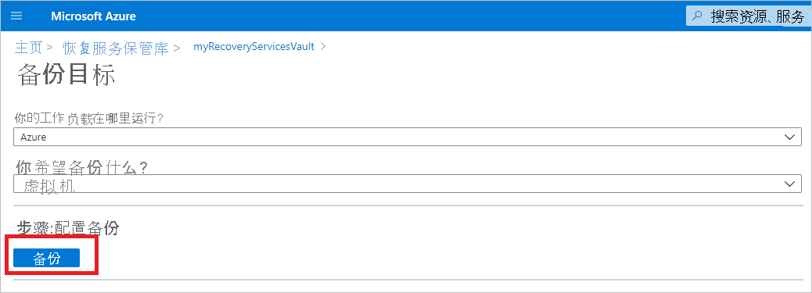

# 将 Azure VM 备份到恢复服务保管库中

本文介绍如何使用[Azure 备份](backup-overview.md)服务在恢复服务保管库中备份 azure vm。

在本文中，学习如何：

> [!div class="checklist"]
>
> * 准备 Azure VM。
> * 创建保管库。
> * 发现 Vm 并配置备份策略。
> * 为 Azure Vm 启用备份。
> * 运行初始备份。

> [!NOTE]
> 本文介绍如何设置保管库并选择要备份的 Vm。 若要备份多个 VM，则本文的内容会有所帮助。 或者，可以直接从 VM 设置[备份单个 AZURE vm](backup-azure-vms-first-look-arm.md) 。

## 开始之前

* [查看](backup-architecture.md#architecture-built-in-azure-vm-backup)Azure VM 备份体系结构。
* [了解](backup-azure-vms-introduction.md) Azure VM 备份和备份扩展。
* 在配置备份之前，请[查看支持矩阵](backup-support-matrix-iaas.md)。

此外，在某些情况下，你可能需要执行几项操作：

* 在**vm 上安装 vm 代理**： azure 备份通过将扩展安装到在计算机上运行的 Azure VM 代理来备份 azure vm。 如果 VM 是从 Azure marketplace 映像创建的，则代理已安装并正在运行。 如果创建自定义 VM，或迁移本地计算机，则可能需要[手动安装代理](#install-the-vm-agent)。

## 创建保管库

 保管库可以存储备份以及在不同时间创建的恢复点，并可以存储与备份的计算机相关联的备份策略。 按如下所述创建保管库：

1. 登录 [Azure 门户](https://portal.azure.com/)。
2. 在 "搜索" 中，键入 "**恢复服务**"。 在 "**服务**" 下，单击 "**恢复服务保管库**"。

     

3. 在**恢复服务保管库**菜单中，单击 " **+ 添加**"。

     

4. 在 "**恢复服务保管库**" 中，键入一个友好名称以标识保管库。
    * 名称对于 Azure 订阅需要是唯一的。
    * 该名称可以包含 2 到 50 个字符。
    * 名称必须以字母开头，只能包含字母、数字和连字符。
5. 选择应在其中创建保管库的 Azure 订阅、资源组和地理区域。 然后单击“创建”。
    * 创建保管库可能需要一段时间。
    * 可以在门户的右上区域中监视状态通知。

创建保管库后，它将显示在 "恢复服务保管库" 列表中。 如果未看到创建的保管库，请选择“刷新”。

>[!NOTE]
> Azure 备份现在允许自定义由 Azure 备份服务创建的资源组名称。 有关详细信息，请参阅[适用于虚拟机的 Azure 备份资源组](backup-during-vm-creation.md#azure-backup-resource-group-for-virtual-machines)。

### 修改存储复制

默认情况下，保管库使用[异地冗余存储（GRS）](https://docs.microsoft.com/azure/storage/common/storage-redundancy-grs)。

* 如果保管库是你的主要备份机制，则建议你使用 GRS。
* 可以使用[本地冗余存储（LRS）](https://docs.microsoft.com/azure/storage/common/storage-redundancy-lrs?toc=%2fazure%2fstorage%2fblobs%2ftoc.json)来获得更便宜的选项。

修改存储复制类型，如下所示：

1. 在新保管库中，单击 "**设置**" 部分中的 "**属性**"。
2. 在 "**属性**" 中的 "**备份配置**" 下，单击 "**更新**"。
3. 选择存储复制类型，然后单击 "**保存**"。

      

> [!NOTE]
   > 在设置保管库并包含备份项后，不能修改存储复制类型。 如果要执行此操作，则需要重新创建保管库。

## 应用备份策略

配置保管库的备份策略。

1. 在保管库中，单击 "**概述**" 部分中的 " **+ 备份**"。

   

2. 在**备份目标** > **工作负荷的运行位置？选择 "** **Azure**"。 在 "**要备份的内容"** 中，选择 "**虚拟机** >   **" 确定 "** 。 这会在保管库中注册 VM 扩展。

   

3. 在“备份策略”中，选择要与保管库关联的策略。
    * 默认策略每天备份一次 VM。 每日备份保留30天。 即时恢复快照保留两天。
    * 如果你不想使用默认策略，请选择 "**新建**"，然后按照下一过程中所述创建自定义策略。

      

4. 在 "**选择虚拟机**" 中，选择要使用策略备份的 vm。 然后单击“确定”。

   * 已验证所选 Vm。
   * 只能选择与保管库位于同一区域中的 VM。
   * 只能在单个保管库中备份 VM。

     

5. 在 "**备份**" 中，单击 "**启用备份**"。 这会将策略部署到保管库和 VM，并在 Azure VM 上运行的 VM 代理中安装备份扩展。

     

启用备份后：

* 无论 VM 是否在运行，备份服务都会安装备份扩展。
* 初始备份将按照备份计划运行。
* 当备份运行时，请注意：
  * 正在运行的 VM 具有捕获应用程序一致恢复点的最大机会。
  * 但是，即使 VM 已关闭，也会对其进行备份。 此类 VM 称为脱机 VM。 在这种情况下，恢复点将是崩溃一致性恢复点。
* 若要备份 Azure Vm，无需显式出站连接。

### 创建自定义策略

如果选择创建新的备份策略，请填写策略设置。

1. 在 "**策略名称**" 中，指定一个有意义的名称。
2. 在 "**备份计划**" 中，指定何时进行备份。 对于 Azure Vm，你可以执行每日或每周备份。
3. 在 "**即时还原**" 中，指定要在本地保留快照以进行即时还原的时间长度。
    * 还原时，备份的 VM 磁盘将从存储复制到整个网络，恢复存储位置。 使用即时还原，你可以利用在备份作业期间拍摄的本地存储的快照，而无需等待备份数据传输到保管库。
    * 可以保留一到五天的即时还原快照。 默认设置为两天。
4. 在 "**保持期**" 中，指定要保留每日或每周备份点的时间长度。
5. 在 "**每月备份点的保留期**" 中，指定是否要保留每月备份和每周备份。
6. 单击“确定”保存策略。

    

> [!NOTE]
   > Azure 备份不支持根据 Azure VM 备份的夏令时时差自动调整时钟。 当时间发生变化时，请根据需要手动修改备份策略。

## 触发初始备份

初始备份将按照计划运行，但你可以立即运行，如下所示：

1. 在保管库菜单中，单击“备份项”。
2. 在 "**备份项**" 中，单击 " **Azure 虚拟机**"。
3. 在 "**备份项**" 列表中，单击省略号（...）。
4. 单击“立即备份”。
5. 现在，在 "**备份**" 中使用 "日历" 控件选择应该保留恢复点的最后一天。 然后单击“确定”。
6. 监视门户通知。 可以在保管库仪表板 >“备份作业” > “进行中”监视作业进度。 创建初始备份可能需要一些时间，具体取决于 VM 的大小。

## 验证备份作业状态

每个 VM 备份的备份作业详细信息包括两个阶段：**快照**阶段，后跟 "将**数据传输到保管库**" 阶段。 
快照阶段保证与磁盘一起存储的恢复点的可用性，以便进行**即时还原**，并且最多可使用5天，具体取决于用户配置的快照保持期。 将数据传输到保管库会在保管库中创建恢复点，以实现长期保留。 仅在快照阶段完成后才会开始将数据传输到保管库。

  

后端上运行了两**个子任务**，一个用于前端备份作业，可以按如下所示从 "**备份作业**详细信息" 边栏选项卡中进行检查：

  

根据磁盘的大小、每个磁盘的变动和几个其他因素，将**数据传输到保管库**阶段可能需要数天时间才能完成。

作业状态可能因以下情况而有所不同：

**快照** | **将数据传输到保管库** | **作业状态**
--- | --- | ---
已完成 | 正在进行 | 正在进行
已完成 | 已跳过 | 已完成
已完成 | 已完成 | 已完成
已完成 | 已失败 | 已完成，但出现警告
已失败 | 已失败 | 已失败

现在，有了此功能，对于同一 VM，两个备份可以并行运行，但在任一阶段（快照、将数据传输到保管库）中，只有一个子任务可运行。 在方案中，正在进行的备份作业将通过此分离功能避免下一天的备份失败。 如果在较早的备份作业处于 "正在进行" 状态，则在将**数据传输到保管库**时，后续日期的备份可能已完成。
在保管库中创建的增量恢复点将捕获在保管库中创建的上一个恢复点的所有改动。 用户不会产生成本影响。

## 可选步骤

### 安装 VM 代理

Azure 备份通过为在计算机上运行的 Azure VM 代理安装一个扩展来备份 Azure VM。 如果 VM 是从 Azure Marketplace 映像创建的，则代理已安装并正在运行。 如果创建自定义 VM，或迁移本地计算机，则可能需要手动安装代理，如表中所述。

**VM** | **详细信息**
--- | ---
**Windows** | 1.[下载并安装](https://go.microsoft.com/fwlink/?LinkID=394789&clcid=0x409)代理 MSI 文件。   2. 在计算机上安装具有管理员权限。   3. 验证安装。 在 VM 上的*C:\WindowsAzure\Packages*中，右键单击 " **waappagent.exe** " > "**属性**"。 在 "**详细信息**" 选项卡上，**产品版本**应为2.6.1198.718 或更高版本。   如果要更新代理，请确保没有正在运行的备份操作，然后[重新安装代理](https://go.microsoft.com/fwlink/?LinkID=394789&clcid=0x409)。
**Linux** | 使用分发包存储库中的 RPM 或 DEB 包进行安装。 这是安装和升级 Azure Linux 代理的首选方法。 所有[认可的分发版提供商](https://docs.microsoft.com/azure/virtual-machines/linux/endorsed-distros)会将 Azure Linux 代理包集成到其映像和存储库。 [GitHub](https://github.com/Azure/WALinuxAgent) 上提供了该代理，但我们不建议从此处安装。   如果要更新代理，请确保没有正在运行的备份操作，并更新二进制文件。

>[!NOTE]
> Azure 备份现在支持使用 Azure 虚拟机备份解决方案进行选择性磁盘备份和还原。
>
>如今，Azure 备份支持使用虚拟机备份解决方案，将 VM 中的所有磁盘（操作系统和数据）备份到一起。 使用排除磁盘功能，你可以选择从 VM 的多个数据磁盘中备份一个或多个数据磁盘。 这为备份和还原需求提供高效且经济高效的解决方案。 每个恢复点都包含备份操作中包含的磁盘数据，在还原操作过程中，您还可以使用该数据的一个子集从给定的恢复点还原。 这适用于从快照和保管库还原。
>
> 此解决方案在以下情况下特别有用：
>  
>1. 你的关键数据只需在一个磁盘中备份，并且你不想备份其他附加到 VM 的磁盘。 这可最大程度地减少备份存储成本。  
>2. VM 数据的一部分有其他备份解决方案。 例如，使用不同的工作负荷备份解决方案来备份数据库或数据，并希望使用 Azure VM 级别备份来实现磁盘和数据的其余部分，以利用可用的最佳功能构建高效且可靠的系统。
>
>若要注册预览版，请在 AskAzureBackupTeam@microsoft.com 写信

## 后续步骤

* 排查[AZURE vm 代理](backup-azure-troubleshoot-vm-backup-fails-snapshot-timeout.md)或[azure vm 备份](backup-azure-vms-troubleshoot.md)的任何问题。
* [还原](backup-azure-arm-restore-vms.md)Azure Vm。
