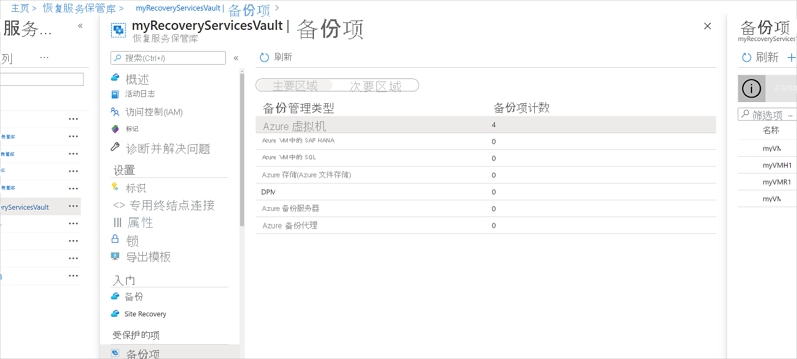
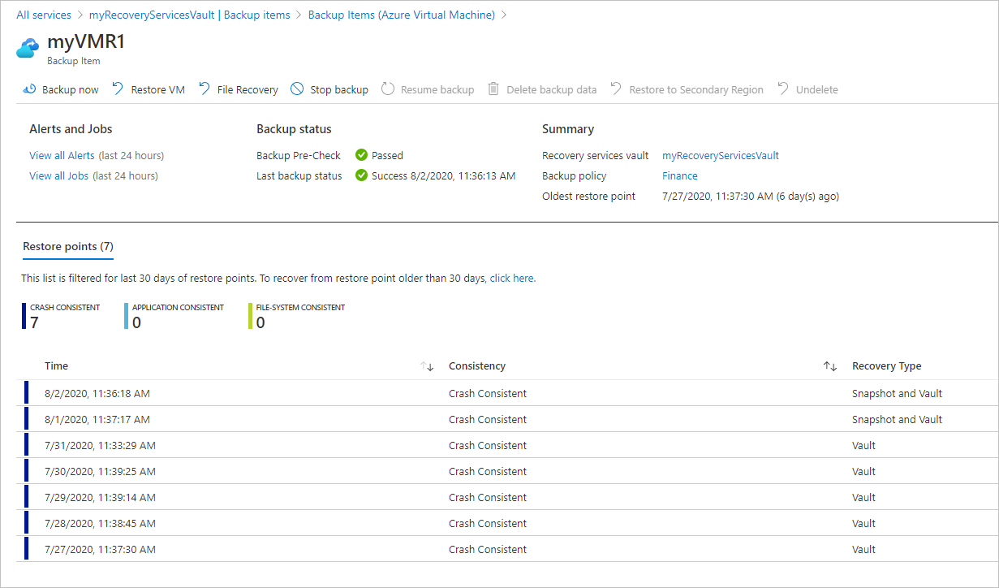
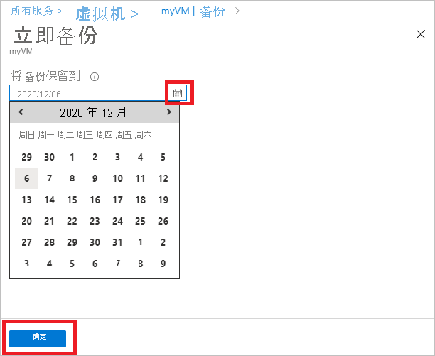

# 使用 Azure 备份服务管理 Azure VM 备份

本文介绍了如何使用 [Azure 备份服务](backup-overview.md)管理 Azure 虚拟机 (VM)。 本文还概述了可以在保管库仪表板上找到的备份信息。

在 Azure 门户中，可以使用恢复服务保管库仪表板访问保管库信息，包括：

* 最新备份，也是最新还原点。
* 备份策略。
* 所有备份快照的总大小。
* 启用了备份的 VM 数。

可以使用仪表板以及通过向下钻取到各个 VM 来管理备份。 若要开始计算机备份，请在仪表板上打开保管库。

## 在仪表板中查看 VM

若要在仪表板中查看 VM，请执行以下操作：

1. 登录到 Azure[门户](https://portal.azure.com/)。
2. 在“中心”菜单上选择“浏览”。**** 在资源列表中，键入“恢复服务”****。 在键入时，列表会根据你的输入进行筛选。 选择**恢复服务保管库**。

    

3. 为了便于使用，请右键单击保管库，然后选择“固定到仪表板”****。
4. 打开保管库仪表板。

    

5. 在“备份项”**** 磁贴中，选择“Azure 虚拟机”****。

    

6. 在 **"备份项目"** 窗格中，您可以查看受保护的 VM 列表。 在此示例中，保管库保护着一台虚拟机：demobackup。  

    

7. 从保管库项的仪表板中，修改备份策略，运行按需备份，停止或恢复 VM 保护，删除备份数据，查看还原点，以及运行还原。

    

## 管理 VM 的备份策略

若要管理备份策略，请执行以下操作：

1. 登录到 Azure[门户](https://portal.azure.com/)。 打开保管库仪表板。
2. 在“备份项”**** 磁贴中，选择“Azure 虚拟机”****。

    

3. 在 **"备份项目"** 窗格中，您可以查看受保护 VM 的列表以及具有最新还原点时间的最后一个备份状态。

    

4. 从保管库项的仪表板中，你可以选择备份策略。

   * 若要切换策略，请选择其他策略，然后选择“保存”。**** 新策略将立即应用于保管库。

     

## 运行按需备份

为 VM 设置保护后，可以为 VM 运行按需备份。 请记住以下详细信息：

* 如果初始备份已挂起，则按需备份会在恢复服务保管库中创建 VM 的完整副本。
* 如果初始备份已完成，按需备份仅将以前快照的更改发送到恢复服务保管库。 也就是说，后续备份始终是增量备份。
* 按需备份的保留期范围是你在触发备份时指定的保留期值。

若要触发按需备份，请执行以下操作：

1. 在[保管库项仪表板](#view-vms-on-the-dashboard)上，在“受保护的项”**** 下，选择“备份项”****。

    

2. 从“备份管理类型”**** 下，选择“Azure 虚拟机”****。 将显示 **"备份项目（Azure 虚拟机）"** 窗格。
3. 选择一个 VM，选择“立即备份”**** 来创建一个按需备份。 将显示"**立即备份"** 窗格。
4. 在“备份保留截止日期”**** 字段中，指定要将备份保留到的日期。

    

5. 选择“确定”**** 以运行备份作业。

若要跟踪作业进度，请在保管库仪表板中，选择“备份作业”磁贴。****

## 停止保护 VM

可通过两种方法来停止保护 VM：

* **停止保护并保留备份数据**。 此选项将使所有将来的备份作业停止保护你的 VM；但是，Azure 备份服务将保留已备份的恢复点。  你需要付费才能将恢复点保留在保管库中（有关详细信息，请参阅 [Azure 备份定价](https://azure.microsoft.com/pricing/details/backup/)）。 如果需要，你将能够还原 VM。 如果决定恢复 VM 保护，则可以使用“恢复备份”** 选项。
* **停止保护并删除备份数据**。 此选项将使所有将来的备份作业停止保护你的 VM 并删除所有恢复点。 你将无法还原 VM，也无法使用“恢复备份”** 选项。

>[!NOTE]
>如果在不停止备份的情况下删除数据源，则新备份会失败。 旧恢复点将根据策略过期，但始终会保留一个最后的恢复点，直至你显式停止备份并删除数据。
>

### 停止保护并保留备份数据

若要停止保护并保留 VM 的数据，请执行以下操作：

1. 在[保管库项的仪表板](#view-vms-on-the-dashboard)上，选择“停止备份”。****
2. 选择“保留备份数据”****，并根据需要确认你的选择。 如果需要，添加注释。 如果不确定项名称，将鼠标悬停在感叹号上面即可查看该名称。

    

一条通知将让你获悉备份作业已停止。

### 停止保护并删除备份数据

若要停止保护并删除 VM 的数据，请执行以下操作：

1. 在[保管库项的仪表板](#view-vms-on-the-dashboard)上，选择“停止备份”。****
2. 选择“删除备份数据”****，并根据需要确认你的选择。 输入备份项的名称，并根据需要添加注释。

    

## 恢复对 VM 的保护

如果在停止 VM 保护期间选择了["停止保护"并保留备份数据](#stop-protection-and-retain-backup-data)选项，则可以使用 **"恢复备份**"。 如果选择了“[停止保护并删除备份数据](#stop-protection-and-delete-backup-data)”选项或“[删除备份数据](#delete-backup-data)”，则此选项不可用。

若要恢复 VM 保护，请执行以下操作：

1. 在[保管库项的仪表板](#view-vms-on-the-dashboard)上，选择“恢复备份”。****

2. 按[管理备份策略](#manage-backup-policy-for-a-vm)中的步骤为 VM 分配策略。 不需要选择 VM 的初始保护策略。
3. 将备份策略应用于 VM 后，你会看到以下消息：

    

## 删除备份数据

有两种方法可以删除 VM 的备份数据：

* 在保管库项仪表板中，选择“停止备份”，然后按照“[停止保护并删除备份数据](#stop-protection-and-delete-backup-data)”选项的说明进行操作。

  

* 在保管库项仪表板中，选择“删除备份数据”。 如果在停止 VM 保护期间选择了“[停止保护并保留备份数据](#stop-protection-and-retain-backup-data)”选项，则会启用此选项

  

  * 在[保管库项仪表板](#view-vms-on-the-dashboard)中，选择“删除备份数据”。****
  * 键入备份项的名称以确认你要删除恢复点。

    

  * 若要删除项的备份数据，请选择“删除”****。 一条通知消息将让你获悉备份数据已删除。

为了保护数据，Azure 备份包括软删除功能。 使用软删除，即使在删除 VM 的备份（所有恢复点）后，备份数据也会保留 14 天。 有关详细信息，请参阅[软删除文档](https://docs.microsoft.com/azure/backup/backup-azure-security-feature-cloud)。

  > [!NOTE]
  > 删除备份数据时，将删除所有关联的恢复点。 无法选择要删除的特定恢复点。

### 主数据源不再存在的备份项

* 如果为 Azure 备份配置的 Azure VM 被删除或移动而不停止保护，则计划备份作业和按需（临时）备份作业都将因错误 UserErrorVmNotFoundV2 而失败。 备份预检查将仅对失败的按需备份作业（未显示失败的计划作业）显示为关键。
* 这些备份项在系统中保持活动状态，并遵守用户设置的备份和保留策略。 这些 Azure VM 的备份数据将根据保留策略保留。 过期的恢复点（最后一个恢复点除外）将根据备份策略中设置的保留范围进行清理。
* 如果用户不再需要删除资源的备份项/数据，因为最后一个恢复点会永久保留，并且用户按适用的备份定价收费，则建议用户删除主数据源不再存在的备份项目，以避免任何额外费用。

## 后续步骤

* 了解如何[通过 VM 的设置备份 Azure VM](backup-azure-vms-first-look-arm.md)。
* 了解如何[还原 VM](backup-azure-arm-restore-vms.md)。
* 了解如何[监视 Azure VM 备份](backup-azure-monitor-vms.md)。
