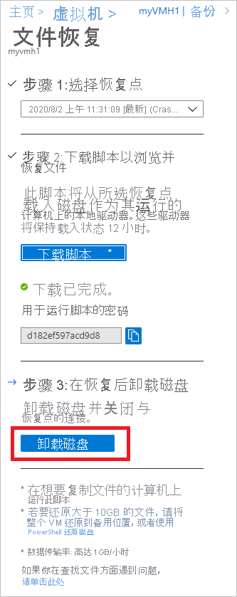

# <a name="recover-files-from-azure-virtual-machine-backup"></a>从 Azure 虚拟机备份恢复文件

Azure 备份提供从 Azure VM 备份（也称恢复点）还原 [Azure 虚拟机 (VM) 和磁盘](./backup-azure-arm-restore-vms.md)的功能。 本文介绍如何从 Azure VM 备份恢复文件和文件夹。 还原文件和文件夹仅适用于使用资源管理器模型部署的、在恢复服务保管库中受保护的 Azure VM。

> [!Note]
> 此功能适用于使用 Resource Manager 模型部署的、在恢复服务保管库中受保护的 Azure VM。
> 不支持从加密的 VM 备份恢复文件。
>

## <a name="mount-the-volume-and-copy-files"></a>装载卷并复制文件

若要从恢复点还原文件或文件夹，请转到虚拟机并选择所需的恢复点。

1. 登录到 [Azure 门户](http://portal.Azure.com)，在左侧窗格中单击“虚拟机”。 从虚拟机列表中，选择虚拟机以打开其仪表板。

2. 在虚拟机菜单中，单击“备份”以打开“备份”仪表板。

    

3. 在“备份”仪表板菜单上，单击“文件恢复”。

    

    此时将打开“文件恢复”菜单。

    

4. 从“选择恢复点”下拉菜单中，选择包含所需文件的恢复点。 默认已选择最新的恢复点。

5. 要下载要用于从恢复点复制文件的软件，请单击“下载可执行文件”（适用于 Microsoft Azure VM）或“下载脚本”（对于 Linux Azure VM，会生成 python 脚本）。

    

    Azure 会将该可执行文件或脚本下载到本地计算机。

    

    若要以管理员身份运行该可执行文件或脚本，建议将下载文件保存到计算机。

6. 该可执行文件或脚本受密码保护，需要密码才能运行。 在“文件恢复”菜单上，单击复制按钮以将密码加载到内存中。

    

7. 从下载位置（通常是“下载”文件夹），右键单击该可执行文件或脚本，然后用管理员凭据运行。 出现提示时，键入密码或粘贴内存中的密码，然后按 Enter。 输入有效的密码后，脚本将连接到恢复点。

    

    如果在访问受限的计算机上运行该脚本，请确保能够访问：

    - download.microsoft.com
    - 恢复服务 URL（地区名称是指恢复服务保管库的区域）
        - <https://pod01-rec2.geo-name.backup.windowsazure.com>（适用于 Azure 公共地区）
        - <https://pod01-rec2.geo-name.backup.windowsazure.cn>（适用于 Azure 中国）
        - <https://pod01-rec2.geo-name.backup.windowsazure.us>（适用于 Azure 美国政府）
        - <https://pod01-rec2.geo-name.backup.windowsazure.de>（适用于 Azure 德国）
    - 出站端口 3260

    在 Linux 上，该脚本需要“open-iscsi”和“lshw”组件才能连接到恢复点。 如果这些组件不存在于运行脚本的计算机上，该脚本会请求权限以安装组件。 请同意安装必需组件。

    需要访问 download.microsoft.com 才能下载在运行脚本的计算机与恢复点中的数据之间构建安全通道所使用的组件。

    可以在具有与备份 VM 相同（或兼容）操作系统的任何计算机上运行该脚本。 有关兼容的操作系统，请参阅[兼容的 OS 表](backup-azure-restore-files-from-vm.md#system-requirements)。 如果受保护的 Azure 虚拟机使用 Windows 存储空间（适用于 Windows Azure VM）或 LVM/RAID 阵列（适用于 Linux VM），则不能在同一虚拟机上运行该可执行文件或脚本。 而应在具有兼容操作系统的任何其他计算机上运行该可执行文件或脚本。

### <a name="identifying-volumes"></a>标识卷

#### <a name="for-windows"></a>对于 Windows

运行可执行文件时，操作系统将装载新卷并分配驱动器号。 可以使用 Windows 资源管理器或文件资源管理器来浏览这些驱动器。 分配给卷的驱动器号不能与原始虚拟机中的驱动器号相同，不过，卷名会保留。 例如，如果原始虚拟机上的卷为“数据磁盘(E:`\`)”，可在本地计算机上将该卷附加为“数据磁盘(‘任意字母’:`\`)”。 浏览脚本输出中所述的所有卷，直到找到文件/文件夹。  

   

#### <a name="for-linux"></a>对于 Linux

在 Linux 中，恢复点的卷将装载到运行脚本的文件夹。 将相应地显示附加的磁盘、卷和对应装载路径。 这些装载路径对于具有根级别访问权限的用户可见。 浏览脚本输出中涉及的卷。

  
  
## <a name="closing-the-connection"></a>关闭连接

识别文件并将其复制到本地存储位置后，请删除（或卸载）其他驱动器。 若要卸载驱动器，请在 Azure 门户中的“文件恢复”菜单上，单击“卸载磁盘”。



卸载磁盘后，会收到一条消息。 连接可能在几分钟时间后才会刷新，以便能够删除磁盘。

在 Linux 中，断开与恢复点的连接后，OS 不会自动删除相应装载路径。 安装路径作为“孤立”卷存在并且可见，但访问/写入文件时会引发错误。 这些卷可以手动删除。 该脚本运行时会标识以前的任何恢复点存在的任何此类卷，并在获得许可后将其清除。

## <a name="special-configurations"></a>特殊配置

### <a name="dynamic-disks"></a>动态磁盘

如果受保护的 Azure VM 包含带有以下一个或两个特征的卷，则无法在同一 VM 上运行该可执行脚本。

    - 跨多个磁盘的卷（跨区卷和带区卷）
    - 动态磁盘上的容错卷（镜像卷和 RAID-5 卷）

而应在具有兼容操作系统的任何其他计算机上运行该可执行脚本。

### <a name="windows-storage-spaces"></a>Windows 存储空间

Windows 存储空间是用于将存储器虚拟化的一种 Windows 技术。 使用 Windows 存储空间，可将行业标准磁盘分组为存储池。 然后使用这些存储池中的可用空间创建虚拟磁盘，即存储空间。

如果受保护的 Azure VM 使用 Windows 存储空间，则不能在同一 VM 上运行该可执行脚本。 而应在具有兼容操作系统的任何其他计算机上运行该可执行脚本。

### <a name="lvmraid-arrays"></a>LVM/RAID 阵列

在 Linux 中，逻辑卷管理器 (LVM) 和/或软件 RAID 阵列用于管理多个磁盘上的逻辑卷。 如果受保护的 Linux VM 使用 LVM 和/或 RAID 阵列，则不能在同一 VM 上运行该脚本。 而应在具有兼容 OS 且支持受保护 VM 的文件系统的任何其他计算机上运行该脚本。

以下脚本输出显示了 LVM 和/或 RAID 阵列磁盘和卷，及其分区类型。

   

若要使这些分区联机，请运行以下各部分中的命令。

#### <a name="for-lvm-partitions"></a>对于 LVM 分区

列出物理卷下的卷组名称。

```bash
#!/bin/bash
$ pvs <volume name as shown above in the script output>
```

列出卷组中所有逻辑卷、名称及其路径。

```bash
#!/bin/bash
$ lvdisplay <volume-group-name from the pvs command’s results>
```

将逻辑卷装载到所选的路径。

```bash
#!/bin/bash
$ mount <LV path> </mountpath>
```

#### <a name="for-raid-arrays"></a>对于 RAID 阵列

使用以下命令，将显示有关所有 RAID 磁盘的详细信息。

```bash
#!/bin/bash
$ mdadm –detail –scan
```

 相关 RAID 磁盘显示为 `/dev/mdm/<RAID array name in the protected VM>`

如果 RAID 磁盘具有物理卷，请使用 mount 命令。

```bash
#!/bin/bash
$ mount [RAID Disk Path] [/mountpath]
```

如果 RAID 磁盘中配置了另一 LVM，请使用前述 LVM 分区相关过程，但使用卷名称代替 RAID 磁盘名称

## <a name="system-requirements"></a>系统要求

### <a name="for-windows-os"></a>对于 Windows OS

下表显示了服务器与计算机操作系统之间的兼容性。 恢复文件时，不能将文件还原到更旧或更新的操作系统版本。 例如，不能将文件从 Windows Server 2016 VM 还原到 Windows Server 2012 或 Windows 8 计算机。 可将 VM 中的文件还原到相同的服务器操作系统，或还原到兼容的客户端操作系统。

|服务器 OS | 兼容的客户端 OS  |
| --------------- | ---- |
| Windows Server 2016    | Windows 10 |
| Windows Server 2012 R2 | Windows 8.1 |
| Windows Server 2012    | Windows 8  |
| Windows Server 2008 R2 | Windows 7   |

### <a name="for-linux-os"></a>对于 Linux OS

在 Linux 中，用于还原文件的计算机的 OS 必须支持受保护虚拟机的文件系统。 选择用于运行脚本的计算机时，请确保计算机具有兼容的 OS，并使用下表中认定的版本之一：

|Linux OS | 版本  |
| --------------- | ---- |
| Ubuntu | 12.04 及更高版本 |
| CentOS | 6.5 及更高版本  |
| RHEL | 6.7 及更高版本 |
| Debian | 7 及更高版本 |
| Oracle Linux | 6.4 及更高版本 |
| SLES | 12 及更高版本 |
| openSUSE | 42.2 及更高版本 |

该脚本还需要 Python 和 bash 组件才能执行并安全地连接到恢复点。

|组件 | 版本  |
| --------------- | ---- |
| bash | 4 及更高版本 |
| Python | 2.6.6 及更高版本  |
| TLS | 应支持 1.2  |

## <a name="troubleshooting"></a>故障排除

如果从虚拟机恢复文件时遇到问题，请查看下表了解更多信息。

| 错误消息/情景 | 可能的原因 | 建议的操作 |
| ------------------------ | -------------- | ------------------ |
| 可执行文件输出：“连接到目标时发生异常” |脚本无法访问恢复点    | 检查计算机是否满足前述访问要求。 |  
| 可执行文件输出：已经通过 iSCSI 会话登录目标。 | 脚本已在同一台计算机上执行，并且已附加驱动器 | 已附加恢复点所在的卷。 不能使用与原始 VM 相同的驱动器号装载这些卷。 在文件的文件资源管理器中浏览所有可用卷 |
| 可执行文件输出：“此脚本无效，因为磁盘已通过门户卸载/已超过 12 小时限制。*请从门户下载新脚本。* |    磁盘已从门户卸除或超过了 12 小时限制 | 此特定可执行文件现已失效，无法运行。 若要访问该恢复时间点的文件，请在门户中访问新的可执行文件|
| 在运行可执行文件的计算机上：单击卸载按钮后，新卷不会卸载 | 计算机上的 iSCSI 发起程序无响应/不刷新它与目标之间的连接，并且不保留缓存。 |  单击“卸除”后，请等待几分钟。 如果无法卸载新卷，请浏览所有卷。 浏览所有卷会强制发起程序刷新连接并卸载卷，但会出现错误消息，指出磁盘不可用。|
| 可执行文件输出：脚本已成功运行，但脚本输出中不显示“已附加新卷” |    这是暂时性的错误    | 卷其实已附加。 打开资源管理器即可浏览它们。 如果每次都使用同一台计算机来运行脚本，请考虑重新启动计算机，这样，以后运行可执行文件时应会显示列表。 |
| Linux 特定：无法查看所需的卷 | 运行脚本的计算机的 OS 可能无法识别受保护 VM 的基础文件系统 | 检查恢复点是崩溃一致还是文件一致。 如果文件一致，请在 OS 可识别受保护 VM 的文件系统的另一台计算机上运行该脚本 |
| Windows 特定：无法查看所需的卷 | 磁盘可能已附加，但未配置卷 | 从磁盘管理屏幕中，识别与恢复点相关的其他磁盘。 如果这些磁盘有任何一个处于脱机状态，请尝试通过右键单击该磁盘并单击“联机”来使其联机|
