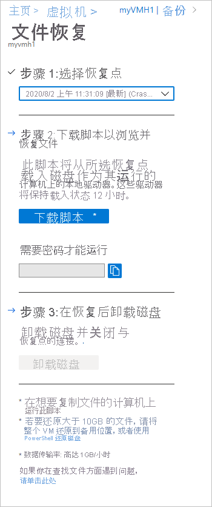

# <a name="recover-files-from-azure-virtual-machine-backup"></a>从 Azure 虚拟机备份恢复文件

Azure 备份提供从 Azure VM 备份（也称恢复点）还原 [Azure 虚拟机 (VM) 和磁盘](./backup-azure-arm-restore-vms.md)的功能。 本文介绍如何从 Azure VM 备份恢复文件和文件夹。 还原文件和文件夹仅适用于使用资源管理器模型部署的、在恢复服务保管库中受保护的 Azure VM。

> [!NOTE]
> 此功能适用于使用 Resource Manager 模型部署的、在恢复服务保管库中受保护的 Azure VM。
> 不支持从加密的 VM 备份恢复文件。
>

## <a name="mount-the-volume-and-copy-files"></a>装载卷并复制文件

若要从恢复点还原文件或文件夹，请转到虚拟机并选择所需的恢复点。

1. 登录到 [Azure 门户](https://portal.Azure.com)，在左侧窗格中单击“虚拟机”。 从虚拟机列表中，选择虚拟机以打开其仪表板。

2. 在虚拟机菜单中，单击“备份”以打开“备份”仪表板。

    

3. 在“备份”仪表板菜单上，单击“文件恢复”。

    

    此时将打开“文件恢复”菜单。

    

4. 从“选择恢复点”下拉菜单中，选择包含所需文件的恢复点。 默认已选择最新的恢复点。

5. 若要下载用于从恢复点复制文件的软件，请单击 "**下载可执行**文件（适用于 Windows azure vm）" 或 "**下载脚本**" （适用于 Linux Azure vm，生成 python 脚本）。

    

    Azure 会将该可执行文件或脚本下载到本地计算机。

    

    若要以管理员身份运行该可执行文件或脚本，建议您将下载的文件保存到您的计算机。

6. 该可执行文件或脚本受密码保护，需要密码才能运行。 在“文件恢复”菜单上，单击复制按钮以将密码加载到内存中。

    

7. 从下载位置（通常是“下载”文件夹），右键单击该可执行文件或脚本，然后用管理员凭据运行。 出现提示时，键入密码或从内存中粘贴密码，然后按**enter**。 输入有效的密码后，脚本将连接到恢复点。

    

8. 对于 Linux 计算机，将生成 python 脚本。 需要下载该脚本并将其复制到相关兼容的 Linux 服务器。 您可能必须修改权限才能使用 ```chmod +x <python file name>```执行该权限。 然后 ```./<python file name>```运行 python 文件。

请参阅[访问要求](#access-requirements)部分，确保脚本已成功运行。

### <a name="identifying-volumes"></a>标识卷

#### <a name="for-windows"></a>对于 Windows

运行可执行文件时，操作系统将装载新卷并分配驱动器号。 可以使用 Windows 资源管理器或文件资源管理器来浏览这些驱动器。 分配给卷的驱动器号不能与原始虚拟机的驱动器号相同。 但会保留卷名。 例如，如果原始虚拟机上的卷为“数据磁盘(E:`\`)”，可在本地计算机上将该卷附加为“数据磁盘(‘任意字母’:`\`)”。 浏览脚本输出中提到的所有卷，直到找到文件或文件夹。  

   

#### <a name="for-linux"></a>对于 Linux

在 Linux 中，恢复点的卷将装载到运行脚本的文件夹。 将相应地显示附加的磁盘、卷和对应装载路径。 这些装载路径对于具有根级别访问权限的用户可见。 浏览脚本输出中涉及的卷。

  

## <a name="closing-the-connection"></a>关闭连接

识别文件并将其复制到本地存储位置后，请删除（或卸载）其他驱动器。 若要卸载驱动器，请在 Azure 门户中的“文件恢复”菜单上，单击“卸载磁盘”。


卸载磁盘后，会收到一条消息。 连接可能在几分钟时间后才会刷新，以便能够删除磁盘。

在 Linux 中，断开与恢复点的连接后，OS 不会自动删除相应装载路径。 装载路径作为 "孤立" 卷存在并且可见，但在访问/写入文件时会引发错误。 这些卷可以手动删除。 该脚本运行时会标识以前的任何恢复点存在的任何此类卷，并在获得许可后将其清除。

## <a name="special-configurations"></a>特殊配置

### <a name="dynamic-disks"></a>动态磁盘

如果受保护的 Azure VM 包含带有以下一个或两个特征的卷，则无法在同一 VM 上运行该可执行脚本。

- 跨多个磁盘的卷（跨区卷和带区卷）
- 动态磁盘上的容错卷（镜像卷和 RAID-5 卷）

而应在具有兼容操作系统的任何其他计算机上运行该可执行脚本。

### <a name="windows-storage-spaces"></a>Windows 存储空间

Windows 存储空间是用于将存储器虚拟化的一种 Windows 技术。 使用 Windows 存储空间，可将行业标准磁盘分组为存储池。 然后使用这些存储池中的可用空间创建虚拟磁盘，即存储空间。

如果受保护的 Azure VM 使用 Windows 存储空间，则不能在同一 VM 上运行该可执行脚本。 而应在具有兼容操作系统的任何其他计算机上运行该可执行脚本。

### <a name="lvmraid-arrays"></a>LVM/RAID 阵列

在 Linux 中，逻辑卷管理器 (LVM) 和/或软件 RAID 阵列用于管理多个磁盘上的逻辑卷。 如果受保护的 Linux VM 使用 LVM 和/或 RAID 阵列，则不能在同一 VM 上运行该脚本。 而应在具有兼容 OS 且支持受保护 VM 的文件系统的任何其他计算机上运行该脚本。

以下脚本输出显示了 LVM 和/或 RAID 阵列磁盘和卷，及其分区类型。

   

若要使这些分区联机，请运行以下各部分中的命令。

#### <a name="for-lvm-partitions"></a>对于 LVM 分区

若要列出物理卷下的卷组名称，请执行以下操作：

```bash
#!/bin/bash
pvs <volume name as shown above in the script output>
```

若要列出卷组中的所有逻辑卷、名称及其路径，请执行以下操作：

```bash
#!/bin/bash
lvdisplay <volume-group-name from the pvs command’s results>
```

将逻辑卷装载到所选的路径：

```bash
#!/bin/bash
mount <LV path> </mountpath>
```

#### <a name="for-raid-arrays"></a>对于 RAID 阵列

以下命令显示有关所有 raid 磁盘的详细信息：

```bash
#!/bin/bash
mdadm –detail –scan
```

 相关 RAID 磁盘显示为 `/dev/mdm/<RAID array name in the protected VM>`

如果 RAID 磁盘具有物理卷，请使用 mount 命令：

```bash
#!/bin/bash
mount [RAID Disk Path] [/mountpath]
```

如果 RAID 磁盘上配置了另一 LVM，则使用上述过程来执行 LVM 分区，但使用卷名来代替 RAID 磁盘名称。

## <a name="system-requirements"></a>系统要求

### <a name="for-windows-os"></a>对于 Windows OS

下表显示了服务器与计算机操作系统之间的兼容性。 恢复文件时，不能将文件还原到更旧或更新的操作系统版本。 例如，不能将文件从 Windows Server 2016 VM 还原到 Windows Server 2012 或 Windows 8 计算机。 可将 VM 中的文件还原到相同的服务器操作系统，或还原到兼容的客户端操作系统。

|服务器 OS | 兼容的客户端 OS  |
| --------------- | ---- |
| Windows Server 2019    | Windows 10 |
| Windows Server 2016    | Windows 10 |
| Windows Server 2012 R2 | Windows 8.1 |
| Windows Server 2012    | Windows 8  |
| Windows Server 2008 R2 | Windows 7   |

### <a name="for-linux-os"></a>对于 Linux OS

在 Linux 中，用于还原文件的计算机的 OS 必须支持受保护虚拟机的文件系统。 选择用于运行脚本的计算机时，请确保计算机具有兼容的 OS，并使用下表中认定的版本之一：

|Linux OS | 版本  |
| --------------- | ---- |
| Ubuntu | 12.04 及更高版本 |
| CentOS | 6.5 及更高版本  |
| RHEL | 6.7 及更高版本 |
| Debian | 7 及更高版本 |
| Oracle Linux | 6.4 及更高版本 |
| SLES | 12 及更高版本 |
| OpenSUSE | 42.2 及更高版本 |

> [!NOTE]
> 我们发现，在使用 SLES 12 SP4 操作系统的计算机上运行文件恢复脚本时，我们发现了一些问题，我们正在使用 SLES 团队进行调查。
> 目前，运行文件恢复脚本正在使用 SLES 12 SP2 和 SP3 OS 版本的计算机。
>

该脚本还需要 Python 和 bash 组件才能执行并安全地连接到恢复点。

|组件 | 版本  |
| --------------- | ---- |
| bash | 4 及更高版本 |
| Python | 2.6.6 及更高版本  |
| TLS | 应支持 1.2  |

## <a name="access-requirements"></a>访问要求

如果在访问受限的计算机上运行该脚本，请确保能够访问：

- `download.microsoft.com`
- 恢复服务 URL（地区名称是指恢复服务保管库的区域）
  - <https://pod01-rec2.geo-name.backup.windowsazure.com>（适用于 Azure 公共地区）
  - <https://pod01-rec2.geo-name.backup.windowsazure.cn> （适用于 Azure 中国世纪互联）
  - <https://pod01-rec2.geo-name.backup.windowsazure.us>（适用于 Azure 美国政府）
  - <https://pod01-rec2.geo-name.backup.windowsazure.de>（适用于 Azure 德国）
- 出站端口53（DNS）、443、3260

> [!NOTE]
>
> - 下载的脚本文件名将具有要在 URL 中填充的**地理名称**。 对于示例：下载的脚本名称以 \'VMname\'开头 \_\'geoname\'_\'GUID\'，如*ContosoVM_wcus_12345678*
> - URL 将 <https://pod01-rec2.wcus.backup.windowsazure.com>"
>

在 Linux 上，该脚本需要“open-iscsi”和“lshw”组件才能连接到恢复点。 如果组件在运行脚本的计算机上不存在，则脚本会要求提供安装组件的权限。 请同意安装必需组件。

若要下载用于在运行脚本的计算机与恢复点中的数据之间生成安全通道的组件，需要对 `download.microsoft.com` 的访问权限。

可以在具有与备份 VM 相同（或兼容）操作系统的任何计算机上运行该脚本。 有关兼容的操作系统，请参阅[兼容的 OS 表](backup-azure-restore-files-from-vm.md#system-requirements)。 如果受保护的 Azure 虚拟机使用 Windows 存储空间（适用于 Windows Azure VM）或 LVM/RAID 阵列（适用于 Linux VM），则不能在同一虚拟机上运行该可执行文件或脚本。 而应在具有兼容操作系统的任何其他计算机上运行该可执行文件或脚本。

## <a name="file-recovery-from-virtual-machine-backups-having-large-disks"></a>从具有大型磁盘的虚拟机备份恢复文件

本部分介绍如何从包含16个以上磁盘的 Azure 虚拟机的备份执行文件恢复，并且每个磁盘大小均大于 32 TB。

由于文件恢复过程从备份中附加了所有磁盘，因此当使用大量磁盘（> 16）或大磁盘（每个 > 32 TB）时，建议使用以下操作点：

- 保留单独的还原服务器（Azure VM D2v3 Vm）以进行文件恢复。 您只能将它用于文件恢复，并在不需要时将其关闭。 建议不要在原始计算机上还原，因为它会对 VM 本身产生重大影响。
- 然后运行该脚本一次，检查文件恢复操作是否成功。
- 如果文件恢复过程挂起（磁盘从未装载或装载但未显示卷），请执行以下步骤。
  - 如果还原服务器是 Windows VM：
    - 确保操作系统为 WS 2012 或更高版本。
    - 确保在还原服务器中将注册表项设置为 "建议"，并确保重新启动服务器。 GUID 旁边的数字范围为0001-0005。 在下面的示例中，它是0.0004。 在 "参数" 部分中，导航到 "注册表项路径"。

    

```registry
- HKEY_LOCAL_MACHINE\SYSTEM\CurrentControlSet\Services\Disk\TimeOutValue – change this from 60 to 1200
- HKEY_LOCAL_MACHINE\SYSTEM\ControlSet001\Control\Class\{4d36e97b-e325-11ce-bfc1-08002be10318}\0003\Parameters\SrbTimeoutDelta – change this from 15 to 1200
- HKEY_LOCAL_MACHINE\SYSTEM\ControlSet001\Control\Class\{4d36e97b-e325-11ce-bfc1-08002be10318}\0003\Parameters\EnableNOPOut – change this from 0 to 1
- HKEY_LOCAL_MACHINE\SYSTEM\ControlSet001\Control\Class\{4d36e97b-e325-11ce-bfc1-08002be10318}\0003\Parameters\MaxRequestHoldTime - change this from 60 to 1200
```

- 如果还原服务器是 Linux VM：
  - 在文件/etc/iscsi/iscsid.conf 中，将设置从：
    - node.js [0]. noop_out_timeout timeo = 5 到 node.js [0]. noop_out_timeout timeo = 30
- 进行上述更改后，再次运行脚本。 进行这些更改后，文件恢复的可能性很高。
- 用户每次下载脚本时，Azure 备份将启动准备下载恢复点的过程。 对于大型磁盘，此过程需要相当长的时间。 如果存在连续突发的请求，目标准备将进入下载螺旋。 因此，建议从门户/Powershell/CLI 下载脚本，等待20-30 分钟（启发式），然后运行该脚本。 此时，目标应准备就绪，可以从脚本进行连接。
- 在文件恢复后，确保返回到门户，并单击 "**卸载磁盘**" 获取无法装入卷的恢复点。 实质上，此步骤将清除任何现有进程/会话并增加恢复的可能性。

## <a name="troubleshooting"></a>故障排除

如果从虚拟机恢复文件时遇到问题，请查看下表了解更多信息。

| 错误消息/情景 | 可能的原因 | 建议的操作 |
| ------------------------ | -------------- | ------------------ |
| Exe 输出：*连接到目标时捕获到异常* | 此脚本无法访问恢复点    | 检查计算机是否满足以前的[访问要求](#access-requirements)。 |  
| 可执行文件输出：已经通过 iSCSI 会话登录目标。 | 脚本已在同一台计算机上执行，并且已附加驱动器 | 已附加恢复点所在的卷。 不能使用与原始 VM 相同的驱动器号装载这些卷。 在文件资源管理器中浏览文件的所有可用卷。 |
| Exe 输出：*此脚本无效，因为磁盘已通过门户卸载/已超过12小时限制。从门户下载新脚本。* |    磁盘已从门户卸除或超过了12小时限制 | 此特定可执行文件现已失效，无法运行。 如果要访问该恢复时间点的文件，请访问门户获取新的 exe。|
| 在运行 exe 的计算机上：单击卸载按钮后，新卷不会被卸载 | 计算机上的 iSCSI 发起程序未响应/刷新与目标的连接并维护缓存。 |  单击“卸除”后，请等待几分钟。 如果未卸载新卷，请浏览所有卷。 浏览所有卷会强制发起程序刷新连接，并且会卸载卷，并显示一条错误消息，指出磁盘不可用。|
| Exe 输出：脚本已成功运行，但脚本输出中不显示 "已附加新卷" |    这是暂时性的错误    | 卷已附加。 打开资源管理器即可浏览它们。 如果每次都使用同一台计算机来运行脚本，请考虑重新启动计算机，列表应显示在后续 exe 运行中。 |
| Linux 特定：无法查看所需的卷 | 运行脚本的计算机的 OS 可能无法识别受保护 VM 的基础文件系统 | 检查恢复点是崩溃一致还是文件一致。 如果文件一致，请在其 OS 识别受保护 VM 的文件系统的另一台计算机上运行该脚本。 |
| Windows 特定：无法查看所需的卷 | 磁盘可能已附加，但未配置卷 | 从磁盘管理屏幕中，识别与恢复点相关的其他磁盘。 如果这些磁盘中有任何一个处于脱机状态，请尝试通过右键单击该磁盘并单击 "**联机**" 来使其联机。|

## <a name="security"></a>安全性

本部分介绍了从 Azure VM 备份执行文件恢复的各种安全措施。

### <a name="feature-flow"></a>功能流

此功能是为访问 VM 数据而构建的，无需还原整个 VM 或 VM 磁盘，且需要的步骤数最少。 对 VM 数据的访问由脚本提供（运行时将装载恢复卷，如下所示），它构成了所有安全实现的基础：

  

### <a name="security-implementations"></a>安全实现

#### <a name="select-recovery-point-who-can-generate-script"></a>选择恢复点（可以生成脚本的人员）

此脚本提供对 VM 数据的访问，因此，必须首先规定哪些用户可以生成它。 你需要登录到 Azure 门户，并[获得 RBAC 授权](backup-rbac-rs-vault.md#mapping-backup-built-in-roles-to-backup-management-actions)以生成脚本。

文件恢复需要与 VM 还原和磁盘还原所需的相同级别的授权。 换句话说，只有经过授权的用户才能查看 VM 数据，才能生成脚本。

生成的脚本通过 Azure 备份服务的官方 Microsoft 证书进行签名。 对脚本进行的任何篡改都意味着签名中断，任何运行脚本的尝试都将突出显示为操作系统的潜在风险。

#### <a name="mount-recovery-volume-who-can-run-script"></a>装载恢复卷（可运行脚本）

只有管理员才能运行该脚本，它应在提升模式下运行。 此脚本只运行预先生成的一组步骤，并且不接受来自任何外部源的输入。

若要运行该脚本，只需在 Azure 门户或 PowerShell/CLI 中生成脚本时，才向授权用户显示密码。 这是为了确保下载该脚本的授权用户同时负责运行该脚本。

#### <a name="browse-files-and-folders"></a>浏览文件和文件夹

若要浏览文件和文件夹，该脚本将使用计算机中的 iSCSI 发起程序并连接到配置为 iSCSI 目标的恢复点。 在这里，你可以想像一下，其中一种方法是尝试模仿/欺骗所有组件。

我们使用相互 CHAP 身份验证机制，以便每个组件对另一个组件进行身份验证。 这意味着，虚设发起程序连接到 iSCSI 目标以及将假目标连接到运行脚本的计算机非常困难。

恢复服务与计算机之间的数据流通过基于 TCP 构建安全 SSL 隧道来保护（在运行脚本的计算机上[应支持 TLS 1.2](#system-requirements) ）。

父/备份 VM 中存在的任何文件访问控制列表（ACL）也会保留在已装载的文件系统中。

此脚本提供对恢复点的只读访问权限，仅在12小时内有效。 如果要删除之前的访问权限，请登录到 Azure 门户/PowerShell/CLI，并为该特定恢复点执行**卸载磁盘**。 脚本将立即失效。

## <a name="next-steps"></a>后续步骤

- 对于还原文件时遇到的任何问题，请参阅[故障排除](#troubleshooting)部分
- 了解如何[通过 Powershell 还原文件](https://docs.microsoft.com/azure/backup/backup-azure-vms-automation#restore-files-from-an-azure-vm-backup)
- 了解如何[通过 Azure CLI 还原文件](https://docs.microsoft.com/azure/backup/tutorial-restore-files)
- 恢复 VM 后，请了解如何[管理备份](https://docs.microsoft.com/azure/backup/backup-azure-manage-vms)
