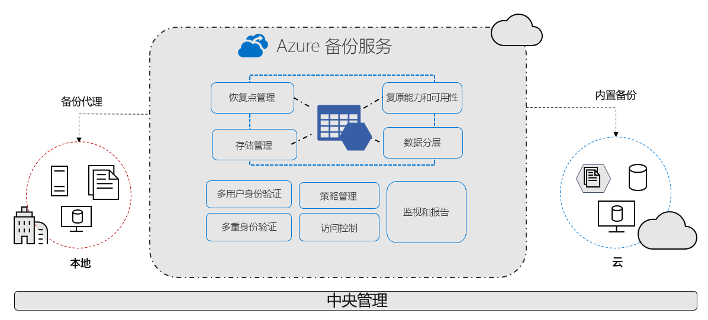

# 什么是 Azure 备份服务？

Azure 备份服务提供简单、安全且经济高效的解决方案来备份数据，并从 Microsoft Azure 云恢复数据。

> [!VIDEO https://www.youtube.com/embed/elODShatt-c]

## 可以备份哪些内容？

- **本地** - 使用 [Microsoft Azure 恢复服务 (MARS) 代理](backup-support-matrix-mars-agent.md)备份文件、文件夹和系统状态。 或者，使用 DPM 或 Azure 备份服务器 (MABS) 代理保护本地 VM（[Hyper-V](back-up-hyper-v-virtual-machines-mabs.md) 和 [VMware](backup-azure-backup-server-vmware.md)）及其他[本地工作负荷](backup-mabs-protection-matrix.md)
- **Azure VM** - [备份整个 Windows/Linux VM](backup-azure-vms-introduction.md)（使用备份扩展），或使用 [MARS 代理](backup-azure-manage-mars.md)备份文件、文件夹和系统状态。
- **Azure 文件存储共享** - [将 Azure 文件存储共享备份到存储帐户](backup-afs.md)
- **Azure VM 中的 SQL Server** -  [备份 Azure VM 上运行的 SQL Server 数据库](backup-azure-sql-database.md)
- **Azure VM 中的 SAP HANA 数据库** - [备份 Azure VM 上运行的 SAP HANA 数据库](backup-azure-sap-hana-database.md)
- **Azure Database for PostgreSQL 服务器（预览版）**  -  [备份 Azure PostgreSQL 数据库，并将备份最多保留 10 年](backup-azure-database-postgresql.md)

## 为何使用 Azure 备份？

Azure 备份具有以下主要优势：

- **卸载本地备份**：Azure 备份提供一个简单的解决方案，可以将本地资源备份到云。 获取短期和长期备份，不需部署复杂的本地备份解决方案。
- **备份 Azure IaaS VM**：Azure 备份提供独立且隔离的备份，可以防范原始数据的意外破坏。 备份存储在提供恢复点内置管理的恢复服务保管库中。 配置和可伸缩性很简单，备份经过优化，可以轻松地根据需要还原。
- **轻松缩放** - Azure 备份利用 Azure 云的基础功能和无限缩放功能实现高可用性 - 无需维护，也无需监视开销。
- **无限数据传输**：Azure 备份不会限制传输的入站或出站数据量，且不会收取数据传输费。
  - 出站数据是指还原操作期间从恢复服务保管库传输的数据。
  - 如果使用 Azure 导入/导出服务执行脱机初始备份以导入大量数据，则入站数据将产生相关费用。  [了解详细信息](backup-azure-backup-import-export.md)。
- **保护数据安全**：Azure 备份为[传输中](backup-azure-security-feature.md)的数据和[静态](backup-azure-security-feature-cloud.md)数据提供保护解决方案。
- **集中式监视和管理**：Azure 备份在恢复服务保管库中提供[内置的监视和警报功能](backup-azure-monitoring-built-in-monitor.md)。 无需任何附加的管理基础结构即可使用这些功能。 还可以[使用 Azure Monitor](backup-azure-monitoring-use-azuremonitor.md) 提高监视和报告的规模。
- **获取应用一致性备份**：应用程序一致性备份意味着恢复点包含还原备份副本所需的所有数据。 Azure 备份提供应用程序一致性备份，确保无需进行额外的修复就能还原数据。 还原应用程序一致型数据可减少还原时间，因此可快速恢复到运行状态。
- **保留短期和长期数据**：可将[恢复服务保管库](backup-azure-recovery-services-vault-overview.md)用于短期和长期数据保留。
- **自动存储管理** - 混合环境常常需要异类存储（部分在本地，部分在云端）。 在 Azure 备份中，使用本地存储设备无需付费。 Azure 备份会自动分配和管理备份存储，且采用即用即付模型。 因此，只需为所用的存储付费。 [详细了解](https://azure.microsoft.com/pricing/details/backup)定价情况。
- **多个存储选项** - Azure 备份提供两种类型的复制来保持存储/数据的高可用性。
  - [本地冗余存储 (LRS)](../storage/common/storage-redundancy.md#locally-redundant-storage) 将数据中心的存储缩放单元中的数据复制三次（创建三个数据副本）。 数据的所有副本存在于同一区域。 LRS 是一个低成本选项，可在本地硬件故障时保护数据。
  - [异地冗余存储 (GRS)](../storage/common/storage-redundancy.md#geo-redundant-storage) 是默认的和推荐的复制选项。 GRS 将数据复制到离源数据主位置数英里之外的次要区域中。 GRS 的成本比 LRS 的高，但 GRS 提供更高的数据持久度，即使出现区域性服务中断也是如此。
  - [区域冗余存储 (ZRS)](../storage/common/storage-redundancy.md#zone-redundant-storage) 在[可用性区域](../availability-zones/az-overview.md#availability-zones)复制数据，从而确保同一区域中的数据驻留和复原能力。 ZRS 不会造成停机。 因此，可在 ZRS 中备份需要[数据驻留](https://azure.microsoft.com/resources/achieving-compliant-data-residency-and-security-with-azure/)且必须没有停机时间的关键工作负载。

## 后续步骤

- [查看](backup-architecture.md)不同备份方案的体系结构和组件。
- [验证](backup-support-matrix.md)对备份和 [Azure VM 备份](backup-support-matrix-iaas.md)的支持要求和限制。