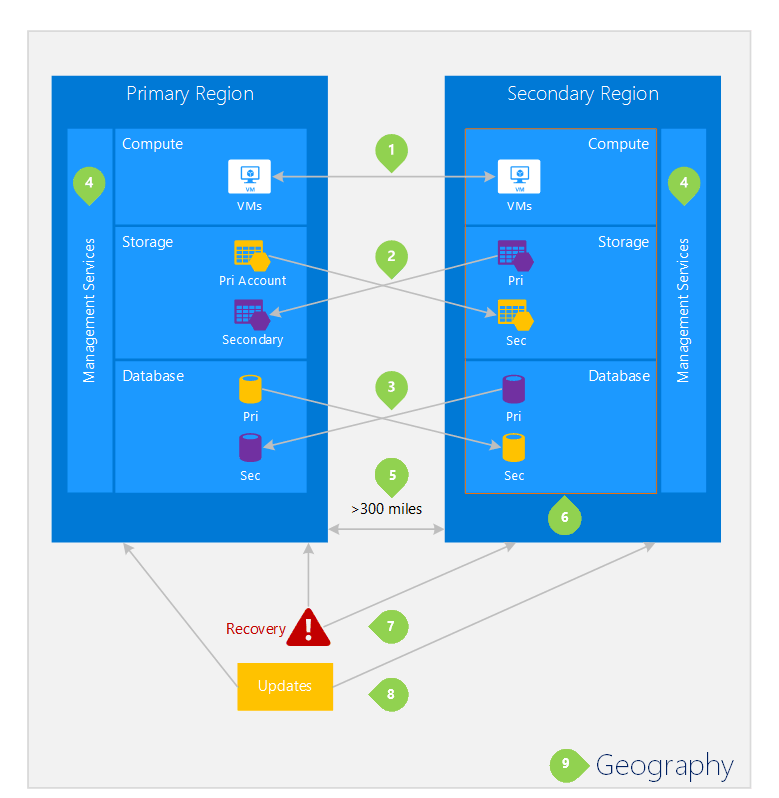

# 业务连续性和灾难恢复 (BCDR)：Azure 配对区域

## 什么是配对区域？

Azure 区域由部署在延迟定义的外围部署并通过专用低延迟网络连接的一组数据中心组成。  这可确保 Azure 区域中的 Azure 服务提供最佳的性能和安全性。  

Azure 地理环境定义包含至少一个 Azure 区域的世界区域。 地理位置定义一个离散市场，通常包含两个或多个区域，以保留数据驻留性和合规性边界。  在此处查找有关 Azure[全球基础结构的详细信息](https://azure.microsoft.com/global-infrastructure/regions/)

区域对由同一地理位置内的两个区域组成。 Azure 跨区域对序列化平台更新（计划维护），确保每个对中只有一个区域一次更新。 如果中断影响多个区域，则每个对中至少有一个区域将优先进行恢复。

某些 Azure 服务进一步利用配对区域，以确保业务连续性并防止数据丢失。  Azure 提供了多个[存储解决方案](./storage/common/storage-redundancy.md#redundancy-in-a-secondary-region)，这些解决方案利用配对区域来确保数据可用性。 例如[，Azure 异地冗余存储](./storage/common/storage-redundancy.md#geo-redundant-storage)（GRS） 会自动将数据复制到辅助区域，确保即使在主区域不可恢复的情况下，数据也是持久的。 

请注意，并非所有 Azure 服务都自动复制数据，也不是所有 Azure 服务都会自动从失败区域回退到其对。  在这种情况下，恢复和复制必须由客户配置。

## 我可以选择区域对吗？

不是。 某些 Azure 服务依赖于区域对，例如 Azure 的[冗余存储](./storage/common/storage-redundancy.md)。 这些服务不允许创建新的区域配对。  同样，由于 Azure 控制区域对的计划维护和恢复优先级，因此无法定义自己的区域对以利用这些服务。 但是，您可以通过在任意数量的区域中构建服务并利用 Azure 服务将它们配对来创建自己的灾难恢复解决方案。 

例如，可以使用 Azure 服务（如[AzCopy）](./storage/common/storage-use-azcopy-v10.md)将数据备份计划到其他区域中的存储帐户。  使用[Azure DNS 和 Azure 流量管理器](./networking/disaster-recovery-dns-traffic-manager.md)，客户可以为其应用程序设计一个弹性体系结构，这些体系结构将在主区域丢失后存活下来。

## 我仅限于使用区域对中的服务吗？

不是。 虽然给定的 Azure 服务可能依赖于区域对，但您可以在满足业务需求的任何区域中托管其他服务。  Azure GRS 存储解决方案可能会将加拿大中部的数据与加拿大东部的对等体数据配对，同时使用位于美国东部的计算资源。  

## 我必须使用 Azure 区域对吗？

不是。 客户可以利用 Azure 服务来构建弹性服务，而无需依赖 Azure 的区域对。  但是，我们建议您跨区域对配置业务连续性灾难恢复 （BCDR），以便从[隔离](./security/fundamentals/isolation-choices.md)中获益并提高[可用性](./availability-zones/az-overview.md)。 对于支持多个活动区域的应用程序，建议尽可能使用区域对中的这两个区域。 这可确保应用程序的最佳可用性，并在发生灾难时最大限度地减少恢复时间。 尽可能设计应用程序，以实现[最大的恢复能力和](https://docs.microsoft.com/azure/architecture/framework/resiliency/overview)[灾难恢复](https://docs.microsoft.com/azure/architecture/framework/resiliency/backup-and-recovery)的简便性。

## Azure 区域对

| 地理位置 | 区域对 A | 区域对 B  |
|:--- |:--- |:--- |
| 亚太地区 |东亚（香港） | 东南亚（新加坡） |
| 澳大利亚 |澳大利亚东部 |澳大利亚东南部 |
| 澳大利亚 |澳大利亚中部 |澳大利亚中部 2 |
| 巴西 |巴西南部 |美国中南部 |
| Canada |加拿大中部 |加拿大东部 |
| 中国 |中国北部 |中国东部|
| 中国 |中国北部 2 |中国东部 2|
| 欧洲 |北欧（爱尔兰） |西欧（荷兰） |
| 法国 |法国中部|法国南部|
| 德国 |德国中部 |德国东北部 |
| 印度 |印度中部 |印度南部 |
| 印度 |印度西部 |印度南部 |
| 日本 |日本东部 |日本西部 |
| 韩国 |韩国中部 |韩国南部 |
| 北美 |美国东部 |美国西部 |
| 北美 |美国东部 2 |美国中部 |
| 北美 |美国中北部 |美国中南部 |
| 北美 |美国西部 2 |美国中西部 |
| 挪威 | 挪威东部 | 挪威西部 |
| 南非 | 南非北部 |南非西部 |
| 瑞士 | 瑞士北部 |瑞士西部 |
| 英国 |英国西部 |英国南部 |
| 阿拉伯联合酋长国 | 阿拉伯联合酋长国北部 | 阿联酋中部
| 美国国防部 |US DoD 东部 |US DoD 中部 |
| 美国政府 |US Gov 亚利桑那州 |US Gov 德克萨斯州 |
| 美国政府 |US Gov 爱荷华州 |US Gov 弗吉尼亚州 |
| 美国政府 |US Gov 弗吉尼亚州 |US Gov 德克萨斯州 |

> [!Important]
> - 西印度只朝一个方向配对。 印度西部的次要区域是印度南部，而印度南部的次要区域是印度中部。
> - 巴西南部是独一无二的，因为它与地理以外的区域配对。 巴西南部的第二个地区是美国中南部。 美国中南部的次生地区不是巴西南部。

## 配对区域的示例
下图演示了使用区域对进行灾难恢复的假设应用程序。 绿色数字突出显示三个 Azure 服务的跨区域活动（Azure 计算、存储和数据库），以及如何将它们配置为跨区域复制。 橙色数字突出显示了跨配对区域部署的独特优势。

图 2 – 虚构的 Azure 区域对

## 跨区域活动
如图 2 所示。

1. **Azure 计算 （IaaS）** – 您必须提前预配其他计算资源，以确保资源在灾难期间在另一个区域可用。 有关详细信息，请参阅 [Azure resiliency technical guidance](https://github.com/uglide/azure-content/blob/master/articles/resiliency/resiliency-technical-guidance.md)（Azure 复原技术指南）。 

2. **Azure 存储**- 如果使用托管磁盘，请使用 Azure[备份了解跨区域备份](https://docs.microsoft.com/azure/architecture/resiliency/recovery-loss-azure-region#virtual-machines)，以及通过 Azure 站点恢复[将 VM](https://docs.microsoft.com/azure/site-recovery/azure-to-azure-tutorial-enable-replication)从一个区域复制到另一个区域。 如果使用存储帐户，则默认情况下在创建 Azure 存储帐户时配置异地冗余存储 （GRS）。 使用 GRS 时，数据会在主要区域自动复制三次，并在配对区域复制三次。 有关详细信息，请参阅 [Azure 存储冗余选项](storage/common/storage-redundancy.md)。

3. **Azure SQL 数据库**– 使用 Azure SQL 数据库异地复制，可以将事务的异步复制配置为世界上任何区域;因此，可以将事务异步复制配置为世界上任何区域。但是，我们建议您在配对区域中部署这些资源，以便执行大多数灾难恢复方案。 有关详细信息，请参阅 [Azure SQL 数据库中的异地复制](sql-database/sql-database-geo-replication-overview.md)。

4. **Azure 资源管理器** - 资源管理器原本就能跨区域提供组件的逻辑隔离。 这意味着某个区域发生逻辑故障不太可能会影响另一个区域。

## 配对区域的优势

5. **物理隔离**– 如果可能，Azure 更喜欢区域对中的数据中心之间至少分离 300 英里，尽管这在所有地理位置都不可行或可能。 物理数据中心隔离能够降低自然灾害、社会动乱、电力中断或物理网络中断同时影响两个区域的可能性。 隔离受限于地理位置的约束（地理位置大小、电源/网络基础结构可用性、法规，等等）。  

6. **平台提供的复制**- 某些服务（如异地冗余存储）提供对配对区域的自动复制。

7. **区域恢复顺序**– 在发生广泛中断时，每个对中优先恢复一个区域。 可以保证跨配对区域部署的应用程序在其中一个区域中优先恢复。 如果应用程序部署在未配对的区域中，则可能会发生恢复延迟；最坏的情况是，选中的两个区域可能最后才会得到恢复。

8. **顺序更新**– 计划 Azure 系统更新按顺序（不是同时）推出到配对区域，以最大程度地减少停机时间、Bug 的影响，并在极少数情况下发生错误更新时出现逻辑故障。

9. **数据驻留**– 区域位于与其对（巴西南部除外）相同的地理位置内，以满足税务和执法管辖目的的数据居住要求。
