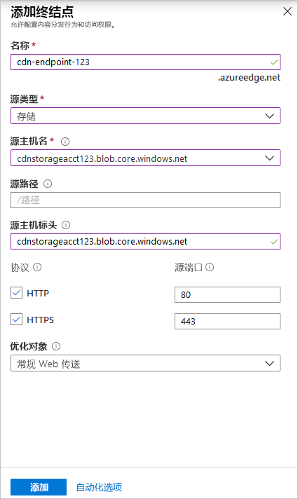
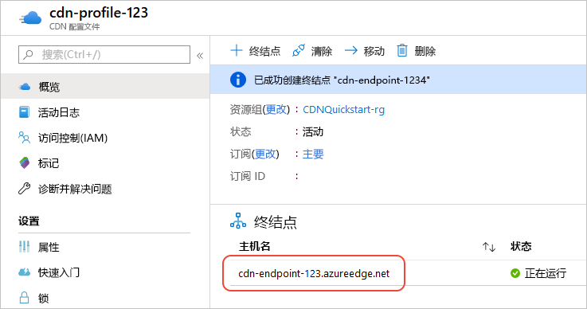

# 快速入门：创建 Azure CDN 配置文件和终结点

在本快速入门中，请通过创建新的 Azure 内容分发网络 (CDN) 配置文件（一个或多个 CDN 终结点的集合）来启用 CDN。 创建配置文件和终结点以后，即可将内容交付给客户。

## 先决条件

- 具有活动订阅的 Azure 帐户。 [免费创建帐户](https://azure.microsoft.com/free/?ref=microsoft.com&utm_source=microsoft.com&utm_medium=docs&utm_campaign=visualstudio)。
- 名为“cdnstorageacct123”的 Azure 存储帐户，用于源服务器主机名。 若要完成此要求，请参阅[将 Azure 存储帐户与 Azure CDN 集成](cdn-create-a-storage-account-with-cdn.md)。

## 登录到 Azure 门户

使用 Azure 帐户登录到 [Azure 门户](https://portal.azure.com)。

[!INCLUDE [cdn-create-profile](../../includes/cdn-create-profile.md)]

## 创建新的 CDN 终结点

在创建 CDN 配置文件以后，即可用它来创建终结点。

1. 在 Azure 门户的仪表板中，选择已创建的 CDN 配置文件。 如果找不到，可以打开创建它的资源组，或者使用门户顶部的搜索栏，输入配置文件名称，然后从结果中选择该配置文件。
   
1. 在“CDN 配置文件”页中，选择“+ 终结点”。
   
    
   
    此时会显示“添加终结点”窗格。

3. 输入以下设置值：

    | 设置 | 值 |
    | ------- | ----- |
    | **名称** | 输入“cdn-endpoint-123”作为终结点主机名。 此名称必须在 Azure 中全局独一无二；如果此名称已在使用，请输入其他名称。 此名称用于访问在域 _&lt;终结点名称&gt;_ .azureedge.net 中缓存的资源。|
    | **源服务器类型** | 选择“存储”。 | 
    | **源服务器主机名** | 从下拉列表中选择要使用的 Azure 存储帐户的主机名，例如“cdnstorageacct123.blob.core.windows.net”。 |
    | **源服务器路径** | 留空。 |
    | **源服务器主机标头** | 保留默认值（即存储帐户的主机名）。 |  
    | 协议 | 保留默认选择的 **HTTP** 和 **HTTPS** 选项。 |
    | **源服务器端口** | 保留默认的端口值。 | 
    | **优化对象** | 保留默认选择“常规 Web 交付”。 |

    

3. 选择“添加”可创建新的终结点。 终结点在创建后出现在配置文件的终结点列表中。
    
   
    
   终结点传播所用的时间取决于创建配置文件时选择的定价层。 “标准 Akamai”通常在一分钟内完成，“标准 Microsoft”通常在 10 分钟内完成，“标准 Verizon”和“高级 Verizon”通常在 90 分钟内完成。

## 清理资源

在前面的步骤中，在资源组中创建了 CDN 配置文件和终结点。 若要转到[后续步骤](#next-steps)，以便了解如何向终结点添加自定义域，请保存这些资源。 但是，如果认为将来不需要这些资源，可以通过删除资源组来删除它们，避免额外付费：

1. 在 Azure 门户的左侧菜单中选择“资源组”，然后选择“CDNQuickstart-rg”。

2. 在“资源组”页上选择“删除资源组”，在文本框中输入“CDNQuickstart-rg”，然后选择“删除”。  此操作会删除在本快速入门中创建的资源组、配置文件和终结点。

## 后续步骤

> [!div class="nextstepaction"]
> [教程：从 Web 应用使用 CDN 提供静态内容](cdn-add-to-web-app.md)

> [!div class="nextstepaction"]
> [教程：将自定义域添加到 Azure CDN 终结点](cdn-map-content-to-custom-domain.md)
