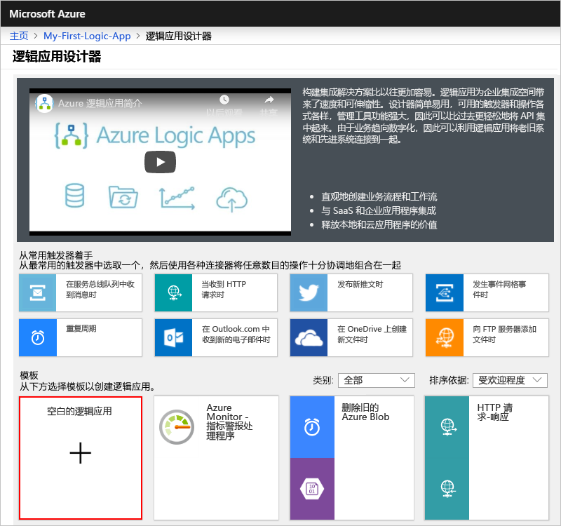

# <a name="tutorial-use-form-recognizer-with-azure-logic-apps-to-analyze-invoices"></a>教程：使用表单识别器和 Azure 逻辑应用分析发票

在本教程中，你将在 Azure 逻辑应用中创建一个使用表单识别器（Azure 认知服务套件的一部分服务）从发票提取数据的工作流。 首先使用示例数据集训练表单识别器模型，然后在另一个数据集上测试模型。

本教程的内容：

> [!div class="checklist"]
> * 请求表单识别器的访问权限
> * 创建 Azure 存储 blob 容器
> * 将示例数据上传到 Azure blob 容器
> * 创建 Azure 逻辑应用
> * 配置逻辑应用以使用表单识别器资源
> * 运行逻辑应用测试工作流

## <a name="prerequisites"></a>必备条件

* Azure 订阅 - [免费创建订阅](https://azure.microsoft.com/free/)。

## <a name="understand-the-invoice-to-be-analyzed"></a>了解要分析的发票

用于训练和测试模型的示例数据集在 [GitHub](https://go.microsoft.com/fwlink/?linkid=2090451) 中以 .zip 文件形式提供。 下载并提取 .zip 文件，然后在“/Train”文件夹下打开发票 PDF 文件  。 请注意，它有一个包含发票号、发票日期等项目的表。 

> [!div class="mx-imgBorder"]
> 

本教程介绍如何使用 Azure 逻辑应用工作流将信息从这样的表中提取为 JSON 格式。

## <a name="create-an-azure-storage-blob-container"></a>创建 Azure 存储 blob 容器

使用此容器上传训练模型所需的示例数据。

1. 按照[创建 Azure 存储帐户](../../storage/common/storage-account-create.md)中的说明创建存储帐户。 使用“formrecostorage”作为存储帐户名  。
1. 按照[创建 Azure blob 容器](../../storage/blobs/storage-quickstart-blobs-portal.md)中的说明在 Azure 存储帐户中创建容器。 使用“formrecocontainer”作为容器名称  。 请确保将公共访问级别设置为“容器(对容器和 Blob 进行匿名读取访问)”  。

    > [!div class="mx-imgBorder"]
    > 

## <a name="upload-sample-data-to-the-azure-blob-container"></a>将示例数据上传到 Azure blob 容器

下载 [GitHub](https://go.microsoft.com/fwlink/?linkid=2090451) 上提供的示例数据。 将数据提取到本地文件夹，并将“/Train”文件夹的内容上传到先前创建的“formrecocontainer”   。 按照[上传块 Blob](../../storage/blobs/storage-quickstart-blobs-portal.md#upload-a-block-blob) 中的说明将数据上传到容器。

复制容器的 URL。 需要在本教程的后面部分使用此 URL。 如果使用与本教程中列出的相同名称创建了存储帐户和容器，则 URL 将为 https:\//formrecostorage.blob.core.windows.net/formrecocontainer/  。

## <a name="create-a-form-recognizer-resource"></a>创建表单识别器资源

[!INCLUDE [create resource](./includes/create-resource.md)]

## <a name="create-your-logic-app"></a>创建逻辑应用

可以使用 Azure 逻辑应用来自动化和编排任务和工作流。 在本教程中，你将创建一个逻辑应用，该应用通过接收要作为电子邮件附件进行分析的发票而触发。 在本工作流中，你可执行以下任务：
* 将逻辑应用配置为在收到附有发票的电子邮件时自动触发。
* 将逻辑应用配置为使用表单识别器“训练模型”操作以使用上传到 Azure Blob 存储的示例数据训练模型  。
* 将逻辑应用配置为使用表单识别器“分析表单”操作以使用已训练的模型  。 此组件将根据先前训练的模型分析提供给此逻辑应用的发票。

请按以下步骤设置工作流。

1. 在 Azure 主菜单中，依次选择“创建资源” > “集成” > “逻辑应用”。   

1. 在“创建逻辑应用”下，提供有关逻辑应用的详细信息，如下所示。  完成后，选择“创建”  。

   | properties | 值 | 说明 |
   |----------|-------|-------------|
   | **名称** | <*logic-app-name*> | 逻辑应用名称，只能包含字母、数字、连字符 (`-`)、下划线 (`_`)、括号（`(`、`)`）和句点 (`.`)。 此示例使用“My-First-Logic-App”。 |
   | **订阅** | <*Azure-subscription-name*> | Azure 订阅名称 |
   | **资源组** | <*Azure-resource-group-name*> | 用于组织相关资源的 [Azure 资源组](./../../azure-resource-manager/management/overview.md)的名称。 此示例使用“My-First-LA-RG”。 |
   | **位置** | <*Azure-region*> | 用于存储逻辑应用信息的区域。 此示例使用“美国西部”。 |
   | **Log Analytics** | 关闭 | 对于诊断日志记录，请保留“关闭”设置。  |
   ||||

1. 在 Azure 部署你的应用后，在 Azure 工具栏上，选择“通知”   > “转到资源”  ，查看你部署的逻辑应用。 或者，可以通过在搜索框中键入名称来查找和选择逻辑应用。

   逻辑应用设计器打开并显示一个包含简介视频和常用触发器的页面。   在“模板”下选择“空白逻辑应用”。

   > [!div class="mx-imgBorder"]
   > 

### <a name="configure-the-logic-app-to-trigger-the-workflow-when-an-email-arrives"></a>配置逻辑应用以在收到电子邮件时触发工作流

在本教程中，当收到带有附有发票的电子邮件时，将触发工作流。 本教程使用 Office 365 作为电子邮件服务，但你可以使用自己想要使用的任何其他电子邮件提供程序。

1. 从选项卡中，依次选择“全部”、“Office 365 Outlook”，然后在“触发器”下，选择“收到新电子邮件时”    。

    

1. 在“Office 365 Outlook”框中，单击“登录”，然后输入详细信息以登录到 Office 365 帐户   。

1. 在下一个对话框中，执行以下步骤。
    1. 选择应监视任何新电子邮件的文件夹。
    1. 对于“带有附件”，请选择“是”   。 这确保只有带有附件的电子邮件才会触发工作流。
    1. 对于“包括附件”，请选择“是”   。 这样可以确保在下游处理中使用附件的内容。

        > [!div class="mx-imgBorder"]
        > 

1. 单击顶部工具栏中的“保存”  。

### <a name="configure-the-logic-app-to-use-form-recognizer-train-model-operation"></a>配置逻辑应用以使用表单识别器训练模型操作

在使用表单识别器服务分析发票之前，你需要通过向模型提供一些示例发票数据来训练模型，以便模型能够对这些数据进行分析和学习。

1. 选择“新建步骤”，然后在“选择操作”下，搜索“表单识别器”    。 从显示的结果中，选择“表单识别器”，然后在可用于表单识别器的操作下，选择“训练模型”   。

    > [!div class="mx-imgBorder"]
    > 

1. 在“表单识别器”对话框中，提供连接的名称，并输入为表单识别器资源检索的终结点 URL 和密钥。

    > [!div class="mx-imgBorder"]
    > 

    单击“创建”。 

1. 在“训练模型”对话框中，对于“源”，输入上传示例数据的容器的 URL   。

    > [!div class="mx-imgBorder"]
    > 

1. 单击顶部工具栏中的“保存”  。

### <a name="configure-the-logic-app-to-use-the-form-recognizer-analyze-form-operation"></a>配置逻辑应用以使用表单识别器分析表单操作

在本节中，将“分析表单”操作添加到工作流中  。 此操作使用已训练的模型来分析提供给逻辑应用的新发票。

1. 选择“新建步骤”，然后在“选择操作”下，搜索“表单识别器”    。 从显示的结果中，选择“表单识别器”，然后在可用于表单识别器的操作下，选择“分析表单”   。

    > [!div class="mx-imgBorder"]
    > 

1. 在“分析表单”对话框中执行以下步骤  ：

    1. 单击“模型 ID”文本框，然后在打开的对话框中的“动态内容”选项卡下，选择“modelId”    。 通过执行此操作，可以为流应用程序提供上一节中训练的模型的模型 ID。

        > [!div class="mx-imgBorder"]
        > 

    2. 单击“文档”文本框，然后在打开的对话框中的“动态内容”选项卡下，选择“附件内容”    。 这样就会将流配置为使用电子邮件中附有的示例发票文件来触发工作流。

        > [!div class="mx-imgBorder"]
        > 

1. 单击顶部工具栏中的“保存”  。

### <a name="extract-the-table-information-from-the-invoice"></a>从发票中提取表信息

在此部分，我们配置逻辑应用以提取发票中的表信息。

1. 选择“添加操作”，然后在“选择操作”下，搜索“撰写”，然后在可用的操作下，再次选择“撰写”     。
    

1. 在“撰写”对话框中，单击“输入”文本框，然后从弹出的对话框中选择“表”    。

    > [!div class="mx-imgBorder"]
    > 

1. 单击“ **保存**”。

## <a name="test-your-logic-app"></a>测试逻辑应用

若要测试逻辑应用，请使用从 [GitHub](https://go.microsoft.com/fwlink/?linkid=2090451) 下载的示例数据集的“/Test”文件夹中的示例发票  。 执行以下步骤:

1. 在应用的 Azure 逻辑应用设计器中，从顶部的工具栏中选择“运行”  。 工作流现在处于活动状态，等待收到附有发票的电子邮件。
1. 将一封附有发票的电子邮件发动到创建逻辑应用时所提供的电子邮件地址。 确保在配置逻辑应用时将电子邮件发送到你所提供的文件夹。
1. 将电子邮件发送到文件夹后，逻辑应用设计器就会显示一个屏幕，其中显示每个阶段的进度。 在下面的屏幕截图中，你可以看到已收到带有附件的电子邮件，并且工作流正在进行中。

    > [!div class="mx-imgBorder"]
    > 

1. 工作流的所有阶段运行完毕后，逻辑应用设计器会在每个阶段显示一个绿色复选框。 在设计器窗口中，选择”每 2 个“，然后选择“撰写”   。

    > [!div class="mx-imgBorder"]
    > 

    从“输出”框中，复制输出并将其粘贴到任何文本编辑器中  。

1. 将 JSON 输出与你在电子邮件中作为附件发送的示例发票进行比较。 验证 JSON 数据是否与发票中的表中的数据对应。

    ```json
    [
      {
        "id": "table_0",
        "columns": [
          {
            "header": [
              {
                "text": "Invoice Number",
                "boundingBox": [
                  38.5,
                  585.2,
                  113.4,
                  585.2,
                  113.4,
                  575.8,
                  38.5,
                  575.8
                ]
              }
            ],
            "entries": [
              [
                {
                  "text": "7689302",
                  "boundingBox": [
                    38.5,
                    549.8,
                    77.3,
                    549.8,
                    77.3,
                    536.2,
                    38.5,
                    536.2
                  ],
                  "confidence": 1
                }
              ]
            ]
          },
          {
            "header": [
              {
                "text": "Invoice Date",
                "boundingBox": [
                  139.7,
                  585.2,
                  198.5,
                  585.2,
                  198.5,
                  575.8,
                  139.7,
                  575.8
                ]
              }
            ],
            "entries": [
              [
                {
                  "text": "3/09/2015",
                  "boundingBox": [
                    139.7,
                    548.1,
                    184,
                    548.1,
                    184,
                    536.2,
                    139.7,
                    536.2
                  ],
                  "confidence": 1
                }
              ]
            ]
          },
          {
            "header": [
              {
                "text": "Invoice Due Date",
                "boundingBox": [
                  240.5,
                  585.2,
                  321,
                  585.2,
                  321,
                  575.8,
                  240.5,
                  575.8
                ]
              }
            ],
            "entries": [
              [
                {
                  "text": "6/29/2016",
                  "boundingBox": [
                    240.5,
                    549,
                    284.8,
                    549,
                    284.8,
                    536.2,
                    240.5,
                    536.2
                  ],
                  "confidence": 1
                }
              ]
            ]
          },
          {
            "header": [
              {
                "text": "Charges",
                "boundingBox": [
                  341.3,
                  585.2,
                  381.2,
                  585.2,
                  381.2,
                  575.8,
                  341.3,
                  575.8
                ]
              }
            ],
            "entries": [
              [
                {
                  "text": "$22,123.24",
                  "boundingBox": [
                    380.6,
                    548.5,
                    430.5,
                    548.5,
                    430.5,
                    536.2,
                    380.6,
                    536.2
                  ],
                  "confidence": 1
                }
              ]
            ]
          },
          {
            "header": [
              {
                "text": "VAT ID",
                "boundingBox": [
                  442.1,
                  590,
                  474.8,
                  590,
                  474.8,
                  575.8,
                  442.1,
                  575.8
                ]
              }
            ],
            "entries": [
              [
                {
                  "text": "QR",
                  "boundingBox": [
                    447.7,
                    549.8,
                    462.6,
                    549.8,
                    462.6,
                    536.2,
                    447.7,
                    536.2
                  ],
                  "confidence": 1
                }
              ]
            ]
          }
        ]
      }
    ]
    ```
    已成功完成本教程！

## <a name="next-steps"></a>后续步骤

在本教程中，将设置一个 Azure 逻辑应用工作流，使用表单识别器来训练模型并提取发票的内容。 接下来，了解如何生成定型数据集，以便可以使用自己的表单创建类似的方案。

> [!div class="nextstepaction"]
> [生成训练数据集](build-training-data-set.md)