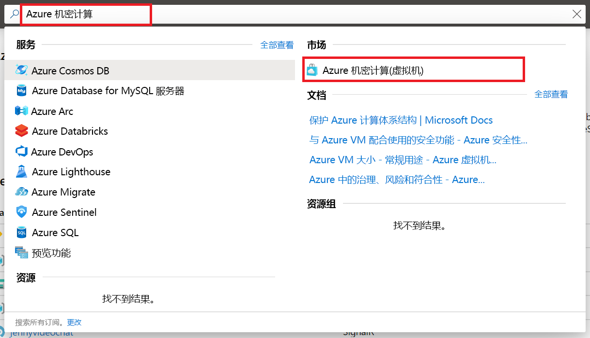
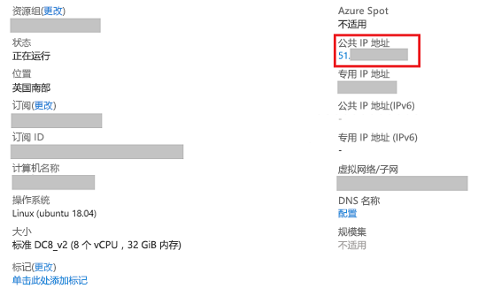

# <a name="quickstart-deploy-an-azure-confidential-computing-vm-in-the-marketplace"></a>快速入门：在市场中部署 Azure 机密计算 VM

使用 Azure 市场创建由 Intel SGX 提供支持的虚拟机 (VM)，以开始使用 Azure 机密计算。 然后，安装 Open Enclave 软件开发工具包 (OE SDK) 以设置开发环境。 

如果你想要快速开始部署机密计算虚拟机，建议参考本教程。 VM 在专用硬件上运行，要求提供特定的配置输入才能按预期方式运行。 本快速入门中所述的市场产品/服务通过限制用户输入来简化虚拟机的部署。

如果你想要采用自定义程度更高的配置部署机密计算虚拟机，请遵循 [Azure 门户中的机密计算虚拟机部署步骤](quick-create-portal.md)。

## <a name="prerequisites"></a>先决条件

如果还没有 Azure 订阅，可以在开始前[创建一个帐户](https://azure.microsoft.com/pricing/purchase-options/pay-as-you-go/)。

> [!NOTE]
> 免费试用帐户无法访问本教程中使用的虚拟机。 请升级到即用即付订阅。

## <a name="sign-in-to-azure"></a>登录 Azure

1. 登录 [Azure 门户](https://portal.azure.com/)。

1. 在顶部的搜索栏中键入“Azure 机密计算”  。

1. 在“市场”部分中选择“Azure 机密计算(虚拟机)”   。 

        

1. 在 Azure 机密计算部署登陆页面上，选择“创建”  。
 

## <a name="configure-your-virtual-machine"></a>配置虚拟机

1. 在“基本信息”选项卡中，选择自己的**订阅**和**资源组**。  资源组必须是空的，这样才能基于此模板将虚拟机部署到其中。

1. 键入或选择以下值：

   * **区域**：选择合适的 Azure 区域。

        > [!NOTE]
        > 机密计算虚拟机仅在特定区域中可用的专用硬件上运行。 有关 DCsv2 系列 VM 的最新可用区域，请参阅[可用区域](https://azure.microsoft.com/global-infrastructure/services/?products=virtual-machines)。
    
    * **选择映像**：选择任意映像。 若要完成本特定教程，请选择“Ubuntu 18.04 (Gen 2)”。 否则，你将重定向到下面的相应步骤。 

    * 在“虚拟机名称”中，为新 VM 输入一个名称  。

    * **身份验证类型**：如果你要创建 Linux VM，请选择“SSH 公钥”  。 

         > [!NOTE]
         > 可以选择使用“SSH 公钥”或“密码”进行身份验证。 SSH 更安全。 有关如何生成 SSH 密钥的说明，请参阅[在 Linux 和 Mac 上为 Azure 中的 Linux VM 创建 SSH 密钥](https://docs.microsoft.com/azure/virtual-machines/virtual-machines-linux-mac-create-ssh-keys)。

    * **用户名**：输入 VM 的管理员名称。

    * **SSH 公钥**：如果适用，请输入你的 RSA 公钥。
    
    * **密码**：如果适用，请输入你的身份验证密码。
 
1. 选择页面底部的“下一步:  虚拟机设置”按钮。

    > [!IMPORTANT]
    > 等待页面更新。 不应有消息指出“机密计算 DCsv2 系列 VM 在有限数量的区域中可用。  ” 如果此消息持续出现，请返回上一页，并选择一个可用的 DCsv2 系列区域。

1. 对于“更改大小”，请在大小选择器中选择具有机密计算功能的 VM  。 

    > [!TIP]
    > 你应会看到大小“DC1s_v2”、“DC2s_v2”、“DC4s_V2”和“DC8_v2”     。 这是目前仅有的支持机密计算的虚拟机大小。 [了解详细信息](virtual-machine-solutions.md)。

1. 对于“OS 磁盘类型”，请选择一个磁盘类型  。

1. 对于“虚拟网络”，请新建一个或者从现有资源中选择一个虚拟网络  。

1. 对于“子网”，请新建一个或者从现有资源中选择一个子网  。

1. 对于“选择公共入站端口”，请选择“SSH(Linux)/RDP(Windows)”   。 在本快速入门中，必须执行此步骤才能连接到 VM 并完成 Open Enclave SDK 配置。 

1. 对于“启动诊断”，在本快速入门中请将其保持禁用状态  。 

1. 选择“查看 + 创建”  。

1. 在“查看 + 创建”窗格中，选择“创建”。  

> [!NOTE]
> 如果已部署了 Linux VM，请转到下一部分继续学习本教程。 如果部署了 Windows VM，请[遵循这些步骤连接到 Windows VM](../virtual-machines/windows/connect-logon.md)，然后[在 Windows 上安装 OE SDK](https://github.com/openenclave/openenclave/blob/master/docs/GettingStartedDocs/install_oe_sdk-Windows.md)。


## <a name="connect-to-the-linux-vm"></a>连接到 Linux VM

如果已使用 BASH shell，请通过 ssh 命令连接到 Azure VM。  在以下命令中，替换连接到 Linux VM 所需的 VM 用户名和 IP 地址。

```bash
ssh azureadmin@40.55.55.555
```

可以在 Azure 门户中虚拟机的“概览”部分下找到 VM 的公共 IP 地址。



如果在 Windows 上运行且没有 BASH shell，请安装 SSH 客户端，例如 PuTTY。

1. [下载并安装 PuTTY](https://www.chiark.greenend.org.uk/~sgtatham/putty/download.html)。

1. 运行 PuTTY。

1. 在 PuTTY 配置屏幕上，输入 VM 的公共 IP 地址。

1. 选择“打开”，并根据提示输入用户名和密码。 

若要详细了解如何连接到 Linux VM，请参阅[使用门户在 Azure 上创建 Linux VM](../virtual-machines/linux/quick-create-portal.md)。

> [!NOTE]
> 如果出现有关不会在注册表中缓存服务器主机密钥的 PuTTY 安全警报，请从以下选项中进行选择。 如果你信任此主机，请选择“是”将密钥添加到 PuTTy 缓存并继续进行连接。  如果你只想建立连接一次，而无需将密钥添加到缓存，请选择“否”。  如果你不信任此主机，请选择“取消”以放弃连接。 

## <a name="install-the-open-enclave-sdk-oe-sdk"></a>安装 Open Enclave SDK (OE SDK) <a id="Install"></a>

按照分步说明在运行 Ubuntu 18.04 LTS Gen 2 映像的 DCsv2 系列虚拟机上安装 [OE SDK](https://github.com/openenclave/openenclave)。 

如果虚拟机在 Ubuntu 16.04 LTS Gen 2 上运行，则需要按照[适用于 Ubuntu 16.04 的安装说明](https://github.com/openenclave/openenclave/blob/master/docs/GettingStartedDocs/install_oe_sdk-Ubuntu_16.04.md)进行操作。 

#### <a name="1-configure-the-intel-and-microsoft-apt-repositories"></a>1.配置 Intel 和 Microsoft APT 存储库

```bash
echo 'deb [arch=amd64] https://download.01.org/intel-sgx/sgx_repo/ubuntu bionic main' | sudo tee /etc/apt/sources.list.d/intel-sgx.list
wget -qO - https://download.01.org/intel-sgx/sgx_repo/ubuntu/intel-sgx-deb.key | sudo apt-key add -

echo "deb http://apt.llvm.org/bionic/ llvm-toolchain-bionic-7 main" | sudo tee /etc/apt/sources.list.d/llvm-toolchain-bionic-7.list
wget -qO - https://apt.llvm.org/llvm-snapshot.gpg.key | sudo apt-key add -

echo "deb [arch=amd64] https://packages.microsoft.com/ubuntu/18.04/prod bionic main" | sudo tee /etc/apt/sources.list.d/msprod.list
wget -qO - https://packages.microsoft.com/keys/microsoft.asc | sudo apt-key add -
```

#### <a name="2-install-the-intel-sgx-dcap-driver"></a>2.安装 Intel SGX DCAP 驱动程序

```bash
sudo apt update
sudo apt -y install dkms
wget https://download.01.org/intel-sgx/sgx-dcap/1.4/linux/distro/ubuntuServer18.04/sgx_linux_x64_driver_1.21.bin -O sgx_linux_x64_driver.bin
chmod +x sgx_linux_x64_driver.bin
sudo ./sgx_linux_x64_driver.bin
```

> [!WARNING]
> 请使用 [Intel SGX 站点](https://01.org/intel-software-guard-extensions/downloads)中的最新 Intel SGX DCAP 驱动程序。

#### <a name="3-install-the-intel-and-open-enclave-packages-and-dependencies"></a>3.安装 Intel 和 Open Enclave 包与依赖项

```bash
sudo apt -y install clang-7 libssl-dev gdb libsgx-enclave-common libsgx-enclave-common-dev libprotobuf10 libsgx-dcap-ql libsgx-dcap-ql-dev az-dcap-client open-enclave
```

> [!NOTE] 
> 此步骤还会安装 [az-dcap-client](https://github.com/microsoft/azure-dcap-client) 包，在 Azure 中执行远程认证时需要此包。

#### <a name="4-verify-the-open-enclave-sdk-install"></a>4.**验证 Open Enclave SDK 安装**

参阅 GitHub 上的[使用 Open Enclave SDK](https://github.com/openenclave/openenclave/blob/master/docs/GettingStartedDocs/Linux_using_oe_sdk.md) 来验证和使用已安装的 SDK。

## <a name="clean-up-resources"></a>清理资源

当不再需要时，可以删除资源组、虚拟机和所有相关资源。 

选择虚拟机的资源组，然后选择“删除”  。 确认资源组名称，以完成资源删除。

## <a name="next-steps"></a>后续步骤

在本快速入门中，你部署了一个机密计算虚拟机，并安装了 Open Enclave SDK。 有关 Azure 上的机密计算虚拟机的详细信息，请参阅[有关虚拟机的解决方案](virtual-machine-solutions.md)。 

如果你部署了 Windows VM，请使用 GitHub 上的[适用于 Windows 的 OE SDK 示例](https://github.com/openenclave/openenclave/blob/master/samples/README_Windows.md)了解如何构建应用程序。 

继续参阅 GitHub 上的 Open Enclave SDK Linux 示例，了解如何在 Linux 上构建机密计算应用程序。 

> [!div class="nextstepaction"]
> [在 Linux 上构建 Open Enclave SDK 示例](https://github.com/openenclave/openenclave/blob/master/samples/README_Linux.md)
