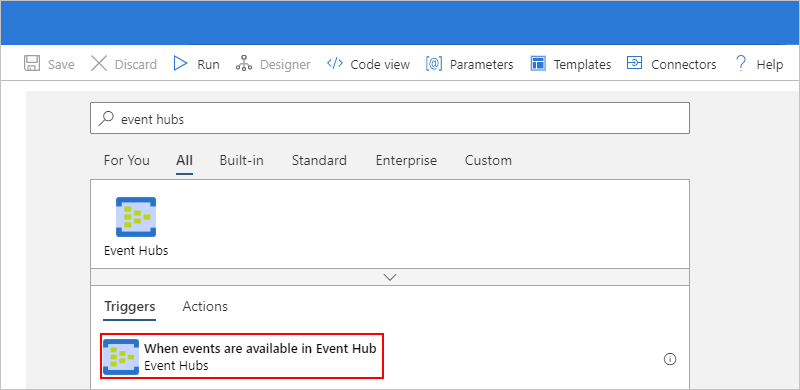

# 通过事件中心连接器监视、接收和发送事件

若要设置事件监视器，以便逻辑应用检测、接收和发送事件，请从逻辑应用连接到 [Azure 事件中心](https://azure.microsoft.com/services/event-hubs)。 了解有关 [Azure 事件中心](../event-hubs/event-hubs-what-is-event-hubs.md)的详细信息。

## 要求

* 必须在 Azure 中有[事件中心命名空间和事件中心](../event-hubs/event-hubs-create.md)。 了解[如何创建事件中心命名空间和事件中心](../event-hubs/event-hubs-create.md)。 

* 若要在逻辑应用中使用[任意连接器](https://docs.microsoft.com/azure/connectors/apis-list)，必须先创建逻辑应用。 了解[如何创建逻辑应用](../logic-apps/logic-apps-create-a-logic-app.md)。

## 检查事件中心命名空间权限，找到连接字符串

若要让逻辑应用访问某个服务，必须在逻辑应用和该服务之间创建[连接](./connectors-overview.md)（如果尚未创建）。** 该连接授权逻辑应用访问数据。
若要让逻辑应用访问事件中心，你必须有事件中心命名空间的“管理”权限和连接字符串。****

若要检查权限并获取连接字符串，请执行以下步骤。

1.  登录 [Azure 门户](https://portal.azure.com "Azure portal")。 

2.  转到事件中心命名空间，而不是特定的事件中心。** 在命名空间边栏选项卡的“设置”下，选择“共享访问策略”。**** 在“声明”下，检查你是否有该命名空间的“管理”权限。****

    

3.  若要复制事件中心命名空间的连接字符串，请选择 **RootManageSharedAccessKey**。 在主密钥连接字符串旁边选择复制按钮。

    

    > [!TIP]
    > 若要确认连接字符串是与你的事件中心命名空间关联，还是与特定的事件中心关联，请检查该连接字符串中是否存在 `EntityPath` 参数。 如果找到了该参数，则说明连接字符串适用于特定的事件中心“实体”，不是适用于你的逻辑应用的正确字符串。

4.  现在（在向逻辑应用添加事件中心触发器或操作以后），当系统提示你输入凭据时，你就可以连接到事件中心命名空间。 为连接提供一个名称，输入复制的连接字符串，然后选择“创建”。****

    

    创建连接以后，连接名称应显示在事件中心触发器或操作中。 
    然后，你可以继续逻辑应用中的其他步骤。

    

## 当事件中心接收新事件时启动工作流

[触发器](../logic-apps/logic-apps-what-are-logic-apps.md#logic-app-concepts)是一个事件，在逻辑应用中启动工作流。** 若要在新事件发送到事件中心时启动工作流，请执行以下步骤，以便添加用于检测该事件的触发器。

1.  在 [Azure 门户](https://portal.azure.com "Azure 门户")中转到现有的逻辑应用，或者创建一个空白逻辑应用。

2.  在逻辑应用设计器的搜索框中，输入 `event hubs` 作为筛选器。 选择此触发器：**当事件在事件中心可用时**

    

    如果你还没有到事件中心命名空间的连接，此时系统会提示你创建该连接。 为连接提供一个名称，然后输入事件中心命名空间的连接字符串。 
    必要时请参阅[如何查找连接字符串](#permissions-connection-string)。

    

    创建连接后，将会显示“当事件在事件中心可用时”触发器的设置。****

    

3.  输入或选择要监视的事件中心的名称。 根据你想多久一次检查事件中心，选择频率和时间间隔。

    > [!TIP]
    > （可选）若要选择一个用于读取事件的使用者组，请选择“显示高级选项”。**** 

    

    你现在已设置一个用于启动逻辑应用工作流的触发器。 
    逻辑应用会根据所设计划检查指定的事件中心。 
    如果你的应用在事件中心发现新事件，则触发器会在逻辑应用中运行其他操作或触发器。

## 将事件从逻辑应用发送到事件中心

[*操作*](../logic-apps/logic-apps-what-are-logic-apps.md#logic-app-concepts)是逻辑应用工作流执行的任务。 将触发器添加到逻辑应用后，可以添加一个操作，以便使用该触发器生成的数据执行操作。 若要将事件从逻辑应用发送到事件中心，请执行以下步骤。

1.  在逻辑应用设计器的逻辑应用触发器下，选择“新步骤” > “添加操作”。****

    

    现在可以查找并选择要执行的操作。 
    虽然你可以选择任何操作，但在此示例中，我们需要使用事件中心操作来发送事件。

2.  在搜索框中，输入 `event hubs` 作为筛选器。
选择此操作：**发送事件**

    

3.  输入事件的必要详细信息，例如要向其发送事件的事件中心的名称。 输入与事件有关的任何其他可选详细信息，例如该事件的内容。

    > [!TIP]
    > （可选）若要指定事件中心分区，以便向其发送事件，请选择“显示高级选项”。**** 

    

6.  保存所做更改。

    

    你现在已设置一个用于从逻辑应用发送事件的操作。 

## 查看 Swagger
请参阅 [Swagger 详细信息](/connectors/eventhubs/)。 

## 获取帮助

若要提问、解答问题和了解其他 Azure 逻辑应用用户的活动，请访问 [Azure 逻辑应用论坛](https://social.msdn.microsoft.com/Forums/en-US/home?forum=azurelogicapps)。

为了帮助我们改进逻辑应用和连接器，敬请在[逻辑应用用户反馈站点](http://aka.ms/logicapps-wish)上投票或发表看法。

## 后续步骤

*  [查找适用于 Azure 逻辑应用的其他连接器](./apis-list.md)
