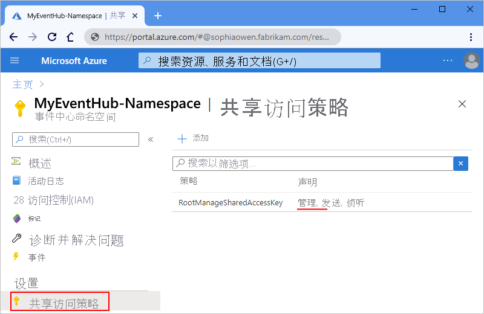
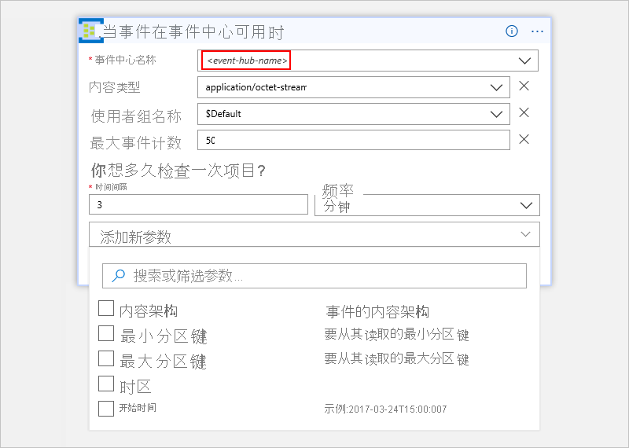
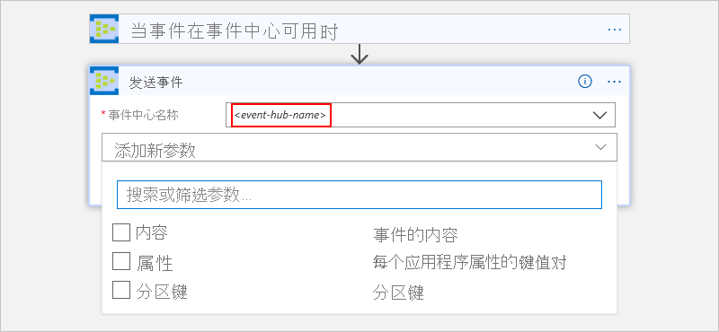
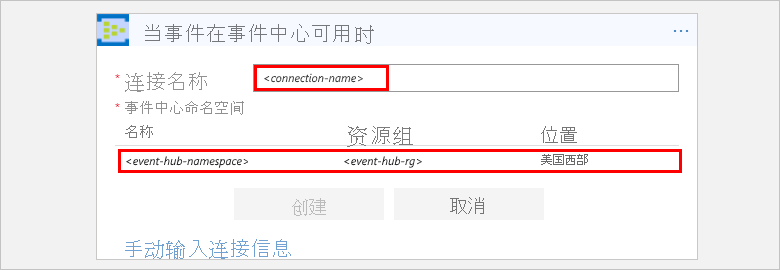

# 使用 Azure 事件中心和 Azure 逻辑应用监视、接收和发送事件

本文演示如何使用 Azure 事件中心连接器监视和管理从逻辑应用发送到 [Azure 事件中心](../event-hubs/event-hubs-what-is-event-hubs.md)的事件。 通过这样的方式可以创建逻辑应用，从事件中心自动执行检查、发送和接收事件的任务和工作流。 特定于连接器的技术信息，请参阅[Azure 事件中心连接器参考](https://docs.microsoft.com/connectors/eventhubs/)</a>。

## 必备组件

* Azure 订阅。 如果没有 Azure 订阅，请[注册一个免费 Azure 帐户](https://azure.microsoft.com/free/)。 

* [Azure 事件中心命名空间和事件中心](../event-hubs/event-hubs-create.md)

* 要在其中访问事件中心的逻辑应用。 若要通过 Azure 事件中心触发器启动逻辑应用，需要一个[空白逻辑应用](../logic-apps/quickstart-create-first-logic-app-workflow.md)。
如果不熟悉逻辑应用，请查看[什么是 Azure 逻辑应用](../logic-apps/logic-apps-overview.md)和[快速入门：创建第一个逻辑应用](../logic-apps/quickstart-create-first-logic-app-workflow.md)。

## 检查权限并获取连接字符串

要使逻辑应用能够访问事件中心，请检查权限并获取事件中心命名空间的连接字符串。

1. 登录到 [Azure 门户](https://portal.azure.com)。

1. 转到事件中心命名空间，而不是特定的事件中心。 

1. 在命名空间菜单上，在**设置**，选择**共享访问策略**。 在“声明”下，检查你是否有该命名空间的“管理”权限。

   

1. 如果想要以后手动输入连接信息，请获取事件中心命名空间的连接字符串。

   1. 在“策略”下，选择“RootManageSharedAccessKey”。

   1. 查找主键的连接字符串。 选择复制按钮，并保存连接字符串供以后使用。

      

      > [!TIP]
      > 若要确认连接字符串是与事件中心命名空间关联，还是与特定的事件中心关联，请确保该连接字符串不具有 `EntityPath` 参数。 如果找到了该参数，则说明连接字符串适用于特定的事件中心“实体”，不是适用于逻辑应用的正确字符串。

1. 现在继续[添加事件中心触发器](#add-trigger)或[添加事件中心操作](#add-action)。

## 添加事件中心触发器

在 Azure 逻辑应用中，每个逻辑应用都必须从[触发器](../logic-apps/logic-apps-overview.md#logic-app-concepts)开始，该触发器在发生特定事件或特定条件得到满足的情况下触发。 每当触发器触发时，逻辑应用引擎就会创建一个逻辑应用实例并开始运行应用的工作流。

此示例演示在将新事件发送到事件中心时，如何启动逻辑应用工作流。 

1. 在 Azure 门户或 Visual Studio 中创建一个空白的逻辑应用，以便打开逻辑应用设计器。 此示例使用 Azure 门户。

1. 在搜索框中，输入“事件中心”作为筛选器。 从触发器列表中选择此触发器：**事件是在事件中心的事件中心可用时**

   

1. 如果系统提示输入连接详细信息，请[立即创建事件中心连接](#create-connection)。 

1. 在触发器中，提供有关你想要监视的事件中心的信息。 更多属性，打开**添加新参数**列表。 选择一个参数将该属性添加到触发器卡。

   

   | 属性 | 需要 | 描述 |
   |----------|----------|-------------|
   | **事件中心名称** | 是 | 你想要监视的事件中心名称 |
   | **内容类型** | 否 | 事件的内容类型。 默认为 `application/octet-stream`。 |
   | **使用者组名称** | 否 | [事件中心使用者组名称](../event-hubs/event-hubs-features.md#consumer-groups)要用于读取事件。 如果未指定，则使用默认使用者组。 |
   | **最大事件计数** | 否 | 最大事件数。 触发器返回的事件数至少为 1，至多为此属性指定的事件数。 |
   | 间隔 | 是 | 一个正整数，用于描述工作流的运行频率按的频率 |
   | **频率** | 是 | 定期计划的时间单位 |
   ||||

   **其他属性**

   | 属性 | 需要 | 描述 |
   |----------|----------|-------------|
   | **内容架构** | 否 | 要从事件中心读取的事件 JSON 内容架构。 例如，如果指定的内容架构，可以触发逻辑应用与架构匹配的事件。 |
   | **最小分区键** | 否 | 输入要读取的最小[分区](../event-hubs/event-hubs-features.md#partitions) ID。 默认读取所有分区。 |
   | **最大分区键** | 否 | 输入要读取的最大[分区](../event-hubs/event-hubs-features.md#partitions) ID。 默认读取所有分区。 |
   | **时区** | 否 | 仅适用于您指定的开始时间，因为此触发器不接受 UTC 偏移量。 选择要应用的时区。 
有关详细信息，请参阅[创建和运行重复任务和使用 Azure 逻辑应用工作流](../connectors/connectors-native-recurrence.md)。 |
   | **开始时间** | 否 | 按以下格式提供开始时间： 
如果选择了时区，则格式为 YYYY-MM-DDThh:mm:ss
-或-
如果未选择时区，则格式为 YYYY-MM-DDThh:mm:ssZ
有关详细信息，请参阅[创建和运行重复任务和使用 Azure 逻辑应用工作流](../connectors/connectors-native-recurrence.md)。 |
   ||||

1. 完成后，请在设计器工具栏上选择“保存”。

1. 现在请继续向逻辑应用添加一个或多个操作，以便完成需对触发器结果执行的任务。 

   例如，若要根据特定值，如类别筛选事件可以添加一个条件，以便**发送事件中心的事件-** 操作发送符合条件的事件。 

> [!NOTE]
> 所有事件中心触发器都是长轮询触发器，这意味着当触发器触发时，触发器将处理所有事件，然后等待 30 秒，让更多事件出现在事件中心。
> 如果在 30 秒内未收到事件，则会跳过触发器运行。 否则，该触发器将继续读取事件，直到事件中心为空。
> 下一次触发器轮询的发生将基于触发器的属性中指定的重复周期间隔。

## 添加事件中心操作

在 Azure 逻辑应用中，[操作](../logic-apps/logic-apps-overview.md#logic-app-concepts)是指工作流中紧跟在某个触发器或另一操作后面执行的一个步骤。 对于此示例，逻辑应用从事件中心触发器开始，该触发器检查事件中心中的新事件。

1. 在 Azure 门户或 Visual Studio 的逻辑应用设计器中打开逻辑应用。 此示例使用 Azure 门户。

1. 在触发器或操作中，选择**新步骤**。

   若要在现有步骤之间添加操作，请将鼠标移到连接箭头上方。 
   选择出现的加号 (**+**)，然后选择“添加操作”。

1. 在搜索框中，输入“事件中心”作为筛选器。
从操作列表中，选择此操作：**发送事件的事件中心**

   

1. 如果系统提示输入连接详细信息，请[立即创建事件中心连接](#create-connection)。 

1. 在操作中，提供有关你想要发送的事件的信息。 更多属性，打开**添加新参数**列表。 选择一个参数将该属性添加到操作卡。

   

   | 属性 | 需要 | 描述 |
   |----------|----------|-------------|
   | **事件中心名称** | 是 | 你想要将事件发送到事件中心 |
   | **内容** | 否 | 要发送的事件内容 |
   | **属性** | 否 | 要发送的应用属性和值 |
   | **分区键** | 否 | [分区](../event-hubs/event-hubs-features.md#partitions)，可向其发送该事件的 ID |
   ||||

   例如，可以将输出从事件中心触发器发送到另一个事件中心：

   

1. 完成后，请在设计器工具栏上选择“保存”。

## 连接到事件中心

[!INCLUDE [Create connection general intro](../../includes/connectors-create-connection-general-intro.md)] 

1. 系统提示输入连接信息时，请提供以下详细信息：

   | 属性 | 需要 | Value | 描述 |
   |----------|----------|-------|-------------|
   | **连接名称** | 是 | <connection-name> | 为连接创建的名称 |
   | **事件中心 Namespace** | 是 | <event-hubs-namespace> | 选择要使用的事件中心命名空间。 |
   |||||  

   例如：

   

   若要手动输入连接字符串，请选择“手动输入连接信息”。 
   了解[如何查找连接字符串](#permissions-connection-string)。

2. 如果尚未选择，请选择要使用的事件中心。 选择“创建”。

   

3. 创建连接后，继续[添加事件中心触发器](#add-trigger)或[添加事件中心操作](#add-action)。

## 连接器参考

有关技术详细信息，如触发器、 操作和限制，如所述的连接器的 OpenAPI (以前称为 Swagger) 文件，请参阅[连接器的参考页](/connectors/eventhubs/)。

## 后续步骤

了解其他[逻辑应用连接器](../connectors/apis-list.md)