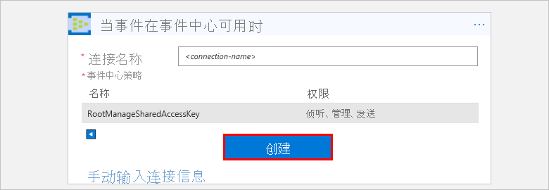

# 通过事件中心连接器监视、接收和发送事件

若要设置事件监视器，以便逻辑应用检测、接收和发送事件，请从逻辑应用连接到 [Azure 事件中心](https://azure.microsoft.com/services/event-hubs)。 详细了解 [Azure 事件中心](../event-hubs/event-hubs-what-is-event-hubs.md)以及[逻辑应用连接器的定价机制](../logic-apps/logic-apps-pricing.md)。

## 先决条件

在使用事件中心连接器之前，必须具备以下项：

* [Azure 事件中心命名空间和事件中心](../event-hubs/event-hubs-create.md)
* [逻辑应用](../logic-apps/quickstart-create-first-logic-app-workflow.md)

## 连接到 Azure 事件中心

要使逻辑应用能够访问某个服务，必须在逻辑应用与该服务之间创建[连接](./connectors-overview.md)（如果尚未创建）。 该连接授权逻辑应用访问数据。 要使逻辑应用能够访问事件中心，请检查权限并获取事件中心命名空间的连接字符串。

1.  登录 [Azure 门户](https://portal.azure.com "Azure portal")。 

2.  转到事件中心命名空间，而不是特定的事件中心。 在命名空间页上，在“设置”下，选择“共享访问策略”。 在“声明”下，检查你是否有该命名空间的“管理”权限。

    

3. 如果想要以后手动输入连接信息，请获取事件中心命名空间的连接字符串。 选择“RootManageSharedAccessKey”。 在主密钥连接字符串旁边选择复制按钮。 保存连接字符串供以后使用。

    

    > [!TIP]
    > 若要确认连接字符串是与事件中心命名空间关联，还是与特定的事件中心关联，请检查该连接字符串中是否存在 `EntityPath` 参数。 如果找到了该参数，则说明连接字符串适用于特定的事件中心“实体”，不是适用于逻辑应用的正确字符串。

## 当事件中心获得新事件时触发工作流

[触发器](../logic-apps/logic-apps-overview.md#logic-app-concepts)是一个事件，在逻辑应用中启动工作流。 若要在新事件发送到事件中心时启动工作流，请执行以下步骤，以便添加用于检测该事件的触发器。

1. 在 [Azure 门户](https://portal.azure.com "Azure 门户")中转到现有的逻辑应用，或者创建一个空白逻辑应用。

2. 在逻辑应用设计器中，在搜索框中输入“事件中心”作为筛选器。 选择此触发器：**当事件在事件中心可用时**

   

   1. 如果还没有到事件中心命名空间的连接，此时系统会提示创建该连接。 为连接提供一个名称，然后选择要使用的事件中心命名空间。

      

      或者，若要手动输入连接字符串，请选择“手动输入连接信息”。 
      了解[如何查找连接字符串](#permissions-connection-string)。

   2. 现在，选择要使用的事件中心策略，然后选择“创建”。

      

3. 选择要监视的事件中心，并针对何时检查事件中心设置时间间隔和频率。

    

    > [!TIP]
    > （可选）若要选择一个用于读取事件的使用者组，请选择“显示高级选项”。

4. 保存逻辑应用。 在设计器工具栏上，选择“保存”。

现在，当逻辑应用检查所选事件中心并查找新事件时，触发器将针对找到的事件运行逻辑应用中的操作。

## 将事件从逻辑应用发送到事件中心

[*操作*](../logic-apps/logic-apps-overview.md#logic-app-concepts)是逻辑应用工作流执行的任务。 将触发器添加到逻辑应用后，可以添加一个操作，以便使用该触发器生成的数据执行操作。 要将事件从逻辑应用发送到事件中心，请执行以下步骤。

1. 在逻辑应用设计器的触发器下，选择“+ 新建步骤” > “添加操作”。

2. 在搜索框中，输入“事件中心”作为筛选器。
选择此操作：“事件中心 - 发送事件”

   

3. 选择要将事件发送到的事件中心。 然后，输入事件内容和任何其他详细信息。

   

4. 保存逻辑应用。

现在，你已设置了一个用于从逻辑应用发送事件的操作。 

## 特定于连接器的详细信息

若要详细了解由 Swagger 文件和任何限制定义的触发器和操作，请查看[连接器详细信息](/connectors/eventhubs/)。

## 获取支持

* 有关问题，请访问 [Azure 逻辑应用论坛](https://social.msdn.microsoft.com/Forums/en-US/home?forum=azurelogicapps)。
* 若要提交功能建议或对功能建议进行投票，请访问[逻辑应用用户反馈网站](http://aka.ms/logicapps-wish)。

## 后续步骤

* 详细了解[适用于 Azure 逻辑应用的其他连接器](../connectors/apis-list.md)