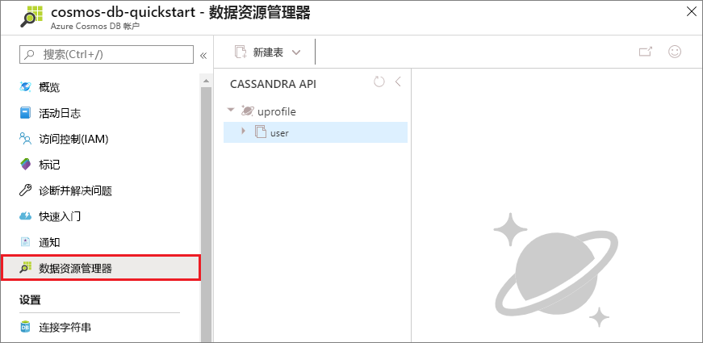

# <a name="quickstart-build-a-cassandra-app-with-python-and-azure-cosmos-db"></a>快速入门：使用 Python 和 Azure Cosmos DB 生成 Cassandra 应用

本快速入门介绍如何使用 Python 和 Azure Cosmos DB [Cassandra API](cassandra-introduction.md)，通过克隆 GitHub 中的示例来生成配置文件应用。 此外，本快速入门还逐步讲解了如何使用基于 Web 的 Azure 门户创建 Azure Cosmos DB 帐户。

Azure Cosmos DB 由 Microsoft 提供，是全球分布的多模型数据库服务。 可快速创建和查询文档、表、键/值和图形数据库，它们都受益于 Azure Cosmos DB 核心的全球分布和横向缩放功能。   

## <a name="prerequisites"></a>先决条件

[!INCLUDE [quickstarts-free-trial-note](../../includes/quickstarts-free-trial-note.md)]或者，无需 Azure 订阅即可[免费试用 Azure Cosmos DB](https://azure.microsoft.com/try/cosmosdb/)，也无需缴纳费用或承诺金。

有权访问 Azure Cosmos DB Cassandra API 预览程序。 如果尚未申请访问权限，请[立即注册](cassandra-introduction.md#sign-up-now)。

此外：
* [Python](https://www.python.org/downloads/) 版本 v2.7.14
* [Git](http://git-scm.com/)
* [Apache Cassandra 的 Python 驱动程序](https://github.com/datastax/python-driver)

## <a name="create-a-database-account"></a>创建数据库帐户

在创建文档数据库之前，需通过 Azure Cosmos DB 创建 Cassandra 帐户。

[!INCLUDE [cosmos-db-create-dbaccount-cassandra](../../includes/cosmos-db-create-dbaccount-cassandra.md)]

## <a name="clone-the-sample-application"></a>克隆示例应用程序

现在从 github 克隆 Cassandra API 应用，设置连接字符串，并运行应用。 会看到以编程方式处理数据是多么容易。 

1. 打开命令提示符，新建一个名为“git-samples”的文件夹，然后关闭命令提示符。

    ```bash
    md "C:\git-samples"
    ```

2. 打开诸如 git bash 之类的 git 终端窗口，并使用 `cd` 命令更改为要安装示例应用的新文件夹。

    ```bash
    cd "C:\git-samples"
    ```

3. 运行下列命令以克隆示例存储库。 此命令在计算机上创建示例应用程序的副本。

    ```bash
    git clone https://github.com/Azure-Samples/azure-cosmos-db-cassandra-python-getting-started.git
    ```

## <a name="review-the-code"></a>查看代码

此步骤是可选的。 如果有意了解如何使用代码创建数据库资源，可以查看以下代码片段。 这些代码片段全部摘自 pyquickstart.py 文件。 否则，可以直接跳转到[更新连接字符串](#update-your-connection-string)。 

* 用户名和密码是使用 Azure 门户中的连接字符串页设置的。 请将 path\to\cert 替换为 X509 证书的路径。

   ```python
    ssl_opts = {
            'ca_certs': 'path\to\cert',
            'ssl_version': ssl.PROTOCOL_TLSv1_2
            }
    auth_provider = PlainTextAuthProvider( username=cfg.config['username'], password=cfg.config['password'])
    cluster = Cluster([cfg.config['contactPoint']], port = cfg.config['port'], auth_provider=auth_provider, ssl_options=ssl_opts)
    session = cluster.connect()
   
   ```

* 使用 contactPoint 信息初始化 `cluster`。 从 Azure 门户中检索 contactPoint。

    ```python
   cluster = Cluster([cfg.config['contactPoint']], port = cfg.config['port'], auth_provider=auth_provider)
    ```

* `cluster` 连接到 Azure Cosmos DB Cassandra API。

    ```python
    session = cluster.connect()
    ```

* 创建新的键空间。

    ```python
   session.execute('CREATE KEYSPACE IF NOT EXISTS uprofile WITH replication = {\'class\': \'NetworkTopologyStrategy\', \'datacenter1\' : \'1\' }')
    ```

* 创建新表。

   ```
   session.execute('CREATE TABLE IF NOT EXISTS uprofile.user (user_id int PRIMARY KEY, user_name text, user_bcity text)');
   ```

* 插入键/值实体。

    ```Python
    insert_data = session.prepare("INSERT INTO  uprofile.user  (user_id, user_name , user_bcity) VALUES (?,?,?)")
    batch = BatchStatement()
    batch.add(insert_data, (1, 'LyubovK', 'Dubai'))
    batch.add(insert_data, (2, 'JiriK', 'Toronto'))
    batch.add(insert_data, (3, 'IvanH', 'Mumbai'))
    batch.add(insert_data, (4, 'YuliaT', 'Seattle'))
    ....
    session.execute(batch)
    ```

* 用于获取所有键值的查询。

    ```Python
    rows = session.execute('SELECT * FROM uprofile.user')
    ```  
    
* 用于获取键-值的查询。

    ```Python
    
    rows = session.execute('SELECT * FROM uprofile.user where user_id=1')
    ```  

## <a name="update-your-connection-string"></a>更新连接字符串

现在返回到 Azure 门户，获取连接字符串信息，并将其复制到应用。 这样，应用程序就可以与托管的数据库进行通信。

1. 在 [Azure 门户](http://portal.azure.com/)中，单击“连接字符串”。 

    使用  复制最上面的值“联系点”。

    

2. 打开 `config.py` 文件。 

3. 粘贴门户中的“联系点”值，并覆盖第 10 行中的 `<FILLME>`。

    第 10 行现在应如下所示 

    `'contactPoint': 'cosmos-db-quickstarts.cassandra.cosmosdb.azure.com:10350'`

4. 复制并粘贴门户中的“用户名”值，并覆盖第 6 行中的 `<FILLME>`。

    第 6 行现在应如下所示 

    `'username': 'cosmos-db-quickstart',`
    
5. 复制并粘贴门户中的“密码”值，并覆盖第 8 行中的 `<FILLME>`。

    第 8 行现在应如下所示

    `'password' = '2Ggkr662ifxz2Mg==`';`

6. 保存 config.py 文件。
    
## <a name="use-the-x509-certificate"></a>使用 X509 证书

1. 如果需要添加 Baltimore CyberTrust 根，它具有序列号 02:00:00:b9 和 SHA1 指纹 d4🇩🇪20:d0:5e:66:fc:53:fe:1a:50:88:2c:78:db:28:52:ca:e4:74。 可以从 https://cacert.omniroot.com/bc2025.crt 下载，然后使用扩展名 .cer 保存到本地文件

2. 打开 pyquickstart.py，并将“path\to\cert”更改为指向新证书。

3. 保存 pyquickstart.py。

## <a name="run-the-app"></a>运行应用

1. 在 git 终端中使用 cd 命令切换到 azure-cosmos-db-cassandra-python-getting-started 文件夹。 

2. 运行以下命令安装所需的模块：

    ```python
    python -m pip install cassandra-driver
    python -m pip install prettytable
    python -m pip install requests
    python -m pip install pyopenssl
    ```

2. 运行以下命令启动 node 应用程序：

    ```
    python pyquickstart.py
    ```

3. 通过命令行验证结果是否符合预期。

    按 CTRL + C 停止执行程序并关闭控制台窗口。 

    
    
    现在，可在 Azure 门户中打开数据资源管理器，查看查询、修改和处理这些新数据。 

    

## <a name="review-slas-in-the-azure-portal"></a>在 Azure 门户中查看 SLA

[!INCLUDE [cosmosdb-tutorial-review-slas](../../includes/cosmos-db-tutorial-review-slas.md)]

## <a name="clean-up-resources"></a>清理资源

[!INCLUDE [cosmosdb-delete-resource-group](../../includes/cosmos-db-delete-resource-group.md)]

## <a name="next-steps"></a>后续步骤

本快速入门介绍了如何创建 Azure Cosmos DB 帐户、如何使用数据资源管理器创建容器，以及如何运行应用。 现在可以将其他数据导入 Cosmos DB 帐户。 

> [!div class="nextstepaction"]
> [将 Cassandra 数据导入 Azure Cosmos DB](cassandra-import-data.md)

