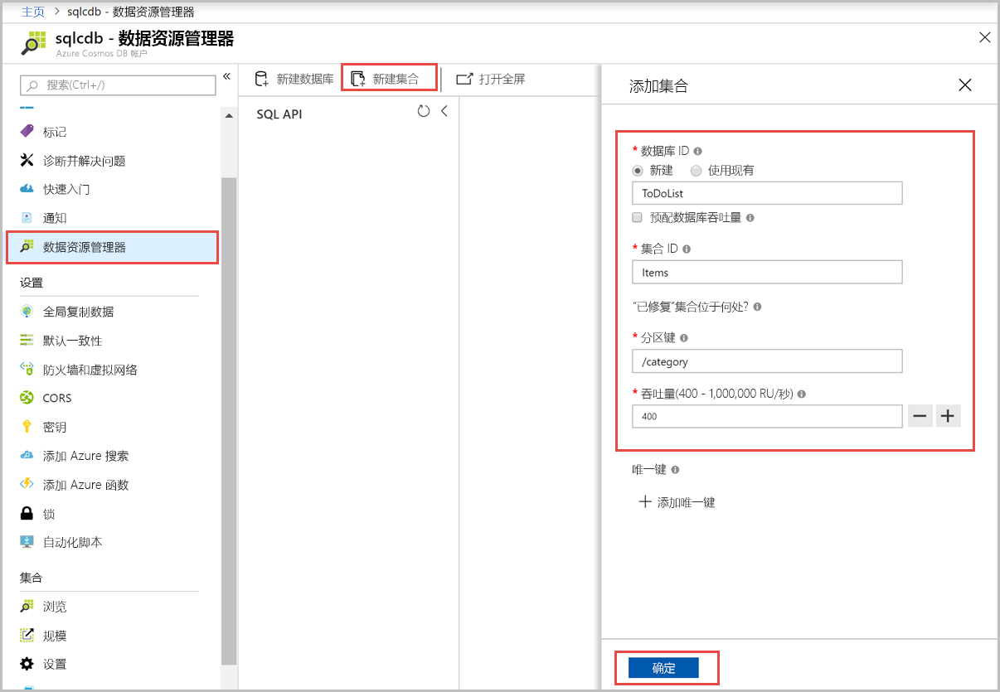
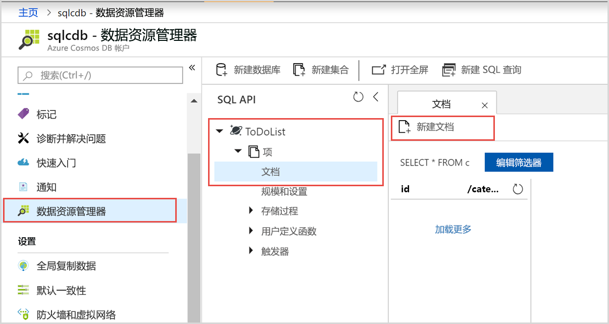
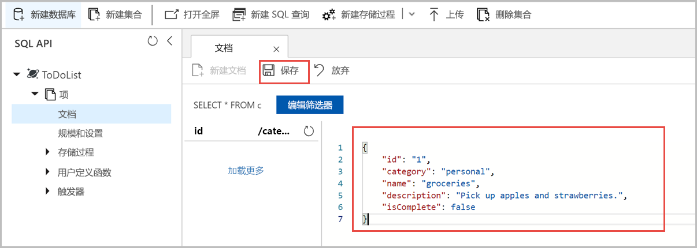

# <a name="quickstart-create-an-azure-cosmos-account-database-container-and-items-from-the-azure-portal"></a>快速入门：从 Azure 门户创建 Azure Cosmos 帐户、数据库、容器和项

> [!div class="op_single_selector"]
> * [Azure 门户](create-cosmosdb-resources-portal.md)
> * [.NET](create-sql-api-dotnet.md)
> * [Java](create-sql-api-java.md)
> * [Node.js](create-sql-api-nodejs.md)
> * [Python](create-sql-api-python.md)
> * [Xamarin](create-sql-api-xamarin-dotnet.md)
>  

Azure Cosmos DB 是 Microsoft 提供的全球分布式多模型数据库服务。 可以使用 Azure Cosmos DB 快速创建和查询键/值数据库、文档数据库和图形数据库，所有这些资源都可受益于 Azure Cosmos DB 核心的全球分布和水平缩放功能。 

本快速入门演示如何使用 Azure 门户创建 Azure Cosmos DB [SQL API](sql-api-introduction.md) 帐户、创建文档数据库和容器，并将数据添加到容器。 

## <a name="prerequisites"></a>先决条件

Azure 订阅，或免费的 Azure Cosmos DB 试用帐户
- [!INCLUDE [quickstarts-free-trial-note](../../includes/quickstarts-free-trial-note.md)] 

- [!INCLUDE [cosmos-db-emulator-docdb-api](../../includes/cosmos-db-emulator-docdb-api.md)]  

<a id="create-account"></a>
## <a name="create-an-azure-cosmos-db-account"></a>创建 Azure Cosmos DB 帐户

[!INCLUDE [cosmos-db-create-dbaccount](../../includes/cosmos-db-create-dbaccount.md)]

<a id="create-container-database"></a>
## <a name="add-a-database-and-a-container"></a>添加数据库和容器 

可以使用 Azure 门户中的数据资源管理器来创建数据库和容器。 

1.  在 Azure Cosmos DB 帐户页上的左侧导航栏中选择“数据资源管理器”，然后选择“新建容器”。   
    
    可能需要向右滚动才能看到“添加容器”窗口。 
    
    
    
1.  在“添加容器”窗格中，输入新容器的设置。 
    
    |设置|建议的值|说明
    |---|---|---|
    |**数据库 ID**|ToDoList|输入 ToDoList  作为新数据库的名称。 数据库名称必须包含 1 到 255 个字符，不能包含 `/, \\, #, ?` 或尾随空格。 选中“预配数据库吞吐量”选项，这样就可以在数据库中的所有容器之间共享预配给该数据库的吞吐量。  此选项还有助于节省成本。 |
    |**吞吐量**|400|将吞吐量保留为每秒 400 个请求单位 (RU/s)。 如果想要减少延迟，以后可以增加吞吐量。| 
    |**容器 ID**|Items|输入 *Items* 作为新容器的名称。 容器 ID 与数据库名称的字符要求相同。|
    |**分区键**| /category| 本文中所述的示例使用 /category  作为分区键。|

    
    对于本示例，请不要添加“唯一键”。  使用唯一键可将数据完整性层添加到数据库，因为它能确保每个分区键的一个或多个值的唯一性。 有关详细信息，请参阅 [Azure Cosmos DB 中的唯一键](unique-keys.md)。
    
1.  选择“确定”  。 数据资源管理器将显示新建的数据库和容器。

## <a name="add-data-to-your-database"></a>将数据添加到数据库

使用数据资源管理器将数据添加到新的数据库。

1. 在“数据资源管理器”中展开“ToDoList”数据库，然后展开“项”容器。    接下来，依次选择“项”、“新建项”。   
   
   
   
1. 在“文档”窗格的右侧，将以下结构添加到文档： 

     ```json
     {
         "id": "1",
         "category": "personal",
         "name": "groceries",
         "description": "Pick up apples and strawberries.",
         "isComplete": false
     }
     ```

1. 选择“保存”。 
   
   
   
1. 再次选择“新建文档”，创建并保存具有唯一 `id` 的另一个文档，以及所需的其他任何属性和值。  文档可以采用任何结构，因为 Azure Cosmos DB 不会对数据施加任何架构。

## <a name="query-your-data"></a>查询数据

[!INCLUDE [cosmos-db-create-sql-api-query-data](../../includes/cosmos-db-create-sql-api-query-data.md)] 

## <a name="clean-up-resources"></a>清理资源

[!INCLUDE [cosmosdb-delete-resource-group](../../includes/cosmos-db-delete-resource-group.md)]

## <a name="next-steps"></a>后续步骤

本快速入门介绍了如何创建 Azure Cosmos DB 帐户，以及如何使用数据资源管理器创建数据库和容器。 现在可以将其他数据导入 Azure Cosmos DB 帐户了。 

> [!div class="nextstepaction"]
> [将数据导入 Azure Cosmos DB](import-data.md)