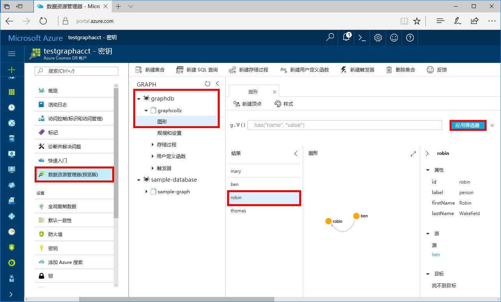

# <a name="azure-cosmos-db-build-a-net-framework-or-core-application-using-the-graph-api"></a>Azure Cosmos DB：使用图形 API 生成 .NET Framework 或 Core 应用程序

Azure Cosmos DB 是 Microsoft 提供的全球分布式多模型数据库服务。 可快速创建和查询文档、键/值和图形数据库，所有这些都受益于 Azure Cosmos DB 核心的全球分布和水平缩放功能。 

本快速入门教程演示如何使用 Azure 门户创建 Azure Cosmos DB 帐户、数据库和图形（容器）。 然后将生成并运行基于[图形 API](graph-sdk-dotnet.md) 构建的控制台应用。  

## <a name="prerequisites"></a>先决条件

如果尚未安装 Visual Studio 2017，可以下载并使用**免费的** [Visual Studio 2017 Community Edition](https://www.visualstudio.com/downloads/)。 在安装 Visual Studio 的过程中，请确保启用“Azure 开发”。

如果已安装 Visual Studio 2017，请确保安装 [Visual Studio 2017 Update 3](https://www.visualstudio.com/en-us/news/releasenotes/vs2017-relnotes) 及更高版本。

[!INCLUDE [quickstarts-free-trial-note](../../includes/quickstarts-free-trial-note.md)]

## <a name="create-a-database-account"></a>创建数据库帐户

[!INCLUDE [cosmos-db-create-dbaccount-graph](../../includes/cosmos-db-create-dbaccount-graph.md)]

## <a name="add-a-graph"></a>添加图形

[!INCLUDE [cosmos-db-create-graph](../../includes/cosmos-db-create-graph.md)]

## <a name="clone-the-sample-application"></a>克隆示例应用程序

现在让我们从 github 克隆图形 API 应用、设置连接字符串，并运行。 会看到以编程方式处理数据是多么容易。 

此示例项目使用 .NET Core 项目格式，并已配置为面向以下框架：
 - netcoreapp2.0
 - net461

1. 打开 git 终端窗口（例如 git bash）并使用 `cd` 切换到工作目录。  

2. 运行下列命令以克隆示例存储库。 

    ```bash
    git clone https://github.com/Azure-Samples/azure-cosmos-db-graph-dotnet-getting-started.git
    ```

3. 然后打开 Visual Studio，再打开解决方案文件。 

## <a name="review-the-code"></a>查看代码

快速查看应用中发生的情况。 打开 Program.cs 文件，会发现以下代码行创建 Azure Cosmos DB 资源。 

* 将对 DocumentClient 进行初始化。 在预览版中，我们将一个图形扩展 API 添加到了 Azure Cosmos DB 客户端。 我们正在努力开发从 Azure Cosmos DB 客户端和资源中解耦的独立图形客户端。

    ```csharp
    using (DocumentClient client = new DocumentClient(
        new Uri(endpoint),
        authKey,
        new ConnectionPolicy { ConnectionMode = ConnectionMode.Direct, ConnectionProtocol = Protocol.Tcp }))
    ```

* 将创建一个新数据库。

    ```csharp
    Database database = await client.CreateDatabaseIfNotExistsAsync(new Database { Id = "graphdb" });
    ```

* 将创建一个新图形。

    ```csharp
    DocumentCollection graph = await client.CreateDocumentCollectionIfNotExistsAsync(
        UriFactory.CreateDatabaseUri("graphdb"),
        new DocumentCollection { Id = "graph" },
        new RequestOptions { OfferThroughput = 1000 });
    ```
* 将使用 `CreateGremlinQuery` 方法执行一系列 Gremlin 步骤。

    ```csharp
    // The CreateGremlinQuery method extensions allow you to execute Gremlin queries and iterate
    // results asychronously
    IDocumentQuery<dynamic> query = client.CreateGremlinQuery<dynamic>(graph, "g.V().count()");
    while (query.HasMoreResults)
    {
        foreach (dynamic result in await query.ExecuteNextAsync())
        {
            Console.WriteLine($"\t {JsonConvert.SerializeObject(result)}");
        }
    }

    ```

## <a name="update-your-connection-string"></a>更新连接字符串

现在返回到 Azure 门户，获取连接字符串信息，并将其复制到应用。

1. 在 [Azure 门户](http://portal.azure.com/)中，单击“密钥”。 

    复制 URI 值的第一部分。

    

2. 在 Visual Studio 2017 中打开 appsettings.json 文件，将值以粘贴方式覆盖 `endpoint` 中的 `FILLME`。 

    `"endpoint": "https://FILLME.documents.azure.com:443/",`

    终结点值现在应如下所示：

    `"endpoint": "https://testgraphacct.documents.azure.com:443/",`

3. 如果是在 2017 年 11 月 27 日之前创建的图形数据库帐户，请将 `endpoint` 值中的 `documents` 更改为 `graphs`。 如果是在 2017 年 11 月 27 日当天或之后创建的图形数据库帐户，请将 `endpoint` 值中的 `documents` 更改为 `gremlin.cosmosdb`。

    终结点值现在应如下所示：

    `"endpoint": "https://testgraphacct.graphs.azure.com:443/",` 或 `"endpoint": "https://testgraphacct.gremlin.cosmosdb.azure.com:443/",`

4. 从门户复制“主密钥”的值，并在 App.config 中将其设为 AuthKey 密钥的值，然后保存所做的更改。 

    `"authkey": "FILLME"`

5. 保存 appsettings.json 文件。 

现已使用与 Azure Cosmos DB 进行通信所需的所有信息更新应用。 

## <a name="run-the-console-app"></a>运行控制台应用

运行应用程序之前，建议将 Microsoft.Azure.Graphs 包更新到最新版本。

1. 在 Visual Studio 中，右键单击**解决方案资源管理器**中的 **GraphGetStarted** 项目，并单击“管理 NuGet 包”。 

2. 在 NuGet 包管理器“更新”选项卡中，键入 Microsoft.Azure.Graphs，并选中“包括预发行版”框。 

3. 从结果中将 Microsoft.Azure.Graphs 库更新到最新版本的包。 这会安装 Azure Cosmos DB 图形扩展库包和所有依赖项。

    如果获得有关查看解决方案更改的消息，请单击“确定”。 如果获得有关接受许可证的消息，请单击“我接受”。

4. 单击 Ctrl+F5 运行应用程序。

   控制台窗口会显示所添加到图形的顶点及边缘。 完成脚本后，按两次 ENTER 以关闭控制台窗口。

## <a name="browse-using-the-data-explorer"></a>使用数据资源管理器浏览

现在可以返回到 Azure 门户中的数据资源管理器，浏览和查询新的图形数据。

1. 在数据资源管理器中，新数据库会显示在“图形”窗格中。 依次展开 graphdb、graphcoll，然后单击“图形”。

2. 单击“应用筛选器”按钮，使用默认查询来查看图形中的所有顶点。 示例应用生成的数据会显示在“图形”窗格中。

    可以放大和缩小图形，可以扩展图形显示空间，可以添加其他顶点，还可以在显示图面移动顶点。

    

## <a name="review-slas-in-the-azure-portal"></a>在 Azure 门户中查看 SLA

[!INCLUDE [cosmosdb-tutorial-review-slas](../../includes/cosmos-db-tutorial-review-slas.md)]

## <a name="clean-up-resources"></a>清理资源

如果不打算继续使用此应用，请删除本快速入门教程在 Azure 门户中创建的所有资源，步骤如下： 

1. 在 Azure 门户的左侧菜单中，单击“资源组”，并单击已创建资源的名称。 
2. 在资源组页上单击“删除”，在文本框中键入要删除的资源的名称，并单击“删除”。

## <a name="next-steps"></a>后续步骤

在本快速入门教程中，已了解如何创建 Azure Cosmos DB 帐户、使用数据资源管理器创建图形和运行应用。 现在可以使用 Gremlin 构建更复杂的查询，实现功能强大的图形遍历逻辑。 

> [!div class="nextstepaction"]
> [使用 Gremlin 查询](tutorial-query-graph.md)

