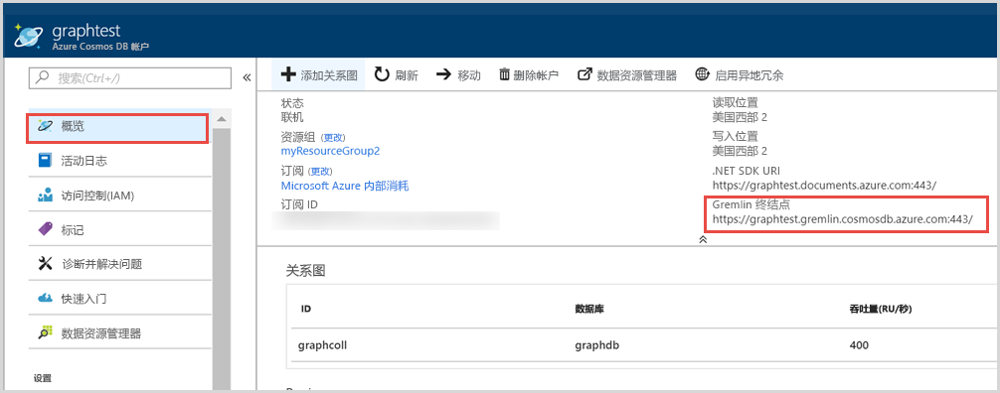

# <a name="azure-cosmos-db-build-a-net-framework-or-core-application-using-the-gremlin-api"></a>Azure Cosmos DB：使用 Gremlin API 生成 .NET Framework 或 Core 应用程序

> [!div class="op_single_selector"]
> * [Gremlin 控制台](create-graph-gremlin-console.md)
> * [.NET](create-graph-dotnet.md)
> * [Java](create-graph-java.md)
> * [Node.js](create-graph-nodejs.md)
> * [Python](create-graph-python.md)
> * [PHP](create-graph-php.md)
>  

Azure Cosmos DB 由 Microsoft 提供，是全球分布的多模型数据库服务。 可快速创建和查询文档、键/值和图形数据库，所有这些都受益于 Azure Cosmos DB 核心的全球分布和水平缩放功能。 

本快速入门教程演示如何使用 Azure 门户创建 Azure Cosmos DB [Gremlin API](graph-introduction.md) 帐户、数据库和图形（容器）。 然后使用开源驱动程序 [Gremlin.Net](http://tinkerpop.apache.org/docs/3.2.7/reference/#gremlin-DotNet) 生成并运行控制台应用。  

## <a name="prerequisites"></a>先决条件

如果尚未安装 Visual Studio 2017，可以下载并使用免费的 [Visual Studio 2017 Community Edition](https://www.visualstudio.com/downloads/)。 在安装 Visual Studio 的过程中，请确保启用“Azure 开发”。

如果已安装 Visual Studio 2017，请确保安装 [Visual Studio 2017 Update 3](https://www.visualstudio.com/en-us/news/releasenotes/vs2017-relnotes) 及更高版本。

[!INCLUDE [quickstarts-free-trial-note](../../includes/quickstarts-free-trial-note.md)]

## <a name="create-a-database-account"></a>创建数据库帐户

[!INCLUDE [cosmos-db-create-dbaccount-graph](../../includes/cosmos-db-create-dbaccount-graph.md)]

## <a name="add-a-graph"></a>添加图形

[!INCLUDE [cosmos-db-create-graph](../../includes/cosmos-db-create-graph.md)]

## <a name="clone-the-sample-application"></a>克隆示例应用程序

现在从 GitHub 克隆 Gremlin API 应用，设置连接字符串，并运行应用。 会看到以编程方式处理数据是多么容易。 

1. 打开命令提示符，新建一个名为“git-samples”的文件夹，然后关闭命令提示符。

    ```bash
    md "C:\git-samples"
    ```

2. 打开诸如 git bash 之类的 git 终端窗口，并使用 `cd` 命令更改为要安装示例应用的新文件夹。

    ```bash
    cd "C:\git-samples"
    ```

3. 运行下列命令以克隆示例存储库。 此命令在计算机上创建示例应用程序的副本。

    ```bash
    git clone https://github.com/Azure-Samples/azure-cosmos-db-graph-gremlindotnet-getting-started.git
    ```

4. 然后打开 Visual Studio，再打开解决方案文件。

5. 在项目中还原 NuGet 包。 这应该包括 Gremlin.Net 驱动程序和 Newtonsoft.Json 包。


6. 也可使用 NuGet 包管理器或 [NuGet 命令行实用程序](https://docs.microsoft.com/nuget/install-nuget-client-tools)手动安装 Gremlin.Net 驱动程序： 

    ```bash
    nuget install Gremlin.Net
    ```

## <a name="review-the-code"></a>查看代码

此步骤是可选的。 如果有意了解如何使用代码创建数据库资源，可以查看以下代码片段。 否则，可以直接跳转到[更新连接字符串](#update-your-connection-string)。 

以下代码片段全部摘自 Program.cs 文件。

* 跟踪上面创建的帐户设置连接参数（第 19 行）： 

    ```csharp
    private static string hostname = "your-endpoint.gremlin.cosmosdb.azure.com";
    private static int port = 443;
    private static string authKey = "your-authentication-key";
    private static string database = "your-database";
    private static string collection = "your-graph-container";
    ```

* 要执行的 Gremlin 命令列在字典中（第 26 行）：

    ```csharp
    private static Dictionary<string, string> gremlinQueries = new Dictionary<string, string>
    {
        { "Cleanup",        "g.V().drop()" },
        { "AddVertex 1",    "g.addV('person').property('id', 'thomas').property('firstName', 'Thomas').property('age', 44)" },
        { "AddVertex 2",    "g.addV('person').property('id', 'mary').property('firstName', 'Mary').property('lastName', 'Andersen').property('age', 39)" },
        { "AddVertex 3",    "g.addV('person').property('id', 'ben').property('firstName', 'Ben').property('lastName', 'Miller')" },
        { "AddVertex 4",    "g.addV('person').property('id', 'robin').property('firstName', 'Robin').property('lastName', 'Wakefield')" },
        { "AddEdge 1",      "g.V('thomas').addE('knows').to(g.V('mary'))" },
        { "AddEdge 2",      "g.V('thomas').addE('knows').to(g.V('ben'))" },
        { "AddEdge 3",      "g.V('ben').addE('knows').to(g.V('robin'))" },
        { "UpdateVertex",   "g.V('thomas').property('age', 44)" },
        { "CountVertices",  "g.V().count()" },
        { "Filter Range",   "g.V().hasLabel('person').has('age', gt(40))" },
        { "Project",        "g.V().hasLabel('person').values('firstName')" },
        { "Sort",           "g.V().hasLabel('person').order().by('firstName', decr)" },
        { "Traverse",       "g.V('thomas').out('knows').hasLabel('person')" },
        { "Traverse 2x",    "g.V('thomas').out('knows').hasLabel('person').out('knows').hasLabel('person')" },
        { "Loop",           "g.V('thomas').repeat(out()).until(has('id', 'robin')).path()" },
        { "DropEdge",       "g.V('thomas').outE('knows').where(inV().has('id', 'mary')).drop()" },
        { "CountEdges",     "g.E().count()" },
        { "DropVertex",     "g.V('thomas').drop()" },
    };
    ```


* 使用上面提供的参数创建 `GremlinServer` 连接对象（第 52 行）：

    ```csharp
    var gremlinServer = new GremlinServer(hostname, port, enableSsl: true, 
                                                    username: "/dbs/" + database + "/colls/" + collection, 
                                                    password: authKey);
    ```

* 创建新的 `GremlinClient` 对象（第 56 行）：

    ```csharp
    var gremlinClient = new GremlinClient(gremlinServer);
    ```

* 通过将 `GremlinClient` 对象与异步任务配合使用来执行每一个 Gremlin 查询（第 63 行）。 此时会从上面定义的字典中读取 Gremlin 查询（第 26 行）：

    ```csharp
    var task = gremlinClient.SubmitAsync<dynamic>(query.Value);
    task.Wait();
    ```

* 使用 Newtonsoft.Json 中的 `JsonSerializer` 类，检索结果并读取已格式化为字典的值：

    ```csharp
    foreach (var result in task.Result)
    {
        // The vertex results are formed as dictionaries with a nested dictionary for their properties
        string output = JsonConvert.SerializeObject(result);
        Console.WriteLine(String.Format("\tResult:\n\t{0}", output));
    }
    ```

## <a name="update-your-connection-string"></a>更新连接字符串

现在返回到 Azure 门户，获取连接字符串信息，并将其复制到应用。

1. 从 [Azure 门户](http://portal.azure.com/)中，导航到你的图形数据库帐户。 在“概述”选项卡中，可以看到两个终结点： 
 
   **.Net SDK URI** - 使用 Microsoft.Azure.Graphs 库连接到图形帐户时将使用此值。 

   **Gremlin 终结点** - 使用 Gremlin.Net 库连接到图形帐户时将使用此值。

    

   若要运行此示例，请复制 **Gremlin 终结点**值，删除末尾的端口号，也就是说，URI 将变为 `https://<your cosmos db account name>.gremlin.cosmosdb.azure.com`

2. 在 Program.cs 中粘贴该值，使之覆盖第 19 行的 `hostname` 变量中的 `your-endpoint`。 

    `"private static string hostname = "<your cosmos db account name>.gremlin.cosmosdb.azure.com";`

    终结点值现在应如下所示：

    `"private static string hostname = "testgraphacct.gremlin.cosmosdb.azure.com";`

3. 接下来，从门户中导航到“密钥”选项卡并复制“主密钥”值，将其粘贴到 `authkey` 变量中，替换第 21 行中的 `"your-authentication-key"` 占位符。 

    `private static string authKey = "your-authentication-key";`

4. 根据上面创建的数据库的信息，将数据库名称粘贴到第 22 行的 `database` 变量中。 

    `private static string database = "your-database";`

5. 同样，根据上面创建的容器的信息，将集合（也是图形名称）粘贴到第 23 行的 `collection` 变量中。 

    `private static string collection = "your-collection-or-graph";`

6. 保存 Program.cs 文件。 

现已使用与 Azure Cosmos DB 进行通信所需的所有信息更新应用。 

## <a name="run-the-console-app"></a>运行控制台应用

单击 Ctrl+F5 运行应用程序。 应用程序会在控制台中列显 Gremlin 查询命令和结果。

   控制台窗口会显示所添加到图形的顶点及边缘。 完成脚本后，按 ENTER 关闭控制台窗口。

## <a name="browse-using-the-data-explorer"></a>使用数据资源管理器浏览

现在可以返回到 Azure 门户中的数据资源管理器，浏览和查询新的图形数据。

1. 在数据资源管理器中，新数据库会显示在“图形”窗格中。 展开数据库和容器节点，然后单击“图形”。

2. 单击“应用筛选器”按钮，使用默认查询来查看图形中的所有顶点。 示例应用生成的数据会显示在“图形”窗格中。

    可以放大和缩小图形，可以扩展图形显示空间，可以添加其他顶点，还可以在显示图面移动顶点。

    

## <a name="review-slas-in-the-azure-portal"></a>在 Azure 门户中查看 SLA

[!INCLUDE [cosmosdb-tutorial-review-slas](../../includes/cosmos-db-tutorial-review-slas.md)]

## <a name="clean-up-resources"></a>清理资源

[!INCLUDE [cosmosdb-delete-resource-group](../../includes/cosmos-db-delete-resource-group.md)]

## <a name="next-steps"></a>后续步骤

在本快速入门教程中，已了解如何创建 Azure Cosmos DB 帐户、使用数据资源管理器创建图形和运行应用。 现在可以使用 Gremlin 构建更复杂的查询，实现功能强大的图形遍历逻辑。 

> [!div class="nextstepaction"]
> [使用 Gremlin 查询](tutorial-query-graph.md)

