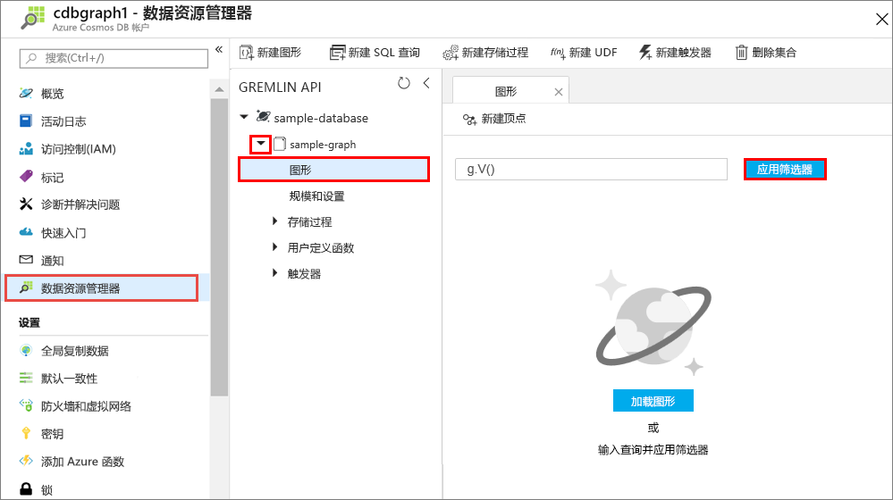
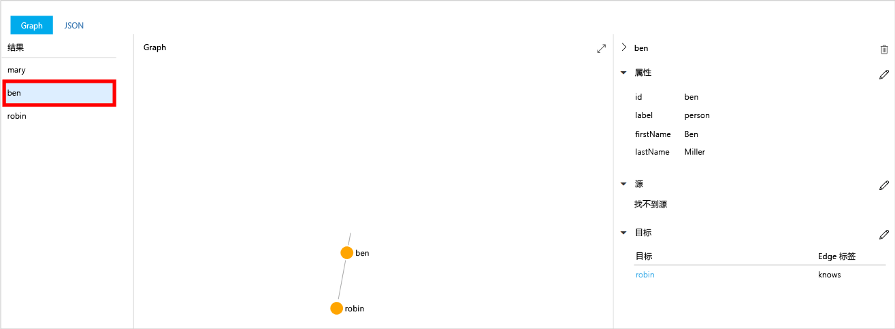
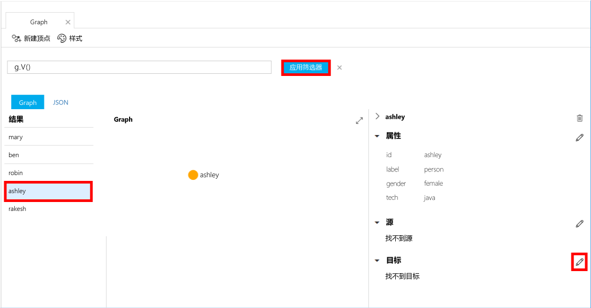
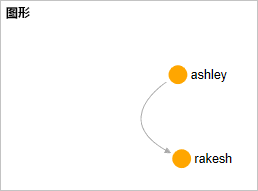

# <a name="azure-cosmos-db-create-a-graph-database-using-java-and-the-azure-portal"></a>Azure Cosmos DB：使用 Java 和 Azure 门户创建图形数据库

Azure Cosmos DB 是 Microsoft 提供的全球分布式多模型数据库服务。 可快速创建和查询文档、键/值和图形数据库，它们都受益于 Azure Cosmos DB 核心的全球分布和水平缩放功能。 

本快速入门通过适用于 Azure Cosmos DB 的 Azure 门户工具创建图形数据库。 本快速入门还介绍了如何使用图形数据库通过 OSS [Gremlin Java](https://mvnrepository.com/artifact/org.apache.tinkerpop/gremlin-driver) 驱动程序快速创建 Java 控制台应用。 本快速入门中的说明适用于任何能够运行 Java 的操作系统。 完成本快速入门以后，即可熟悉如何通过 UI 或编程方式创建和修改图形资源，具体取决于你首选哪种方式。 

## <a name="prerequisites"></a>先决条件

* [Java 开发工具包 (JDK) 1.7+](http://www.oracle.com/technetwork/java/javase/downloads/jdk8-downloads-2133151.html)
    * 在 Ubuntu 上运行 `apt-get install default-jdk`，以便安装 JDK。
    * 请确保设置 JAVA_HOME 环境变量，使之指向在其中安装了 JDK 的文件夹。
* [下载](http://maven.apache.org/download.cgi)和[安装](http://maven.apache.org/install.html) [Maven](http://maven.apache.org/) 二进制存档
    * 在 Ubuntu 上，可以通过运行 `apt-get install maven` 来安装 Maven。
* [Git](https://www.git-scm.com/)
    * 在 Ubuntu 上，可以通过运行 `sudo apt-get install git` 来安装 Git。

[!INCLUDE [quickstarts-free-trial-note](../../includes/quickstarts-free-trial-note.md)]

## <a name="create-a-database-account"></a>创建数据库帐户

在创建图形数据库之前，需通过 Azure Cosmos DB 创建 Gremlin (Graph) 数据库帐户。

[!INCLUDE [cosmos-db-create-dbaccount-graph](../../includes/cosmos-db-create-dbaccount-graph.md)]

## <a name="add-a-graph"></a>添加图形

现在可以在 Azure 门户中使用数据资源管理器工具来创建图形数据库。 

1. 在 Azure 门户的左侧导航菜单中，单击“数据资源管理器(预览版)”。 
2. 在“数据资源管理器(预览版)”边栏选项卡中，单击“新建图形”，并使用以下信息填写该页。

    

    设置|建议的值|说明
    ---|---|---
    数据库 ID|sample-database|新数据库的 ID。 数据库名称的长度必须为 1 到 255 个字符，不能包含 `/ \ # ?` 或尾随空格。
    图形 ID|sample-graph|新图形的 ID。 图形名称与数据库 ID 的字符要求相同。
    存储容量| 10 GB|保留默认值。 这是数据库的存储容量。
    吞吐量|400 RU|保留默认值。 如果想要减少延迟，以后可以增加吞吐量。
    RU/m|关闭|保留默认值。
    分区键|留空|本快速入门此分区键留空。

3. 填写表单后，请单击“确定”。

## <a name="clone-the-sample-application"></a>克隆示例应用程序

现在从 GitHub 克隆图形应用，设置连接字符串，并运行该应用。 会看到以编程方式处理数据是多么容易。 

1. 打开 git 终端窗口（例如 git bash）并使用 `cd` 切换到工作目录。  

2. 运行下列命令以克隆示例存储库。 

    ```bash
    git clone https://github.com/Azure-Samples/azure-cosmos-db-graph-java-getting-started.git
    ```

## <a name="review-the-code"></a>查看代码

快速查看应用中发生的情况。 从 \src\GetStarted 文件夹打开 `Program.java` 文件，找到以下代码行。 

* 将通过 `src/remote.yaml` 中的配置初始化 Gremlin `Client`。

    ```java
    cluster = Cluster.build(new File("src/remote.yaml")).create();
    ...
    client = cluster.connect();
    ```

* 将使用 `client.submit` 方法执行一系列 Gremlin 步骤。

    ```java
    ResultSet results = client.submit(gremlin);

    CompletableFuture<List<Result>> completableFutureResults = results.all();
    List<Result> resultList = completableFutureResults.get();

    for (Result result : resultList) {
        System.out.println(result.toString());
    }
    ```

## <a name="update-your-connection-string"></a>更新连接字符串

1. 打开 src/remote.yaml 文件。 

3. 在 src/remote.yaml 文件中填充 hosts、username 和 password 值。 其余设置不需更改。

    设置|建议的值|说明
    ---|---|---
    主机|[***.graphs.azure.com]|请参看此表后面的屏幕截图。 此值是 Azure 门户“概览”页上的“Gremlin URI”值，方括号中已删除尾部的 :443/。<br><br>也可以在“密钥”选项卡中使用“URI”值来检索此值：删除 https:// ， 将 documents 更改为 graphs 并删除尾部的 :443/ 即可。
    用户名|/dbs/sample-database/colls/sample-graph|采用 `/dbs/<db>/colls/<coll>` 格式的资源，其中，`<db>` 是现有数据库名称，`<coll>` 是现有集合名称。
    密码|*主密钥*|请参看此表后面的第二个屏幕截图。 此值是主键，可以从 Azure 门户的“键”页上的“主键”框中检索到。 使用该框右侧的复制按钮复制该值。

    对于 Hosts 值，请复制“概览”页中的“Gremlin URI”值。 如果该值为空，请查看上表 Hosts 行中的说明，了解如何从“键”边栏选项卡创建 Gremlin URI。


    对于 Password 值，请复制“键”边栏选项卡中的“主键”：

## <a name="run-the-console-app"></a>运行控制台应用

1. 在 git 终端窗口中，通过 `cd` 命令转到 azure-cosmos-db-graph-java-getting-started 文件夹。

2. 在 git 终端窗口键入 `mvn package`，安装所需的 Java 包。

3. 在 git 终端窗口运行 `mvn exec:java -D exec.mainClass=GetStarted.Program`，启动 Java 应用程序。

终端窗口会显示添加到图形的顶点。 程序完成后，在 Internet 浏览器中切换回 Azure 门户。 

<a id="add-sample-data"></a>
## <a name="review-and-add-sample-data"></a>查看并添加示例数据

现在可以回到数据资源管理器，查看添加到图形的顶点，并添加其他数据点。

1. 在数据资源管理器中，展开 “sample-database”/“sample-graph”，单击“图形”，然后单击“应用筛选器”。 

   

2. 在“结果”列表中，请注意添加到图形的新用户。 选择“ben”。请注意，他连接到 robin。 可以在图形资源管理器中四处移动顶点，可以放大和缩小，还可以扩展图形资源管理器图面的大小。 

   

3. 使用数据资源管理器向图形添加一些新用户。 单击“新建顶点”按钮，向图形添加数据。

   

4. 添加标签“人员”，然后输入以下键和值，在图形中创建第一个顶点。 注意，可以在图形中为每个人创建唯一属性。 仅 id 键是必需的。

    key|value|说明
    ----|----|----
    id|ashley|顶点的唯一标识符。 如果未指定 id，将为你生成一个。
    gender|女| 
    技术 | java | 

    > [!NOTE]
    > 在本快速入门中，我们创建未分区的集合。 但是，如果在创建集合过程中通过指定分区键创建了分区的集合，则需在每个新顶点中包括该分区键作为键。 

5. 单击 **“确定”**。 可能需要展开屏幕才能在屏幕底部看到“确定”。

6. 再次单击“新建顶点”，添加其他新用户。 输入标签“人员”，然后输入以下键和值：

    key|value|说明
    ----|----|----
    id|rakesh|顶点的唯一标识符。 如果未指定 id，将为你生成一个。
    gender|男| 
    学校|MIT| 

7. 单击 **“确定”**。 

8. 在筛选器为默认 `g.V()` 筛选器的情况下，单击“应用筛选器”。 所有用户此时会显示在“结果”列表中。 添加更多数据时，可以使用筛选器来限制结果。 默认情况下，数据资源管理器使用 `g.V()` 来检索图形中的所有顶点，但可以将其更改为其他[图形查询](tutorial-query-graph.md)（例如 `g.V().count()`），以 JSON 格式返回图形中所有顶点的计数。

9. 现在可以连接 rakesh 与 ashley。 确保“ashley”在“结果”列表中为选中状态，然后单击右下侧“目标”旁边的编辑按钮。 可能需要扩大窗口才能看到“属性”区域。

   

10. 在“目标”框中键入“rakesh”，在“Edge 标签”框中键入“认识”，然后单击复选框。

   

11. 现在，从结果列表中选择“rakesh”即可看到 ashley 和 rakesh 已连接。 

   

    还可以使用数据资源管理器创建存储过程、UDF 和触发器以执行服务器端业务逻辑和缩放吞吐量。 数据资源管理器公开 API 中提供的所有内置编程数据访问，但可以使用它轻松访问 Azure 门户中的数据。


## <a name="review-slas-in-the-azure-portal"></a>在 Azure 门户中查看 SLA

[!INCLUDE [cosmosdb-tutorial-review-slas](../../includes/cosmos-db-tutorial-review-slas.md)]

## <a name="clean-up-resources"></a>清理资源

如果不打算继续使用此应用，请删除本快速入门教程在 Azure 门户中创建的所有资源，步骤如下： 

1. 在 Azure 门户的左侧菜单中，单击“资源组”，并单击已创建资源的名称。 
2. 在资源组页上单击“删除”，在文本框中键入要删除的资源的名称，并单击“删除”。

## <a name="next-steps"></a>后续步骤

在本快速入门教程中，已了解如何创建 Azure Cosmos DB 帐户、使用数据资源管理器创建图形和运行应用。 现可使用 Gremlin 构建更复杂的查询，实现功能强大的图形遍历逻辑。 

> [!div class="nextstepaction"]
> [使用 Gremlin 查询](tutorial-query-graph.md)


