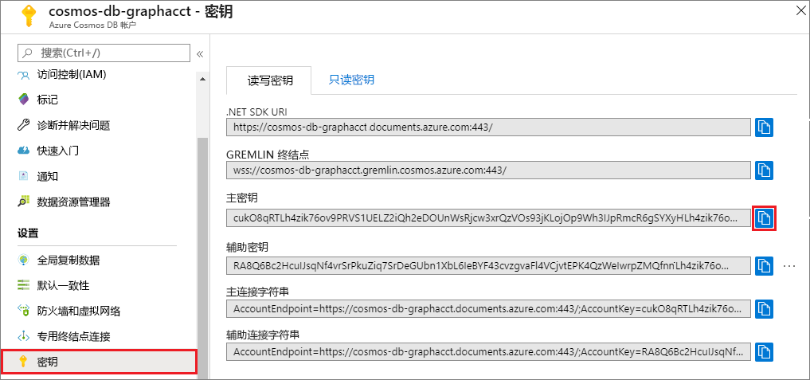

# <a name="azure-cosmos-db-build-a-nodejs-application-by-using-gremlin-api"></a>Azure Cosmos DB：使用 Gremlin API 生成 Node.js 应用程序

> [!div class="op_single_selector"]
> * [Gremlin 控制台](create-graph-gremlin-console.md)
> * [.NET](create-graph-dotnet.md)
> * [Java](create-graph-java.md)
> * [Node.js](create-graph-nodejs.md)
> * [Python](create-graph-python.md)
> * [PHP](create-graph-php.md)
>  

Azure Cosmos DB 是 Microsoft 全球分布的多模型数据库服务。 可快速创建和查询文档、键/值和图形数据库，所有这些都受益于 Azure Cosmos DB 核心的全球分布和水平缩放功能。 

本快速入门教程演示如何使用 Azure 门户创建 Azure Cosmos DB [Gremlin API](graph-introduction.md) 帐户、数据库和图形。 然后使用开放源 [Gremlin Node.js](https://www.npmjs.com/package/gremlin) 驱动程序生成并运行控制台应用。

## <a name="prerequisites"></a>先决条件

在运行此示例之前，必须具备以下先决条件：
* [Node.js](https://nodejs.org/en/) 版本 v0.10.29 或更高版本
* [Git](https://git-scm.com/)

[!INCLUDE [quickstarts-free-trial-note](../../includes/quickstarts-free-trial-note.md)]

## <a name="create-a-database-account"></a>创建数据库帐户

[!INCLUDE [cosmos-db-create-dbaccount-graph](../../includes/cosmos-db-create-dbaccount-graph.md)]

## <a name="add-a-graph"></a>添加图形

[!INCLUDE [cosmos-db-create-graph](../../includes/cosmos-db-create-graph.md)]

## <a name="clone-the-sample-application"></a>克隆示例应用程序

现在从 GitHub 克隆 Gremlin API 应用，设置连接字符串，并运行应用。 会看到以编程方式处理数据是多么容易。 

1. 打开命令提示符，新建一个名为“git-samples”的文件夹，然后关闭命令提示符。

    ```bash
    md "C:\git-samples"
    ```

2. 打开诸如 git bash 之类的 git 终端窗口，并使用 `cd` 命令更改为要安装示例应用的新文件夹。

    ```bash
    cd "C:\git-samples"
    ```

3. 运行下列命令以克隆示例存储库。 此命令在计算机上创建示例应用程序的副本。

    ```bash
    git clone https://github.com/Azure-Samples/azure-cosmos-db-graph-nodejs-getting-started.git
    ```

3. 在 Visual Studio 中打开解决方案文件。 

## <a name="review-the-code"></a>查看代码

此步骤是可选的。 如果有意了解如何使用代码创建数据库资源，可以查看以下代码片段。 否则，可以直接跳转到[更新连接字符串](#update-your-connection-string)。 

以下代码片段全部摘自 app.js 文件。

* 将创建 Gremlin 客户端。

    ```nodejs
    const client = Gremlin.createClient(
        443, 
        config.endpoint, 
        { 
            "session": false, 
            "ssl": true, 
            "user": `/dbs/${config.database}/colls/${config.collection}`,
            "password": config.primaryKey
        });
    ```

  配置均位于 `config.js` 中，后者可在[以下部分](#update-your-connection-string)中编辑。

* 将定义一系列函数以执行不同 Gremlin 操作。 以下是其中一个函数：

    ```nodejs
    function addVertex1(callback)
    {
        console.log('Running Add Vertex1'); 
        client.execute("g.addV('person').property('id', 'thomas').property('firstName', 'Thomas').property('age', 44).property('userid', 1)", { }, (err, results) => {
          if (err) callback(console.error(err));
          console.log("Result: %s\n", JSON.stringify(results));
          callback(null)
        });
    }
    ```

* 每个函数均通过 Gremlin 查询字符串参数执行 `client.execute` 方法。 下面是演示如何执行 `g.V().count()` 的示例：

    ```nodejs
    console.log('Running Count'); 
    client.execute("g.V().count()", { }, (err, results) => {
        if (err) return console.error(err);
        console.log(JSON.stringify(results));
        console.log();
    });
    ```

* 然后在文件末尾，使用 `async.waterfall()` 方法调用所有方法。 这将依次执行它们：

    ```nodejs
    try{
        async.waterfall([
            dropGraph,
            addVertex1,
            addVertex2,
            addEdge,
            countVertices
            ], finish);
    } catch(err) {
        console.log(err)
    }
    ```


## <a name="update-your-connection-string"></a>更新连接字符串

1. 打开 config.js 文件。 

2. 在 config.js 中，使用 Azure 门户的“概述”页中的“Gremlin URI”值填写 `config.endpoint` 密钥。 

    `config.endpoint = "GRAPHENDPOINT";`

    

   如果“Gremlin URI”值为空，可从门户中的“密钥”页生成值。 使用“URI”值，删除 https:// 并将 documents 更改为 gremlin.cosmosdb。 如果图形帐户是在 2017 年 12 月 20 日之前创建的，请将 documents 更改为 graphs。 

   Gremlin 终结点只能是没有协议/端口号的主机名，例如 `mygraphdb.gremlin.cosmosdb.azure.com`（不能是 `https://mygraphdb.gremlin.cosmosdb.azure.com` 或 `mygraphdb.gremlin.cosmosdb.azure.com:433`）。

3. 在 config.js 中，使用 Azure 门户“密钥”页中的“主密钥”值填充 config.primaryKey 值。 

    `config.primaryKey = "PRIMARYKEY";`

   

4. 输入数据库名称和图形（容器）名称作为 config.database 和 config.collection 的值。 

下面举例说明了完成的 config.js 文件是什么样子：

```nodejs
var config = {}

// Note that this must not have HTTPS or the port number
config.endpoint = "testgraphacct.gremlin.cosmosdb.azure.com";
config.primaryKey = "Pams6e7LEUS7LJ2Qk0fjZf3eGo65JdMWHmyn65i52w8ozPX2oxY3iP0yu05t9v1WymAHNcMwPIqNAEv3XDFsEg==";
config.database = "graphdb"
config.collection = "Persons"

module.exports = config;
```

## <a name="run-the-console-app"></a>运行控制台应用

1. 打开终端窗口，更改（通过 `cd` 命令）为项目中包括的 package.json 文件的安装目录。

2. 运行 `npm install`，安装所需的 npm 模块，包括 `gremlin`。

3. 在终端中运行 `node app.js`，启动 node 应用程序。

## <a name="browse-with-data-explorer"></a>使用数据资源管理器浏览

现在可以返回到 Azure 门户中的数据资源管理器，查看、查询、修改以及使用新的图形数据。

在数据资源管理器中，新数据库会显示在“图形”窗格中。 展开数据库（后跟容器），然后选择“图形”。

选择“应用筛选器”时，由示例应用生成的数据会显示在“图形”选项卡的下一窗格中。

尝试使用 `.has('firstName', 'Thomas')` 来完成 `g.V()`，对筛选器进行测试。 请注意，值区分大小写。

## <a name="review-slas-in-the-azure-portal"></a>在 Azure 门户中查看 SLA

[!INCLUDE [cosmosdb-tutorial-review-slas](../../includes/cosmos-db-tutorial-review-slas.md)]

## <a name="clean-up-your-resources"></a>清理资源

[!INCLUDE [cosmosdb-delete-resource-group](../../includes/cosmos-db-delete-resource-group.md)]

## <a name="next-steps"></a>后续步骤

通过本文，已了解如何创建 Azure Cosmos DB 帐户、使用数据资源管理器创建图形和运行应用。 现可使用 Gremlin 生成更复杂的查询，实现功能强大的图形遍历逻辑。 

> [!div class="nextstepaction"]
> [使用 Gremlin 查询](tutorial-query-graph.md)
