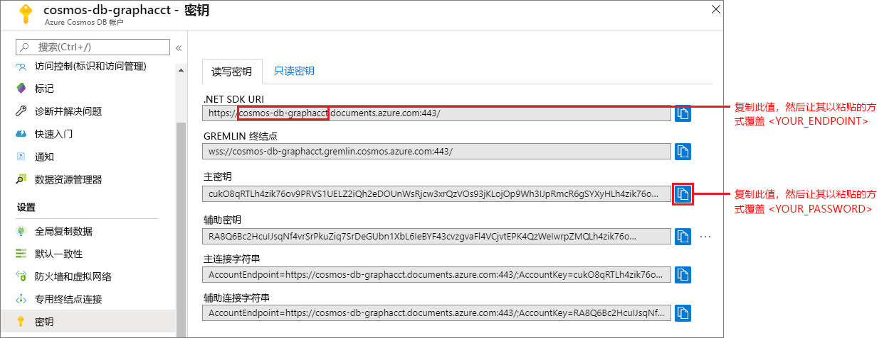
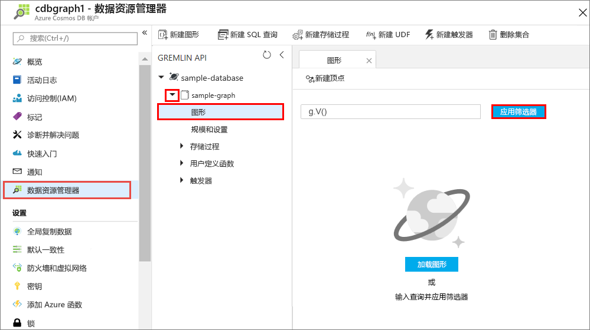
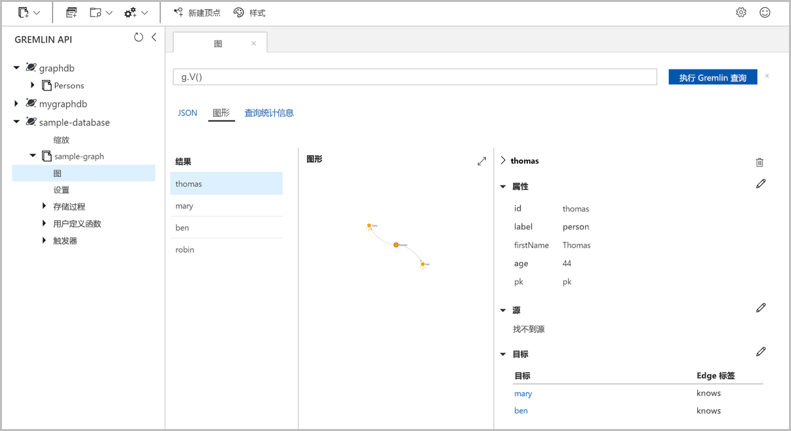
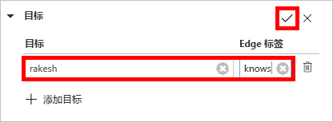
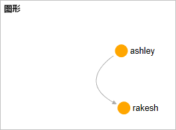

# <a name="quickstart-create-a-graph-database-in-azure-cosmos-db-using-python-and-the-azure-portal"></a>快速入门：在 Azure Cosmos DB 中使用 Python 和 Azure 门户创建图形数据库

> [!div class="op_single_selector"]
> * [Gremlin 控制台](create-graph-gremlin-console.md)
> * [.NET](create-graph-dotnet.md)
> * [Java](create-graph-java.md)
> * [Node.js](create-graph-nodejs.md)
> * [Python](create-graph-python.md)
> * [PHP](create-graph-php.md)
>  

在本快速入门中，你将通过 Azure 门户创建和管理 Azure Cosmos DB Gremlin（图形）API 帐户，并使用从 GitHub 克隆的 Python 应用来添加数据。 Azure Cosmos DB 是一种多模型数据库服务，它通过全局分布和水平缩放功能让你快速创建和查询文档、表、键/值和图形数据库。

## <a name="prerequisites"></a>必备条件
- 具有活动订阅的 Azure 帐户。 [免费创建一个](https://azure.microsoft.com/free/?ref=microsoft.com&utm_source=microsoft.com&utm_medium=docs&utm_campaign=visualstudio)。 或者[免费试用 Azure Cosmos DB](https://azure.microsoft.com/try/cosmosdb/) 而无需 Azure 订阅。
- [Python 3.5+](https://www.python.org/downloads/)，包括 [pip](https://pip.pypa.io/en/stable/installing/) 程序包安装程序。
- [适用于 Gremlin 的 Python 驱动程序](https://github.com/apache/tinkerpop/tree/master/gremlin-python)。
- [Git](https://git-scm.com/downloads)。

> [!NOTE]
> 本快速入门需要 2017 年 12 月 20 日之后创建的图形数据库帐户。 迁移至正式发布版后，现有帐户将支持 Python。

## <a name="create-a-database-account"></a>创建数据库帐户

在创建图形数据库之前，需通过 Azure Cosmos DB 创建 Gremlin (Graph) 数据库帐户。

[!INCLUDE [cosmos-db-create-dbaccount-graph](../../includes/cosmos-db-create-dbaccount-graph.md)]

## <a name="add-a-graph"></a>添加图形

[!INCLUDE [cosmos-db-create-graph](../../includes/cosmos-db-create-graph.md)]

## <a name="clone-the-sample-application"></a>克隆示例应用程序

现在，让我们转到如何使用代码上来。 从 GitHub 克隆 Gremlin API 应用，设置连接字符串，并运行应用。 会看到以编程方式处理数据是多么容易。  

1. 打开命令提示符，新建一个名为“git-samples”的文件夹，然后关闭命令提示符。

    ```bash
    md "C:\git-samples"
    ```

2. 打开诸如 git bash 之类的 git 终端窗口，并使用 `cd` 命令更改为相应的示例应用程序安装文件夹。  

    ```bash
    cd "C:\git-samples"
    ```

3. 运行下列命令以克隆示例存储库。 此命令在计算机上创建示例应用程序的副本。 

    ```bash
    git clone https://github.com/Azure-Samples/azure-cosmos-db-graph-python-getting-started.git
    ```

## <a name="review-the-code"></a>查看代码

此步骤是可选的。 如果有意了解如何使用代码创建数据库资源，可以查看以下代码片段。 这些代码片段全部摘自 *C:\git-samples\azure-cosmos-db-graph-python-getting-started\\* 文件夹中的 *connect.py* 文件。 否则，可以直接跳转到[更新连接字符串](#update-your-connection-information)。 

* Gremlin `client` 是在 *connect.py* 中的第 104 行初始化的：

    ```python
    ...
    client = client.Client('wss://<YOUR_ENDPOINT>.gremlin.cosmosdb.azure.com:443/','g', 
        username="/dbs/<YOUR_DATABASE>/colls/<YOUR_COLLECTION_OR_GRAPH>", 
        password="<YOUR_PASSWORD>")
    ...
    ```

* *connect.py* 文件的开头声明了一系列 Gremlin 步骤。 然后它们将通过 `client.submitAsync()` 方法执行：

    ```python
    client.submitAsync(_gremlin_cleanup_graph)
    ```

## <a name="update-your-connection-information"></a>更新连接信息

现在，返回到 Azure 门户，获取连接信息，并将信息复制到应用程序中。 借助这些设置，应用程序可以与托管的数据库进行通信。

1. 在 [Azure 门户](https://portal.azure.com/)中，在你的 Azure Cosmos DB 帐户中，选择“密钥”  。 

    复制 URI 值的第一部分。

    

2. 打开 *connect.py* 文件，并将 URI 值粘贴至第 104 行的 `<YOUR_ENDPOINT>` 位置：

    ```python
    client = client.Client('wss://<YOUR_ENDPOINT>.gremlin.cosmosdb.azure.com:443/','g', 
        username="/dbs/<YOUR_DATABASE>/colls/<YOUR_COLLECTION_OR_GRAPH>", 
        password="<YOUR_PASSWORD>")
    ```

    客户端对象的 URI 部分应类似于以下代码：

    ```python
    client = client.Client('wss://test.gremlin.cosmosdb.azure.com:443/','g', 
        username="/dbs/<YOUR_DATABASE>/colls/<YOUR_COLLECTION_OR_GRAPH>", 
        password="<YOUR_PASSWORD>")
    ```

3. 更改 `client` 对象的第二个参数以替换 `<YOUR_DATABASE>` 和 `<YOUR_COLLECTION_OR_GRAPH>` 字符串。 如果使用建议的值，该参数应类似于以下代码：

    `username="/dbs/sample-database/colls/sample-graph"`

    整个 `client` 对象现在应类似于以下代码：

    ```python
    client = client.Client('wss://test.gremlin.cosmosdb.azure.com:443/','g', 
        username="/dbs/sample-database/colls/sample-graph", 
        password="<YOUR_PASSWORD>")
    ```

4. 在“密钥”页上，使用“复制”按钮复制主密钥，并将它粘贴到 `password=<YOUR_PASSWORD>` 参数中的 `<YOUR_PASSWORD>` 位置。 

    整个 `client` 对象定义现在应类似以下代码：
    ```python
    client = client.Client('wss://test.gremlin.cosmosdb.azure.com:443/','g', 
        username="/dbs/sample-database/colls/sample-graph", 
        password="asdb13Fadsf14FASc22Ggkr662ifxz2Mg==")
    ```

6. 保存 *connect.py* 文件。

## <a name="run-the-console-app"></a>运行控制台应用

1. 在 git 终端窗口中，使用 `cd` 命令转到 azure-cosmos-db-graph-python-getting-started 文件夹。

    ```git
    cd "C:\git-samples\azure-cosmos-db-graph-python-getting-started"
    ```

2. 在 git 终端窗口中，使用以下命令安装所需 Python 包。

   ```
   pip install -r requirements.txt
   ```

3. 在 git 终端窗口中，使用以下命令启动 Python 应用程序。
    
    ```
    python connect.py
    ```

    终端窗口会显示添加到图形的顶点和边缘。 
    
    如果遇到超时错误，请在[更新你的连接信息](#update-your-connection-information)中检查是否正确更新了连接信息，并尝试再次运行上一个命令。 
    
    一旦程序停止运行，按 Enter，然后在 Internet 浏览器中立即切换回 Azure 门户。

<a id="add-sample-data"></a>
## <a name="review-and-add-sample-data"></a>查看并添加示例数据

插入顶点和边后，现在可以返回数据资源管理器，查看添加到图中的顶点，并添加其他数据点。

1. 在 Azure 门户中，在你的 Azure Cosmos DB 帐户中，选择“数据资源管理器”  ，展开“sample-graph”  ，再依次选择“图形”  和“应用筛选器”  。 

   

2. 在“结果”  列表中，请注意，图中添加了三个新用户。 可以通过拖放操作来移动顶点，也可以通过滚动鼠标滚轮进行缩放，并能用双箭头放大图形。 

   

3. 接下来，添加几个新用户。 选择“新建顶点”按钮，向图形中添加数据。 

   

4. 输入标签“人员”  。

5. 选择“添加属性”  ，以添加下列每个属性。 注意，可以在图形中为每个人创建唯一属性。 仅 id 键是必需的。

    key|值|说明
    ----|----|----
    pk|/pk| 
    id|ashley|顶点的唯一标识符。 如果未指定 id，将为你生成一个。
    gender|女| 
    技术 | java | 

    > [!NOTE]
    > 在本快速入门中创建未分区的集合。 但是，如果在创建集合过程中通过指定分区键创建了分区的集合，则需在每个新顶点中包括该分区键作为键。 

6. 选择“确定”  。 可能需要展开屏幕才能在屏幕底部看到“确定”。 

7. 再次选择“新建顶点”，添加其他新用户。  

8. 输入标签“人员”  。

9. 选择“添加属性”  ，以添加下列每个属性：

    key|值|说明
    ----|----|----
    pk|/pk| 
    id|rakesh|顶点的唯一标识符。 如果未指定 id，将为你生成一个。
    gender|男| 
    学校|MIT| 

10. 选择“确定”  。 

11. 选择“应用筛选器”  按钮（默认为 `g.V()` 筛选器），在图形中显示所有值。 所有用户此时会显示在“结果”列表中。  

    添加更多数据时，可以使用筛选器来限制结果。 默认情况下，数据资源管理器使用 `g.V()` 检索图形中的所有顶点。 可以更改为其他[图形查询](tutorial-query-graph.md)（如 `g.V().count()`），以 JSON 格式返回图形中所有 顶点的计数。 如果更改了筛选器，请将筛选器更改回 `g.V()`，并选择“应用筛选器”  ，再次显示所有结果。

12. 现在可以连接 rakesh 与 ashley。 确保  在“结果”  列表中选中“ashley”，然后选择右下侧“目标”  旁边的编辑按钮。 可能需要扩大窗口才能看到“属性”区域。 

    

13. 在“目标”  框中键入“rakesh”  ，在“Edge 标签”  框中键入“认识”  ，再选中复选框。

    

14. 现在，从结果列表中选择“rakesh”即可看到  ashley 和 rakesh 已连接。 

    

这就完成了本教程的资源创建部分。 可以继续向图形添加顶点、修改现有顶点，也可以更改查询。 现在，回顾一下 Azure Cosmos DB 提供的指标，然后清理资源。 

## <a name="review-slas-in-the-azure-portal"></a>在 Azure 门户中查看 SLA

[!INCLUDE [cosmosdb-tutorial-review-slas](../../includes/cosmos-db-tutorial-review-slas.md)]

## <a name="clean-up-resources"></a>清理资源

[!INCLUDE [cosmosdb-delete-resource-group](../../includes/cosmos-db-delete-resource-group.md)]

## <a name="next-steps"></a>后续步骤

在本快速入门中，你已了解了如何创建 Azure Cosmos DB 帐户，使用数据资源管理器创建图形，以及运行 Python 应用来向图形添加数据。 现在可以使用 Gremlin 构建更复杂的查询，实现功能强大的图形遍历逻辑。 

> [!div class="nextstepaction"]
> [使用 Gremlin 查询](tutorial-query-graph.md)

