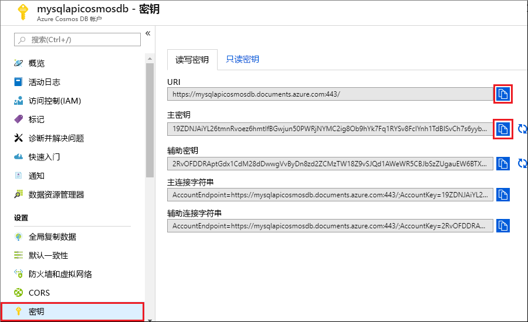

# <a name="quickstart-build-a-net-web-app-using-azure-cosmos-db-sql-api-account"></a>快速入门：使用 Azure Cosmos DB SQL API 帐户生成 .NET Web 应用

> [!div class="op_single_selector"]
> * [.NET](create-sql-api-dotnet.md)
> * [.NET（预览版）](create-sql-api-dotnet-preview.md)
> * [Java](create-sql-api-java.md)
> * [Node.js](create-sql-api-nodejs.md)
> * [Python](create-sql-api-python.md)
> * [Xamarin](create-sql-api-xamarin-dotnet.md)
>  
> 

Azure Cosmos DB 是 Microsoft 提供的全球分布式多模型数据库服务。 可快速创建和查询文档、键/值和图形数据库，所有这些都受益于 Azure Cosmos DB 核心的全球分布和水平缩放功能。 

本快速入门演示如何使用 Azure 门户创建 Azure Cosmos DB [SQL API](sql-api-introduction.md) 帐户、文档数据库、集合以及将示例数据添加到集合。 然后使用 [SQL .NET SDK](sql-api-sdk-dotnet.md) 生成待办事项列表 Web 应用并进行部署，以在集合中添加更多管理数据。 

## <a name="prerequisites"></a>先决条件

如果尚未安装 Visual Studio 2017，可以下载并使用**免费的** [Visual Studio 2017 Community Edition](https://www.visualstudio.com/downloads/)。 在安装 Visual Studio 的过程中，请确保启用“Azure 开发”。

[!INCLUDE [quickstarts-free-trial-note](../../includes/quickstarts-free-trial-note.md)] 
[!INCLUDE [cosmos-db-emulator-docdb-api](../../includes/cosmos-db-emulator-docdb-api.md)]  

<a id="create-account"></a>
## <a name="create-an-account"></a>创建帐户

[!INCLUDE [cosmos-db-create-dbaccount](../../includes/cosmos-db-create-dbaccount.md)]

<a id="create-collection-database"></a>
## <a name="add-a-database-and-a-collection"></a>添加数据库和集合

现在可以在 Azure 门户中使用数据资源管理器工具来创建数据库和集合。 

1. 单击“数据资源管理器” > “新建集合”。 
    
    “添加集合”区域显示在最右侧，可能需要向右滚动才能看到它。

    

2. 在“添加集合”页上，输入新集合的设置。

    设置|建议的值|说明
    ---|---|---
    **数据库 ID**|ToDoList|输入 ToDoList 作为新数据库的名称。 数据库名称必须包含 1 到 255 个字符，不能包含 `/, \\, #, ?` 或尾随空格。
    **集合 ID**|Items|输入 *Items* 作为新集合的名称。 集合 ID 与数据库名称的字符要求相同。
    **分区键**| `<your_partition_key>`| 输入分区键。 本文中所述的示例使用 /category 作为分区键。
    **吞吐量**|400 RU|将吞吐量更改为每秒 400 个请求单位 (RU/s)。 如果想要减少延迟，以后可以增加吞吐量。 
    
    除了前面的设置，还可以选择为集合添加“唯一键”。 在此示例中，请将此字段留空。 开发人员可以使用唯一键向数据库添加一层数据完整性。 创建集合时，通过创建唯一键策略，可确保每个分区键的一个或多个值的唯一性。 若要了解详细信息，请参阅 [Azure Cosmos DB 中的唯一键](unique-keys.md)一文。
    
    单击“确定”。

    数据资源管理器将显示新的数据库和集合。

    

<a id="add-sample-data"></a>
## <a name="add-sample-data"></a>添加示例数据

现在可以使用数据资源管理器将数据添加到新集合。

1. 在数据资源管理器中，新数据库会显示在“集合”窗格中。 展开 **Tasks** 数据库，展开 **Items** 集合，单击“文档”，然后单击“新建文档”。 

   
  
2. 现在，将文档添加到具有以下结构的集合。

     ```json
     {
         "id": "1",
         "category": "personal",
         "name": "groceries",
         "description": "Pick up apples and strawberries.",
         "isComplete": false
     }
     ```

3. 将 json 添加到“文档”选项卡以后，即可单击“保存”。

    

4. 再创建并保存一个文档，在其中插入 `id` 属性的唯一值，并将其他属性更改为适当值。 新文档可以具有所需的任何结构，因为 Azure Cosmos DB 不对数据施加任何架构。

## <a name="query-your-data"></a>查询数据

[!INCLUDE [cosmos-db-create-sql-api-query-data](../../includes/cosmos-db-create-sql-api-query-data.md)]

## <a name="clone-the-sample-application"></a>克隆示例应用程序

现在，让我们转到如何使用代码上来。 接下来，克隆 [GitHub 中的 SQL API](https://github.com/Azure-Samples/documentdb-dotnet-todo-app) 应用程序，设置连接字符串，并运行应用程序。 会看到以编程方式处理数据是多么容易。 

1. 打开命令提示符，新建一个名为“git-samples”的文件夹，然后关闭命令提示符。

    ```bash
    md "C:\git-samples"
    ```

2. 打开诸如 git bash 之类的 git 终端窗口，并使用 `cd` 命令更改为要安装示例应用的新文件夹。

    ```bash
    cd "C:\git-samples"
    ```

3. 运行下列命令以克隆示例存储库。 此命令在计算机上创建示例应用程序的副本。

    ```bash
    git clone https://github.com/Azure-Samples/documentdb-dotnet-todo-app.git
    ```

4. 然后在 Visual Studio 中打开 todo 解决方案文件。 

## <a name="review-the-code"></a>查看代码

此步骤是可选的。 如果有意了解如何使用代码创建数据库资源，可以查看以下代码片段。 否则，可以直接跳转到[更新连接字符串](#update-your-connection-string)。 在此快速入门中，会使用 Azure 门户创建数据库和集合，并使用 .NET 示例添加示例数据。 但是，也可以使用 .NET 示例创建数据库和集合。 

以下代码片段全部摘自 DocumentDBRepository.cs 文件。

* 初始化 DocumentClient，如以下代码所示：

    ```csharp
    client = new DocumentClient(new Uri(ConfigurationManager.AppSettings["endpoint"]), ConfigurationManager.AppSettings["authKey"]);
    ```

* 使用 `CreateDatabaseAsync` 方法创建新数据库，如以下代码所示：

    ```csharp
    await client.CreateDatabaseAsync(new Database { Id = DatabaseId });
    ```

* 使用 `CreateDocumentCollectionAsync` 创建新集合，如以下代码所示：

    ```csharp
    private static async Task CreateCollectionIfNotExistsAsync()
    {
        try
        {
           await client.ReadDocumentCollectionAsync(UriFactory.CreateDocumentCollectionUri(DatabaseId, CollectionId));
        }
        catch (DocumentClientException e)
        {
           if (e.StatusCode == System.Net.HttpStatusCode.NotFound)
           {
              await client.CreateDocumentCollectionAsync(
              UriFactory.CreateDatabaseUri(DatabaseId),
              new DocumentCollection
              {
                  Id = CollectionId
              },
              new RequestOptions { OfferThroughput = 400 });
           }
           else
           {
             throw;
           }
        }
    }
    ```

## <a name="update-your-connection-string"></a>更新连接字符串

现在返回到 Azure 门户，获取连接字符串信息，并将其复制到应用。

1. 在 [Azure 门户](https://portal.azure.com/)的 Azure Cosmos DB 帐户的左侧导航栏中，选择“密钥”，然后选择“读写密钥”。 使用屏幕右侧的复制按钮将 URI 和主密钥复制到下一步的 web.config 文件中。

    

2. 在 Visual Studio 2017 中，打开 web.config 文件。 

3. 从门户中复制 URI 值（使用复制按钮），并在 web.config 中将其设为终结点密钥的值。 

    `<add key="endpoint" value="FILLME" />`

4. 然后从门户复制 PRIMARY KEY 值，并在 web.config 中将其设为 authKey 的值。 

    `<add key="authKey" value="FILLME" />`
    
5. 然后更新数据库和集合值以匹配先前创建的数据库的名称。 现已使用与 Azure Cosmos DB 进行通信所需的所有信息更新应用。 

   ```csharp
   <add key="database" value="ToDoList"/>
   <add key="collection" value="Items"/>
   ```
 
## <a name="run-the-web-app"></a>运行 Web 应用
1. 在 Visual Studio 中，右键单击解决方案资源管理器中的项目，然后选择“管理 NuGet 包”。 

2. 在 NuGet“浏览”框中，键入 *DocumentDB*。

3. 从结果中安装“Microsoft.Azure.DocumentDB”库。 这会安装 Microsoft.Azure.DocumentDB 包以及所有依赖项。

4. 选择 CTRL + F5 以运行应用程序。 应用会显示在浏览器中。 

5. 在浏览器中选择“新建”，并在“待办事项”应用中创建一些新任务。

   

现可返回到数据资源管理器，查看查询、修改和处理此新数据。 

## <a name="review-slas-in-the-azure-portal"></a>在 Azure 门户中查看 SLA

[!INCLUDE [cosmosdb-tutorial-review-slas](../../includes/cosmos-db-tutorial-review-slas.md)]

## <a name="clean-up-resources"></a>清理资源

[!INCLUDE [cosmosdb-delete-resource-group](../../includes/cosmos-db-delete-resource-group.md)]

## <a name="next-steps"></a>后续步骤

在本快速入门教程中，已了解如何创建 Azure Cosmos DB 帐户、使用数据资源管理器创建集合和运行 Web 应用。 现在可以将其他数据导入 Cosmos DB 帐户。 

> [!div class="nextstepaction"]
> [将数据导入 Azure Cosmos DB](import-data.md)


