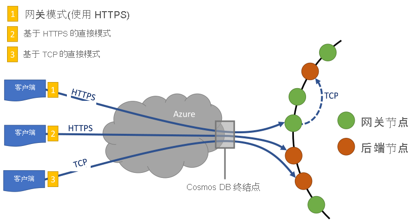

# <a name="performance-tips-for-azure-cosmos-db-and-net"></a>适用于 Azure Cosmos DB 和 .NET 的性能提示

> [!div class="op_single_selector"]
> * [异步 Java](performance-tips-async-java.md)
> * [Java](performance-tips-java.md)
> * [.NET](performance-tips.md)
> 

Azure Cosmos DB 是一个快速、弹性的分布式数据库，可以在提供延迟与吞吐量保证的情况下无缝缩放。 您不必进行重大体系结构更改或编写复杂的代码来使用 Azure Cosmos DB 扩展数据库。 扩展和缩减操作就像执行单个 API 调用一样简单。 若要了解详细信息，请参阅[如何预配容器吞吐量](how-to-provision-container-throughput.md)或[如何预配数据库吞吐量](how-to-provision-database-throughput.md)。 但是，由于 Azure Cosmos DB 是通过网络调用访问的，因此在使用[SQL .NET SDK](sql-api-sdk-dotnet-standard.md)时，您可以进行客户端优化以实现峰值性能。

因此，如果您尝试提高数据库性能，请考虑以下选项：

## <a name="hosting-recommendations"></a>托管建议

**对于查询密集型工作负载，请使用 Windows 64 位而不是 Linux 或 Windows 32 位主机处理**

我们建议处理 Windows 64 位主机以提高性能。 SQL SDK 包括一个本机 ServiceInterop.dll，用于在本地解析和优化查询。 服务 Interop.dll 仅在 Windows x64 平台上受支持。 对于 Linux 和其他不支持的平台（ServiceInterop.dll 不可用），将再对网关进行网络调用以获取优化的查询。 默认情况下，以下类型的应用程序使用 32 位主机处理。 要将主机处理更改为 64 位处理，请根据应用程序的类型执行以下步骤：

- 对于可执行应用程序，您可以通过在 **"生成"选项卡上的"项目属性**"窗口中将[平台目标](https://docs.microsoft.com/visualstudio/ide/how-to-configure-projects-to-target-platforms?view=vs-2019)设置为**x64**来**Build**更改主机处理。

- 对于基于 VSTest 的测试项目，您可以通过在 Visual Studio**测试**菜单中选择**测试** > **设置** > **默认处理器体系结构作为 X64**来更改主机处理。

- 对于本地部署ASP.NET Web 应用程序，您可以通过选择"**工具** > **选项** > **项目和解决方案** > **Web 项目**"下的 Web**站点和项目使用 64 位版本的 IIS Express**来更改主机处理。

- 对于部署在 Azure 上的ASP.NET Web 应用程序，可以通过在 Azure 门户中**的应用程序设置**中选择**64 位**平台来更改主机处理。

> [!NOTE] 
> 默认情况下，新的可视化工作室项目设置为**任何 CPU**。 我们建议您将项目设置为**x64，** 以便它不会切换到**x86**。 如果添加了仅 x86 的依赖项，则设置为 **"任何 CPU"** 的项目集可以轻松地切换到**x86。**<br/>
> ServiceInterop.dll 需要位于正在从中执行 SDK DLL 的文件夹中。 仅当手动复制 DLL 或具有自定义生成/部署系统时，这才应是一个问题。
    
**打开服务器端垃圾回收 （GC）**

在某些情况下，减少垃圾回收的频率会有所帮助。 在 .NET 中，将`true` [gcServer](https://msdn.microsoft.com/library/ms229357.aspx)设置为 。

**横向扩展客户端工作负载**

如果您在高吞吐量级别（超过 50，000 RU/s）进行测试，则客户端应用程序可能会由于计算机在 CPU 或网络利用率上受到限制而成为瓶颈。 如果达到此上限，可以跨多个服务器横向扩展客户端应用程序以继续进一步推送 Azure Cosmos DB 帐户。

> [!NOTE] 
> CPU 使用率高可能会导致延迟增加和请求超时异常。

## <a name="networking"></a>网络
<a id="direct-connection"></a>

**连接策略：使用直接连接模式**

客户端如何连接到 Azure Cosmos DB 具有重要的性能影响，尤其是对于观察到的客户端延迟。 有两个关键配置设置可用于配置客户端连接策略：连接*模式*和连接*协议*。  两种可用模式：

   * 网关模式
      
     网关模式在所有 SDK 平台上都受支持，是[Microsoft.Azure.DocumentDB SDK](sql-api-sdk-dotnet.md)的配置默认值。 如果应用程序在具有严格防火墙限制的公司网络中运行，则网关模式是最佳选择，因为它使用标准 HTTPS 端口和单个终结点。 但是，性能权衡是，每次从 Azure Cosmos DB 读取数据或写入 Azure Cosmos DB 时，网关模式都涉及额外的网络跃点。 因此，直接模式提供更好的性能，因为网络跃点较少。 在套接字连接数量有限的环境中运行应用程序时，我们还建议采用网关连接模式。

     在 Azure 函数中使用 SDK 时，尤其是在[使用计划中](../azure-functions/functions-scale.md#consumption-plan)，请注意[连接的当前限制](../azure-functions/manage-connections.md)。 在这种情况下，如果您还在 Azure 函数应用程序中使用其他基于 HTTP 的客户端，则网关模式可能更好。

   * 直接模式

     直接模式支持通过TCP协议连接，如果您使用的是[Microsoft.Azure.Cosmos/.NET V3 SDK](sql-api-sdk-dotnet-standard.md)，则它是默认连接模式。

在网关模式下，当您使用 MongoDB 的 Azure Cosmos DB API 时，Azure Cosmos DB 使用端口 443 和端口 10250、10255 和 10256。 端口 10250 映射到默认的 MongoDB 实例，无需异地复制。 端口 10255 和 10256 映射到具有异地复制的 MongoDB 实例。
     
在直接模式下使用 TCP 时，除了网关端口之外，还需要确保 10000 和 20000 之间的端口范围处于打开状态，因为 Azure Cosmos DB 使用动态 TCP 端口。 如果这些端口未打开，并且您尝试使用 TCP，您将收到 503 服务不可用错误。 下表显示了可用于各种 API 的连接模式以及用于每个 API 的服务端口：

|连接模式  |支持的协议  |支持的 SDK  |API/服务端口  |
|---------|---------|---------|---------|
|网关  |   HTTPS    |  所有 SDK    |   SQL （443）， 蒙哥DB （10250， 10255， 10256）， 表 （443）， 卡桑德拉 （10350）， 图形 （443）    |
|直接    |     TCP    |  .NET SDK    | 10000 到 20000 范围内的端口 |

Azure Cosmos DB 通过 HTTPS 提供了简单、开放的 RESTful 编程模型。 此外，它提供高效的 TCP 协议，该协议在其通信模型中也是 RESTful，可通过 .NET 客户端 SDK 获得。 TCP 协议使用 SSL 进行初始身份验证以及加密通信。 为了获得最佳性能，请尽可能使用 TCP 协议。

对于 SDK V3，在 中创建`CosmosClient`实例时配置连接模式。 `CosmosClientOptions` 请记住，直接模式是默认值。

```csharp
var serviceEndpoint = new Uri("https://contoso.documents.net");
var authKey = "your authKey from the Azure portal";
CosmosClient client = new CosmosClient(serviceEndpoint, authKey,
new CosmosClientOptions
{
    ConnectionMode = ConnectionMode.Gateway // ConnectionMode.Direct is the default
});
```

对于 Microsoft.Azure.DocumentDB SDK，您可以使用`DocumentClient``ConnectionPolicy`参数在实例构造期间配置连接模式。 如果使用直接模式，也可以使用 参数`Protocol``ConnectionPolicy`设置 。

```csharp
var serviceEndpoint = new Uri("https://contoso.documents.net");
var authKey = "your authKey from the Azure portal";
DocumentClient client = new DocumentClient(serviceEndpoint, authKey,
new ConnectionPolicy
{
   ConnectionMode = ConnectionMode.Direct, // ConnectionMode.Gateway is the default
   ConnectionProtocol = Protocol.Tcp
});
```

由于 TCP 仅在直接模式下受支持，因此如果使用网关模式，则 HTTPS 协议始终用于与网关通信，`Protocol`并且忽略 中的`ConnectionPolicy`值。



**调用 OpenAsync，以避免首次请求的启动延迟**

默认情况下，第一个请求具有更高的延迟，因为它需要获取地址路由表。 当您使用[SDK V2](sql-api-sdk-dotnet.md)`OpenAsync()`时，在初始化期间调用一次，以避免第一个请求上的启动延迟：

    await client.OpenAsync();

> [!NOTE] 
> `OpenAsync`将生成请求以获取帐户中所有容器的地址路由表。 对于具有许多容器但应用程序访问其中子集的帐户，`OpenAsync`将生成不必要的流量，这将使初始化速度变慢。 因此，`OpenAsync`在这种情况下，使用可能毫无用处，因为它会减慢应用程序启动的速度。

   <a id="same-region"></a>
**为了达到性能，将客户端位于同一 Azure 区域中**

如果可能，将调用 Azure Cosmos DB 的任何应用程序放在与 Azure Cosmos 数据库相同的区域中。 下面是一个近似的比较：对 Azure Cosmos DB 的调用在同一区域内完成 1 毫秒到 2 毫秒以内，但美国西海岸和东海岸之间的延迟超过 50 毫秒。 此延迟可能因请求而异，具体取决于请求从客户端传递到 Azure 数据中心边界时所走的路线。 通过确保调用应用程序与预配的 Azure Cosmos DB 终结点位于同一 Azure 区域中，可以获得尽可能低的延迟。 有关可用区域的列表，请参阅 [Azure 区域](https://azure.microsoft.com/regions/#services)。

策略<a id="increase-threads"></a>

**增加线程/任务数**

由于通过网络对 Azure Cosmos DB 进行的调用，您可能需要更改请求的并行性程度，以便客户端应用程序在请求之间花费最少的等待时间。 例如，如果使用 .NET[任务并行库](https://msdn.microsoft.com//library/dd460717.aspx)，则按从 Azure Cosmos DB 读取或写入的数百个任务的顺序创建。

**启用加速网络**
 
 为了减少延迟和 CPU 抖动，我们建议您在客户端虚拟机上启用加速网络。 请参阅[创建具有加速网络的 Windows 虚拟机](../virtual-network/create-vm-accelerated-networking-powershell.md)或[创建具有加速网络的 Linux 虚拟机](../virtual-network/create-vm-accelerated-networking-cli.md)。

## <a name="sdk-usage"></a>SDK 用法
**安装最新的 SDK**

Azure Cosmos DB SDK 正在不断改进以提供最佳性能。 请参阅 [Azure Cosmos DB SDK](sql-api-sdk-dotnet-standard.md) 页以了解最新的 SDK 并查看改进内容。

**使用流 API**

[.NET SDK V3](sql-api-sdk-dotnet-standard.md)包含流 API，可以接收和返回数据而不进行序列化。 

中间层应用程序不直接从 SDK 使用响应，但将它们中继到其他应用程序层，则可以从流 API 中受益。 有关流处理的示例，请参阅[物料管理](https://github.com/Azure/azure-cosmos-dotnet-v3/blob/master/Microsoft.Azure.Cosmos.Samples/Usage/ItemManagement)示例。

**在应用程序的生存期内使用单一的 Azure Cosmos DB 客户端**

每个`DocumentClient`实例`CosmosClient`都是线程安全的，在直接模式下运行时执行高效的连接管理和地址缓存。 为了实现高效的连接管理和更好的 SDK 客户端性能，我们建议您在应用程序的生存期内为每个`AppDomain`实例使用单个实例。

   <a id="max-connection"></a>

**使用网关模式时，增加每个主机的最大连接System.Net**

使用网关模式时，通过 HTTPS/REST 发出 Azure 宇宙 DB 请求。 它们受每个主机名或 IP 地址的默认连接限制。 您可能需要设置为`MaxConnections`较高的值（100 到 1，000），以便客户端库可以使用多个同时连接到 Azure Cosmos DB。 在 .NET SDK 1.8.0 及更高版本中，[服务点管理器的默认值为](https://msdn.microsoft.com/library/system.net.servicepointmanager.defaultconnectionlimit.aspx)50。 要更改该值，可以将[文档.客户端.连接策略.maxConnectionLimit](https://msdn.microsoft.com/library/azure/microsoft.azure.documents.client.connectionpolicy.maxconnectionlimit.aspx)设置为更高的值。

**调整分区集合的并行查询**

SQL .NET SDK 1.9.0 和更高版本支持并行查询，使您能够并行查询分区集合。 有关详细信息，请参阅与使用这些 SDK 相关的[代码示例](https://github.com/Azure/azure-documentdb-dotnet/blob/master/samples/code-samples/Queries/Program.cs)。 并行查询旨在提供比串行查询更好的查询延迟和吞吐量。 并行查询提供两个参数，您可以调整这些参数以满足您的要求： 
- `MaxDegreeOfParallelism`控制可并行查询的最大分区数。 
- `MaxBufferedItemCount`控制预获取结果的数量。

***并行度的调谐度***

并行查询的工作原理是并行查询多个分区。 但是，单个分区中的数据相对于查询进行串行提取。 在`MaxDegreeOfParallelism` [SDK V2](sql-api-sdk-dotnet.md)或`MaxConcurrency` [SDK V3](sql-api-sdk-dotnet-standard.md)中设置为分区数最有可能实现性能最优的查询，前提是所有其他系统条件保持不变。 如果不知道分区的数量，可以将并行度设置为高数字。 系统将选择最小（分区数，用户提供的输入）作为并行性的程度。

请注意，如果数据与查询有关的所有分区均匀分布，则并行查询会产生最大的好处。 如果分区集合进行了分区，以便查询返回的所有数据或大部分集中在几个分区中（一个分区是最坏的情况），则这些分区将制约查询的性能。

***调整最大缓冲项目计数***
    
并行查询旨在在客户端处理当前结果批处理时预提取结果。 此预提取有助于提高查询的总体延迟。 该`MaxBufferedItemCount`参数限制预获取结果的数量。 设置为`MaxBufferedItemCount`返回的预期结果数（或较高数量），以允许查询从预提取中获得最大收益。

无论并行性程度如何，预提取的工作方式都相同，并且所有分区中的数据都有一个缓冲区。  

**按 RetryAfter 间隔实现退让**

在性能测试期间，应增加负载，直到限制少量请求。 如果请求被限制，客户端应用程序应在服务器指定的重试间隔内关闭限制。 尊重回退可确保您在重试之间花费最少的时间等待。 

重试策略支持包含在这些 SDK 中：
- 用于 SQL 的[.NET SDK](sql-api-sdk-dotnet.md)版本 1.8.0 及更高版本，[以及用于 SQL](sql-api-sdk-java.md)的 Java SDK
- 用于 SQL 的[Node.js SDK](sql-api-sdk-node.md)版本 1.9.0 及更高版本，[以及用于 SQL](sql-api-sdk-python.md)的 Python SDK
- [.NET 核心](sql-api-sdk-dotnet-core.md)SDK 的所有支持版本 

有关详细信息，请参阅[重试后](https://msdn.microsoft.com/library/microsoft.azure.documents.documentclientexception.retryafter.aspx)。
    
在版本 1.19 和 .NET SDK 的更高版本中，有一种用于记录其他诊断信息和解决延迟问题的机制，如下例所示。 可以记录具有较高读取延迟的请求的诊断字符串。 捕获的诊断字符串将帮助您了解给定请求收到 429 个错误的次数。

```csharp
ResourceResponse<Document> readDocument = await this.readClient.ReadDocumentAsync(oldDocuments[i].SelfLink);
readDocument.RequestDiagnosticsString 
```

**缓存较低读取延迟的文档 URI**

尽可能缓存文档 URI 以获得最佳读取性能。 创建资源时，需要定义逻辑以缓存资源 ID。 基于资源指示的查找比基于名称的查找更快，因此缓存这些值可提高性能。

   <a id="tune-page-size"></a>
**调整查询/读取源的页面大小，以获得更好的性能**

当您使用读取源功能（例如`ReadDocumentFeedAsync`），或发出 SQL 查询对文档进行批量读取时，如果结果集太大，则以分段方式返回结果。 默认情况下，以包括 100 个项的块或 1 MB 大小的块返回结果（以先达到的限制为准）。

若要减少检索所有适用结果所需的网络往返次数，可以使用[x-ms-max 项计数](https://docs.microsoft.com/rest/api/cosmos-db/common-cosmosdb-rest-request-headers)请求多达 1，000 个标头来增加页面大小。 当您只需要显示几个结果时，例如，如果用户界面或应用程序 API 一次仅返回 10 个结果，也可以将页面大小减小到 10，以减少读取和查询的吞吐量。

> [!NOTE] 
> 该`maxItemCount`属性不应仅用于分形。 它的主要用途是通过减少单个页中返回的最大项数来提高查询的性能。  

您还可以使用可用的 Azure Cosmos DB SDK 设置页面大小。 中的`FeedOptions` [MaxItemCount](/dotnet/api/microsoft.azure.documents.client.feedoptions.maxitemcount?view=azure-dotnet)属性允许您设置枚举操作中要返回的最大项数。 当`maxItemCount`设置为 -1 时，SDK 会自动找到最佳值，具体取决于文档大小。 例如：
    
```csharp
IQueryable<dynamic> authorResults = client.CreateDocumentQuery(documentCollection.SelfLink, "SELECT p.Author FROM Pages p WHERE p.Title = 'About Seattle'", new FeedOptions { MaxItemCount = 1000 });
```
    
执行查询时，结果数据在 TCP 数据包中发送。 如果为`maxItemCount`指定的值太低，则在 TCP 数据包中发送数据所需的行程数很高，这会影响性能。 因此，如果您不确定要为`maxItemCount`属性设置什么值，最好将其设置为 -1，并让 SDK 选择默认值。

**增加线程/任务数**

请参阅增加本文"网络"部分中的[线程/任务数](#increase-threads)。

## <a name="indexing-policy"></a>索引编制策略
 
**从索引中排除未使用的路径以加快写入速度**

Azure Cosmos DB 索引策略还允许您通过使用索引路径（索引策略.包含路径和索引策略.排除路径）指定要包含在索引中或排除哪些文档路径。 索引路径可以提高写入性能，并减少预先知道查询模式的方案的索引存储。 这是因为索引成本与索引的唯一路径数直接相关。 例如，此代码演示如何使用"*"通配符从索引中排除文档的整个部分（子树）：

```csharp
var collection = new DocumentCollection { Id = "excludedPathCollection" };
collection.IndexingPolicy.IncludedPaths.Add(new IncludedPath { Path = "/*" });
collection.IndexingPolicy.ExcludedPaths.Add(new ExcludedPath { Path = "/nonIndexedContent/*");
collection = await client.CreateDocumentCollectionAsync(UriFactory.CreateDatabaseUri("db"), excluded);
```

有关详细信息，请参阅 [Azure Cosmos DB 索引策略](index-policy.md)。

## <a name="throughput"></a>吞吐量
<a id="measure-rus"></a>

**测量和调整较低的请求单位/秒使用情况**

Azure Cosmos DB 提供了一组丰富的数据库操作。 这些操作包括与 UDF 的关系查询和分层查询、存储过程和触发器，所有这些操作都对数据库集合中的文档进行操作。 与每个操作关联的成本因完成操作所需的 CPU、IO 和内存而异。 您可以将请求单元 （RU） 视为执行各种数据库操作和服务应用程序请求所需的资源的单一度量值，而不是考虑和管理硬件资源。

吞吐量根据为每个容器设置[的请求单位](request-units.md)数进行预配。 请求单位消耗量计算为每秒速率。 超过其容器的预配请求单位速率的应用程序将受到限制，直到速率降至容器的预配级别以下。 如果应用程序需要更高级别的吞吐量，则可以通过预配其他请求单位来增加吞吐量。

查询的复杂性会影响操作使用的请求单位数。 谓词数、谓词的性质、UdF 的数量和源数据集的大小都会影响查询操作的成本。

要测量任何操作（创建、更新或删除）的开销，请检查[x-ms 请求-请求-费用](https://docs.microsoft.com/rest/api/cosmos-db/common-cosmosdb-rest-response-headers)标头（或`RequestCharge``FeedResponse\<T>`.NET `ResourceResponse\<T>` SDK 中的等效属性）以测量操作使用的请求单位数：

```csharp
// Measure the performance (Request Units) of writes
ResourceResponse<Document> response = await client.CreateDocumentAsync(collectionSelfLink, myDocument);
Console.WriteLine("Insert of document consumed {0} request units", response.RequestCharge);
// Measure the performance (Request Units) of queries
IDocumentQuery<dynamic> queryable = client.CreateDocumentQuery(collectionSelfLink, queryString).AsDocumentQuery();
while (queryable.HasMoreResults)
    {
        FeedResponse<dynamic> queryResponse = await queryable.ExecuteNextAsync<dynamic>();
        Console.WriteLine("Query batch consumed {0} request units", queryResponse.RequestCharge);
    }
```             

在此标头中返回的请求费用只是预配吞吐量（即 2，000 个 R/秒）的一小部分。 例如，如果前面的查询返回 1，000 个 1-KB 文档，则操作的成本为 1，000。 因此，在一秒钟内，服务器只通知两个此类请求，然后再对以后的请求进行速率限制。 有关详细信息，请参阅[请求单位和](request-units.md)[请求单位计算器](https://www.documentdb.com/capacityplanner)。
<a id="429"></a>

**处理速率限制/请求速率太大**

当客户端尝试超过帐户的保留吞吐量时，服务器的性能不会下降，并且不会使用超出保留级别的吞吐量容量。 服务器将先发制人地使用 RequestRateTooLarge（HTTP 状态代码 429）结束请求。 它将返回一个[x-ms-retry 后 ms 标头](https://docs.microsoft.com/rest/api/cosmos-db/common-cosmosdb-rest-response-headers)，指示用户必须等待的时间量（以毫秒为单位）才能再次尝试请求。

    HTTP Status 429,
    Status Line: RequestRateTooLarge
    x-ms-retry-after-ms :100

SDK 全部都会隐式捕获此响应，并遵循服务器指定的 retry-after 标头，并重试请求。 除非多个客户端同时访问帐户，否则下次重试就会成功。

如果多个客户端累积操作始终高于请求速率，则客户端当前在内部设置为 9 的默认重试计数可能不足。 在这种情况下，客户端向应用程序抛出带有状态代码 429 的 DocumentClientException。 

您可以通过在`RetryOptions``ConnectionPolicy`实例上设置 更改默认重试计数。 默认情况下，如果请求继续以高于请求速率的方式运行，则在 30 秒的累积等待时间后将返回 DocumentClientException 和状态代码 429。 即使当前重试计数小于最大重试计数（无论当前值是默认值 9 还是用户定义的值）也会返回此错误。

自动重试行为有助于提高大多数应用程序的恢复能力和可用性。 但是，在进行性能基准测试时，这可能不是最佳行为，尤其是在测量延迟时。 如果实验达到服务器限制并导致客户端 SDK 静默重试，则客户端观测到的延迟会剧增。 若要避免性能实验期间出现延迟高峰，可以测量每个操作返回的费用，并确保请求以低于保留请求速率的方式运行。 有关详细信息，请参阅[请求单位](request-units.md)。

**为了更高的吞吐量，设计较小的文档**

给定操作的请求费用（即请求处理成本）与文档的大小直接相关。 对大型文档的操作比对小型文档的操作的成本要高出。

## <a name="next-steps"></a>后续步骤
对于用于评估 Azure Cosmos DB 用于几个客户端计算机上高性能方案的示例应用程序，请参阅[使用 Azure Cosmos DB 进行性能和缩放测试](performance-testing.md)。

若要深入了解如何设计应用程序以实现缩放和高性能，请参阅 [Azure Cosmos DB 中的分区和缩放](partition-data.md)。
