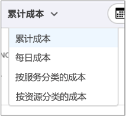
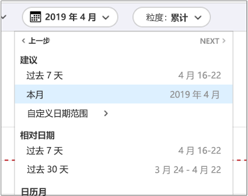
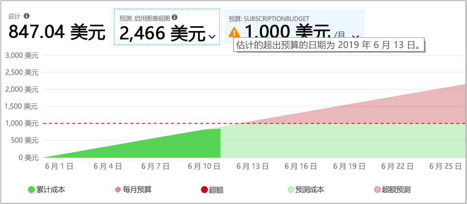
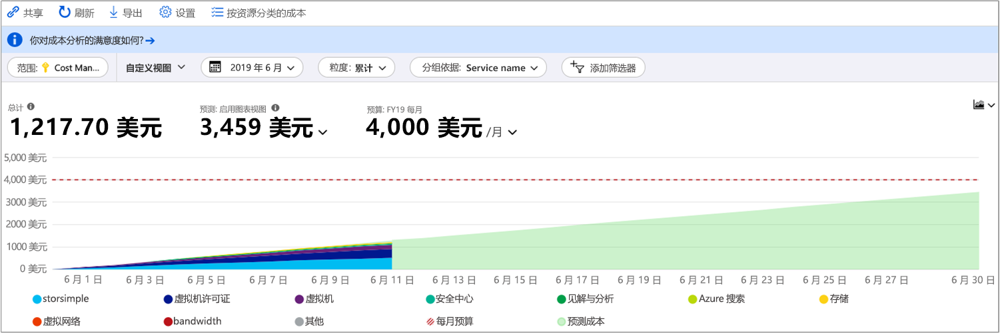
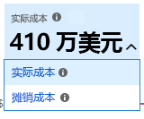
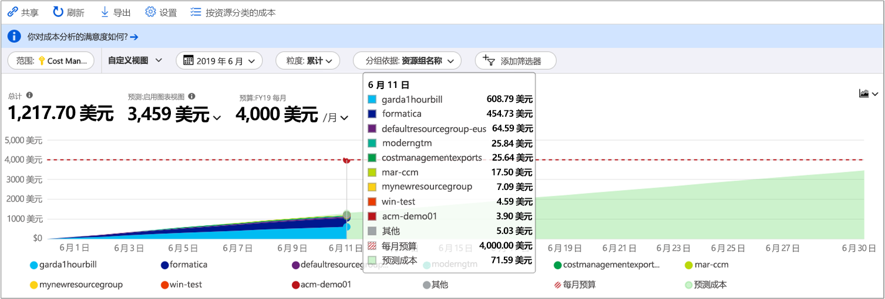
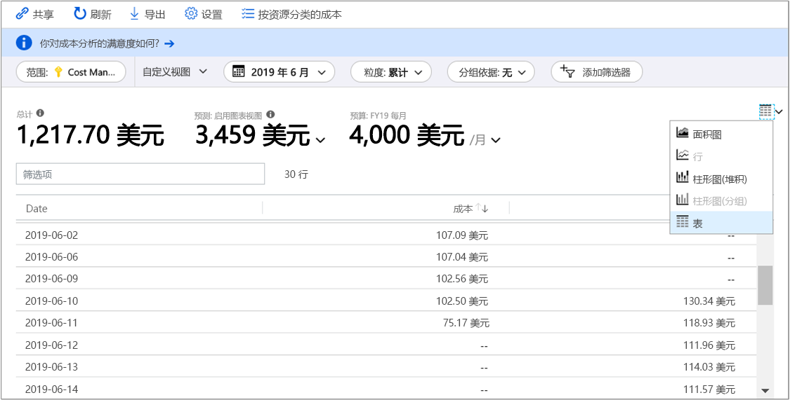

# 快速入门：通过成本分析了解和分析成本

需要知道你组织中哪些方面产生了成本，然后才能正确地控制和优化 Azure 成本。 这还有助于了解服务的成本及其支持的环境和系统。 要准确地了解组织的支出模式，必须了解成本的方方面面。 可在强制实施成本控制机制（如预算）时使用支出模式。

在本快速入门中，你将通过成本分析了解和分析组织成本。 可以按组织查看合计成本，了解哪些方面持续产生成本并确定支出趋势。 可以查看一段时间的累计成本，根据预算预估每月、每季度甚至每年的成本趋势。 预算可帮助你遵守财务约束。 并且预算用于查看每日或每月成本，以隔离异常支出行为。 你还可下载当前报表的数据进行深入分析或在外部系统中使用。

此快速入门介绍如何：

- 通过成本分析查看成本
- 自定义成本视图
- 下载成本分析数据

## 先决条件

成本分析支持各种 Azure 帐户类型。 若要查看支持的帐户类型的完整列表，请参阅[了解成本管理数据](understand-cost-mgt-data.md)。 若要查看成本数据，你至少需要对 Azure 帐户具有读取访问权限。

若要了解如何分配对 Azure 成本管理数据的访问权限，请参阅[分配对数据的访问权限](../../cost-management/assign-access-acm-data.md)。

如果你有新订阅，则无法立即使用成本管理功能。 最多可能需要 48 小时才能使用所有成本管理功能。

## 登录 Azure

- 通过 https://portal.azure.com 登录到 Azure 门户。

## 通过成本分析查看成本

若要通过成本分析查看成本，请在 Azure 门户打开范围并在菜单中选择“成本分析”。 例如，转到“订阅”，从列表中选择订阅，然后在菜单中选择“成本分析” 。 使用“范围”框可在成本分析中切换到不同的范围。 有关范围的详细信息，请参阅[了解并使用范围](understand-work-scopes.md)。

所选的范围将用于整个成本管理，以提供数据整合和控制对成本信息的访问。 使用范围时，不要多选它们。 而应先选择一个汇总了其他范围的较大范围，然后筛选出所需的嵌套范围。 了解此方法很重要，因为某些用户可能无法访问单个涵盖多个嵌套范围的父范围。

请观看视频[如何在 Azure 门户中使用成本管理](https://www.youtube.com/watch?v=mfxysF-kTFA)来详细了解成本分析的用法。 若要观看其他视频，请访问[成本管理 YouTube 频道](https://www.youtube.com/c/AzureCostManagement)。

>[!VIDEO https://www.youtube.com/embed/mfxysF-kTFA]

初始成本分析视图包括以下方面。

**累计成本视图**：表示预定义的成本分析视图配置。 每个视图包含日期范围、粒度、分组依据和筛选器设置。 默认视图显示当前计费周期的聚合成本，但可以更改为其他内置视图。 有关详细信息，请参阅[自定义成本视图](#customize-cost-views)。

**实际成本**：显示当前月份的总使用量和购买成本。这些购买成本是应记成本，会显示在账单上。

**预测**：显示所选时间段的预测成本总计。

**预算**：显示所选范围的计划支出限额（如可用）。

**累计粒度**：显示从计费周期开始算起的累计每日成本总额。 为计费帐户或订阅[创建预算](tutorial-acm-create-budgets.md)后，可快速查看对预算而言的支出趋势。 将鼠标悬停某个日期上以查看该天的累计成本。

**透视图（圆环图）** ：提供动态透视，按一组常见标准属性分解总成本。 它们显示当前月成本（从最大到最小排列）。 通过选择不同的透视，可以随时更改透视图。 成本按服务（计量类别）、位置（区域）和子范围（默认）分类。 例如，注册帐户在计费帐户之下，资源组在订阅之下，资源在资源组之下。

### 了解预测

成本预测显示选定时间段的估计成本预测。 该模型基于时序回归模型。 它需要至少 10 天的最近成本和使用情况数据才能准确预测成本。 对于给定的时间段，预测模型需要使用与预测期间相同时长的训练数据。 例如，对三个月进行预测至少需要三个月的最近成本和使用情况数据。

该模型使用最多六个月的训练数据来预测一年的成本。 它至少需要 7 天的训练数据才会改变它的预测。 此预测基于成本和使用模式的巨大变化，例如剧增和剧减。 预测不会为“分组依据”属性中的每个项生成单独的预测。 它仅提供针对总累计成本的预测。 如果你使用多种货币，则模型仅以美元提供成本预测。

## 自定义成本视图

成本分析有四个内置视图，这些视图已针对最常见的目标进行优化：

查看 | 回答各种问题，例如
--- | ---
累计成本 | 这个月目前的支出是多少？ 在预算范围内吗？
每日成本 | 过去 30 天的每日成本是否有增加？
按服务划分的成本 | 过去 3 张发票的每月使用情况是否有变化？
按资源划分的成本 | 从这个月目前的情况来看，哪些资源的成本最高？

但是，在很多情况下需要更深入的分析。 在页面顶部通过数据选择进行自定义。

默认情况下，成本分析显示当前月份的数据。 使用日期选择器，快速切换到常用的日期范围。 例如：过去七天、上个月、本年度或自定义日期范围。 即用即付订阅还包括基于计费周期的日期范围，该周期并未与日历月绑定，例如当前的计费周期或上一张发票。 使用菜单顶部的 **<上一周期** 和 **下一周期>** 链接分别跳至上一周期或下一周期。 例如，“<上一周期”会从“过去七天”切换到“8-14 天之前”，或切换到“15-21 天之前”   。

默认情况下，成本分析显示“累计”成本。 累计成本显示包括前几天在内的每日费用总额，显示每日应计成本不断变化的情况。 此视图已进行优化，可显示对预算而言所选日期范围的支出趋势。

使用预测图表视图时，可以确定潜在的预算违规情况。 如果有可能的预算违规情况，则会以红色显示预计的超支。 另外还会在图表中显示一个指示符。 将鼠标悬停在该符号上会显示估计的预算违规日期。

此外，还有每日视图显示每日成本。 每日视图不会显示增长趋势。 该视图旨在显示异常，如每日的成本峰值或 dip。 如果选择了预算，则每日视图还会显示每日预算的估算值。

如果每日成本不断高于估算的每日预算，可能会超出每月预算。 估算的每日预算是一种可在较浅显的层面上帮助你直观查看预算的方式。 如果每日成本出现波动，则与每月预算比较，估算的每日预算不太准确。

下面是一个已启用支出预测功能的每日视图，显示了最近的支出。

关闭支出预测功能以后，会看不到将来日期的预计支出。 另外，当你查看过去时间段的成本时，成本预测不显示成本。

通常情况下，有望在 8 到 12 小时内看到所用资源的数据或者通知。

“分组依据”通用属性，用于细分成本并确定排名靠前的贡献因素。 例如，若要按资源标记分组，请选择要按其分组的标记键。 成本按每个标记值进行细分，并且有一个额外的段，用于未应用该标记的资源。  有关分组和筛选选项的详细信息，请参阅[分组和筛选选项](https://docs.microsoft.com/azure/cost-management-billing/costs/group-filter)。

大部分[Azure 资源都支持标记](../../azure-resource-manager/management/tag-support.md)。 但某些标记在“成本管理”和“计费”中不可用。 此外，不支持资源组标记。 对标记的支持适用于在将标记应用于资源后报告的使用情况。 标记不会逆向应用于成本汇总。

观看 [How to review tag policies with Azure Cost Management](https://www.youtube.com/watch?v=nHQYcYGKuyw)（如何通过 Azure 成本管理查看标记策略）视频，了解如何使用 Azure 标记策略来改进成本数据可见性。

下面是当前月份的 Azure 服务成本视图。

默认情况下，成本分析会显示所有使用情况和应记购买成本（也称“实际成本”），并会将其显示在发票上。 查看实际成本适用于发票对帐。 但是，在观察成本中的支出异常和其他变化时，需警觉成本中的购买峰值。 若要抹平因预留购买成本导致的峰值，请切换到“摊销成本”。

摊销成本会将预留购买细分成每日区块，将其平摊到整个预留期间。 例如，你会看到从 1 月 1 日到 12 月 31 日这段时间每天都有一个 1.00 美元的购买项，而不是在 1 月 1 日有一个 365 美元的购买项。 除了基本摊销，系统还会将这些成本重新分配并与使用了预留的特定资源相关联。 例如，如果将那个 1.00 美元的每日费用分摊到两个虚拟机，则会看到该日有两个 0.50 美元的费用。 如果该日的部分预留未使用，则会看到一个与相应的虚拟机关联的 0.50 美元费用，以及另一个费用类型为 `UnusedReservation` 的 0.50 美元费用。 请注意，未使用的预留成本只能在查看摊销成本时看到。

必须指出，由于成本表示方式的变化，实际成本和摊销成本视图会显示不同的总计数字。 通常情况下，在查看摊销成本时，有预留购买的月份的总成本会下降，而预留购买之后的月份的总成本会上升。 目前，摊销仅适用于预留购买，不适用于 Azure 市场购买。

下图显示了资源组名称。 可以按标记分组，以便按标记查看总成本；也可以使用“按资源分类的成本”视图，查看特定资源的所有标记的总成本。

当按特定的属性对成本进行分组时，将按从最高到最低的顺序显示排名前 10 的成本贡献因素。 如果成本贡献因素超过 10 个，则会显示排名前九的成本贡献因素和一个“其他”组，该组表示合并的所有剩余组。 按标记分组时，将显示“无标记”组，用于表示未应用标记键的成本。 **非标记**总是位于最后，即使非标记成本高于标记成本。 如果存在 10 个或更多个标记值，则非标记成本将会列在“其他”中。 切换到表视图并将粒度更改为“无”，以查看成本从最高到最低排名的所有值。

经典虚拟机、网络和存储资源不共享详细的计费数据。 当对成本进行分组时，它们合并为**经典服务**。

主图下的透视图显示了不同的分组，让你在更大范围内了解所选时段和筛选器对应的总体成本。 选择一个属性或标记即可按任意维度查看聚合的成本。

你可以查看任何视图的完整数据集。 你应用的选择或筛选器会影响所显示的数据。 若要查看完整的数据集，请选择“图表类型”列表，然后选择“表”视图。

## 保存和共享自定义视图

保存自定义视图并将其与他人共享，方法是将成本分析固定到 Azure 门户仪表板或复制成本分析的链接。

请观看视频[在 Azure 成本管理中共享和保存视图](https://www.youtube.com/watch?v=kQkXXj-SmvQ)，来详细了解如何使用门户在整个组织中分享成本知识。 若要观看其他视频，请访问[成本管理 YouTube 频道](https://www.youtube.com/c/AzureCostManagement)。

>[!VIDEO https://www.youtube.com/embed/kQkXXj-SmvQ]

若要固定成本分析，请选择右上角或“<Subscription Name> | 成本分析”后的图钉图标。 固定成本分析只会保存主图表或表视图。 共享仪表板，允许他人访问此磁贴。 请注意，这只共享仪表板配置，并不授予他人访问基础数据的权限。 如果你没有成本访问权限但有共享仪表板的访问权限，将会看到“拒绝访问”消息。

若要共享成本分析链接，请选择边栏选项卡顶部的“共享”。 随即会显示一个自定义 URL，单击此 URL 会打开针对此特定范围的特定视图。 如果你没有成本访问权限也没有获取此 URL，你将看到“拒绝访问”消息。

若要详细了解如何针对每个受支持的范围授予成本访问权限，请参阅[了解并使用范围](understand-work-scopes.md)。

## 下载使用情况数据

有时候，需要下载数据进行进一步的分析、将其与你自己的数据合并，或者将其集成到你自己的系统中。 成本管理提供一些不同选项。 如果需要临时高级摘要（例如成本分析中的内容），请首先生成所需的视图。 然后通过依次选择“导出”和“将数据下载到 CSV”或“将数据下载到 Excel”进行下载  。 Excel 下载提供用于生成下载的视图的其他上下文，例如范围、查询配置、总计以及生成日期。

如果需要完整的非聚合数据集，请从计费帐户下载。 然后从门户左侧导航窗格中的服务列表中转到“成本管理 + 计费”。 如果适用，请选择你的计费帐户。 转到“使用情况 + 费用”，然后选择所需计费周期的“下载”图标 。

## 清理资源

- 如果已固定成本分析的自定义视图，但你不再需要它，请转到固定该视图的仪表板，然后删除固定视图。
- 如果下载了使用情况数据文件且不再需要这些文件，请确保将其删除。

## 后续步骤

转到第一个教程，了解如何创建并管理预算。

> [!div class="nextstepaction"]
> [创建并管理预算](tutorial-acm-create-budgets.md)
