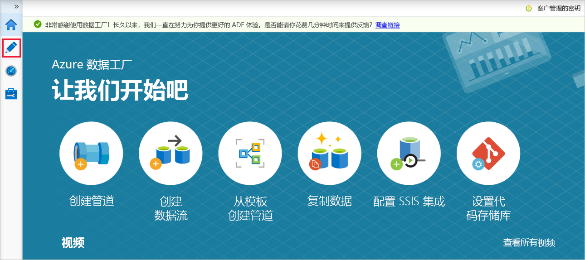
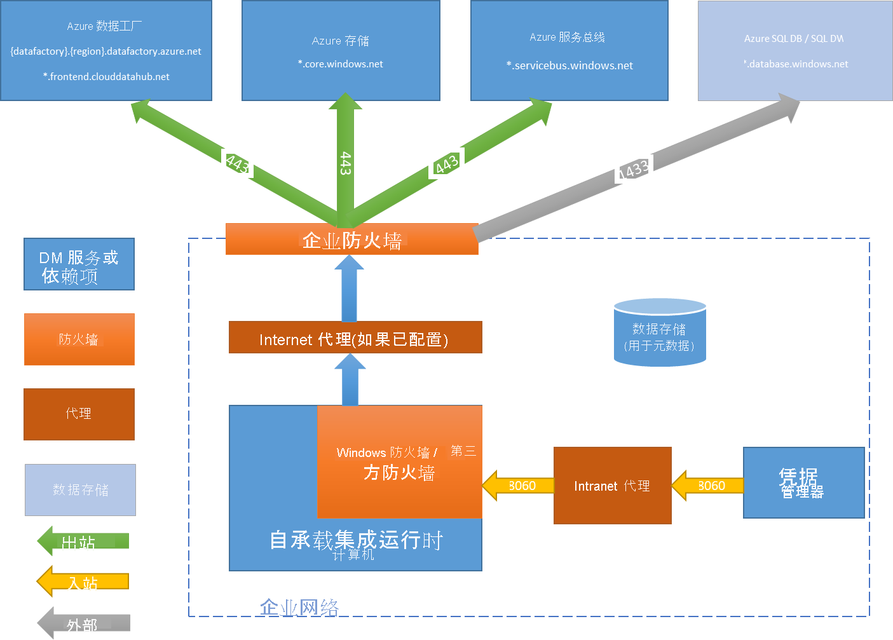

# <a name="create-and-configure-a-self-hosted-integration-runtime"></a>创建和配置自承载集成运行时

集成运行时 (IR) 是 Azure 数据工厂用于在不同的网络环境之间提供数据集成功能的计算基础结构。 有关 IR 的详细信息，请参阅[集成运行时概述](concepts-integration-runtime.md)。

自承载集成运行时可以在专用网络中的云数据存储和数据存储之间运行复制活动。 它还可以针对本地网络或 Azure 虚拟网络中的计算资源调度转换活动。 安装自承载集成运行时需要在专用网络中安装本地计算机或虚拟机。  

本文介绍如何创建和配置自承载 IR。

[!INCLUDE [updated-for-az](../../includes/updated-for-az.md)]

## <a name="setting-up-a-self-hosted-integration-runtime"></a>设置自承载集成运行时

若要创建和设置自承载集成运行时，请使用以下过程。

### <a name="create-a-self-hosted-ir-via-azure-powershell"></a>通过 Azure PowerShell 创建自承载 IR

1. 可以将 Azure PowerShell 用于此任务。 下面是一个示例：

    ```powershell
    Set-AzDataFactoryV2IntegrationRuntime -ResourceGroupName $resourceGroupName -DataFactoryName $dataFactoryName -Name $selfHostedIntegrationRuntimeName -Type SelfHosted -Description "selfhosted IR description"
    ```
  
2. 在本地计算机上[下载](https://www.microsoft.com/download/details.aspx?id=39717)并安装自承载集成运行时。

3. 检索身份验证密钥并使用密钥注册自承载集成运行时。 下面是 PowerShell 示例：

    ```powershell

    Get-AzDataFactoryV2IntegrationRuntimeKey -ResourceGroupName $resourceGroupName -DataFactoryName $dataFactoryName -Name $selfHostedIntegrationRuntimeName  

    ```

### <a name="create-a-self-hosted-ir-via-azure-data-factory-ui"></a>通过 Azure 数据工厂 UI 创建自承载 IR

使用以下步骤，通过 Azure 数据工厂 UI 创建自承载 IR。

1. 在 Azure 数据工厂 UI 的 "**入门**" 页上，选择最左侧窗格中的 "**创作**" 选项卡。

   

1. 选择最左侧窗格底部的 "**连接**"，然后在 "**连接**" 窗口中选择 "**集成运行时**"。 选择 " **+ 新建**"。

   

1. 在 "**集成运行时安装**" 窗口中，选择 "**执行数据移动并将活动分派给外部计算**"，然后选择 "**继续**"。

1. 输入 IR 的名称，并选择 "**创建**"。

1. 选择 "**选项 1** " 下的链接以打开计算机上的快速设置。 或者按照**选项 2**中的步骤进行手动设置。 以下说明基于手动设置：

   

    1. 复制并粘贴身份验证密钥。 选择 "**下载并安装集成运行时**"。

    1. 下载本地 Windows 计算机上的自承载集成运行时。 运行安装程序。

    1. 在 "**注册 Integration Runtime（自承载）** " 页上，粘贴之前保存的密钥，然后选择 "**注册**"。
    
       

    1. 在“新建 Integration Runtime (自承载)节点”页上，选择“完成”。

1. 成功注册自承载集成运行时后，会看到以下窗口：

    

### <a name="set-up-a-self-hosted-ir-on-an-azure-vm-via-an-azure-resource-manager-template"></a>通过 Azure 资源管理器模板在 Azure VM 上设置自承载 IR

可以通过使用 "[创建自承载 ir" 模板](https://github.com/Azure/azure-quickstart-templates/tree/master/101-vms-with-selfhost-integration-runtime)在 Azure 虚拟机上自动执行自承载 ir 设置。 此模板提供了一种简单的方法，可在 Azure 虚拟网络中使用功能齐全的自承载 IR。 IR 具有高可用性和可伸缩性功能，前提是将节点计数设置为2或更高。

### <a name="set-up-an-existing-self-hosted-ir-via-local-powershell"></a>通过本地 PowerShell 设置现有的自承载 IR

可以使用命令行设置或管理现有的自承载 IR。 这种用法特别有助于自动安装和注册自承载 IR 节点。

Dmgcmd 包含在自承载安装程序中。 它通常位于 C:\Program Files\Microsoft Integration Runtime\3.0\Shared\ 文件夹中。 此应用程序支持各种参数，并可通过命令行使用自动化的批处理脚本来调用。

使用应用程序，如下所示：

```powershell
dmgcmd [ -RegisterNewNode "<AuthenticationKey>" -EnableRemoteAccess "<port>" ["<thumbprint>"] -EnableRemoteAccessInContainer "<port>" ["<thumbprint>"] -DisableRemoteAccess -Key "<AuthenticationKey>" -GenerateBackupFile "<filePath>" "<password>" -ImportBackupFile "<filePath>" "<password>" -Restart -Start -Stop -StartUpgradeService -StopUpgradeService -TurnOnAutoUpdate -TurnOffAutoUpdate -SwitchServiceAccount "<domain\user>" ["<password>"] -Loglevel <logLevel> ]
```

下面是应用程序的参数和属性的详细信息： 

| properties                                                    | 描述                                                  | 需要 |
| ----------------------------------------------------------- | ------------------------------------------------------------ | -------- |
| **RegisterNewNode**"`<AuthenticationKey>`"                     | 使用指定的身份验证密钥注册自承载集成运行时节点。 | No       |
| **RegisterNewNode**"`<AuthenticationKey>`"`<NodeName>`"      | 使用指定的身份验证密钥和节点名称注册自承载集成运行时节点。 | No       |
| **EnableRemoteAccess**"`<port>`" ["`<thumbprint>`"]            | 在当前节点上启用远程访问以设置高可用性群集。 或者对自承载 IR 直接设置凭据，而无需通过 Azure 数据工厂。 使用 AzDataFactoryV2LinkedServiceEncryptedCredential cmdlet 从同一网络中的远程计算机执行后一**项**操作。 | No       |
| **EnableRemoteAccessInContainer**"`<port>`" ["`<thumbprint>`"] | 当节点在容器中运行时，允许对当前节点进行远程访问。 | No       |
| **DisableRemoteAccess**                                         | 禁用对当前节点的远程访问。 多节点设置需要远程访问。 即使禁用了远程访问， **AzDataFactoryV2LinkedServiceEncryptedCredential** PowerShell cmdlet 仍可正常工作。 只要在与自承载 IR 节点相同的计算机上执行 cmdlet，就会执行此行为。 | No       |
| **键**"`<AuthenticationKey>`"                                 | 覆盖或更新以前的身份验证密钥。 请小心处理此操作。 如果密钥是新的集成运行时，则以前的自承载 IR 节点可能会脱机。 | No       |
| **GenerateBackupFile**"`<filePath>`"`<password>`"            | 为当前节点生成备份文件。 备份文件包括节点键和数据存储区凭据。 | No       |
| **ImportBackupFile**"`<filePath>`"`<password>`"              | 从备份文件还原节点。                          | No       |
| **重启**                                                     | 重新启动自承载集成运行时主机服务。   | No       |
| **启动**                                                       | 启动自承载集成运行时主机服务。     | No       |
| **Stop**                                                        | 停止自承载集成运行时主机服务。        | No       |
| **StartUpgradeService**                                         | 启动自承载集成运行时升级服务。       | No       |
| **StopUpgradeService**                                          | 停止自承载集成运行时升级服务。        | No       |
| **TurnOnAutoUpdate**                                            | 启用自承载集成运行时自动更新。        | No       |
| **TurnOffAutoUpdate**                                           | 关闭自承载集成运行时自动更新。       | No       |
| **SwitchServiceAccount**"`<domain\user>`" ["`<password>`"]           | 将 DIAHostService 设置为作为新帐户运行。 对于系统帐户和虚拟帐户，使用空密码 ""。 | No       |


## <a name="command-flow-and-data-flow"></a>命令流和数据流

当你在本地与云之间移动数据时，活动使用自承载集成运行时在本地数据源和云之间传输数据。

下面是使用自承载 IR 进行复制时的数据流步骤的高级摘要：


1. 数据开发人员使用 PowerShell cmdlet 在 Azure 数据工厂中创建自承载集成运行时。 目前，Azure 门户不支持此功能。
1. 数据开发人员为本地数据存储创建链接服务。 开发人员通过指定服务应用于连接到数据存储的自承载集成运行时实例来实现此目的。
1. 自承载集成运行时节点使用 Windows 数据保护应用程序编程接口 (DPAPI) 加密凭据，并将凭据保存在本地。 如果设置多个节点以实现高可用性，则凭据将跨其他节点进一步同步。 每个节点使用 DPAPI 加密凭据并将其存储在本地。 凭据同步对数据开发者透明并由自承载 IR 处理。
1. Azure 数据工厂与自承载集成运行时通信，以计划和管理作业。 通过使用共享[Azure 服务总线中继](https://docs.microsoft.com/azure/service-bus-relay/relay-what-is-it#wcf-relay)连接的控制通道进行通信。 需要运行活动作业时，数据工厂会将请求和任何凭据信息一起排队。 如果凭据尚未存储在自承载集成运行时，则会执行此操作。 自承载集成运行时在轮询队列后启动作业。
1. 自承载集成运行时在本地存储和云存储之间复制数据。 副本的方向取决于复制活动在数据管道中的配置方式。 对于此步骤，自承载集成运行时将通过安全的 HTTPS 通道直接与基于云的存储服务（如 Azure Blob 存储）通信。

## <a name="considerations-for-using-a-self-hosted-ir"></a>使用自承载 IR 的注意事项

- 可以对多个本地数据源使用单个自承载集成运行时。 你还可以在同一 Azure Active Directory （Azure AD）租户中将其与另一个数据工厂共享。 有关详细信息，请参阅[共享自承载集成运行时](#create-a-shared-self-hosted-integration-runtime-in-azure-data-factory)。
- 你只能在任何一台计算机上安装自承载集成运行时的一个实例。 如果有两个需要访问本地数据源的数据工厂，请使用[自承载 ir 共享功能](#create-a-shared-self-hosted-integration-runtime-in-azure-data-factory)共享自承载 ir，或在两台本地计算机上安装自承载 ir，每个数据工厂各有一个。  
- 自承载集成运行时不需要在与数据源相同的计算机上。 但是，将自承载集成运行时靠近数据源会缩短自承载集成运行时连接到数据源的时间。 建议在不同于托管本地数据源的计算机上安装自承载集成运行时。 当自承载集成运行时和数据源位于不同的计算机上时，自承载集成运行时不会与资源的数据源竞争。
- 可将不同计算机上的多个自承载集成运行时连接到同一本地数据源。 例如，如果有两个为两个数据工厂提供服务的自承载集成运行时，则可以向这两个数据工厂注册相同的本地数据源。
- 如果已在计算机上安装了网关以提供 Power BI 方案，请在另一台计算机上安装独立于数据工厂的自承载集成运行时。
- 使用自承载集成运行时支持 Azure 虚拟网络中的数据集成。
- 即使使用 Azure ExpressRoute，也要将数据源视为本地数据源（位于防火墙之后）。 使用自承载集成运行时将服务连接到数据源。
- 即使数据存储位于 Azure 基础结构即服务（IaaS）虚拟机上的云中，也使用自承载集成运行时。
- 在已启用 FIPS 兼容加密的 Windows server 上安装的自承载集成运行时，任务可能会失败。 要解决此问题，请禁用服务器上符合 FIPS 标准的加密。 若要禁用符合 FIPS 的加密，请将以下注册表子项的值从1（已启用）更改为0（已禁用）： `HKLM\System\CurrentControlSet\Control\Lsa\FIPSAlgorithmPolicy\Enabled`。

## <a name="prerequisites"></a>必备组件

- 支持的 Windows 版本如下：
  + Windows 7 Service Pack 1
  + Windows 8.1
  + Windows 10
  + Windows Server 2008 R2 SP1
  + Windows Server 2012
  + Windows Server 2012 R2
  + Windows Server 2016
  + Windows Server 2019
   
   不支持在域控制器上安装自承载集成运行时。
- 需要 .NET Framework 4.6.1 或更高版本。 如果在 Windows 7 计算机上安装自承载集成运行时，请安装 .NET Framework 4.6.1 或更高版本。 有关详细信息，请参阅 [.NET Framework 系统需求](/dotnet/framework/get-started/system-requirements)。
- 对于自承载集成运行时计算机，建议的最低配置是具有四个核心的 2 GHz 处理器、8 GB RAM 和 80 GB 可用硬盘空间。
- 如果主机处于休眠状态，则自承载集成运行时将不响应数据请求。 安装自承载集成运行时之前，请在计算机上配置相应的电源计划。 如果计算机配置为休眠，则自承载集成运行时安装程序会提示消息。
- 你必须是计算机上的管理员，才能成功安装和配置自承载集成运行时。
- 复制-活动运行以特定频率发生。 计算机上的处理器和 RAM 使用情况遵循的模式与高峰时间和空闲时间相同。 资源使用情况还很大程度上取决于所移动的数据量。 进行多个复制作业时，会看到资源使用率在高峰期上升。
- 任务在提取 Parquet、ORC 或 Avro 格式的数据时可能会失败。 有关 Parquet 的详细信息，请参阅[Azure 数据工厂中的 Parquet 格式](https://docs.microsoft.com/azure/data-factory/format-parquet#using-self-hosted-integration-runtime)。 文件创建在自承载集成计算机上运行。 若要按预期方式工作，文件创建需要满足以下先决条件：
    - [Visual C++ 2010 可再发行组件](https://download.microsoft.com/download/3/2/2/3224B87F-CFA0-4E70-BDA3-3DE650EFEBA5/vcredist_x64.exe)包（x64）
    - JRE 提供商提供的 Java 运行时（JRE）版本8，如[采用 OpenJDK](https://adoptopenjdk.net/)。 确保已设置 `JAVA_HOME` 环境变量。

## <a name="installation-best-practices"></a>安装最佳做法

可以通过从[Microsoft 下载中心](https://www.microsoft.com/download/details.aspx?id=39717)下载 MSI 安装程序包来安装自承载集成运行时。 有关分步说明，请参阅文章[在本地与云之间移动数据](tutorial-hybrid-copy-powershell.md)。

- 在宿主计算机上为自承载集成运行时配置电源计划，以使计算机不处于休眠状态。 如果主机进入休眠状态，则自承载集成运行时将会脱机。
- 定期备份与自承载集成运行时关联的凭据。
- 若要自动执行自承载 IR 设置操作，请参阅[通过 PowerShell 设置现有的自承载 ir](#setting-up-a-self-hosted-integration-runtime)。  

## <a name="install-and-register-a-self-hosted-ir-from-microsoft-download-center"></a>从 Microsoft 下载中心安装并注册自承载 IR

1. 转到 [Microsoft 集成运行时下载页](https://www.microsoft.com/download/details.aspx?id=39717)。
1. 选择 "**下载**"，选择 "64 位版本"，然后选择 "**下一步**"。 不支持32位版本。
1. 直接运行 MSI 文件，或将其保存到硬盘上并运行。
1. 在**欢迎**窗口中选择一种语言，然后选择 "**下一步**"。
1. 接受 Microsoft 软件许可条款，然后选择“下一步”。
1. 选择用于安装自承载集成运行时的**文件夹**，然后选择“下一步”。
1. 在“准备安装”页上，选择“安装”。
1. 选择 "**完成**" 以完成安装。
1. 使用 PowerShell 获取身份验证密钥。 下面是检索身份验证密钥的 PowerShell 示例：

    ```powershell
    Get-AzDataFactoryV2IntegrationRuntimeKey -ResourceGroupName $resourceGroupName -DataFactoryName $dataFactoryName -Name $selfHostedIntegrationRuntime
    ```

1. 在计算机上运行 Microsoft Integration Runtime Configuration Manager 的 "**注册 Integration Runtime（自承载）** " 窗口中，执行以下步骤：

    1. 将身份验证密钥粘贴到文本区域。

    1. 或者选择“显示身份验证密钥”，以查看密钥文本。

    1. 选择“注册”。

## <a name="high-availability-and-scalability"></a>高可用性和可伸缩性

可将自承载集成运行时与 Azure 中的多个本地计算机或虚拟机相关联。 这些计算机称为节点。 最多可将 4 个节点与一个自承载集成运行时相关联。 在本地计算机上具有为逻辑网关安装的网关的多个节点的好处是：

* 自承载集成运行时的更高可用性，使其不再是大数据解决方案的单一故障点或与数据工厂的云数据集成。 使用最多四个节点时，此可用性可帮助确保连续性。
* 在本地和云数据存储之间移动数据期间提高了性能和吞吐量。 获取有关[性能比较](copy-activity-performance.md)的更多信息。

可以通过从[下载中心](https://www.microsoft.com/download/details.aspx?id=39717)安装自承载集成运行时软件来关联多个节点。 然后，使用从**AzDataFactoryV2IntegrationRuntimeKey** cmdlet 获取的任一身份验证密钥注册它，如[教程](tutorial-hybrid-copy-powershell.md)中所述。

> [!NOTE]
> 不需要创建新的自承载集成运行时来关联每个节点。 可以在另一台计算机上安装自承载集成运行时，并使用同一身份验证密钥注册它。

> [!NOTE]
> 在添加另一个节点以实现高可用性和可伸缩性之前，请确保在第一个节点上启用了 "**远程访问 intranet** " 选项。 为此，请选择 " **Microsoft Integration Runtime Configuration Manager** ** > "**  > "**远程访问 intranet**"。

### <a name="scale-considerations"></a>扩展注意事项

#### <a name="scale-out"></a>横向扩展

如果处理器使用率较高并且自承载 IR 上的可用内存不足，则添加新节点以帮助横向扩展计算机负载。 如果活动因超时或自承载 IR 节点处于脱机状态而失败，则可帮助您向网关添加节点。

#### <a name="scale-up"></a>纵向扩展

如果处理器和可用 RAM 未充分利用，但并发作业的执行达到节点的限制，则可以通过增加节点可以运行的并发作业数来向上缩放。 你可能还想要在活动超时时进行扩展，因为自承载 IR 是重载的。 如下图所示，可以增加节点的最大容量：  


### <a name="tlsssl-certificate-requirements"></a>TLS/SSL 证书要求

下面是用于保护集成运行时节点之间的通信的 TLS/SSL 证书的要求：

- 证书必须是公共可信的 X509 v3 证书。 建议使用由公共合作伙伴证书颁发机构（CA）颁发的证书。
- 每个集成运行时节点必须信任此证书。
- 不建议使用者备用名称（SAN）证书，因为只使用最后一个 SAN 项。 所有其他 SAN 项都将被忽略。 例如，如果你的 SAN 证书的 san 是**node1.domain.contoso.com**和**node2.domain.contoso.com**，则只能在完全限定的域名（FQDN）为**node2.domain.contoso.com**的计算机上使用此证书。
- 证书可以使用 Windows Server 2012 R2 支持的任何密钥大小的 SSL 证书。
- 不支持使用 CNG 密钥的证书。  

> [!NOTE]
> 使用此证书：
>
> - 加密自承载 IR 节点上的端口。
> - 对于状态同步的节点到节点通信，包括跨节点的链接服务的凭据同步。
> - 将 PowerShell cmdlet 用于本地网络中的链接服务凭据设置时。
>
> 如果专用网络环境不安全，或者要保护专用网络中节点之间的通信，建议使用此证书。
>
> 无论是否设置了此证书，从自承载 IR 到其他数据存储区的数据移动始终会出现在加密通道中。

## <a name="create-a-shared-self-hosted-integration-runtime-in-azure-data-factory"></a>在 Azure 数据工厂中创建共享的自承载集成运行时

可以重复使用已在数据工厂中设置的现有自承载集成运行时基础结构。 此重复使用使你可以通过引用现有的共享自承载 IR，在不同的数据工厂中创建链接的自承载集成运行时。

若要查看此功能的简介和演示，请观看以下12分钟视频：

> [!VIDEO https://channel9.msdn.com/Shows/Azure-Friday/Hybrid-data-movement-across-multiple-Azure-Data-Factories/player]

### <a name="terminology"></a>术语

- **共享 IR**：在物理基础结构上运行的原始自承载 ir。  
- **链接 ir**：引用其他共享 IR 的 ir。 链接的 IR 是一个逻辑 IR，并使用另一个共享的自承载 IR 的基础结构。

### <a name="methods-to-share-a-self-hosted-integration-runtime"></a>共享自承载集成运行时的方法

若要共享具有多个数据工厂的自承载集成运行时，请参阅[创建共享的自承载集成运行时](create-shared-self-hosted-integration-runtime-powershell.md)以获取详细信息。

### <a name="monitoring"></a>监视

#### <a name="shared-ir"></a>共享 IR


#### <a name="linked-ir"></a>链接的 IR


### <a name="known-limitations-of-self-hosted-ir-sharing"></a>自承载 IR 共享的已知限制

* 在其中创建链接的 IR 的数据工厂必须具有[MSI](https://docs.microsoft.com/azure/active-directory/managed-service-identity/overview)。 默认情况下，在 Azure 门户或 PowerShell cmdlet 中创建的数据工厂具有隐式创建的 MSI。 但在通过 Azure 资源管理器模板或 SDK 创建数据工厂时，必须显式设置**标识**属性。 此设置可确保资源管理器创建包含 MSI 的数据工厂。

* 支持此功能的数据工厂 .NET SDK 必须是1.1.0 或更高版本。

* 若要授予权限，你需要在共享的 IR 所在的数据工厂中拥有所有者角色或继承的所有者角色。

* 共享功能仅适用于同一个 Azure AD 租户中的数据工厂。

* 对于 Azure AD [guest 用户](https://docs.microsoft.com/azure/active-directory/governance/manage-guest-access-with-access-reviews)，UI 中的搜索功能（使用搜索关键字列出所有数据工厂）[不起作用](https://msdn.microsoft.com/library/azure/ad/graph/howto/azure-ad-graph-api-permission-scopes#SearchLimits)。 但只要来宾用户是数据工厂的所有者，你就可以在不包含搜索功能的情况下共享 IR。 对于需要共享 IR 的数据工厂的 MSI，请在 "**分配权限**" 框中输入该 msi，并在数据工厂 UI 中选择 "**添加**"。

  > [!NOTE]
  > 此功能仅在数据工厂 V2 中可用。

## <a name="notification-area-icons-and-notifications"></a>通知区域图标和通知

如果将光标移到通知区域中的图标或消息上，可以查看有关自承载集成运行时状态的详细信息。


## <a name="ports-and-firewalls"></a>端口和防火墙

需要考虑两个防火墙：

- 在组织的中央路由器上运行的*企业防火墙*
- 在安装了自承载集成运行时的本地计算机上配置为守护程序的*Windows 防火墙*



在企业防火墙级别，需配置以下域和出站端口：

[!INCLUDE [domain-and-outbound-port-requirements](../../includes/domain-and-outbound-port-requirements.md)]

在 Windows 防火墙级别或计算机级别，通常会启用这些出站端口。 如果不是，则可以在自承载集成运行时计算机上配置域和端口。

> [!NOTE]
> 根据源和接收器，可能需要在企业防火墙或 Windows 防火墙中允许其他域和出站端口。
>
> 对于某些云数据库（例如 Azure SQL 数据库和 Azure Data Lake），可能需要在其防火墙配置中允许自承载集成运行时计算机的 IP 地址。

### <a name="copy-data-from-a-source-to-a-sink"></a>将数据从源复制到接收器

确保在企业防火墙、自承载集成运行时计算机的 Windows 防火墙和数据存储本身上正确启用防火墙规则。 启用这些规则可以让自承载集成运行时成功连接到源和接收器。 为复制操作涉及的每个数据存储启用规则。

例如，若要从本地数据存储复制到 SQL 数据库接收器或 Azure SQL 数据仓库接收器，请执行以下步骤：

1. 对于 Windows 防火墙和企业防火墙，允许端口1433上的出站 TCP 通信。
1. 配置 SQL 数据库的防火墙设置，以将自承载集成运行时计算机的 IP 地址添加到允许的 IP 地址列表中。

> [!NOTE]
> 如果防火墙不允许出站端口1433，则自承载集成运行时无法直接访问 SQL 数据库。 在这种情况下，可以使用 SQL 数据库和 SQL 数据仓库的[分阶段复制](copy-activity-performance.md)。 在这种情况下，数据移动只需要 HTTPS （端口443）。

## <a name="proxy-server-considerations"></a>代理服务器注意事项

如果企业网络环境使用代理服务器访问 Internet，请配置自承载集成运行时以使用合适的代理设置。 可以在初始注册阶段设置代理。


配置后，自承载集成运行时使用代理服务器连接到云服务的源和目标（使用 HTTP 或 HTTPS 协议）。 这就是在初始安装过程中选择**更改链接**的原因。


有三个配置选项：

- **不要使用代理**：自承载集成运行时不会显式使用任何代理连接到云服务。
- **使用系统代理**：自承载集成运行时使用在 diahost.exe.config 和 diawp.exe.config 中配置的代理设置。如果这些文件不指定代理配置，则自承载集成运行时无需通过代理即可直接连接到云服务。
- **使用自定义代理**：配置用于自承载集成运行时的 HTTP 代理设置，而不是使用 diahost.exe.config 和 diawp.exe.config 中的配置。**地址**和**端口**值是必需的。 **用户名**和**密码**值是可选的，具体取决于代理的身份验证设置。 所有设置都使用 Windows DPAPI 在自承载集成运行时进行加密，并存储在本地计算机上。

在保存更新的代理设置之后，集成运行时主机服务将自动重新启动。

注册自承载集成运行时后，如果想要查看或更新代理设置，请使用 Microsoft Integration Runtime Configuration Manager。

1. 打开“Microsoft Integration Runtime Configuration Manager”。
1. 选择“设置”选项卡。
1. 在 " **HTTP 代理**" 下，选择 "**更改**" 链接以打开 "**设置 HTTP 代理**" 对话框。
1. 选择“**下一步**”。 然后，会看到一条警告，要求您保存代理设置并重新启动 integration runtime 主机服务。

您可以使用配置管理器工具来查看和更新 HTTP 代理。


> [!NOTE]
> 如果使用 NTLM 身份验证设置代理服务器，integration runtime 主机服务会在域帐户下运行。 如果以后更改域帐户的密码，请记住更新服务的配置设置并重新启动该服务。 由于这一要求，我们建议你使用不需要频繁更新密码的专用域帐户来访问代理服务器。

### <a name="configure-proxy-server-settings"></a>配置代理服务器设置

如果为 HTTP 代理选择 "**使用系统代理**" 选项，则自承载集成运行时将使用 diahost.exe.config 和 diawp.exe.config 中的代理设置。当这些文件不指定代理时，自承载集成运行时将直接连接到云服务，无需通过代理。 以下过程说明如何更新 diahost.exe.config 文件：

1. 在文件资源管理器中，创建 C:\Program Files\Microsoft Integration Runtime\3.0\Shared\diahost.exe.config 的安全副本，作为原始文件的备份。
1. 以管理员身份打开记事本。
1. 在记事本中，打开文本文件 C:\Program Files\Microsoft Integration Runtime\3.0\Shared\diahost.exe.config。
1. 查找默认**system.net**标记，如以下代码所示：

    ```xml
    <system.net>
        <defaultProxy useDefaultCredentials="true" />
    </system.net>
    ```
    然后可以添加代理服务器的详细信息，如以下示例所示：

    ```xml
    <system.net>
        <defaultProxy enabled="true">
              <proxy bypassonlocal="true" proxyaddress="http://proxy.domain.org:8888/" />
        </defaultProxy>
    </system.net>
    ```

    Proxy 标记允许附加属性指定 `scriptLocation`所需的设置。 请参阅[\<proxy\> 元素（网络设置）](https://msdn.microsoft.com/library/sa91de1e.aspx)以了解语法。

    ```xml
    <proxy autoDetect="true|false|unspecified" bypassonlocal="true|false|unspecified" proxyaddress="uriString" scriptLocation="uriString" usesystemdefault="true|false|unspecified "/>
    ```
1. 将配置文件保存在其原始位置。 然后重新启动自承载 integration runtime 主机服务，该服务将提取更改。

   若要重新启动该服务，请使用 "控制面板" 中的 "服务" 小程序。 或在“Integration Runtime Configuration Manager”中依次选择“停止服务”按钮和“启动服务”。

   如果服务未启动，则您可能在您编辑的应用程序配置文件中添加了不正确的 XML 标记语法。

> [!IMPORTANT]
> 不要忘记同时更新 diahost.exe.config 和 diawp.exe.config。

还需要确保 Microsoft Azure 在公司的允许列表中。 你可以从[Microsoft 下载中心](https://www.microsoft.com/download/details.aspx?id=41653)下载有效 Azure IP 地址的列表。

### <a name="possible-symptoms-for-issues-related-to-the-firewall-and-proxy-server"></a>与防火墙和代理服务器相关的问题的可能症状

如果看到如下错误消息，则原因可能是防火墙或代理服务器的配置不正确。 此类配置可防止自承载集成运行时连接到数据工厂进行自身身份验证。 若要确保正确配置防火墙和代理服务器，请参阅上一部分。

* 尝试注册自承载集成运行时时，会收到以下错误消息： "无法注册此 Integration Runtime 节点！ 确认身份验证密钥有效并且 integration service 主机服务正在此计算机上运行。 "
* 打开 Integration Runtime Configuration Manager 时，将看到状态为“已断开连接”或“正在连接”。 查看 Windows 事件日志时，在 "**事件查看器** > **应用程序和服务日志**" > **Microsoft Integration Runtime**，会看到如下错误消息：

    ```
    Unable to connect to the remote server
    A component of Integration Runtime has become unresponsive and restarts automatically. Component name: Integration Runtime (Self-hosted).
    ```

### <a name="enable-remote-access-from-an-intranet"></a>启用从 intranet 进行远程访问

如果使用 PowerShell 从安装自承载集成运行时的网络以外的网络计算机中加密凭据，则可以启用 "**从 Intranet 进行远程访问**" 选项。 如果在安装了自承载集成运行时的计算机上运行 PowerShell 来加密凭据，则无法**从 Intranet 启用远程访问**。

在添加另一个节点以实现高可用性和可伸缩性之前，先**从 Intranet 启用远程访问**。  

运行自承载集成运行时安装版本3.3 或更高版本时，默认情况下，自承载集成运行时安装程序将禁用自承载集成运行时计算机上的**Intranet 的远程访问**。

使用伙伴或其他伙伴的防火墙时，可以手动打开端口8060或用户配置的端口。 如果在设置自承载集成运行时时遇到防火墙问题，请使用以下命令在不配置防火墙的情况下安装自承载集成运行时：

```
msiexec /q /i IntegrationRuntime.msi NOFIREWALL=1
```

如果选择不在自承载集成运行时计算机上打开端口8060，请使用 "设置凭据" 应用程序以外的其他机制来配置数据存储凭据。 例如，你可以使用**AzDataFactoryV2LinkedServiceEncryptCredential** PowerShell cmdlet。

## <a name="next-steps"></a>后续步骤

有关分步说明，请参阅[教程：将本地数据复制到云](tutorial-hybrid-copy-powershell.md)。
