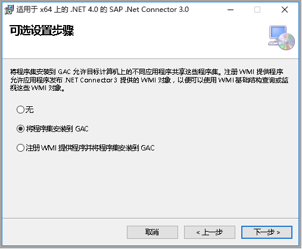

# <a name="copy-data-from-sap-business-warehouse-by-using-azure-data-factory"></a>使用 Azure 数据工厂从 SAP 业务仓库复制数据

本文介绍如何使用 Azure 数据工厂通过开放式集线器将数据从 SAP Business 仓库（BW）复制到 Azure Data Lake Storage Gen2。 您可以使用类似的过程将数据复制到其他[受支持的接收器数据存储](copy-activity-overview.md#supported-data-stores-and-formats)。

> [!TIP]
> 有关从 SAP BW 复制数据的一般信息，包括 SAP BW 开放式中心集成和增量提取流，请参阅[使用 Azure 数据工厂通过开放中心复制 SAP 业务仓库中的数据](connector-sap-business-warehouse-open-hub.md)。

## <a name="prerequisites"></a>必备组件

- **Azure 数据工厂**：如果没有，请按照[创建数据工厂](quickstart-create-data-factory-portal.md#create-a-data-factory)的步骤进行操作。

- **SAP BW 开放目标类型为 "数据库表" 的中心目标（OHD）** ：若要创建 OHD 或检查是否为数据工厂集成正确配置了 OHD，请参阅本文的[SAP BW 开放式中心目标配置](#sap-bw-open-hub-destination-configurations)部分。

- **SAP BW 用户需要以下权限**：

  - 远程函数调用（RFC）和 SAP BW 的授权。
  - 对**S_SDSAUTH**授权对象的 "执行" 活动的权限。

- **使用 SAP .net 连接器3.0 的[自承载集成运行时（IR）](concepts-integration-runtime.md#self-hosted-integration-runtime)** 。 执行以下设置步骤：

  1. 安装并注册自承载集成运行时版本3.13 或更高版本。 （本文稍后将介绍此过程。）

  2. 从 SAP 的网站下载[适用于 Microsoft .NET 3.0 的64位 SAP 连接器](https://support.sap.com/en/product/connectors/msnet.html)，并将其安装在自承载 IR 所在的同一台计算机上。 在安装过程中，请确保在 "**可选安装步骤**" 对话框中选择 "**将程序集安装到 GAC** "，如下图所示：

     

## <a name="do-a-full-copy-from-sap-bw-open-hub"></a>从 SAP BW 打开中心执行完整复制

在 Azure 门户中，转到你的数据工厂。 选择 "**创作 & 监视器**"，在单独的选项卡中打开数据工厂 UI。

1. 在 "**开始**" 页上，选择 "**复制数据**" 以打开复制数据工具。

2. 在 "**属性**" 页上，指定**任务名称**，然后选择 "**下一步**"。

3. 在 "**源数据存储**" 页上，选择 " **+ 新建连接**"。 从连接器库中选择 " **SAP BW 打开中心**"，然后选择 "**继续**"。 若要筛选连接器，可以在 "搜索" 框中键入 " **SAP** "。

4. 在 "**指定 SAP BW 打开中心连接**" 页上，按照以下步骤创建新连接。

   

   1. 从 "**通过集成运行时连接**" 列表中，选择一个现有的自承载 IR。 或者，如果还没有，请选择创建一个。

      若要创建新的自承载 IR，请选择 " **+ 新建**"，然后选择 "**自承载**"。 输入**名称**，然后选择 "**下一步**"。 选择 "**快速安装**" 以在当前计算机上安装，或按照提供的**手动设置**步骤操作。

      如[先决条件](#prerequisites)中所述，请确保在运行自承载 IR 的同一台计算机上安装了适用于 Microsoft .NET 3.0 的 SAP 连接器。

   2. 填写 SAP BW**服务器名称**、**系统编号**、**客户端 ID、** **语言**（如果不是**EN**）、**用户名**和**密码**。

   3. 选择 "**测试连接**" 以验证设置，然后选择 "**完成**"。

   4. 创建新连接。 选择“**下一页**”。

5. 在 "**选择开放集线器目标**" 页上，浏览 SAP BW 中可用的开放中心目标。 选择要从中复制数据的 OHD，然后选择 "**下一步**"。

   

6. 指定筛选器（如果需要）。 如果你的 OHD 只包含单个请求 ID 为单一数据传输过程（DTP）的数据，或者你确定你的 DTP 已经完成并且你想要复制数据，请清除 "**排除最后一个请求**" 复选框。

   有关这些设置的详细信息，请参阅本文的[SAP BW 打开中心目标配置](#sap-bw-open-hub-destination-configurations)部分。 选择 "**验证**" 以确认将返回的数据。 然后，选择“下一步”。

   

7. 在 "**目标数据存储**" 页上，选择 " **+ 创建新连接**" > **Azure Data Lake Storage Gen2** > **继续**。

8. 在 "**指定 Azure Data Lake Storage 连接**" 页上，按照以下步骤创建连接。

   

   1. 从 "**名称**" 下拉列表中选择 Data Lake Storage Gen2 支持的帐户。
   2. 选择“完成”以创建连接。 然后，选择“下一步”。

9. 在 "**选择输出文件或文件夹**" 页上，输入**copyfromopenhub**作为输出文件夹名称。 然后，选择“下一步”。

   

10. 在 "**文件格式设置**" 页上，选择 "**下一步**" 以使用默认设置。

    

11. 在 "**设置**" 页上，展开 "**性能设置**"。 输入**复制并行度的**值，如5以并行从 SAP BW 加载。 然后，选择“下一步”。

    

12. 在“摘要”页上查看设置。 然后，选择“下一步”。

13. 在 "**部署**" 页上，选择 "**监视器**" 以监视管道。

    

14. 请注意，会自动选择页面左侧的 "**监视**" 选项卡。 "**操作**" 列包含用于查看活动运行详细信息的链接以及用于重新运行管道的链接。

    

15. 若要查看与管道运行关联的活动运行，请选择 "**操作**" 列中的 "**查看活动运行**"。 该管道只包含一个活动（复制活动），因此只显示了一个条目。 若要切换回 "管道运行" 视图，请选择顶部的 "**管道**" 链接。 选择“刷新”可刷新列表。

    

16. 若要监视每个复制活动的执行详细信息，请选择 "**详细信息**" 链接，该链接是 "活动-监视" 视图中 "**操作**" 下面的眼镜图标。 可用详细信息包括从源复制到接收器的数据量、数据吞吐量、执行步骤和持续时间以及所使用的配置。

    

17. 若要查看**最大请求 ID**，请返回到 "活动-监视" 视图，然后选择 "**操作**" 下的 "**输出**"。

    

    

## <a name="incremental-copy-from-sap-bw-open-hub"></a>从 SAP BW 打开的中心进行增量复制

> [!TIP]
> 请参阅[SAP BW 打开中心连接器增量提取流](connector-sap-business-warehouse-open-hub.md#delta-extraction-flow)，了解 SAP BW 在数据工厂中打开集线器连接器如何从 SAP BW 复制增量数据。 本文还可帮助你了解基本连接器配置。

现在，让我们继续配置 SAP BW 打开的中心的增量复制。

增量复制使用基于**请求 ID**的 "高水印" 机制。 该 ID 是在 DTP SAP BW 开放中心目标中自动生成的。 下图显示了此工作流：


在 "数据工厂**入门**" 页上，选择 "**从模板创建管道**" 以使用内置模板。

1. 搜索**SAP BW**查找并选择**从 SAP BW 到 Azure Data Lake Storage Gen2 模板的增量复制**。 此模板将数据复制到 Azure Data Lake Storage Gen2。 您可以使用类似的工作流复制到其他接收器类型。

2. 在模板的主页上，选择或创建以下三个连接，然后在窗口右下角选择 "**使用此模板**"。

   - **Azure blob 存储**：在本演练中，我们使用 Azure blob 存储来存储高水印，这是*复制的最大请求 ID*。
   - **SAP BW 打开中心**：这是要从中复制数据的源。 有关详细的配置，请参阅上一完整复制演练。
   - **Azure Data Lake Storage Gen2**：这是要向其复制数据的接收器。 有关详细的配置，请参阅上一完整复制演练。

   

3. 此模板将生成具有以下三个活动的管道，并将其链接到成功：*查找*、*复制数据*和*Web*。

   中转到 "管道**参数**" 选项卡。你将看到需要提供的所有配置。

   

   - **SAPOpenHubDestinationName**：指定要从中复制数据的打开的中心表名称。

   - **Data_Destination_Container**：指定要向其复制数据的目标 Azure Data Lake Storage Gen2 容器。 如果该容器不存在，则数据工厂复制活动会在执行过程中创建一个。
  
   - **Data_Destination_Directory**：指定要向其复制数据的 Azure Data Lake Storage Gen2 容器下的文件夹路径。 如果路径不存在，数据工厂复制活动将在执行过程中创建路径。
  
   - **HighWatermarkBlobContainer**：指定用于存储高水印值的容器。

   - **HighWatermarkBlobDirectory**：在容器下指定用于存储高水印值的文件夹路径。

   - **HighWatermarkBlobName**：指定用于存储高水印值的 blob 名称，如 `requestIdCache.txt`。 在 Blob 存储中，请参阅 HighWatermarkBlobContainer + HighWatermarkBlobDirectory + HighWatermarkBlobName 的相应路径，例如 "*容器/路径/requestIdCache*"。 创建包含内容0的 blob。

      

   - **LogicAppURL**：在此模板中，我们使用 WebActivity 调用 Azure 逻辑应用来设置 Blob 存储中的高水印值。 或者，可以使用 Azure SQL 数据库来存储它。 使用存储过程活动来更新值。

      必须先创建逻辑应用，如下图所示。 然后，粘贴**HTTP POST URL**。

      

      1. 转到 Azure 门户。 选择新的**逻辑应用**服务。 选择 " **+ 空白逻辑应用**"，以打开 "**逻辑应用设计器**"。

      2. **在收到 HTTP 请求时**创建的触发器。 指定 HTTP 请求正文，如下所示：

         ```json
         {
            "properties": {
               "sapOpenHubMaxRequestId": {
                  "type": "string"
               }
            },
            "type": "object"
         }
         ```

      3. 添加 "**创建 blob** " 操作。 对于 "**文件夹路径**" 和 " **Blob 名称**"，请使用以前在*HighWatermarkBlobContainer + HighWatermarkBlobDirectory*和*HighWatermarkBlobName*中配置的相同值。

      4. 选择“保存”。 然后，复制 " **HTTP POST URL** " 的值，以在数据工厂管道中使用。

4. 提供数据工厂管道参数后，选择 "**调试**" > "**完成**" 以调用运行以验证配置。 或者，选择 "**发布**" 以发布所有更改，然后选择 "**添加触发器**" 执行运行。

## <a name="sap-bw-open-hub-destination-configurations"></a>SAP BW 打开中心目标配置

本部分介绍 SAP BW 端的配置，以使用数据工厂中的 SAP BW 开放式集线器连接器来复制数据。

### <a name="configure-delta-extraction-in-sap-bw"></a>在 SAP BW 中配置增量提取

如果需要历史复制和增量复制，或者只需要增量复制，请在 SAP BW 中配置增量提取。

1. 创建开放中心目标。 你可以在 SAP Transaction RSA1 中创建 OHD，这将自动创建所需的转换和数据传输过程。 使用以下设置：

   - **ObjectType**：可以使用任何对象类型。 在这里，我们使用**InfoCube**作为示例。
   - **目标类型**：选择**数据库表**。
   - **表键**：选择 "**技术密钥**"。
   - **提取**：选择 "**保留数据" 并将记录插入到表中**。

   

   

   可以增加 DTP 的并行运行的 SAP 工作进程数：

   

2. 在过程链中计划 DTP。

   仅当所需的行尚未压缩时，多维数据集的增量 DTP 才适用。 确保 BW 多维数据集压缩在 DTP 之前没有运行，直到打开的中心表。 要执行此操作，最简单的方法是将 DTP 集成到现有的进程链。 在下面的示例中，DTP （到 OHD）将插入到 "*调整*（聚合汇总）" 和 "*折叠*（多维数据集压缩）" 步骤之间的进程链。

   

### <a name="configure-full-extraction-in-sap-bw"></a>在 SAP BW 中配置完全提取

除了增量提取外，您可能还需要对相同的 SAP BW InfoProvider 进行完全提取。 这通常适用于想要执行完整复制，而不是增量备份，或者需要重新[同步增量提取](#resync-delta-extraction)。

同一 OHD 不能有多个 DTP。 因此，在增量提取之前，必须创建其他 OHD。


对于完全加载 OHD，请选择不同于增量提取的选项：

- 在 OHD 中：设置**提取**选项以**删除数据和插入记录**。 否则，在 BW 过程链中重复 DTP 时，数据将被多次提取。

- 在 DTP：将**提取模式**设置为 "**完整**"。 创建 OHD 后，必须立即将自动创建的 DTP 从**Delta**更改为**Full** ，如下图所示：

   

- 在数据工厂的 BW 开放式集线器连接器中：关闭 "**排除最后一个请求**"。 否则，将不会提取任何内容。

通常，手动运行完整的 DTP。 或者，您可以为完整的 DTP 创建一个过程链。 它通常是独立于现有进程链的单独链。 在这两种情况下，请*确保在使用数据工厂副本开始提取之前已完成 DTP*。 否则，只会复制部分数据。

### <a name="run-delta-extraction-the-first-time"></a>首次运行增量提取

第一次增量提取在技术上是*完全提取*。 默认情况下，在复制数据时，SAP BW 打开的集线器连接器会排除最后一个请求。 对于第一个增量提取，数据工厂复制活动将不会提取数据，直到后续 DTP 使用单独的请求 ID 在表中生成增量数据。 可以通过两种方法来避免这种情况：

- 对于第一个增量提取，请关闭 "**排除最后一个请求**" 选项。 第一次启动增量提取之前，请确保第一个增量 DTP 已完成。
-  按照下一部分中所述，使用重新同步增量提取的过程。

### <a name="resync-delta-extraction"></a>重新同步增量提取

以下方案将更改 SAP BW 多维数据集中的数据，但不考虑增量 DTP：

- SAP BW 选择性删除（使用任何筛选条件的行数）
- SAP BW 请求删除（错误的请求）

SAP 开放式中心目标不是数据市场控制的数据目标（在2015以后的所有 SAP BW 支持包中）。 因此，您可以在不更改 OHD 中的数据的情况下删除多维数据集中的数据。 然后，必须将多维数据集的数据与数据工厂重新同步：

1. 在数据工厂（通过在 SAP 中使用完整的 DTP）运行完全提取。
2. 删除打开的中心表中的所有行，了解增量 DTP。
3. 将增量 DTP 的状态设置为 "已**提取**"。

此后，所有后续的增量 DTPs 和数据工厂增量提取将按预期工作。

若要将增量 DTP 的状态设置为 "已**获取**"，可以使用以下选项手动运行增量 dtp：

    *No Data Transfer; Delta Status in Source: Fetched*

## <a name="next-steps"></a>后续步骤

了解 SAP BW 开放式集线器连接器支持：

> [!div class="nextstepaction"]
>[SAP 业务仓库打开中心连接器](connector-sap-business-warehouse-open-hub.md)
