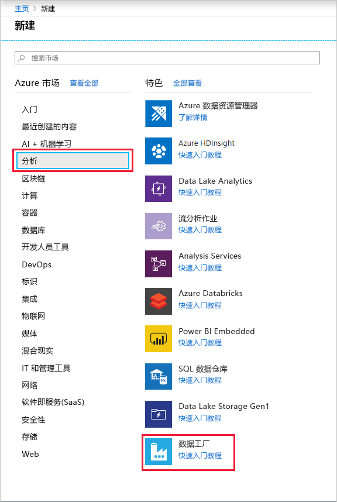
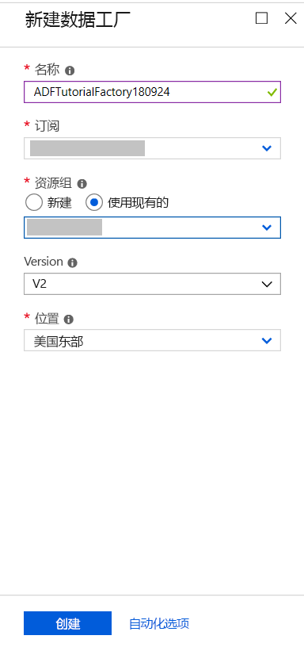
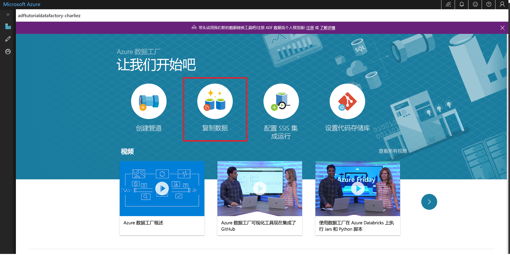
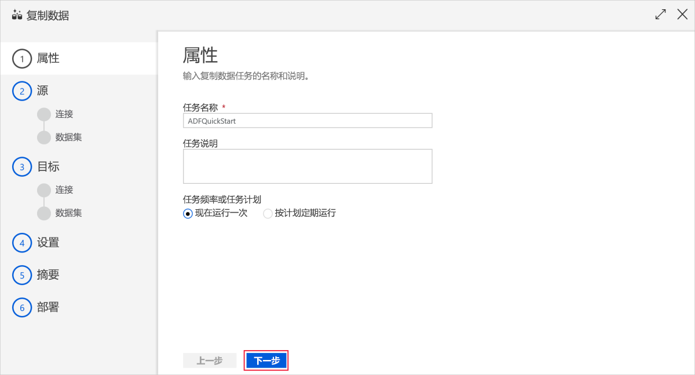
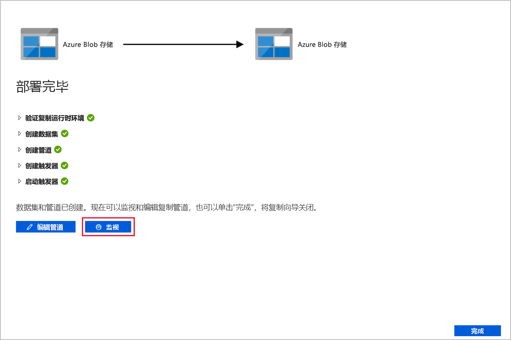

# 使用“复制数据”工具复制数据 
> [!div class="op_single_selector" title1="Select the version of Data Factory service that you are using:"]
> * [版本 1 - 正式版](v1/data-factory-copy-data-from-azure-blob-storage-to-sql-database.md)
> * [版本 2 - 预览版](quickstart-create-data-factory-copy-data-tool.md)

在本快速入门中，我们将使用 Azure 门户创建一个数据工厂。 然后，使用“复制数据”工具创建一个管道，用于将数据从 Azure Blob 存储中的某个文件夹复制到另一个文件夹。 

> [!NOTE]
> 如果你对 Azure 数据工厂不太熟悉，请在学习本快速入门之前参阅 [Azure 数据工厂简介](data-factory-introduction.md)。 
>
> 本文适用于目前处于预览状态的数据工厂版本 2。 如果使用版本 1 的服务（即正式版 (GA)），请参阅[数据工厂版本 1 入门](v1/data-factory-copy-data-from-azure-blob-storage-to-sql-database.md)。

[!INCLUDE [data-factory-quickstart-prerequisites](../../includes/data-factory-quickstart-prerequisites.md)] 

## 创建数据工厂

1. 在左侧菜单中选择“新建”，然后依次选择“数据 + 分析”、“数据工厂”。 
   
   
2. 在“新建数据工厂”页中，输入 **ADFTutorialDataFactory** 作为**名称**。 
      
   
 
   Azure 数据工厂的名称必须 *全局唯一*。 如果出现以下错误，请更改数据工厂的名称（例如改为 **&lt;yourname&gt;ADFTutorialDataFactory**），并重新尝试创建。 有关数据工厂项目的命名规则，请参阅[数据工厂 - 命名规则](naming-rules.md)一文。
  
   
3. 对于“订阅”，请选择要在其中创建数据工厂的 Azure 订阅。 
4. 对于“资源组”，请使用以下步骤之一：
     
   - 选择“使用现有”，并从列表中选择现有的资源组。 
   - 选择“新建”，并输入资源组的名称。   
         
   若要了解有关资源组的详细信息，请参阅 [使用资源组管理 Azure 资源](../azure-resource-manager/resource-group-overview.md)。  
4. 对于“版本”，请选择“V2 (预览版)”。
5. 对于“位置”，请选择数据工厂所在的位置。 

   此列表仅显示支持的位置。 数据工厂使用的数据存储（例如 Azure 存储和 Azure SQL 数据库）和计算资源（例如 Azure HDInsight）可以位于其他位置/区域。

6. 选择“固定到仪表板”。     
7. 选择**创建**。
8. 仪表板上会显示状态为“正在部署数据工厂”的以下磁贴： 

    
9. 创建完成后，会显示“数据工厂”页。 选择“创作和监视”磁贴，在单独的选项卡中启动 Azure 数据工厂用户界面 (UI) 应用程序。
   
   

## 启动“复制数据”工具

1. 在“开始”页中，选择“复制数据”磁贴启动“复制数据”工具。 

   
2. 在“复制数据”工具的“属性”页中，选择“下一步”。 在此页中可以指定管道的名称及其说明。 

   
3. 在“源数据存储”页中选择“Azure Blob 存储”，然后选择“下一步”。

   
4. 在“指定 Azure Blob 存储帐户”页中，从“存储帐户名称”列表中选择自己的存储帐户，然后选择“下一步”。 

   
5. 在“选择输入文件或文件夹”页中完成以下步骤：

   a. 浏览到“adftutorial/input”文件夹。

   b. 选择“emp.txt”文件。

   c. 选择“选择”。 可以双击“emp.txt”跳过此步骤。

   d.单击“下一步”。 选择“**下一步**”。 

   
6. 在“文件格式设置”页中，注意该工具会自动检测列与行的分隔符，然后选择“下一步”。 还可以在此页中预览数据，以及查看输入数据的架构。 

   
7. 在“目标数据存储”页上，选择“Azure Blob 存储”，然后选择“下一步”。 

       
8. 在“指定 Azure Blob 存储帐户”页中选择自己的 Azure Blob 存储帐户，然后选择“下一步”。 

   
9. 在“选择输出文件或文件夹”页中完成以下步骤： 

   a. 输入 **adftutorial/output** 作为文件夹路径。

   b. 输入 **emp.txt** 作为文件名。

   c. 选择“**下一步**”。 

    
10. 在“文件格式设置”页中，选择“下一步”。 

    
11. 在“设置”页中，选择“下一步”。 

    
12. 在“摘要”页中检查所有设置，然后选择“下一步”。 

    
13. 在“部署已完成”页中，选择“监视”可监视创建的管道。 

    
14. 应用程序将切换到“监视”选项卡。可在此选项卡中查看管道的状态。选择“刷新”可刷新列表。 
    
    
15. 在“操作”列中选择“查看活动运行”链接。 该管道只包含一个“复制”类型的活动。 

    
16. 若要查看复制操作的详细信息，请选择“操作”列中的“详细信息”（眼镜图像）链接。 有关属性的详细信息，请参阅[复制活动概述](copy-activity-overview.md)。 

    
17. 验证 **adftutorial** 容器的 **output** 文件夹中是否创建了 **emp.txt** 文件。 如果 output 文件夹不存在，数据工厂服务会自动创建它。 
18. 切换到“编辑”选项卡，以便编辑链接服务、数据集和管道。 若要了解如何在数据工厂 UI 中编辑这些实体，请参阅[使用 Azure 门户创建数据工厂](quickstart-create-data-factory-portal.md)。

    

## 后续步骤
此示例中的管道将数据从 Azure Blob 存储中的一个位置复制到另一个位置。 若要了解如何在更多方案中使用数据工厂，请完成相关[教程](tutorial-copy-data-portal.md)。 