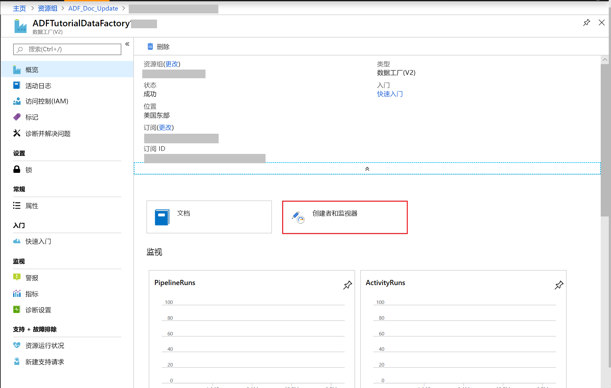

# 使用 Azure 门户创建数据工厂
> [!div class="op_single_selector" title1="Select the version of Data Factory service you are using:"]
> * [版本 1 - GA](v1/data-factory-copy-data-from-azure-blob-storage-to-sql-database.md)
> * [版本 2 - 预览版](quickstart-create-data-factory-portal.md)

Azure 数据工厂是基于云的数据集成服务，用于在云中创建数据驱动型工作流，以便协调和自动完成数据移动和数据转换。 使用 Azure 数据工厂，可以创建和计划数据驱动型工作流（称为管道），以便从不同的数据存储引入数据，通过各种计算服务（例如 Azure HDInsight Hadoop、Spark、Azure Data Lake Analytics 和 Azure 机器学习）处理/转换数据，将输出数据发布到数据存储（例如 Azure SQL 数据仓库），供商业智能 (BI) 应用程序使用。 

在此快速入门中，使用 Azure 门户创建数据工厂。 创建数据工厂后，需要按其他快速入门中所述，使用 PowerShell、.NET SDK、Python SDK 或 REST API 作为数据管道将数据从源数据存储复制到目标数据存储。 目前，不能使用 Azure 门户在数据工厂中创建管道。

> [!NOTE]
> 本文适用于目前处于预览状态的数据工厂版本 2。 如果使用数据工厂服务版本 1（即正式版 (GA)），请参阅[数据工厂版本 1 入门](v1/data-factory-copy-data-from-azure-blob-storage-to-sql-database.md)。

如果你还没有 Azure 订阅，可以在开始前创建一个[免费](https://azure.microsoft.com/free/)帐户。

## 登录到 Azure 门户
登录到 [Azure 门户](https://portal.azure.com/)。

## 创建数据工厂
下面是本快速入门中要执行的步骤：
1. 在左侧菜单中单击“新建”，并依次单击“数据 + 分析”、“数据工厂”。 
   
   
2. 在“新建数据工厂”边栏选项卡中，输入 **ADFTutorialDataFactory** 作为**名称**。 
      
     
 
   Azure 数据工厂的名称必须 **全局唯一**。 如果收到错误，请更改数据工厂的名称（例如改为 yournameADFTutorialDataFactory），并重新尝试创建。 有关数据工厂项目命名规则，请参阅 [Data Factory - Naming Rules](naming-rules.md) （数据工厂 - 命名规则）主题。
  
       `Data factory name “ADFTutorialDataFactory” is not available`
3. 选择要在其中创建数据工厂的 Azure **订阅**。 
4. 对于**资源组**，请执行以下步骤之一：
     
      - 选择“使用现有资源组”，并从下拉列表选择现有的资源组。 
      - 选择“新建”，并输入资源组的名称。   
         
      本快速入门中的一些步骤假定使用 **ADFTutorialResourceGroup** 作为资源组名称。 若要了解有关资源组的详细信息，请参阅 [使用资源组管理 Azure 资源](../azure-resource-manager/resource-group-overview.md)。  
4. 选择“V2 (预览)”作为**版本**。
5. 选择数据工厂的**位置**。 目前，只能在“美国东部”区域中创建 V2 数据工厂。 但是，数据工厂中使用的计算和数据存储可以位于其他区域。 
6. 选择“固定到仪表板”。     
7. 单击“创建” 。
      
      > [!IMPORTANT]
      > 只有订阅/资源组级别的 [数据工厂参与者](../active-directory/role-based-access-built-in-roles.md#data-factory-contributor) 角色成员才能创建数据工厂实例。
      > 
      > 数据工厂名称可能在将来被注册为 DNS 名称，因此将公开可见。             
3. 在仪表板上，会看到状态为“正在部署数据工厂”的以下磁贴。 

    
1. 完成创建后，会显示图中所示的“数据工厂”边栏选项卡。
   
   

## 后续步骤
此示例中的管道将数据从 Azure Blob 存储中的一个位置复制到另一个位置。 完成相关[教程](tutorial-copy-data-dot-net.md)来了解如何在更多方案中使用数据工厂。 