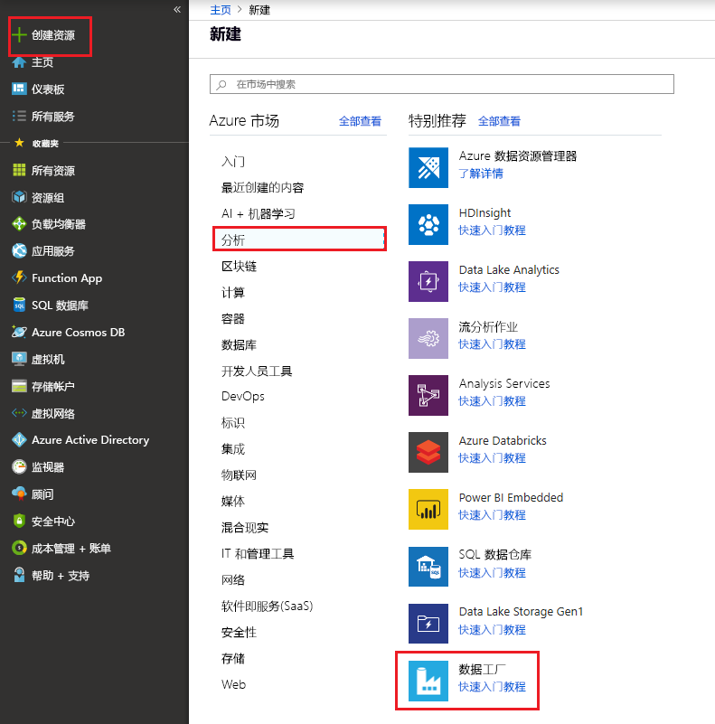
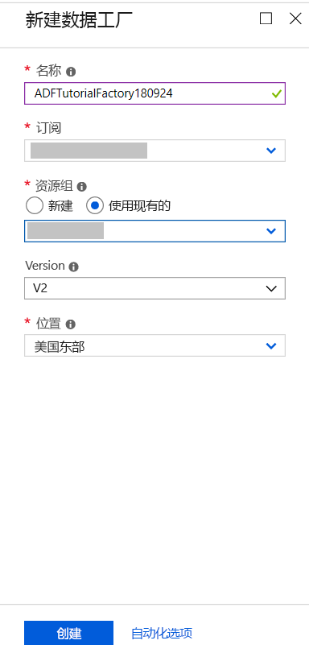
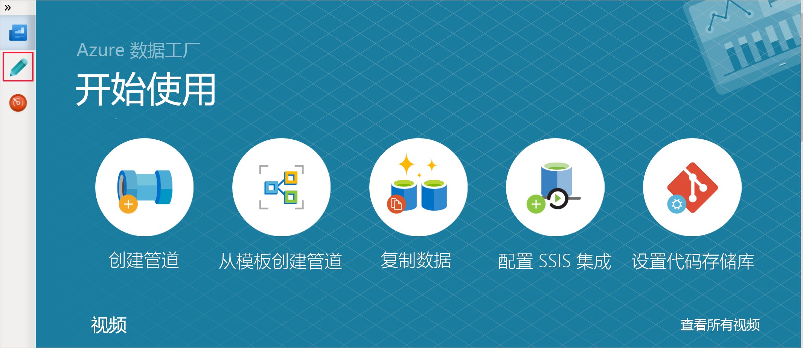
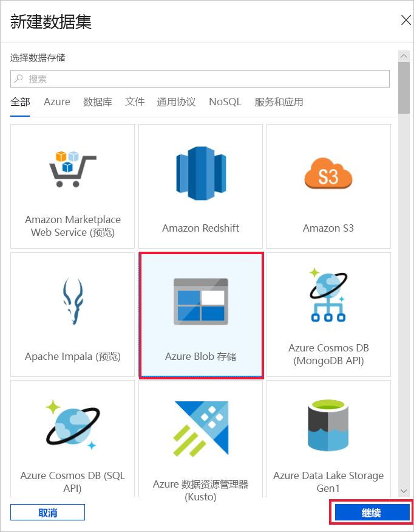
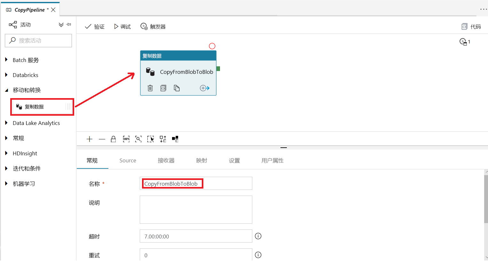
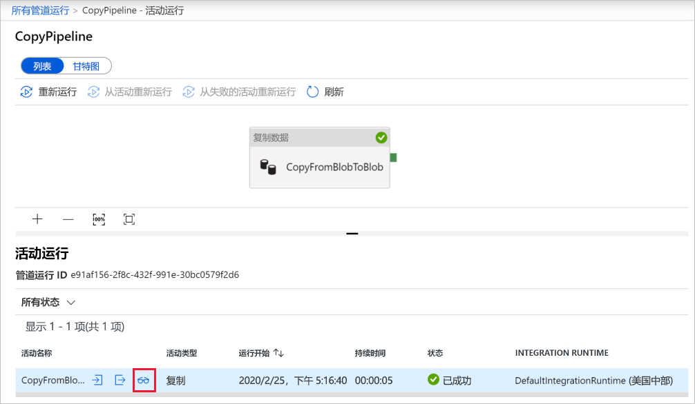
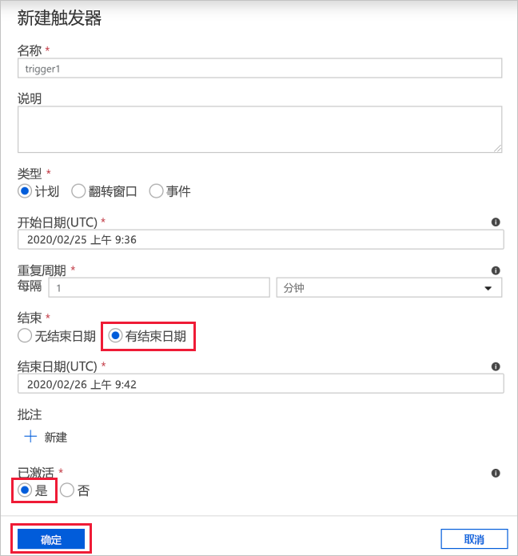

# 使用 Azure 数据工厂 UI 创建数据工厂
> [!div class="op_single_selector" title1="Select the version of Data Factory service that you are using:"]
> * [第 1 版](v1/data-factory-copy-data-from-azure-blob-storage-to-sql-database.md)
> * [当前版本](quickstart-create-data-factory-portal.md)

本快速入门介绍如何使用 Azure 数据工厂 UI 创建和监视数据工厂。 在此数据工厂中创建的管道会将数据从 Azure Blob 存储中的一个文件夹复制到另一个文件夹。 有关如何使用 Azure 数据工厂转换数据的教程，请参阅[教程：使用 Spark 转换数据](tutorial-transform-data-spark-portal.md)。 

> [!NOTE]
> 如果你对 Azure 数据工厂不太熟悉，请在学习本快速入门之前参阅 [Azure 数据工厂简介](data-factory-introduction.md)。 

[!INCLUDE [data-factory-quickstart-prerequisites](../../includes/data-factory-quickstart-prerequisites.md)] 

### 视频 
观看以下视频，了解数据工厂 UI： 
>[!VIDEO https://channel9.msdn.com/Shows/Azure-Friday/Visually-build-pipelines-for-Azure-Data-Factory-v2/Player]

## 创建数据工厂

1. 启动 **Microsoft Edge** 或 **Google Chrome** Web 浏览器。 目前，仅 Microsoft Edge 和 Google Chrome Web 浏览器支持数据工厂 UI。
2. 转到 [Azure 门户](https://portal.azure.com)。 
3. 在左侧菜单中选择“新建”，然后依次选择“数据 + 分析”、“数据工厂”。 
   
   
2. 在“新建数据工厂”页中，输入 **ADFTutorialDataFactory** 作为**名称**。 
      
   
 
   Azure 数据工厂的名称必须 *全局唯一*。 如果出现以下错误，请更改数据工厂的名称（例如改为 **&lt;yourname&gt;ADFTutorialDataFactory**），并重新尝试创建。 有关数据工厂项目的命名规则，请参阅[数据工厂 - 命名规则](naming-rules.md)一文。
  
   
3. 对于“订阅”，请选择要在其中创建数据工厂的 Azure 订阅。 
4. 对于“资源组”，请使用以下步骤之一：
     
   - 选择“使用现有”，并从列表中选择现有的资源组。 
   - 选择“新建”，并输入资源组的名称。   
         
   若要了解有关资源组的详细信息，请参阅 [使用资源组管理 Azure 资源](../azure-resource-manager/resource-group-overview.md)。  
4. 对于“版本”，选择“V2”。
5. 对于“位置”，请选择数据工厂所在的位置。

   列表仅显示数据工厂支持的位置。 数据工厂使用的数据存储（例如 Azure 存储和 Azure SQL 数据库）和计算资源（例如 Azure HDInsight）可以位于其他位置。
6. 选择“固定到仪表板”。     
7. 选择“创建”。
8. 仪表板上会显示状态为“正在部署数据工厂”的以下磁贴： 

   
9. 创建完成后，会显示“数据工厂”页。 选择“创作和监视”磁贴，在单独的选项卡中启动 Azure 数据工厂用户界面 (UI) 应用程序。
   
   
10. 在“入门”页的左侧面板中，切换到“创作”选项卡。 

    

## 创建链接服务
在此过程中，请创建一个链接服务，将 Azure 存储帐户链接到数据工厂。 链接服务包含的连接信息可供数据工厂服务用来在运行时连接到它。

1. 选择“连接”，然后选择工具栏中的“新建”按钮。 

       
2. 在“新建链接服务”页中，选择“Azure Blob 存储”，然后选择“继续”。 

   
3. 完成以下步骤： 

   a. 至于“名称”，请输入 **AzureStorageLinkedService**。

   b. 至于“存储帐户名称”，请选择 Azure 存储帐户的名称。

   c. 选择“测试连接”，确认数据工厂服务可以连接到存储帐户。 

   d. 选择“保存”保存链接服务。 

    

## 创建数据集
此过程创建两个数据集：**InputDataset** 和 **OutputDataset**。 这两个数据集的类型为 **AzureBlob**。 它们引用在上一部分创建的 Azure 存储链接服务。 

输入数据集表示输入文件夹中的源数据。 在输入数据集定义中，请指定包含源数据的 Blob 容器 (**adftutorial**)、文件夹 (**input**) 和文件 (**emp.txt**)。 

输出数据集表示复制到目标的数据。 在输出数据集定义中，请指定要将数据复制到其中的 Blob 容器 (**adftutorial**)、文件夹 (**output**) 和文件。 管道的每次运行都有与之关联的唯一 ID。 可以使用系统变量 **RunId** 来访问该 ID。 输出文件的名称会根据管道的运行 ID 动态进行赋值。   

在链接服务设置中，已指定包含源数据的 Azure 存储帐户。 在源数据集设置中，请指定源数据的具体驻留位置（Blob 容器、文件夹和文件）。 在接收器数据集设置中，请指定将数据复制到其中的位置（Blob 容器、文件夹和文件）。 
 
1. 选择“+ (加)”按钮，然后选择“数据集”。

   
2. 在“新建数据集”页中，选择“Azure Blob 存储”，然后选择“完成”。 

   
3. 在数据集的“常规”选项卡中，输入 **InputDataset** 作为**名称**。 

4. 切换到“连接”选项卡，然后完成以下步骤： 

    a. 至于“链接服务”，请选择“AzureStorageLinkedService”。

    b. 对于“文件路径”，请选择“浏览”按钮。

     c. 在“选择文件或文件夹”窗口中浏览到 **adftutorial** 容器中的 **input** 文件夹，选择 **emp.txt** 文件，然后选择“完成”。

    
    
   d. （可选）选择“预览数据”，预览 emp.txt 文件中的数据。     
5. 重复创建输出数据集的步骤：  

   a. 选择“+ (加)”按钮，然后选择“数据集”。

   b. 在“新建数据集”页中，选择“Azure Blob 存储”，然后选择“完成”。

   c. 在“常规”表中，指定 **OutputDataset** 作为名称。

   d. 在“连接”选项卡中，选择 **AzureStorageLinkedService** 作为链接服务，然后输入 **adftutorial/output** 作为文件夹。 如果 **output** 文件夹不存在，复制活动会在运行时创建它。

## 创建管道 
此过程创建和验证一个管道，其中包含的复制活动可使用输入和输出数据集。 复制活动将数据从输入数据集设置中指定的文件复制到输出数据集设置中指定的文件。 如果输入数据集只指定了一个文件夹（不是文件名），则复制活动会将源文件夹中的所有文件复制到目标。 

1. 选择“+ (加)”按钮，然后选择“管道”。 

   
2. 在“常规”选项卡中指定 **CopyPipeline** 作为**名称**。 

3. 在“活动”工具箱中，展开“数据流”。 将“复制”活动从“活动”工具箱拖到管道设计器图面。 也可在“活动”工具箱中搜索活动。 指定 **CopyFromBlobToBlob** 作为**名称**。

   
4. 切换到复制活动设置中的“源”选项卡，选择 **InputDataset** 作为**源数据集**。

5. 切换到复制活动设置中的“接收器”选项卡，选择 **OutputDataset** 作为**接收器数据集**。

6. 在画布上面的管道工具栏中单击“验证”，以便验证管道设置。 确认已成功验证管道。 若要关闭验证输出，请选择 **>>**（右箭头）按钮。 

## 调试管道
此步骤对管道进行调试，然后再将其部署到数据工厂。 

1. 在画布上面的管道工具栏中单击“调试”，以便触发测试性运行。 
    
2. 确认可以在底部的管道设置的“输出”选项卡中看到管道运行的状态。 

3. 确认可以在 **adftutorial** 容器的 **output** 文件夹中看到输出文件。 如果 output 文件夹不存在，数据工厂服务会自动创建它。 

## 手动触发管道
在此过程中，请将实体（链接服务、数据集、管道）部署到 Azure 数据工厂， 然后手动触发管道运行。 

1. 在触发管道之前，必须将实体发布到数据工厂。 若要进行发布，请选择顶部的“全部发布”。 

   
2. 若要手动触发管道，请选择管道工具栏中的“触发器”，然后选择“立即触发”。 

## 监视管道

1. 在左侧切换到“监视”选项卡。 使用“刷新”按钮刷新列表。

   
2. 在“操作”下选择“查看活动运行”链接。 此时会在此页中看到复制活动运行的状态。 

   
3. 若要查看复制操作的详细信息，请选择“操作”列中的“详细信息”（眼镜图像）链接。 有关属性的详细信息，请参阅[复制活动概述](copy-activity-overview.md)。 

   
4. 确认可以在 **output** 文件夹中看到新文件。 
5. 可以通过选择“管道”链接，从“活动运行”视图切换回“管道运行”视图。 

## 按计划触发管道
在本教程中，此过程为可选过程。 可以创建*计划程序触发器*，将管道计划为定期运行（每小时运行一次、每天运行一次，等等）。 此过程创建一个触发器。该触发器每分钟运行一次，直至指定的结束日期和时间。 

1. 切换到“创作”选项卡。 

2. 转到管道，选择管道工具栏中的“触发器”，然后选择“新建/编辑”。 

2. 在“添加触发器”页中选择“选择触发器”，然后选择“新建”。 

3. 在“新建触发器”页的“结束”下，选择“在特定日期”，指定一个结束时间，使之比当前时间晚数分钟，然后选择“应用”。 

   每次管道运行都需要支付相关成本，因此请指定适当的结束时间，使之仅比开始时间晚数分钟。 确保两个时间是在同一天。 但是，请确保在发布时间和结束时间之间有足够的时间来运行管道。 只有在将解决方案发布到数据工厂之后，触发器才会生效，而不是在 UI 中保存触发器就会使该触发器生效。 

   
4. 在“新建触发器”页中，选中“已激活”复选框，然后选择“下一步”。 

   
5. 查看警告消息，然后选择“完成”。

   
6. 选择“全部发布”，将所做的更改发布到数据工厂。 

8. 在左侧切换到“监视”选项卡。 选择“刷新”可刷新列表。 从发布时间到结束时间这段时间内，可以看到管道每分钟运行一次。 

   请注意“触发因素”列中的值。 手动触发器运行是在此前执行的步骤（“立即触发”）中完成的。 

   
9. 选择“管道运行”旁边的向下箭头，切换到“触发器运行”视图。 

       
10. 确认每次管道运行时，在 **output** 文件夹中都创建了输出文件，直至指定的结束日期和时间为止。 

## 后续步骤
此示例中的管道将数据从 Azure Blob 存储中的一个位置复制到另一个位置。 若要了解如何在更多方案中使用数据工厂，请完成相关[教程](tutorial-copy-data-portal.md)。 