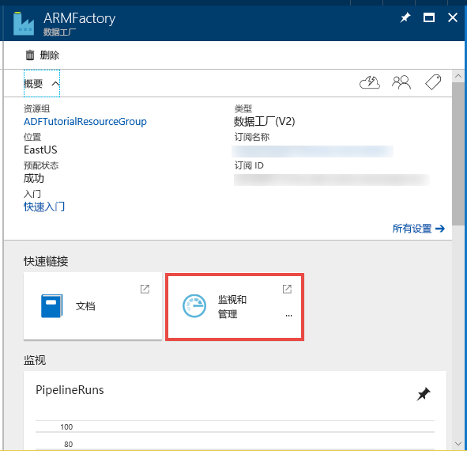
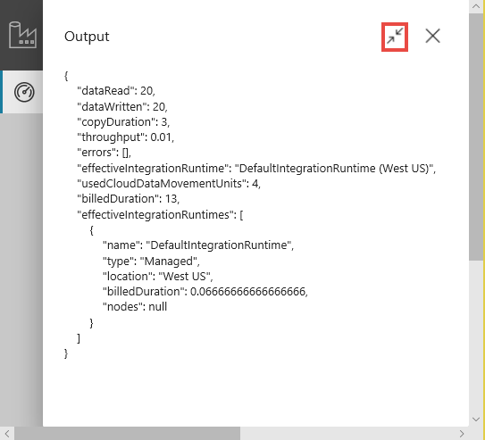

# <a name="tutorial-create-an-azure-data-factory-using-azure-resource-manager-template"></a>教程：使用 Azure 资源管理器模板创建 Azure 数据工厂
> [!div class="op_single_selector" title1="Select the version of Data Factory service you are using:"]
> * [版本 1 - 正式版](v1/data-factory-build-your-first-pipeline-using-arm.md)
> * [版本 2 - 预览版](quickstart-create-data-factory-resource-manager-template.md) 

本快速入门介绍如何使用 Azure 资源管理器模板来创建 Azure 数据工厂。 在此数据工厂中创建的管道会将数据从 Azure Blob 存储中的一个文件夹**复制**到另一个文件夹。 有关如何使用 Azure 数据工厂**转换**数据的教程，请参阅[教程：使用 Spark 转换数据](transform-data-using-spark.md)。 

> [!NOTE]
> 本文适用于目前处于预览版的数据工厂版本 2。 如果使用数据工厂服务版本 1（即正式版 (GA)），请参阅[使用数据工厂版本 1 构建第一个数据工厂](v1/data-factory-build-your-first-pipeline-using-arm.md)。
>
> 本文不提供数据工厂服务的详细介绍。 有关 Azure 数据工厂服务的介绍，请参阅 [Azure 数据工厂简介](introduction.md)。

[!INCLUDE [data-factory-quickstart-prerequisites](../../includes/data-factory-quickstart-prerequisites.md)] 

### <a name="azure-powershell"></a>Azure PowerShell
按[如何安装和配置 Azure PowerShell](/powershell/azure/install-azurerm-ps) 中的说明安装最新的 Azure PowerShell 模块。

## <a name="resource-manager-templates"></a>资源管理器模板
若要了解 Azure 资源管理器模板的一般信息，请参阅[创作 Azure 资源管理器模板](../azure-resource-manager/resource-group-authoring-templates.md)。 

以下部分提供了用于定义数据工厂实体的完整 Resource Manager 模板，以便可以快速完成整个教程并测试模板。 若要了解每个数据工厂实体的定义方式，请参阅[模板中的数据工厂实体](#data-factory-entities-in-the-template)部分。

## <a name="data-factory-json"></a>数据工厂 JSON 
在 **C:\ADFTutorial** 文件夹中，创建包含以下内容的名为 **ADFTutorialARM.json** 的 JSON 文件：

```json
{
    "contentVersion": "1.0.0.0",
    "$schema": "http://schema.management.azure.com/schemas/2015-01-01/deploymentTemplate.json#",
    "parameters": {
        "dataFactoryName": {
            "type": "string",
            "metadata": {
                "description": "Name of the data factory. Must be globally unique."
            }
        },
        "dataFactoryLocation": {
            "type": "string",
            "allowedValues": [
                "East US",
                "East US 2",
                "West Europe"
            ],
            "defaultValue": "East US",
            "metadata": {
                "description": "Location of the data factory. Currently, only East US, East US 2, and West Europe are supported. "
            }
        },
        "storageAccountName": {
            "type": "string",
            "metadata": {
                "description": "Name of the Azure storage account that contains the input/output data."
            }
        },
        "storageAccountKey": {
            "type": "securestring",
            "metadata": {
                "description": "Key for the Azure storage account."
            }
        },
        "blobContainer": {
            "type": "string",
            "metadata": {
                "description": "Name of the blob container in the Azure Storage account."
            }
        },
        "inputBlobFolder": {
            "type": "string",
            "metadata": {
                "description": "The folder in the blob container that has the input file."
            }
        },
        "inputBlobName": {
            "type": "string",
            "metadata": {
                "description": "Name of the input file/blob."
            }
        },
        "outputBlobFolder": {
            "type": "string",
            "metadata": {
                "description": "The folder in the blob container that will hold the transformed data."
            }
        },
        "outputBlobName": {
            "type": "string",
            "metadata": {
                "description": "Name of the output file/blob."
            }
        },
        "triggerStartTime": {
            "type": "string",
            "metadata": {
                "description": "Start time for the trigger."
            }
        },
        "triggerEndTime": {
            "type": "string",
            "metadata": {
                "description": "End time for the trigger."
            }
        }
    },
    "variables": {
        "azureStorageLinkedServiceName": "ArmtemplateStorageLinkedService",
        "inputDatasetName": "ArmtemplateTestDatasetIn",
        "outputDatasetName": "ArmtemplateTestDatasetOut",
        "pipelineName": "ArmtemplateSampleCopyPipeline",
        "triggerName": "ArmTemplateTestTrigger"
    },
    "resources": [{
        "name": "[parameters('dataFactoryName')]",
        "apiVersion": "2017-09-01-preview",
        "type": "Microsoft.DataFactory/factories",
        "location": "[parameters('dataFactoryLocation')]",
        "properties": {
            "loggingStorageAccountName": "[parameters('storageAccountName')]",
            "loggingStorageAccountKey": "[parameters('storageAccountKey')]"
        },
        "resources": [{
                "type": "linkedservices",
                "name": "[variables('azureStorageLinkedServiceName')]",
                "dependsOn": [
                    "[parameters('dataFactoryName')]"
                ],
                "apiVersion": "2017-09-01-preview",
                "properties": {
                    "type": "AzureStorage",
                    "description": "Azure Storage linked service",
                    "typeProperties": {
                        "connectionString": {
                            "value": "[concat('DefaultEndpointsProtocol=https;AccountName=',parameters('storageAccountName'),';AccountKey=',parameters('storageAccountKey'))]",
                            "type": "SecureString"
                        }
                    }
                }
            },
            {
                "type": "datasets",
                "name": "[variables('inputDatasetName')]",
                "dependsOn": [
                    "[parameters('dataFactoryName')]",
                    "[variables('azureStorageLinkedServiceName')]"
                ],
                "apiVersion": "2017-09-01-preview",
                "properties": {
                    "type": "AzureBlob",
                    "typeProperties": {
                        "folderPath": "[concat(parameters('blobContainer'), '/', parameters('inputBlobFolder'), '/')]",
                        "fileName": "[parameters('inputBlobName')]"
                    },
                    "linkedServiceName": {
                        "referenceName": "[variables('azureStorageLinkedServiceName')]",
                        "type": "LinkedServiceReference"
                    }
                }
            },
            {
                "type": "datasets",
                "name": "[variables('outputDatasetName')]",
                "dependsOn": [
                    "[parameters('dataFactoryName')]",
                    "[variables('azureStorageLinkedServiceName')]"
                ],
                "apiVersion": "2017-09-01-preview",
                "properties": {
                    "type": "AzureBlob",
                    "typeProperties": {
                        "folderPath": "[concat(parameters('blobContainer'), '/', parameters('outputBlobFolder'), '/')]",
                        "fileName": "[parameters('outputBlobName')]"
                    },
                    "linkedServiceName": {
                        "referenceName": "[variables('azureStorageLinkedServiceName')]",
                        "type": "LinkedServiceReference"
                    }
                }
            },
            {
                "type": "pipelines",
                "name": "[variables('pipelineName')]",
                "dependsOn": [
                    "[parameters('dataFactoryName')]",
                    "[variables('azureStorageLinkedServiceName')]",
                    "[variables('inputDatasetName')]",
                    "[variables('outputDatasetName')]"
                ],
                "apiVersion": "2017-09-01-preview",
                "properties": {
                    "activities": [{
                        "type": "Copy",
                        "typeProperties": {
                            "source": {
                                "type": "BlobSource"
                            },
                            "sink": {
                                "type": "BlobSink"
                            }
                        },
                        "name": "MyCopyActivity",
                        "inputs": [{
                            "referenceName": "[variables('inputDatasetName')]",
                            "type": "DatasetReference"
                        }],
                        "outputs": [{
                            "referenceName": "[variables('outputDatasetName')]",
                            "type": "DatasetReference"
                        }]
                    }]
                }
            },
            {
                "type": "triggers",
                "name": "[variables('triggerName')]",
                "dependsOn": [
                    "[parameters('dataFactoryName')]",
                    "[variables('azureStorageLinkedServiceName')]",
                    "[variables('inputDatasetName')]",
                    "[variables('outputDatasetName')]",
                    "[variables('pipelineName')]"
                ],
                "apiVersion": "2017-09-01-preview",
                "properties": {
                    "type": "ScheduleTrigger",
                    "typeProperties": {
                        "recurrence": {
                            "frequency": "Hour",
                            "interval": 1,
                            "startTime": "[parameters('triggerStartTime')]",
                            "endTime": "[parameters('triggerEndTime')]",
                            "timeZone": "UTC"
                        }
                    },
                    "pipelines": [{
                        "pipelineReference": {
                            "type": "PipelineReference",
                            "referenceName": "ArmtemplateSampleCopyPipeline"
                        },
                        "parameters": {}
                    }]
                }
            }
        ]
    }]
}
```

## <a name="parameters-json"></a>参数 JSON
创建名为 **ADFTutorialARM-Parameters.json**、包含 Azure 资源管理器模板参数的 JSON 文件。  

> [!IMPORTANT]
> - 为此参数文件中的 **storageAccountName** 和 **storageAccountKey** 参数指定 Azure 存储帐户的名称和密钥。 已在此 Azure Blob 存储中创建 adftutorial 容器并将示例文件 (emp.txt) 上传到 input 文件夹。 
> - 对于 **dataFactoryName** 参数，请为数据工厂指定一个全局唯一名称。 例如：ARMTutorialFactoryJohnDoe11282017。 
> - 对于 **triggerStartTime**，请按 `2017-11-28T00:00:00` 格式指定当天的时间。
> - 对于 **triggerEndTime**，请按 `2017-11-29T00:00:00` 格式指定第二天的时间。 也可查看当前的 UTC 时间，指定随后的一小时或两小时作为结束时间。 例如，如果现在的 UTC 时间为凌晨 1:32，则可指定 `2017-11-29:03:00:00` 作为结束时间。 在这种情况下，触发器运行管道两次（一次在凌晨 2 点，一次在凌晨 3 点）。

```json
{
  "$schema": "https://schema.management.azure.com/schemas/2015-01-01/deploymentParameters.json#",
  "contentVersion": "1.0.0.0",
  "parameters": {
    "dataFactoryName": {
      "value": "<datafactoryname>"
    },    
    "dataFactoryLocation": {
      "value": "East US"
    },
    "storageAccountName": {
      "value": "<yourstroageaccountname>"
    },
    "storageAccountKey": {
      "value": "<yourstorageaccountkey>"
    },
    "blobContainer": {
      "value": "adftutorial"
    },
    "inputBlobFolder": {
      "value": "input"
    },
    "inputBlobName": {
      "value": "emp.txt"
    },
    "outputBlobFolder": {
      "value": "output"
    },
    "outputBlobName": {
      "value": "emp.txt"
    },
    "triggerStartTime": {
        "value": "2017-11-28T00:00:00. Set to today"
    },
    "triggerEndTime": {
        "value": "2017-11-29T00:00:00. Set to tomorrow"
    }
  }
}
```

> [!IMPORTANT]
> 在同一个数据工厂 JSON 模板中，可为开发、测试和生产环境使用不同的参数 JSON 文件。 使用 Power Shell 脚本可在这些环境中自动部署数据工厂实体。 

## <a name="deploy-data-factory-entities"></a>部署数据工厂实体 
在 PowerShell 中运行以下命令，使用在本快速入门前面创建的资源管理器模板来部署数据工厂实体。 

```PowerShell
New-AzureRmResourceGroupDeployment -Name MyARMDeployment -ResourceGroupName ADFTutorialResourceGroup -TemplateFile C:\ADFTutorial\ADFTutorialARM.json -TemplateParameterFile C:\ADFTutorial\ADFTutorialARM-Parameters.json
```

将显示类似于以下示例的输出： 

```
DeploymentName          : MyARMDeployment
ResourceGroupName       : ADFTutorialResourceGroup
ProvisioningState       : Succeeded
Timestamp               : 11/29/2017 3:11:13 AM
Mode                    : Incremental
TemplateLink            :
Parameters              :
                          Name                 Type            Value
                          ===============      ============    ==========
                          dataFactoryName      String          <data factory name>
                          dataFactoryLocation  String          East US
                          storageAccountName   String          <storage account name>
                          storageAccountKey    SecureString
                          blobContainer        String          adftutorial
                          inputBlobFolder      String          input
                          inputBlobName        String          emp.txt
                          outputBlobFolder     String          output
                          outputBlobName       String          emp.txt
                          triggerStartTime     String          11/29/2017 12:00:00 AM
                          triggerEndTime       String          11/29/2017 4:00:00 AM

Outputs                 :
DeploymentDebugLogLevel :
```

## <a name="start-the-trigger"></a>启动触发器

此模板部署以下数据工厂实体： 

- Azure 存储链接服务
- Azure Blob 数据集（输入和输出）
- 包含复制活动的管道
- 用于触发管道的触发器

部署的触发器处于已停止状态。 若要启动触发器，一种方式是使用 **Start-AzureRmDataFactoryV2Trigger** PowerShell cmdlet。 以下过程提供了详细步骤： 

1. 在 PowerShell 窗口中创建一个变量，用于保存资源组的名称。 将以下命令复制到 PowerShell 窗口中，然后按 ENTER。 如果已为 New-AzureRmResourceGroupDeployment 命令指定了其他资源组名称，请在此处更新该值。 

    ```powershell
    $resourceGroupName = "ADFTutorialResourceGroup"
    ``` 
1. 创建一个变量，用于保存数据工厂的名称。 指定一个已在 ADFTutorialARM-Parameters.json 文件中指定的名称。   

    ```powershell
    $dataFactoryName = "<yourdatafactoryname>"
    ```
3. 设置一个变量作为触发器的名称。 触发器的名称在资源管理器模板文件 (ADFTutorialARM.json) 中进行硬编码。

    ```powershell
    $triggerName = "ArmTemplateTestTrigger"
    ```
4. 获取**触发器的状态**，方法是在指定数据工厂和触发器的名称后，运行以下 PowerShell 命令：

    ```powershell
    Get-AzureRmDataFactoryV2Trigger -ResourceGroupName $resourceGroupName -DataFactoryName $dataFactoryName -Name $triggerName
    ```

    下面是示例输出： 

    ```json
    TriggerName       : ArmTemplateTestTrigger
    ResourceGroupName : ADFTutorialResourceGroup
    DataFactoryName   : ARMFactory1128
    Properties        : Microsoft.Azure.Management.DataFactory.Models.ScheduleTrigger
    RuntimeState      : Stopped
    ```
    
    请注意，触发器的运行时状态为“已停止”。 
5. **启动触发器**。 触发器在相应时间运行在模板中定义的管道。 也就是说，如果在下午 2:25 执行此命令，则触发器会在下午 3 点首次运行管道。 然后，触发器会每小时运行一次管道，直至为触发器指定的结束时间。 

    ```powershell
    Start-AzureRmDataFactoryV2Trigger -ResourceGroupName $resourceGroupName -DataFactoryName $dataFactoryName -TriggerName $triggerName
    ```
    
    下面是示例输出： 
    
    ```
    Confirm
    Are you sure you want to start trigger 'ArmTemplateTestTrigger' in data factory 'ARMFactory1128'?
    [Y] Yes  [N] No  [S] Suspend  [?] Help (default is "Y"): y
    True
    ```
6. 再次运行 Get-AzureRmDataFactoryV2Trigger 命令，确认触发器已启动。  

    ```powershell
    Get-AzureRmDataFactoryV2Trigger -ResourceGroupName $resourceGroupName -DataFactoryName $dataFactoryName -TriggerName $triggerName
    ```
    
    下面是示例输出：
    
    ```
    TriggerName       : ArmTemplateTestTrigger
    ResourceGroupName : ADFTutorialResourceGroup
    DataFactoryName   : ARMFactory1128
    Properties        : Microsoft.Azure.Management.DataFactory.Models.ScheduleTrigger
    RuntimeState      : Started
    ```

## <a name="monitor-the-pipeline"></a>监视管道
1. 登录到 [Azure 门户](https://portal.azure.com/)以后，单击“所有服务”，使用 **data fa** 之类的关键字进行搜索，然后选择“数据工厂”。

    
2. 在“数据工厂”页中单击已创建的数据工厂。 根据需要使用数据工厂的名称对列表进行筛选。  

    
3. 在“数据工厂”页中，单击“监视和管理”磁贴。 

    
4. “数据集成应用程序”会在 Web 浏览器的单独选项卡中打开。 如果监视器选项卡未处于活动状态，请切换到**监视器选项卡**。请注意，管道运行已由**计划程序触发器**触发。 

        

    > [!IMPORTANT]
    > 仅在整点（例如，早晨 4 点、早晨 5 点、早晨 6 点，等等）查看管道运行。 当时间到达下一小时时，单击工具栏上的“刷新”以刷新列表。 
5. 单击“操作”列中的链接。 

    
6. 此时会看到与管道运行相关联的活动运行。 在本快速入门中，管道只有一个类型为“复制”的活动。 因此会看到该活动的一个运行。 

    
1. 单击“输出”列下的链接。 此时会在“输出”窗口中看到复制操作的输出。 单击最大化按钮可查看完整输出。 可以关闭最大化输出窗口，也可以直接关闭它。 

    
7. 看到运行成功/失败以后，即可停止触发器。 触发器一小时运行管道一次。 每次运行时，管道会将同一文件从 input 文件夹复制到 output 文件夹。 若要停止触发器，请在 PowerShell 窗口中运行以下命令。 
    
    ```powershell
    Stop-AzureRmDataFactoryV2Trigger -ResourceGroupName $resourceGroupName -DataFactoryName $dataFactoryName -Name $triggerName
    ```

[!INCLUDE [data-factory-quickstart-verify-output-cleanup.md](../../includes/data-factory-quickstart-verify-output-cleanup.md)] 

## <a name="data-factory-entities-in-the-template"></a> 实体的 JSON 定义
JSON 模板中定义了以下数据工厂实体： 

- [Azure 存储链接服务](#azure-storage-linked-service)
- [Azure Blob 输入数据集](#azure-blob-input-dataset)
- [Azure Blob 输出数据集](#azure-blob-output-dataset)
- [包含复制活动的数据管道](#data-pipeline)
- [触发器](#trigger)

#### <a name="azure-storage-linked-service"></a>Azure 存储链接服务
AzureStorageLinkedService 链接将 Azure 存储帐户链接到数据工厂。 已根据先决条件创建了一个容器并将数据上传到该存储帐户。 在本部分中指定 Azure 存储帐户的名称和密钥。 有关用于定义 Azure 存储链接服务的 JSON 属性的详细信息。请参阅 [Azure Storage linked service](connector-azure-blob-storage.md#linked-service-properties)（Azure 存储链接服务）。 

```json
{
    "type": "linkedservices",
    "name": "[variables('azureStorageLinkedServiceName')]",
    "dependsOn": [
        "[parameters('dataFactoryName')]"
    ],
    "apiVersion": "2017-09-01-preview",
    "properties": {
        "type": "AzureStorage",
        "description": "Azure Storage linked service",
        "typeProperties": {
            "connectionString": {
                "value": "[concat('DefaultEndpointsProtocol=https;AccountName=',parameters('storageAccountName'),';AccountKey=',parameters('storageAccountKey'))]",
                "type": "SecureString"
            }
        }
    }
}
```

connectionString 使用 storageAccountName 和 storageAccountKey 参数。 可以使用配置文件传递这些参数的值。 该定义还使用了模板中定义的变量 azureStroageLinkedService 和 dataFactoryName。 

#### <a name="azure-blob-input-dataset"></a>Azure Blob 输入数据集
Azure 存储链接服务指定一个连接字符串，数据工厂服务在运行时使用该字符串连接到 Azure 存储帐户。 在 Azure Blob 数据集定义中，请指定包含输入数据的 Blob 容器、文件夹和文件的名称。 有关用于定义 Azure Blob 数据集的 JSON 属性的详细信息，请参阅 [Azure Blob dataset properties](connector-azure-blob-storage.md#dataset-properties)（Azure Blob 数据集属性）。 

```json
{
    "type": "datasets",
    "name": "[variables('inputDatasetName')]",
    "dependsOn": [
    "[parameters('dataFactoryName')]",
    "[variables('azureStorageLinkedServiceName')]"
    ],
    "apiVersion": "2017-09-01-preview",
    "properties": {
    "type": "AzureBlob",
    "typeProperties": {
        "folderPath": "[concat(parameters('blobContainer'), '/', parameters('inputBlobFolder'), '/')]",
        "fileName": "[parameters('inputBlobName')]"
    },
    "linkedServiceName": {
        "referenceName": "[variables('azureStorageLinkedServiceName')]",
        "type": "LinkedServiceReference"
    }
    }
},

```

#### <a name="azure-blob-output-dataset"></a>Azure Blob 输出数据集
请在 Azure Blob 存储中指定一个文件夹的名称，用于保存从 input 文件夹复制的数据。 有关用于定义 Azure Blob 数据集的 JSON 属性的详细信息，请参阅 [Azure Blob dataset properties](connector-azure-blob-storage.md#dataset-properties)（Azure Blob 数据集属性）。 

```json
{
    "type": "datasets",
    "name": "[variables('outputDatasetName')]",
    "dependsOn": [
    "[parameters('dataFactoryName')]",
    "[variables('azureStorageLinkedServiceName')]"
    ],
    "apiVersion": "2017-09-01-preview",
    "properties": {
    "type": "AzureBlob",
    "typeProperties": {
        "folderPath": "[concat(parameters('blobContainer'), '/', parameters('outputBlobFolder'), '/')]",
        "fileName": "[parameters('outputBlobName')]"
    },
    "linkedServiceName": {
        "referenceName": "[variables('azureStorageLinkedServiceName')]",
        "type": "LinkedServiceReference"
    }
    }
}
```

#### <a name="data-pipeline"></a>数据管道
定义将数据从一个 Azure Blob 数据集复制到另一个 Azure Blob 数据集的管道。 有关用于定义本示例中所述管道的 JSON 元素的说明，请参阅 [Pipeline JSON](concepts-pipelines-activities.md#pipeline-json)（管道 JSON）。 

```json
{
    "type": "pipelines",
    "name": "[variables('pipelineName')]",
    "dependsOn": [
    "[parameters('dataFactoryName')]",
    "[variables('azureStorageLinkedServiceName')]",
    "[variables('inputDatasetName')]",
    "[variables('outputDatasetName')]"
    ],
    "apiVersion": "2017-09-01-preview",
    "properties": {
    "activities": [
        {
        "type": "Copy",
        "typeProperties": {
            "source": {
            "type": "BlobSource"
            },
            "sink": {
            "type": "BlobSink"
            }
        },
        "name": "MyCopyActivity",
        "inputs": [
            {
            "referenceName": "[variables('inputDatasetName')]",
            "type": "DatasetReference"
            }
        ],
        "outputs": [
            {
            "referenceName": "[variables('outputDatasetName')]",
            "type": "DatasetReference"
            }
        ]
        }
    ]
    }
}
```

#### <a name="trigger"></a>触发器
定义一个每小时运行一次管道的触发器。 部署的触发器处于已停止状态。 使用 **Start-AzureRmDataFactoryV2Trigger** cmdlet 启动触发器。 有关触发器的详细信息，请参阅[管道执行和触发器](concepts-pipeline-execution-triggers.md#triggers)一文。 

```json
{
    "type": "triggers",
    "name": "[variables('triggerName')]",
    "dependsOn": [
        "[parameters('dataFactoryName')]",
        "[variables('azureStorageLinkedServiceName')]",
        "[variables('inputDatasetName')]",
        "[variables('outputDatasetName')]",
        "[variables('pipelineName')]"
    ],
    "apiVersion": "2017-09-01-preview",
    "properties": {
        "type": "ScheduleTrigger",
        "typeProperties": {
            "recurrence": {
                "frequency": "Hour",
                "interval": 1,
                "startTime": "2017-11-28T00:00:00",
                "endTime": "2017-11-29T00:00:00",
                "timeZone": "UTC"               
            }
        },
        "pipelines": [{
            "pipelineReference": {
                "type": "PipelineReference",
                "referenceName": "ArmtemplateSampleCopyPipeline"
            },
            "parameters": {}
        }]
    }
}
```

## <a name="reuse-the-template"></a>重复使用模板
本教程创建了一个用于定义数据工厂实体的模板，以及一个用于传递参数值的模板。 要使用同一个模板将数据工厂实体部署到不同的环境，可为每个环境创建一个参数文件，并在部署到该环境时使用该文件。     

示例：  

```PowerShell
New-AzureRmResourceGroupDeployment -Name MyARMDeployment -ResourceGroupName ADFTutorialResourceGroup -TemplateFile ADFTutorialARM.json -TemplateParameterFile ADFTutorialARM-Parameters-Dev.json

New-AzureRmResourceGroupDeployment -Name MyARMDeployment -ResourceGroupName ADFTutorialResourceGroup -TemplateFile ADFTutorialARM.json -TemplateParameterFile ADFTutorialARM-Parameters-Test.json

New-AzureRmResourceGroupDeployment -Name MyARMDeployment -ResourceGroupName ADFTutorialResourceGroup -TemplateFile ADFTutorialARM.json -TemplateParameterFile ADFTutorialARM-Parameters-Production.json
```
请注意，三条命令分别使用开发环境、测试环境和生产环境的参数文件。  

可以重复使用该模板来执行重复的任务。 例如，创建多个数据工厂，其中包含用于实现相同逻辑的一个或多个管道，但每个数据工厂使用不同的 Azure 存储帐户。 在这种情况下，可以在同一个环境（开发、测试或生产）中使用包含不同参数文件的同一个模板来创建数据工厂。 


## <a name="next-steps"></a>后续步骤
此示例中的管道将数据从 Azure Blob 存储中的一个位置复制到另一个位置。 完成相关[教程](tutorial-copy-data-dot-net.md)来了解如何在更多方案中使用数据工厂。 
